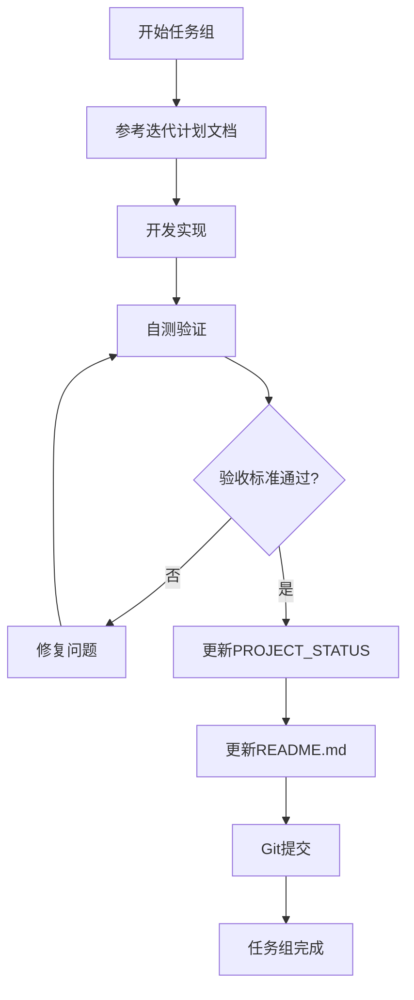

# GitHub Copilot 全局指令

## 📋 项目管理规则

### 规则1: 迭代计划文档保护

**文档**: `docs/迭代计划文档-ITSM智能辅助插件_单人全栈版.md`

**规则**:

- ❌ **禁止修改**: 该文档作为Sprint基准计划文档，一旦制定后不允许修改
- ✅ **只读参考**: 可以阅读引用其中的任务定义、验收标准、工时估算
- ✅ **偏差记录**: 如实际执行与计划偏差，应在 `PROJECT_STATUS_v1.0.md`中记录偏差原因，而非修改计划

**违规示例**:

```markdown
❌ 修改任务工时估算
❌ 调整任务优先级
❌ 删除或新增任务
❌ 修改验收标准
```

**正确做法**:

- 在 `PROJECT_STATUS_v1.0.md`中记录实际完成情况与计划差异
- 在每日复盘中分析偏差原因

---

### 规则2: 项目状态跟踪更新

**文档**: `docs/PROJECT_STATUS_v1.0.md`

**规则**:

- ✅ **强制更新**: 每个任务组完成并通过验收标准后，必须立即更新该文档
- ✅ **同步更新**: 同时更新项目根目录的 `README.md`文件
- ✅ **完整记录**: 必须包含以下信息：
  - 任务组完成时间
  - 实际工时 vs 计划工时
  - 验收结果（通过/未通过）
  - 遇到的问题和解决方案
  - 关键决策记录
  - 下一步计划

**更新触发条件**:

1. 任务组所有验收标准通过
2. 代码已提交到Git仓库
3. 功能已在本地测试通过

**更新流程**:

```
任务组开发完成 → 执行验收测试 → 验收通过 → 更新PROJECT_STATUS_v1.0.md → 更新README.md → Git提交
```

**必须更新的章节**:

- `## 📋 Sprint 1任务状态` - 更新任务组进度
- `## 📊 每日进度跟踪` - 记录当日完成情况
- `## 🔍 问题与解决方案` - 记录技术难点
- `## 📈 指标追踪` - 更新工时、进度等指标
- 📝 Sprint 1开发日志

**README.md同步内容**:

- 项目总体完成度百分比
- 当前里程碑状态
- 最新可用功能列表
- 快速开始指引更新

---

## 🎯 验收标准执行规则

### 任务组验收要求

每个任务组完成后，必须通过以下验收检查：

**功能验收**:

- ✅ 所有功能按验收标准执行通过
- ✅ 手动测试关键路径无异常
- ✅ 边界情况处理正确

**代码质量**:

- ✅ TypeScript编译无错误
- ✅ ESLint检查无警告
- ✅ 代码格式化符合规范

**测试验证**:

- ✅ 单元测试通过（如有）
- ✅ 集成测试通过（如有）
- ✅ 浏览器控制台无错误

**文档验证**:

- ✅ JSDoc注释完整
- ✅ README.md更新
- ✅ PROJECT_STATUS_v1.0.md更新

---

## 🔄 工作流程

### 标准开发流程



### 每日工作检查清单

**每日开始前**:

- [ ] 阅读 `迭代计划文档`中的当日任务
- [ ] 检查 `PROJECT_STATUS_v1.0.md`中的待办事项
- [ ] 确认开发环境正常

**每日结束前**:

- [ ] 完成的任务组已通过验收
- [ ] `PROJECT_STATUS_v1.0.md`已更新当日进度
- [ ] `README.md`已同步更新
- [ ] 代码已提交到Git
- [ ] 记录遇到的问题和解决方案

---

## 📝 文档更新模板

### PROJECT_STATUS_v1.0.md更新示例

```markdown
### 任务组X: [任务组名称] ✅ 已完成

**状态**: 已完成
**实际工时**: X.Xh / 计划X.Xh（偏差+/-X%）
**完成日期**: 2025-12-XX
**验收结果**: ✅ 全部通过

**完成清单**:
- ✅ [T1.1] 任务名称 - 实际工时Xh（计划Xh）
- ✅ [T1.2] 任务名称 - 实际工时Xh（计划Xh）

**关键产出**:
- 文件1: 简要说明
- 文件2: 简要说明

**遇到的问题**:
1. **问题**: 描述问题
   - **解决方案**: 如何解决
   - **耗时**: +Xh

**关键决策**:
- 决策内容及理由

**下一步计划**:
- [ ] 任务组X+1开始时间: 2025-12-XX
```

### README.md更新示例

```markdown
## 📊 项目进度

- **总体完成度**: XX% ⬆️
- **当前Sprint**: Sprint 1 - 进行中
- **最新里程碑**: [任务组名称]已完成 ✅

## ✨ 已完成功能

- ✅ [功能名称] - 2025-12-XX完成
- ✅ [功能名称] - 2025-12-XX完成

## 🚀 快速开始

[根据已完成功能更新使用指引]
```

---

## ⚠️ 注意事项

### 禁止操作

- ❌ 修改 `迭代计划文档`中的任何内容
- ❌ 跳过验收标准直接标记任务完成
- ❌ 忘记更新 `PROJECT_STATUS_v1.0.md`和 `README.md`
- ❌ 提交未通过验收的代码

### 推荐操作

- ✅ 每完成一个任务组立即更新文档
- ✅ 详细记录实际工时和偏差原因
- ✅ 记录所有技术决策和问题解决方案
- ✅ 保持文档和代码同步

---

## 🤖 Copilot使用建议

### 请求代码生成时

**提供完整上下文**:

```
请实现[任务ID]，验收标准见迭代计划文档第X.X节
要求：
1. 满足所有功能验收标准
2. 满足代码质量标准
3. 包含完整JSDoc注释
```

### 请求文档更新时

**明确更新范围**:

```
任务组X已完成，请更新PROJECT_STATUS_v1.0.md和README.md
包括：
- 实际工时vs计划工时
- 验收结果
- 遇到的问题[列出问题]
```

### 验收检查时

**使用验收清单**:

```
请检查[任务组X]是否满足迭代计划文档中的所有验收标准
输出：通过/未通过清单
```

---

**指令版本**: v1.0
**创建日期**: 2025-12-10
**适用范围**: ITSM智能辅助浏览器插件项目
**维护者**: 开发者A
