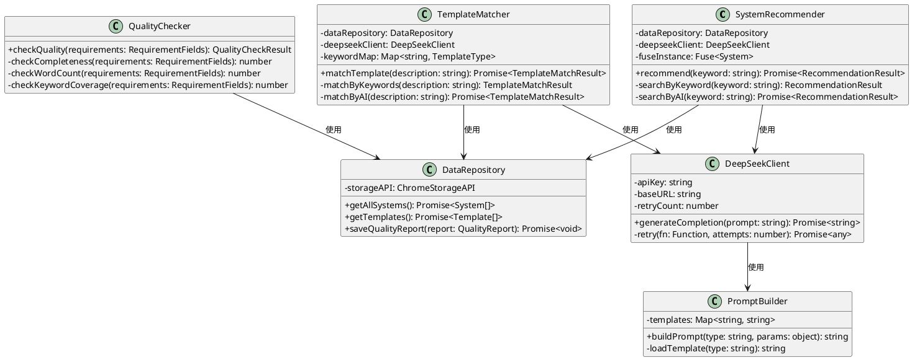

# C4架构图 - ITSM智能辅助浏览器插件

> **📌 文档说明**：本文档基于C4模型标准，展示ITSM智能辅助浏览器插件的四层架构视图
> **项目名称**：广东电信ITSM系统需求提交优化
> **架构设计**：Chrome扩展 + Sidebar + DeepSeek API
> **生成日期**：2025-12-09

---

## 📐 C4模型说明

C4模型是一种分层架构可视化方法，包含4个层次：

| 层次 | 英文名称 | 中文名称 | 目标受众 | 抽象级别 | 典型元素数量 |
|------|---------|---------|---------|---------|-------------|
| **Level 1** | Context | 系统上下文图 | 管理层、非技术人员 | 最高 | 3-8个 |
| **Level 2** | Container | 容器图 | 架构师、技术经理 | 高 | 5-10个 |
| **Level 3** | Component | 组件图 | 开发团队 | 中 | 8-15个 |
| **Level 4** | Code | 代码图 | 开发者 | 低 | 通常不绘制 |

## 🎨 图例说明

- **蓝色框**：系统内部的组件/容器
- **灰色框**：外部系统/服务
- **人形图标**：用户角色
- **实线箭头**：同步调用
- **虚线箭头**：异步调用
- **标注文字**：描述交互内容（如"提交需求"、"调用API"）

---

## Level 1 - 系统上下文图 (Context Diagram)

### 📋 图示说明

系统上下文图展示ITSM智能辅助插件在业务环境中的位置，以及与外部用户、系统的交互关系。

**核心元素**：
- 👤 **用户角色**：业务部门主管（李经理）、一线业务员（小王）
- 🎯 **核心系统**：ITSM智能辅助插件（被设计的系统）
- 🔗 **外部系统**：ITSM系统、DeepSeek API、Chrome浏览器

### PlantUML代码

```plantuml
@startuml C4_Context
!include https://raw.githubusercontent.com/plantuml-stdlib/C4-PlantUML/master/C4_Context.puml

LAYOUT_WITH_LEGEND()

title 系统上下文图 - ITSM智能辅助浏览器插件

' 定义用户角色
Person(business_user, "业务部门用户", "业务主管（李经理）\n一线业务员（小王）\n提交需求到ITSM系统")
Person_Ext(it_support, "IT支持人员", "接收需求\n需求澄清\n需求分派")

' 定义核心系统
System(itsm_assistant, "ITSM智能辅助插件", "智能系统推荐（Top3）\n结构化需求引导\n实时质量检测与评分\n提交前缺失警告")

' 定义外部系统
System_Ext(itsm_system, "ITSM系统", "广东电信需求管理系统\n汇聚上百套IT系统需求流转")
System_Ext(deepseek_api, "DeepSeek API", "大语言模型服务\n场景识别\n模板推荐\nPrompt优化")
System_Ext(chrome_browser, "Chrome浏览器", "提供扩展运行环境\nSidebar侧边栏UI\nContent Script注入")

' 定义关系
Rel(business_user, itsm_assistant, "使用", "在ITSM页面打开侧边栏\n输入需求描述")
Rel(itsm_assistant, itsm_system, "操作DOM", "自动选择系统下拉框\n填充需求描述字段")
Rel(itsm_assistant, deepseek_api, "调用", "发送Prompt\n获取推荐结果（JSON）")
Rel(itsm_assistant, chrome_browser, "运行于", "浏览器扩展形式\nManifest V3规范")
Rel(business_user, itsm_system, "提交需求", "填写需求表单\n提交工单")
Rel(itsm_system, it_support, "分派", "需求流转给IT支持")

' 说明文字
note right of itsm_assistant
  **核心价值**
  1. 系统选择错误率：40% → 10%
  2. 需求澄清轮次：2.5次 → 1次
  3. 需求填写时间：10分钟 → 3分钟
end note

@enduml
```

### 设计要点

| 要素 | 说明 | 数量 |
|------|------|------|
| **用户角色** | 业务部门用户（主要）、IT支持人员（辅助） | 2个 |
| **核心系统** | ITSM智能辅助插件（本项目） | 1个 |
| **外部系统** | ITSM系统、DeepSeek API、Chrome浏览器 | 3个 |
| **关系** | 使用、操作DOM、调用API、运行于、提交需求、分派 | 6条 |

**关键交互路径**：
```
业务用户 → ITSM智能辅助插件 → DeepSeek API（获取推荐）
       ↓
    ITSM系统（填充表单） → IT支持人员（需求处理）
```

---

## Level 2 - 容器图 (Container Diagram)

### 📋 图示说明

容器图展示ITSM智能辅助插件内部的技术组件及其交互关系。本系统采用**浏览器扩展架构**，无需后端服务器。

**核心容器**：
- 🎨 **Sidebar UI**：侧边栏用户界面（React组件）
- 📄 **Content Script**：页面内容脚本（DOM操作）
- 🔧 **Background Service Worker**：后台服务（状态管理、API调用）
- 💾 **LocalStorage**：本地数据存储（系统列表、模板、用户行为日志）

### PlantUML代码

```plantuml
@startuml C4_Container
!include https://raw.githubusercontent.com/plantuml-stdlib/C4-PlantUML/master/C4_Container.puml

LAYOUT_WITH_LEGEND()

title 容器图 - ITSM智能辅助浏览器插件

' 定义用户
Person(business_user, "业务部门用户", "提交需求，查看推荐结果")

' 定义外部系统
System_Ext(itsm_system, "ITSM系统", "需求管理系统（原有系统）")
System_Ext(deepseek_api, "DeepSeek API", "大语言模型服务\n0.14元/百万Token")

' 定义系统边界
System_Boundary(itsm_assistant, "ITSM智能辅助插件（Chrome扩展）") {
    ' 前端容器
    Container(sidebar_ui, "Sidebar侧边栏UI", "React 18 + TypeScript", "系统智能搜索界面\n模板推荐与引导\n质量评分可视化\n信心度反馈表单")
  
    ' 内容脚本容器
    Container(content_script, "Content Script", "JavaScript", "监听ITSM页面输入\n操作DOM（下拉框选择）\n填充需求描述字段\nMutationObserver监听")
  
    ' 后台服务容器
    Container(background_worker, "Background Service Worker", "JavaScript + Service Worker API", "管理扩展状态\n调用DeepSeek API\nPrompt工程\n数据缓存与同步")
  
    ' 数据存储容器
    ContainerDb(local_storage, "LocalStorage", "浏览器原生存储（5-10MB）", "系统列表（500KB）\n模板配置（200KB）\n用户行为日志（1MB）\n信心度记录")
}

' 定义关系
Rel(business_user, sidebar_ui, "使用", "输入需求描述\n选择系统\n填写模板")
Rel(sidebar_ui, background_worker, "调用", "chrome.runtime.sendMessage()")
Rel(sidebar_ui, content_script, "通信", "chrome.tabs.sendMessage()")

Rel(content_script, itsm_system, "操作DOM", "document.querySelector()\n修改value属性")
Rel(content_script, sidebar_ui, "监听变化", "发送输入事件")

Rel(background_worker, deepseek_api, "调用", "HTTPS POST /v1/chat/completions\nJSON格式Prompt")
Rel(background_worker, local_storage, "读写", "chrome.storage.local API")

Rel(deepseek_api, background_worker, "返回", "推荐结果JSON\n模板匹配置信度")
Rel(background_worker, sidebar_ui, "返回", "推荐Top3系统\n模板结构化字段\n质量评分（0-100分）")

' 说明文字
note right of sidebar_ui
  **UI组件**
  - 系统搜索框（拼音支持）
  - 模板推荐卡片
  - 质量评分进度条
  - 信心度单选按钮
end note

note right of background_worker
  **核心功能**
  - 场景识别（Bug/优化/新功能）
  - 系统推荐（关键词+模糊匹配）
  - 质量评分算法
  - API重试机制（3次）
end note

@enduml
```

### 设计要点

| 容器 | 技术栈 | 核心职责 | 数据流 |
|------|--------|---------|--------|
| **Sidebar UI** | React 18 + TypeScript + TailwindCSS | 用户交互、数据展示 | 接收用户输入 → 发送到Background Worker |
| **Content Script** | JavaScript（注入ITSM页面） | DOM操作、页面监听 | 监听ITSM输入 → 填充ITSM表单 |
| **Background Worker** | Service Worker + DeepSeek SDK | 业务逻辑、API调用 | 调用DeepSeek → 返回推荐结果 |
| **LocalStorage** | chrome.storage.local API | 本地数据存储 | 读写系统列表、模板、日志 |

**关键技术决策**：
- ✅ **无需后端服务**：完全在浏览器端运行，降低部署成本
- ✅ **Service Worker架构**：Manifest V3规范，后台持久化运行
- ✅ **Content Script注入**：可灵活操作ITSM页面DOM
- ✅ **LocalStorage存储**：5MB容量满足MVP需求（系统列表<1MB）

**性能指标**：
- 页面加载增加：<500ms
- 侧边栏响应时间：<200ms
- DeepSeek API调用：P95<2秒
- 内存占用：<50MB

---

## Level 3 - 组件图 (Component Diagram)

### 📋 图示说明

组件图展示**Background Service Worker**容器内部的关键模块和交互关系。选择Background Worker作为展开对象，因为它包含核心业务逻辑。

**核心组件**：
- 🎯 **System Recommender**：系统推荐引擎
- 📋 **Template Matcher**：模板匹配引擎
- 📊 **Quality Checker**：质量检测引擎
- 🤖 **DeepSeek Client**：大模型客户端
- 💾 **Data Repository**：数据访问层

### PlantUML代码

```plantuml
@startuml C4_Component
!include https://raw.githubusercontent.com/plantuml-stdlib/C4-PlantUML/master/C4_Component.puml

LAYOUT_WITH_LEGEND()

title 组件图 - Background Service Worker内部结构

' 定义外部容器
Container(sidebar_ui, "Sidebar UI", "React", "侧边栏界面")
Container(content_script, "Content Script", "JavaScript", "DOM操作")
ContainerDb(local_storage, "LocalStorage", "Browser Storage", "本地数据存储")
System_Ext(deepseek_api, "DeepSeek API", "大模型服务")

' 定义组件边界
Container_Boundary(background_worker, "Background Service Worker") {
    ' API控制层
    Component(message_handler, "消息处理器", "chrome.runtime.onMessage", "接收Sidebar/Content Script消息\n路由到对应处理器\n返回处理结果")
  
    ' 业务逻辑层
    Component(system_recommender, "系统推荐引擎", "TypeScript Class", "关键词分词+拼音匹配\n模糊搜索（Fuse.js）\n计算推荐置信度\n返回Top3系统")
  
    Component(template_matcher, "模板匹配引擎", "TypeScript Class", "场景识别（Bug/优化/新功能）\n关键词映射\n调用DeepSeek语义理解\n返回模板+置信度")
  
    Component(quality_checker, "质量检测引擎", "TypeScript Class", "完整性检测（必填字段）\n字数统计\n关键词覆盖度\n计算质量评分（0-100分）")
  
    Component(confidence_tracker, "信心度追踪器", "TypeScript Class", "记录用户信心度选择\n生成备选系统推荐\n统计分析")
  
    ' AI集成层
    Component(deepseek_client, "DeepSeek客户端", "OpenAI SDK", "封装API调用\nPrompt模板管理\n重试机制（3次+5秒超时）\n降级到规则引擎")
  
    Component(prompt_builder, "Prompt构建器", "TypeScript Class", "系统推荐Prompt\n场景识别Prompt\n需求优化Prompt\n动态参数注入")
  
    ' 数据访问层
    Component(data_repository, "数据仓库", "TypeScript Class", "封装chrome.storage API\n系统列表CRUD\n模板配置管理\n行为日志记录")
  
    Component(cache_manager, "缓存管理器", "TypeScript Class", "DeepSeek响应缓存\n防抖优化（200ms）\n过期策略（1小时）")
}

' 定义关系 - 外部到组件
Rel(sidebar_ui, message_handler, "发送消息", "chrome.runtime.sendMessage({action: 'recommend'})")
Rel(content_script, message_handler, "发送消息", "输入变化事件")

' 定义关系 - 消息处理器路由
Rel(message_handler, system_recommender, "调用", "recommend(keyword)")
Rel(message_handler, template_matcher, "调用", "matchTemplate(description)")
Rel(message_handler, quality_checker, "调用", "checkQuality(requirements)")
Rel(message_handler, confidence_tracker, "调用", "trackConfidence(systemId, level)")

' 定义关系 - 业务逻辑层调用AI层
Rel(system_recommender, deepseek_client, "调用", "generateCompletion(prompt)")
Rel(template_matcher, deepseek_client, "调用", "generateCompletion(prompt)")
Rel(quality_checker, deepseek_client, "调用", "generateCompletion(prompt)")

' 定义关系 - AI层内部
Rel(deepseek_client, prompt_builder, "调用", "buildPrompt(type, params)")
Rel(prompt_builder, deepseek_client, "返回", "格式化的Prompt字符串")
Rel(deepseek_client, cache_manager, "查询", "getCachedResponse(promptHash)")

' 定义关系 - 数据访问层
Rel(system_recommender, data_repository, "查询", "getAllSystems()")
Rel(template_matcher, data_repository, "查询", "getTemplates()")
Rel(quality_checker, data_repository, "读写", "saveQualityReport()")
Rel(confidence_tracker, data_repository, "写入", "saveConfidenceLog()")

Rel(data_repository, local_storage, "访问", "chrome.storage.local API")
Rel(cache_manager, local_storage, "访问", "chrome.storage.local API")

' 定义关系 - 外部API调用
Rel(deepseek_client, deepseek_api, "调用", "POST /v1/chat/completions\nAuthorization: Bearer {API_KEY}")

' 定义关系 - 返回结果
Rel(system_recommender, message_handler, "返回", "Top3系统 + 置信度")
Rel(template_matcher, message_handler, "返回", "模板 + 结构化字段")
Rel(quality_checker, message_handler, "返回", "评分 + 改进建议")

Rel(message_handler, sidebar_ui, "返回", "处理结果JSON")

' 说明文字
note right of system_recommender
  **推荐算法**
  1. 关键词分词（jieba）
  2. 拼音转换（pinyin.js）
  3. 模糊匹配（Fuse.js）
  4. AI语义理解（可选）
  5. 置信度计算
end note

note right of deepseek_client
  **容错机制**
  - 3次重试
  - 5秒超时
  - 降级到规则引擎
  - 错误日志记录
end note

note left of quality_checker
  **评分算法**
  - 完整性：30%（必填字段）
  - 字数充足度：25%（≥50字）
  - 关键词覆盖：25%
  - 逻辑清晰度：20%
  总分：0-100分
end note

@enduml
```

### 设计要点

| 分层 | 组件 | 职责 | 关键技术 |
|------|------|------|---------|
| **API控制层** | 消息处理器 | 接收消息、路由、返回结果 | chrome.runtime.onMessage |
| **业务逻辑层** | 系统推荐引擎 | 关键词匹配、拼音搜索 | Fuse.js、jieba分词 |
| | 模板匹配引擎 | 场景识别、模板推荐 | 关键词映射+AI语义理解 |
| | 质量检测引擎 | 完整性检测、评分计算 | 规则引擎+关键词覆盖 |
| | 信心度追踪器 | 记录用户反馈、生成备选 | 统计分析 |
| **AI集成层** | DeepSeek客户端 | API调用、重试、降级 | OpenAI SDK、容错机制 |
| | Prompt构建器 | Prompt模板管理 | 模板引擎、参数注入 |
| **数据访问层** | 数据仓库 | 封装存储操作 | chrome.storage.local |
| | 缓存管理器 | 响应缓存、防抖 | LRU缓存、过期策略 |

**组件交互流程（系统推荐场景）**：
```
1. Sidebar UI → 消息处理器：{action: 'recommend', keyword: 'CRM'}
2. 消息处理器 → 系统推荐引擎：recommend('CRM')
3. 系统推荐引擎 → 数据仓库：getAllSystems()
4. 数据仓库 → LocalStorage：读取系统列表JSON
5. 系统推荐引擎：执行关键词匹配+拼音搜索（Fuse.js）
6. 系统推荐引擎 → DeepSeek客户端：generateCompletion(prompt)
   （可选，用于AI语义理解）
7. DeepSeek客户端 → Prompt构建器：buildPrompt('system_recommend', {keyword: 'CRM'})
8. DeepSeek客户端 → DeepSeek API：POST /v1/chat/completions
9. DeepSeek API → DeepSeek客户端：返回推荐结果JSON
10. 系统推荐引擎：合并规则引擎+AI结果，计算置信度
11. 系统推荐引擎 → 消息处理器：返回Top3系统
12. 消息处理器 → Sidebar UI：返回推荐结果
13. Sidebar UI：展示推荐列表，用户点击选择
```

**关键设计决策**：
- ✅ **分层架构**：API控制层、业务逻辑层、AI集成层、数据访问层清晰分离
- ✅ **规则引擎+AI混合**：规则引擎作为基础，AI增强（可降级）
- ✅ **缓存优化**：DeepSeek响应缓存1小时，减少API调用成本
- ✅ **防抖机制**：用户输入防抖200ms，避免频繁调用
- ✅ **容错机制**：3次重试+5秒超时+降级到规则引擎

---

## Level 4 - 代码图 (Code Diagram)

### 📋 图示说明

**说明**：Level 4代码图通常用于展示类级别的设计细节，在MVP阶段**不建议绘制**。原因：

1. ✅ **代码量较小**：2人10天MVP，代码量约3000-5000行，类结构相对简单
2. ✅ **频繁变化**：MVP阶段代码结构快速迭代，代码图维护成本高
3. ✅ **Component图已足够**：Level 3组件图已清晰展示模块职责和交互

**如需代码级设计**，建议以下方式：
- 📝 **类职责表**：列出核心类的属性和方法（Markdown表格）
- 🔗 **接口契约**：定义关键接口的TypeScript类型定义
- 📖 **代码注释**：在源码中使用JSDoc注释

### 核心类设计示例

#### SystemRecommender类

```typescript
/**
 * 系统推荐引擎
 * 负责根据关键词推荐Top3系统
 */
export class SystemRecommender {
  private dataRepository: DataRepository;
  private deepseekClient: DeepSeekClient;
  private fuseInstance: Fuse<System>;

  constructor(
    dataRepository: DataRepository,
    deepseekClient: DeepSeekClient
  ) {
    this.dataRepository = dataRepository;
    this.deepseekClient = deepseekClient;
    this.initFuseSearch();
  }

  /**
   * 推荐系统
   * @param keyword 关键词（中文/拼音）
   * @param useAI 是否使用AI增强（默认true）
   * @returns 推荐结果（Top3系统+置信度）
   */
  async recommend(
    keyword: string,
    useAI: boolean = true
  ): Promise<RecommendationResult> {
    // 1. 规则引擎：关键词+拼音匹配
    const ruleBasedResults = this.searchByKeyword(keyword);

    // 2. AI增强（可选）
    if (useAI && ruleBasedResults.maxConfidence < 0.8) {
      const aiResults = await this.searchByAI(keyword);
      return this.mergeResults(ruleBasedResults, aiResults);
    }

    return ruleBasedResults;
  }

  /**
   * 关键词搜索（规则引擎）
   */
  private searchByKeyword(keyword: string): RecommendationResult {
    // Fuse.js模糊搜索
    const fuseResults = this.fuseInstance.search(keyword);
    return this.formatFuseResults(fuseResults);
  }

  /**
   * AI语义搜索（DeepSeek）
   */
  private async searchByAI(keyword: string): Promise<RecommendationResult> {
    const prompt = this.buildPrompt(keyword);
    const response = await this.deepseekClient.generateCompletion(prompt);
    return this.parseAIResponse(response);
  }

  /**
   * 合并规则引擎和AI结果
   */
  private mergeResults(
    ruleResults: RecommendationResult,
    aiResults: RecommendationResult
  ): RecommendationResult {
    // 加权合并：规则引擎60% + AI 40%
    // ...
  }
}
```

#### TemplateMatcherclass

```typescript
/**
 * 模板匹配引擎
 * 识别需求场景（Bug/优化/新功能），推荐模板
 */
export class TemplateMatcher {
  private dataRepository: DataRepository;
  private deepseekClient: DeepSeekClient;
  private keywordMap: Map<string, TemplateType>;

  /**
   * 匹配模板
   * @param description 需求描述
   * @returns 模板+置信度
   */
  async matchTemplate(description: string): Promise<TemplateMatchResult> {
    // 1. 关键词映射（规则引擎）
    const ruleBasedMatch = this.matchByKeywords(description);

    // 2. AI语义理解（如果置信度<80%）
    if (ruleBasedMatch.confidence < 0.8) {
      const aiMatch = await this.matchByAI(description);
      return aiMatch.confidence > ruleBasedMatch.confidence
        ? aiMatch
        : ruleBasedMatch;
    }

    return ruleBasedMatch;
  }

  /**
   * 关键词映射
   */
  private matchByKeywords(description: string): TemplateMatchResult {
    const keywords = this.extractKeywords(description);
    // 匹配关键词到模板类型
    // {"慢/卡/报错": "Bug反馈", "优化/改进": "功能优化"}
  }

  /**
   * AI语义理解
   */
  private async matchByAI(description: string): Promise<TemplateMatchResult> {
    const prompt = `识别以下需求的类型（Bug反馈/功能优化/新功能）：\n${description}`;
    const response = await this.deepseekClient.generateCompletion(prompt);
    return this.parseTemplateType(response);
  }
}
```

#### QualityChecker类

```typescript
/**
 * 质量检测引擎
 * 检测需求完整性，计算质量评分
 */
export class QualityChecker {
  /**
   * 检测质量
   * @param requirements 需求内容（结构化字段）
   * @returns 质量评分（0-100）+ 改进建议
   */
  checkQuality(requirements: RequirementFields): QualityCheckResult {
    const scores = {
      completeness: this.checkCompleteness(requirements), // 30%
      wordCount: this.checkWordCount(requirements), // 25%
      keywordCoverage: this.checkKeywordCoverage(requirements), // 25%
      logicalClarity: 20, // 20%（简化为固定值）
    };

    const totalScore = this.calculateTotalScore(scores);
    const suggestions = this.generateSuggestions(requirements, scores);

    return { score: totalScore, suggestions, scores };
  }

  /**
   * 完整性检测
   */
  private checkCompleteness(requirements: RequirementFields): number {
    const requiredFields = ['background', 'goal', 'scenario', 'acceptance'];
    const filledFields = requiredFields.filter(
      (field) => requirements[field]?.length > 0
    );
    return (filledFields.length / requiredFields.length) * 30;
  }

  /**
   * 字数检测
   */
  private checkWordCount(requirements: RequirementFields): number {
    const minWords = 50;
    const totalWords = Object.values(requirements).reduce(
      (sum, text) => sum + (text?.length || 0),
      0
    );
    return Math.min((totalWords / (minWords * 4)) * 25, 25);
  }

  /**
   * 关键词覆盖度检测
   */
  private checkKeywordCoverage(requirements: RequirementFields): number {
    const keywordRules = {
      background: ['问题', '痛点', '原因'],
      goal: ['提升', '降低', '达到'],
      scenario: ['用户', '场景', '流程'],
      acceptance: ['验收', '标准', '判断'],
    };
    // 检测每个字段是否包含关键词
    // ...
  }
}
```

### 类图（简化版）



---

## 使用说明

### 如何渲染PlantUML图

#### 方法1：VS Code插件（推荐）

1. 安装PlantUML扩展：`PlantUML` (jebbs.plantuml)
2. 打开.md文件，右键点击PlantUML代码块
3. 选择"Preview Current Diagram"

#### 方法2：在线渲染

访问：http://www.plantuml.com/plantuml/uml/

将代码块粘贴到输入框，点击"Submit"

#### 方法3：本地渲染（需安装Java + Graphviz）

```bash
# 安装PlantUML
npm install -g node-plantuml

# 渲染图片
plantuml diagram.puml -tpng
```

### 如何修改架构图

#### 添加新组件

```plantuml
Component(new_component, "新组件名称", "技术栈", "职责描述")
```

#### 添加新关系

```plantuml
Rel(source, target, "动词", "详细说明")
```

#### 调整布局

```plantuml
' 垂直布局
LAYOUT_TOP_DOWN()

' 水平布局
LAYOUT_LEFT_RIGHT()

' 自动布局（推荐）
LAYOUT_WITH_LEGEND()
```

### 架构图版本管理

建议将架构图纳入Git版本管理：

```bash
git add C4架构图-ITSM智能辅助浏览器插件.md
git commit -m "docs: 更新C4架构图 - 添加缓存管理器组件"
```

---

## 架构决策追溯

本C4架构图与以下架构决策文档对应：

| ADR文档 | 对应C4层级 | 关键决策 |
|---------|-----------|---------|
| ADR-001 架构选型 | Level 2 Container | Chrome扩展+Sidebar架构，无后端服务 |
| ADR-001 AI模型选型 | Level 2 Container | DeepSeek API（0.14元/百万Token） |
| ADR-001 数据存储选型 | Level 2 Container | LocalStorage（5-10MB） |
| ADR-001 实施计划 | Level 3 Component | 分层架构：API控制层、业务逻辑层、AI集成层、数据访问层 |

---

## 架构演进路线

### MVP阶段（当前）

- ✅ Chrome扩展 + Sidebar
- ✅ LocalStorage存储
- ✅ DeepSeek API
- ✅ 规则引擎+AI混合

### V2阶段（未来）

- 🔄 引入后端服务（FastAPI）
- 🔄 云端数据存储（PostgreSQL）
- 🔄 用户协作功能
- 🔄 需求知识图谱

### 架构演进图

```
MVP架构（当前）
┌─────────────────────────────────┐
│  Chrome扩展（无后端）             │
│  ├─ Sidebar UI                  │
│  ├─ Content Script              │
│  ├─ Background Worker           │
│  └─ LocalStorage (5MB)          │
│                                 │
│  外部依赖：                      │
│  └─ DeepSeek API                │
└─────────────────────────────────┘

↓ 演进

V2架构（未来）
┌─────────────────────────────────┐
│  Chrome扩展（前端）               │
│  ├─ Sidebar UI                  │
│  ├─ Content Script              │
│  └─ Background Worker           │
└───────────┬─────────────────────┘
            │ HTTPS/JSON
┌───────────▼─────────────────────┐
│  后端服务（新增）                 │
│  ├─ API服务（FastAPI）           │
│  ├─ 知识图谱引擎                  │
│  ├─ 协作服务                     │
│  └─ PostgreSQL                  │
└───────────┬─────────────────────┘
            │
┌───────────▼─────────────────────┐
│  外部依赖                        │
│  ├─ DeepSeek API                │
│  └─ Neo4j（知识图谱）            │
└─────────────────────────────────┘
```

---

## 附录：技术栈映射

### 容器 → 技术栈映射表

| 容器 | 技术栈 | 框架版本 | 关键依赖 |
|------|--------|---------|---------|
| Sidebar UI | React 18 + TypeScript 5 + TailwindCSS 3 | Vite 5.x | react-dom, @types/chrome |
| Content Script | JavaScript (ES6+) | - | MutationObserver API |
| Background Worker | TypeScript 5 + Service Worker API | - | chrome.runtime, chrome.storage |
| LocalStorage | chrome.storage.local API | Chrome 90+ | - |
| DeepSeek Client | OpenAI SDK compatible | - | axios, retry library |

### 组件 → 技术栈映射表

| 组件 | 实现技术 | 关键库 |
|------|---------|--------|
| SystemRecommender | TypeScript Class | Fuse.js 7.x, jieba分词, pinyin.js |
| TemplateMatcher | TypeScript Class | 正则表达式 |
| QualityChecker | TypeScript Class | 规则引擎（自实现） |
| DeepSeekClient | TypeScript Class | OpenAI SDK, axios |
| PromptBuilder | TypeScript Class | 模板字符串 |
| DataRepository | TypeScript Class | chrome.storage API |
| CacheManager | TypeScript Class | LRU Cache（lru-cache库） |

---

## 版本历史

| 版本 | 日期 | 更新内容 | 作者 |
|------|------|---------|------|
| v1.0 | 2025-12-09 | 初始版本，生成Context/Container/Component三层架构图 | AI架构师 |

---

**📌 注意事项**：

1. 本架构图基于ADR-001技术选型，如ADR更新需同步修改架构图
2. MVP阶段重点维护Level 2和Level 3，Level 4代码图不建议绘制
3. 建议每月更新一次架构图，确保与代码实现一致
4. PlantUML代码可直接复制到VS Code中渲染，无需手动绘图
5. 架构演进时（如MVP→V2），需新增架构图版本而非直接覆盖
