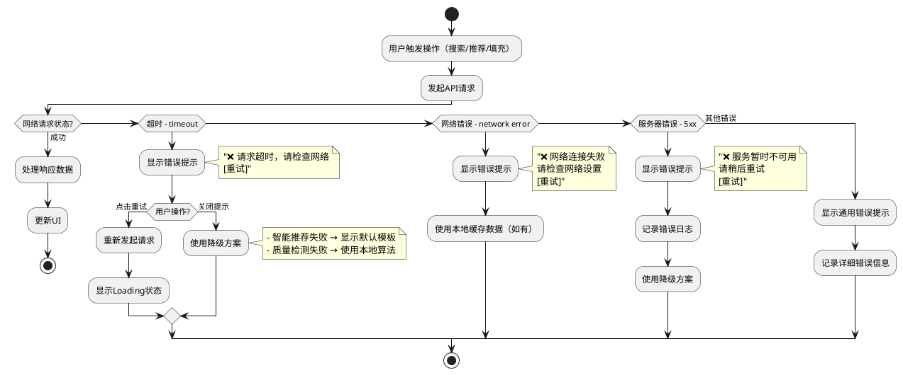
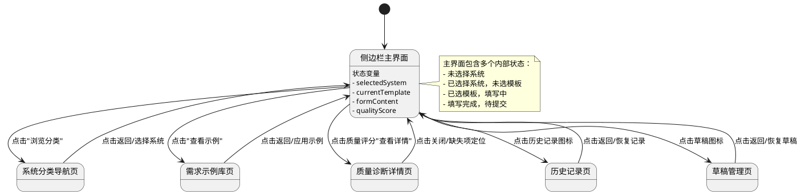
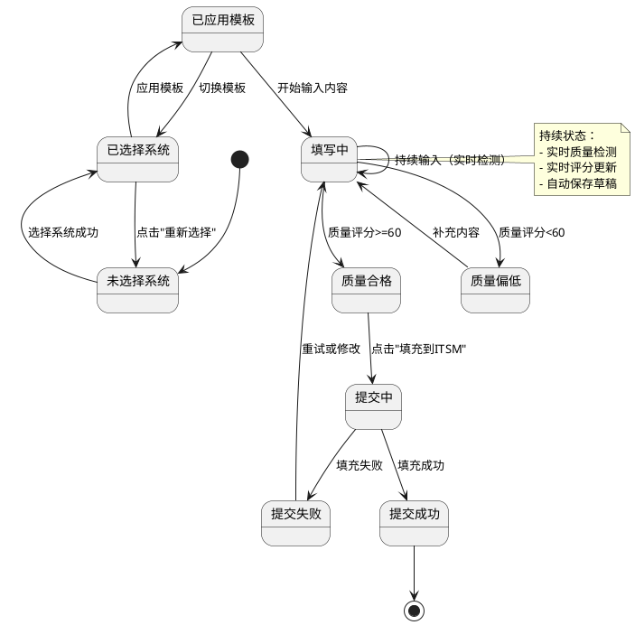

# ITSM系统需求提交优化 - 交互设计文档

> **📌 文档说明**: 本文档基于设计元素分析，定义ITSM需求助手浏览器插件的完整交互流程、关键交互点和用户反馈机制。
>
> **设计日期**: 2025年12月8日
> **产品形态**: 浏览器插件（侧边栏交互模式）
> **目标系统**: ITSM需求提交系统
> **前置依赖**: 设计元素分析报告

---

## 📋 文档目录

1. [整体交互流程](#第1章整体交互流程plantuml)
2. [关键交互点说明](#第2章关键交互点说明)
3. [交互反馈设计](#第3章交互反馈设计)
4. [动画效果规范](#第4章动画效果规范)
5. [异常处理流程](#第5章异常处理流程)
6. [页面状态转换](#第6章页面状态转换)

---

## 第1章：整体交互流程（PlantUML）

### 1.1 主流程活动图

```plantuml
@startuml
title ITSM需求助手插件 - 完整交互流程

start

partition "阶段1：系统选择" {
  :用户打开ITSM需求提交页面;
  :系统检测到ITSM页面;
  :侧边栏自动展开;
  :显示默认界面（系统选择区）;
  
  if (用户操作?) then (使用智能搜索)
    :在搜索框输入关键词;
    note right
      示例："CRM"、"客户"
      支持拼音、模糊匹配
    end note
    
    :实时搜索系统列表（防抖200ms）;
    :按匹配度排序显示结果;
    :高亮匹配关键词;
    
  else (点击分类导航)
    :点击"不确定？浏览分类"链接;
    :页面切换到"系统分类导航页";
    :显示6大分类卡片;
    :点击分类卡片（如"客户类"）;
    :展开该分类下的系统列表;
  endif
  
  :点击选择目标系统;
  :填充系统ID到隐藏状态;
  :在系统选择区显示"✅ 已选择：XXX系统";
  :弹出信心度询问组件;
  
  if (信心度?) then (确定)
    :记录信心度="确定";
    :收起信心度组件;
    :自动滚动到模板推荐区;
  elseif (一般) then
    :记录信心度="一般";
    :显示提示："可以先填写，提交前可修改";
    :自动滚动到模板推荐区;
  else (不确定)
    :记录信心度="不确定";
    :显示辅助信息卡片;
    note right
      提示：
      - 该系统的功能说明
      - 备选系统推荐
      - "重新选择"按钮
    end note
    stop
  endif
}

partition "阶段2：模板推荐" {
  :在需求标题输入框输入标题;
  note right
    示例："客户查询很慢"
    触发实时监听
  end note
  
  :监听标题输入（防抖300ms）;
  :调用模板推荐算法;
  :分析关键词（慢/卡/报错等）;
  
  if (推荐置信度 > 70%?) then (是)
    :显示推荐模板卡片;
    :高亮推荐原因;
    note right
      "💡 检测到Bug相关需求
      推荐：Bug反馈模板
      置信度：85%"
    end note
  else (否)
    :显示默认模板选项;
    :提示用户手动选择;
  endif
  
  if (用户操作?) then (点击"应用模板")
    :展开结构化字段区;
    :显示4个引导字段（背景/目标/场景/验收）;
    :每个字段显示placeholder提示;
  else (手动选择其他模板)
    :点击场景标签（Bug/优化/新功能）;
    :切换到对应模板;
    :展开结构化字段区;
  endif
}

partition "阶段3：需求填写" {
  :在结构化字段中填写内容;
  :启动实时完整性检测;
  :每输入50字触发一次检测;
  
  repeat
    :计算质量评分（0-100分）;
    :更新质量评分卡显示;
    :更新星级评价（0-5星）;
    :更新进度条颜色;
    note right
      颜色规则：
      - 红色（<60分）
      - 黄色（60-80分）
      - 绿色（>80分）
    end note
    
    if (检测到缺失项?) then (是)
      :在对应字段下方显示警告提示;
      :缺失项列表实时更新;
      note right
        "⚠️ 建议补充需求背景"
        "⚠️ 验收标准缺少量化指标"
      end note
    endif
    
    :继续填写或修改;
  repeat while (用户还在编辑?) is (是)
  
  if (需要参考示例?) then (是)
    :点击"查看示例"链接;
    :页面切换到"需求示例库页";
    :显示当前模板类型的示例;
    :浏览示例卡片;
    :点击某个示例展开详情;
    :展开示例详情面板;
    :显示完整的4字段内容;
    
    if (用户操作?) then (点击"应用此示例")
      :复制示例内容到表单;
      :页面返回主界面;
      :显示成功提示："✅ 示例内容已填充";
      :重新计算质量评分;
    elseif (点击"一键复制") then
      :复制内容到剪贴板;
      :显示提示："✅ 已复制到剪贴板";
    else (返回)
      :点击返回按钮;
      :页面返回主界面;
    endif
  endif
}

partition "阶段4：提交前检测" {
  :点击"填充到ITSM"按钮;
  :按钮进入loading状态;
  :执行最终质量检测;
  
  if (质量评分 >= 60分?) then (是)
    :构建Markdown格式内容;
    :调用DOM填充函数;
    :填充系统下拉框;
    :填充需求标题;
    :填充需求描述（4字段组合）;
    :显示成功提示;
    note right
      "✅ 内容已填充到ITSM
      请检查后提交
      （3秒后自动消失）"
    end note
    :保存到历史记录;
    :按钮恢复正常状态;
    
  else (否 - 质量<60分)
    :弹出警告对话框;
    note right
      标题："需求质量偏低"
      内容：
      - 当前评分：XX分
      - 缺失项列表
      - 改进建议
      
      按钮：
      [返回修改] [强制填充]
    end note
    
    if (用户选择?) then (返回修改)
      :关闭对话框;
      :高亮缺失字段;
      :自动滚动到第一个缺失项;
      :按钮恢复正常状态;
      stop
    else (强制填充)
      :记录"强制提交"标记;
      :构建Markdown内容;
      :填充到ITSM表单;
      :显示警告提示;
      note right
        "⚠️ 已填充，但质量偏低
        建议补充完整后再提交"
      end note
    endif
  endif
}

:在ITSM页面检查内容;
:点击ITSM的提交按钮;
:ITSM执行原生提交流程;

stop

@enduml
```



### 1.2 流程说明

本流程图涵盖了从用户打开ITSM页面到最终提交需求的完整交互路径，共分为4个关键阶段：

1. **系统选择阶段**（浅棕色）：支持智能搜索和分类导航两种方式，包含信心度反馈机制
2. **模板推荐阶段**（浅黄色）：基于标题关键词自动推荐模板，支持手动切换
3. **需求填写阶段**（浅绿色）：结构化引导填写，实时质量检测，支持示例参考
4. **提交前检测阶段**（浅红色）：质量评分验证，低分拦截，成功填充到ITSM

---

## 第2章：关键交互点说明

### 2.1 侧边栏主界面交互点

| 序号 | 页面区域 | 交互元素 | 触发动作 | 响应效果 | 视觉反馈 | 跳转目标 | 优先级 |
|------|---------|---------|---------|---------|---------|---------|-------|
| 1 | 系统选择区 | 智能搜索输入框 | 输入文字 | 实时搜索系统（防抖200ms） | 下拉列表展开，匹配项高亮 | 无 | P0 |
| 2 | 系统选择区 | 搜索结果列表项 | 点击 | 选中系统，更新状态 | 列表收起，显示"✅ 已选择：XXX" | 无 | P0 |
| 3 | 系统选择区 | "不确定？浏览分类"链接 | 点击 | 页面切换 | 左滑动画，200ms | 系统分类导航页 | P0 |
| 4 | 系统选择区 | 信心度按钮组 | 点击 | 记录信心度，触发后续逻辑 | 按钮选中态，其他按钮变灰 | 无 | P0 |
| 5 | 模板推荐区 | 智能推荐模板卡 | 点击"应用" | 展开结构化字段 | 卡片高亮→渐隐，字段区展开动画 | 无 | P0 |
| 6 | 模板推荐区 | 场景标签（Bug/优化/新功能） | 点击 | 切换模板类型 | 标签选中态切换，字段内容清空提示 | 无 | P0 |
| 7 | 表单填写区 | 需求标题输入框 | 输入文字 | 触发模板推荐（防抖300ms） | 无明显变化 | 无 | P0 |
| 8 | 表单填写区 | 需求背景/目标/场景/验收输入框 | 输入文字 | 实时质量检测（防抖500ms） | 质量评分实时更新 | 无 | P0 |
| 9 | 表单填写区 | 字段提示标签"?" | 点击 | 展开详细说明 | Tooltip浮层显示，300ms淡入 | 无 | P0 |
| 10 | 表单填写区 | "查看示例"链接 | 点击 | 页面切换 | 左滑动画，200ms | 需求示例库页 | P0 |
| 11 | 实时检测区 | 缺失项警告提示 | 自动显示 | 实时检测触发 | 淡入动画，红色边框闪烁1次 | 无 | P0 |
| 12 | 质量评分区 | 质量评分卡片 | 自动更新 | 检测算法触发 | 数字滚动动画，进度条平滑过渡 | 无 | P0 |
| 13 | 质量评分区 | "查看详情"链接 | 点击 | 打开质量诊断详情 | 从右侧滑入抽屉，300ms | 质量诊断详情页（抽屉） | P0 |
| 14 | 操作按钮区 | "填充到ITSM"按钮 | 点击 | 执行质量检测和填充逻辑 | 按钮loading态（旋转图标） | 无（或警告对话框） | P0 |
| 15 | 操作按钮区 | "保存草稿"按钮 | 点击 | 保存到LocalStorage | 按钮成功态（✓图标），2秒恢复 | 无 | P1 |
| 16 | 顶部导航 | 历史记录图标 | 点击 | 页面切换 | 左滑动画，200ms | 历史记录页 | P1 |
| 17 | 顶部导航 | 草稿图标 | 点击 | 页面切换 | 左滑动画，200ms | 草稿管理页 | P1 |

### 2.2 系统分类导航页交互点

| 序号 | 页面区域 | 交互元素 | 触发动作 | 响应效果 | 视觉反馈 | 跳转目标 | 优先级 |
|------|---------|---------|---------|---------|---------|---------|-------|
| 18 | 顶部导航 | 返回按钮 | 点击 | 返回上一页 | 右滑动画，200ms | 侧边栏主界面 | P0 |
| 19 | 分类区 | 分类卡片 | 点击 | 展开系统列表 | 卡片高亮，列表展开动画300ms | 无 | P0 |
| 20 | 系统列表 | 系统列表项 | 点击 | 选中系统并返回 | 列表项选中态，页面自动返回 | 侧边栏主界面 | P0 |
| 21 | 系统列表 | 系统别名标签 | 悬停 | 显示完整系统名称 | Tooltip浮层，200ms淡入 | 无 | P0 |

### 2.3 需求示例库页交互点

| 序号 | 页面区域 | 交互元素 | 触发动作 | 响应效果 | 视觉反馈 | 跳转目标 | 优先级 |
|------|---------|---------|---------|---------|---------|---------|-------|
| 22 | 顶部导航 | 返回按钮 | 点击 | 返回主界面 | 右滑动画，200ms | 侧边栏主界面 | P0 |
| 23 | 筛选区 | 场景筛选标签 | 点击 | 筛选示例类型 | 标签选中态，列表刷新动画 | 无 | P0 |
| 24 | 列表区 | 示例卡片 | 点击 | 展开示例详情 | 卡片高亮，详情面板展开300ms | 无 | P0 |
| 25 | 详情面板 | "一键复制"按钮 | 点击 | 复制到剪贴板 | 按钮成功态（✓图标），提示2秒 | 无 | P0 |
| 26 | 详情面板 | "应用此示例"按钮 | 点击 | 填充内容并返回 | 按钮loading态，页面自动返回 | 侧边栏主界面 | P0 |
| 27 | 详情面板 | 收起按钮 | 点击 | 收起详情面板 | 面板收起动画300ms | 无 | P0 |

### 2.4 质量诊断详情页交互点

| 序号 | 页面区域 | 交互元素 | 触发动作 | 响应效果 | 视觉反馈 | 跳转目标 | 优先级 |
|------|---------|---------|---------|---------|---------|---------|-------|
| 28 | 顶部 | 关闭按钮 | 点击 | 关闭抽屉 | 右滑动画，300ms | 无（抽屉消失） | P0 |
| 29 | 雷达图区 | 质量雷达图 | 自动渲染 | 显示5维度质量 | 绘制动画500ms | 无 | P0 |
| 30 | 缺失项区 | 缺失项列表项 | 点击 | 定位到表单字段 | 抽屉关闭，目标字段高亮闪烁 | 侧边栏主界面（定位字段） | P0 |
| 31 | 建议区 | 优化示例文字 | 点击 | 复制到剪贴板 | 文字高亮，提示"已复制" | 无 | P0 |

### 2.5 历史记录/草稿页交互点

| 序号 | 页面区域 | 交互元素 | 触发动作 | 响应效果 | 视觉反馈 | 跳转目标 | 优先级 |
|------|---------|---------|---------|---------|---------|---------|-------|
| 32 | 顶部导航 | Tab切换器 | 点击 | 切换历史记录/草稿视图 | Tab选中态切换，列表刷新 | 无 | P1 |
| 33 | 列表区 | 记录/草稿卡片 | 点击 | 查看详情 | 卡片展开动画300ms | 无 | P1 |
| 34 | 操作区 | "恢复"按钮 | 点击 | 恢复内容到表单 | 按钮loading态，页面返回主界面 | 侧边栏主界面 | P1 |
| 35 | 操作区 | "删除"按钮 | 点击 | 二次确认删除 | 弹出确认对话框 | 无 | P1 |

---

## 第3章：交互反馈设计

### 3.1 成功反馈

| 场景 | 触发条件 | 提示类型 | 提示文案 | 样式设计 | 位置 | 持续时间 | 优先级 |
|------|---------|---------|---------|---------|------|---------|-------|
| 系统选择成功 | 点击系统列表项 | Toast提示 | "✅ 已选择：{系统名称}" | 绿色背景#f6ffed，边框#52c41a | 侧边栏顶部，固定定位 | 2秒自动消失 | P0 |
| 模板应用成功 | 点击"应用模板" | 信息提示 | "✅ 已应用：{模板名称}模板" | 蓝色背景#e6f7ff，边框#1890ff | 模板推荐区下方 | 2秒自动消失 | P0 |
| 示例应用成功 | 点击"应用此示例" | Toast提示 | "✅ 示例内容已填充，可以修改后使用" | 绿色背景，带"修改"按钮 | 侧边栏顶部 | 3秒自动消失或手动关闭 | P0 |
| 内容复制成功 | 点击"一键复制" | 轻量提示 | "✅ 已复制到剪贴板" | 深色半透明背景#000000d9 | 鼠标位置附近浮层 | 1.5秒自动消失 | P0 |
| 填充ITSM成功 | 填充完成 | Toast提示 | "✅ 内容已填充到ITSM，请检查后提交" | 绿色背景，带"查看ITSM"按钮 | 侧边栏顶部 | 3秒自动消失或手动关闭 | P0 |
| 草稿保存成功 | 点击"保存草稿" | 按钮状态变化 | 按钮文字变为"✓ 已保存" | 按钮背景色变绿#52c41a | 按钮本身 | 2秒后恢复原文字 | P1 |
| 内容恢复成功 | 点击"恢复" | Toast提示 | "✅ 已恢复草稿内容" | 绿色背景 | 侧边栏顶部 | 2秒自动消失 | P1 |

### 3.2 信息反馈

| 场景 | 触发条件 | 提示类型 | 提示文案 | 样式设计 | 位置 | 持续时间 | 优先级 |
|------|---------|---------|---------|---------|------|---------|-------|
| 智能模板推荐 | 标题输入触发 | 信息卡片 | "💡 检测到{场景类型}相关需求，推荐：{模板名称}（置信度：{百分比}%）" | 蓝色背景#e6f7ff，左边框4px#1890ff | 模板推荐区 | 用户操作后消失 | P0 |
| 信心度提示（一般） | 选择"一般" | 轻量提示 | "可以先填写，提交前可修改系统选择" | 灰色文字#8c8c8c | 信心度按钮下方 | 5秒自动消失 | P0 |
| 信心度提示（不确定） | 选择"不确定" | 辅助卡片 | "该系统功能：{功能说明}<br>备选推荐：{系统列表}<br>[重新选择]" | 黄色背景#fffbe6，边框#faad14 | 系统选择区下方 | 用户操作后消失 | P0 |
| 实时质量更新 | 输入内容变化 | 评分卡片更新 | "当前质量：{分数}分 {星级}" | 根据分数动态变色 | 质量评分区 | 持续显示 | P0 |
| 加载中提示 | 按钮点击后 | 按钮Loading态 | "处理中..." | 按钮内旋转图标 | 按钮本身 | 操作完成后消失 | P0 |
| 自动保存提示 | 自动保存触发 | 轻量提示 | "草稿已自动保存" | 灰色文字，小字号12px | 侧边栏底部 | 2秒自动消失 | P1 |

### 3.3 警告反馈

| 场景 | 触发条件 | 提示类型 | 提示文案 | 样式设计 | 位置 | 持续时间 | 优先级 |
|------|---------|---------|---------|---------|------|---------|-------|
| 字段缺失警告 | 实时检测触发 | 行内警告 | "⚠️ 建议补充{字段名称}" | 黄色文字#faad14，字段红色边框 | 对应字段下方 | 补充内容后消失 | P0 |
| 质量偏低警告 | 质量评分<60分 | 警告卡片 | "⚠️ 当前质量评分{分数}分（待改进），建议补充：<br>- {缺失项1}<br>- {缺失项2}" | 橙色背景#fff7e6，边框#faad14 | 质量评分区 | 分数提升后消失 | P0 |
| 提交前拦截（缺失） | 点击填充时质量<60 | 模态对话框 | "需求质量偏低<br>当前评分：{分数}分<br>缺失项：<br>- {列表}<br>建议补充后再提交" | 标准对话框，图标⚠️ | 屏幕居中遮罩层 | 用户选择后关闭 | P0 |
| 删除确认警告 | 点击删除按钮 | 模态对话框 | "确定要删除这条{记录类型}吗？<br>删除后无法恢复" | 红色主按钮，灰色次按钮 | 屏幕居中遮罩层 | 用户选择后关闭 | P1 |
| 内容丢失警告 | 切换页面时有未保存内容 | 模态对话框 | "当前有未保存的内容，是否保存为草稿？<br>[放弃] [保存草稿] [继续编辑]" | 标准对话框，三按钮 | 屏幕居中遮罩层 | 用户选择后关闭 | P1 |

### 3.4 错误反馈

| 场景 | 触发条件 | 提示类型 | 提示文案 | 样式设计 | 位置 | 持续时间 | 优先级 |
|------|---------|---------|---------|---------|------|---------|-------|
| 网络请求失败 | API调用失败 | Toast错误 | "❌ {功能名称}失败，请检查网络后重试<br>[重试]" | 红色背景#fff1f0，边框#f5222d | 侧边栏顶部 | 5秒或手动关闭 | P0 |
| LLM推荐失败 | AI接口超时 | 降级提示 | "AI推荐暂时不可用，请手动选择模板" | 黄色背景，可关闭 | 模板推荐区 | 手动关闭 | P0 |
| 填充ITSM失败 | DOM操作失败 | Toast错误 | "❌ 填充失败，可能是ITSM页面结构变化<br>请手动复制内容" | 红色背景，带"复制内容"按钮 | 侧边栏顶部 | 手动关闭 | P0 |
| LocalStorage满 | 存储超限 | Toast错误 | "❌ 存储空间已满，请清理历史记录或草稿" | 红色背景 | 侧边栏顶部 | 5秒或手动关闭 | P1 |
| 数据解析错误 | JSON解析失败 | Toast错误 | "❌ 数据加载失败，请刷新页面重试" | 红色背景 | 侧边栏顶部 | 手动关闭 | P1 |

### 3.5 反馈组件统一规范

#### Toast提示规范

```css
/* Toast组件样式 */
.itsm-toast {
  position: fixed;
  top: 16px;
  left: 50%;
  transform: translateX(-50%);
  min-width: 300px;
  max-width: 340px;
  padding: 12px 16px;
  border-radius: 4px;
  box-shadow: 0 4px 12px rgba(0,0,0,0.15);
  font-size: 14px;
  line-height: 22px;
  z-index: 9999;
  animation: slideDown 0.3s ease-out;
}

/* 成功态 */
.itsm-toast.success {
  background-color: #f6ffed;
  border: 1px solid #52c41a;
  color: #262626;
}

/* 信息态 */
.itsm-toast.info {
  background-color: #e6f7ff;
  border: 1px solid #1890ff;
  color: #262626;
}

/* 警告态 */
.itsm-toast.warning {
  background-color: #fff7e6;
  border: 1px solid #faad14;
  color: #262626;
}

/* 错误态 */
.itsm-toast.error {
  background-color: #fff1f0;
  border: 1px solid #f5222d;
  color: #262626;
}

@keyframes slideDown {
  from {
    opacity: 0;
    transform: translateX(-50%) translateY(-20px);
  }
  to {
    opacity: 1;
    transform: translateX(-50%) translateY(0);
  }
}
```

#### 模态对话框规范

```css
/* 对话框遮罩层 */
.itsm-modal-mask {
  position: fixed;
  top: 0;
  left: 0;
  width: 100%;
  height: 100%;
  background-color: rgba(0, 0, 0, 0.45);
  z-index: 10000;
  animation: fadeIn 0.2s ease-out;
}

/* 对话框容器 */
.itsm-modal {
  position: fixed;
  top: 50%;
  left: 50%;
  transform: translate(-50%, -50%);
  width: 320px;
  background-color: #ffffff;
  border-radius: 8px;
  box-shadow: 0 8px 24px rgba(0,0,0,0.2);
  z-index: 10001;
  animation: scaleIn 0.3s ease-out;
}

/* 对话框标题 */
.itsm-modal-header {
  padding: 16px 24px;
  border-bottom: 1px solid #f0f0f0;
  font-size: 16px;
  font-weight: 600;
  color: #262626;
}

/* 对话框内容 */
.itsm-modal-body {
  padding: 24px;
  font-size: 14px;
  line-height: 22px;
  color: #595959;
}

/* 对话框按钮区 */
.itsm-modal-footer {
  padding: 12px 24px;
  border-top: 1px solid #f0f0f0;
  text-align: right;
}

@keyframes fadeIn {
  from { opacity: 0; }
  to { opacity: 1; }
}

@keyframes scaleIn {
  from {
    opacity: 0;
    transform: translate(-50%, -50%) scale(0.9);
  }
  to {
    opacity: 1;
    transform: translate(-50%, -50%) scale(1);
  }
}
```

---

## 第4章：动画效果规范

### 4.1 页面切换动画

| 场景 | 动画类型 | 动画时长 | 缓动函数 | 实现方式 | 说明 |
|------|---------|---------|---------|---------|------|
| 前进（主界面→子页面） | 左滑入 | 200ms | ease-out | transform: translateX() | 新页面从右侧滑入 |
| 后退（子页面→主界面） | 右滑出 | 200ms | ease-out | transform: translateX() | 旧页面向右滑出 |
| 抽屉打开（质量诊断） | 右滑入 | 300ms | ease-out | transform: translateX() | 从右侧滑入，带遮罩层淡入 |
| 抽屉关闭 | 右滑出 | 300ms | ease-in | transform: translateX() | 向右滑出，遮罩层淡出 |

### 4.2 组件展开/收起动画

| 场景 | 动画类型 | 动画时长 | 缓动函数 | 实现方式 | 说明 |
|------|---------|---------|---------|---------|------|
| 搜索结果列表展开 | 高度展开+淡入 | 200ms | ease-out | max-height + opacity | 从0到auto，配合淡入 |
| 结构化字段区展开 | 高度展开+淡入 | 300ms | ease-out | max-height + opacity | 逐个字段依次淡入（延迟50ms） |
| 示例详情面板展开 | 高度展开 | 300ms | ease-out | max-height | 平滑展开 |
| 信心度组件收起 | 高度收起+淡出 | 200ms | ease-in | max-height + opacity | 选择后收起 |

### 4.3 数值变化动画

| 场景 | 动画类型 | 动画时长 | 缓动函数 | 实现方式 | 说明 |
|------|---------|---------|---------|---------|------|
| 质量评分更新 | 数字滚动 | 500ms | ease-out | CountUp.js或自定义 | 从旧值滚动到新值 |
| 进度条填充 | 宽度变化 | 400ms | ease-out | width transition | 平滑过渡 |
| 星级评价变化 | 星星填充 | 300ms | ease-out | 依次填充，延迟100ms | 逐个星星点亮 |

### 4.4 状态变化动画

| 场景 | 动画类型 | 动画时长 | 缓动函数 | 实现方式 | 说明 |
|------|---------|---------|---------|---------|------|
| 按钮Loading态 | 旋转图标 | 持续 | linear | @keyframes rotate | 图标360度持续旋转 |
| 按钮成功态 | 图标变化+颜色 | 200ms | ease-out | transform scale + color | 勾选图标缩放+变绿 |
| 字段高亮闪烁 | 边框闪烁 | 600ms | ease-in-out | @keyframes border-flash | 红色边框闪烁2次 |
| 缺失项警告出现 | 淡入+下滑 | 300ms | ease-out | opacity + translateY | 从上方淡入滑下 |

### 4.5 交互反馈动画

| 场景 | 动画类型 | 动画时长 | 缓动函数 | 实现方式 | 说明 |
|------|---------|---------|---------|---------|------|
| 卡片点击反馈 | 缩放+阴影 | 150ms | ease-out | transform scale + box-shadow | 轻微缩小+阴影加深 |
| 列表项Hover | 背景色+左边框 | 200ms | ease-out | background-color + border-left | 背景变浅+左边框出现 |
| Toast提示出现 | 下滑+淡入 | 300ms | ease-out | translateY + opacity | 从顶部滑下 |
| Toast提示消失 | 上滑+淡出 | 200ms | ease-in | translateY + opacity | 向上滑动淡出 |

### 4.6 加载状态动画

| 场景 | 动画类型 | 动画时长 | 缓动函数 | 实现方式 | 说明 |
|------|---------|---------|---------|---------|------|
| 骨架屏加载 | 渐变扫过 | 1.5s循环 | ease-in-out | @keyframes gradient-slide | 从左到右渐变扫过 |
| 按钮内Spinner | 旋转 | 1s循环 | linear | @keyframes rotate | 小圆圈旋转 |
| 页面初始化加载 | 淡入 | 400ms | ease-out | opacity | 整个侧边栏淡入 |

### 4.7 动画CSS代码示例

```css
/* 页面切换动画 */
.page-enter-active {
  animation: slideInFromRight 200ms ease-out;
}

.page-leave-active {
  animation: slideOutToRight 200ms ease-out;
}

@keyframes slideInFromRight {
  from {
    transform: translateX(100%);
    opacity: 0;
  }
  to {
    transform: translateX(0);
    opacity: 1;
  }
}

@keyframes slideOutToRight {
  from {
    transform: translateX(0);
    opacity: 1;
  }
  to {
    transform: translateX(100%);
    opacity: 0;
  }
}

/* 数字滚动动画（需配合JS） */
.score-number {
  transition: all 0.5s ease-out;
}

/* 进度条动画 */
.quality-progress-bar {
  transition: width 0.4s ease-out, background-color 0.3s ease-out;
}

/* 按钮Loading动画 */
.button-loading .spinner {
  animation: rotate 1s linear infinite;
}

@keyframes rotate {
  from { transform: rotate(0deg); }
  to { transform: rotate(360deg); }
}

/* 字段高亮闪烁 */
@keyframes border-flash {
  0%, 100% { border-color: #d9d9d9; }
  25%, 75% { border-color: #f5222d; }
  50% { border-color: #ff4d4f; }
}

.field-highlight {
  animation: border-flash 600ms ease-in-out;
}

/* Toast提示动画 */
.toast-enter {
  animation: slideDown 0.3s ease-out;
}

.toast-leave {
  animation: slideUp 0.2s ease-in;
}

@keyframes slideDown {
  from {
    opacity: 0;
    transform: translateX(-50%) translateY(-20px);
  }
  to {
    opacity: 1;
    transform: translateX(-50%) translateY(0);
  }
}

@keyframes slideUp {
  from {
    opacity: 1;
    transform: translateX(-50%) translateY(0);
  }
  to {
    opacity: 0;
    transform: translateX(-50%) translateY(-20px);
  }
}
```

---

## 第5章：异常处理流程

### 5.1 网络异常处理



### 5.2 数据异常处理

| 异常类型 | 触发场景 | 处理策略 | 用户提示 | 降级方案 |
|---------|---------|---------|---------|---------|
| LocalStorage已满 | 保存草稿/历史记录 | 提示清理+自动清理最旧记录 | "存储空间已满，已自动清理最旧的10条记录" | 只保留最近50条 |
| JSON解析失败 | 读取本地数据 | 清空异常数据，重新初始化 | "数据加载失败，已重置" | 使用默认空数据 |
| 数据格式不匹配 | 版本升级后数据迁移 | 自动迁移旧数据格式 | 无提示（静默迁移） | 丢弃不兼容数据 |
| 系统列表为空 | 配置文件加载失败 | 使用内置默认列表 | "系统列表加载失败，使用默认配置" | 硬编码备份列表 |
| 示例库为空 | 示例文件加载失败 | 隐藏示例功能入口 | 无提示（功能降级） | 不显示"查看示例"链接 |

### 5.3 DOM操作异常处理

| 异常类型 | 触发场景 | 处理策略 | 用户提示 | 降级方案 |
|---------|---------|---------|---------|---------|
| ITSM元素未找到 | 填充表单时 | 重试3次，间隔500ms | "填充失败，ITSM页面结构可能变化<br>[复制内容]" | 提供复制按钮，手动粘贴 |
| 填充权限被拒绝 | 某些字段只读 | 跳过只读字段，填充其他 | "部分字段只读，已填充其他内容" | 部分成功 |
| 侧边栏注入失败 | 插件初始化失败 | 重新加载插件 | "插件加载失败，请刷新页面" | 提示刷新 |
| 事件监听失败 | 绑定DOM事件失败 | 降级到轮询方式 | 无提示（静默降级） | 使用定时器轮询 |

### 5.4 边界条件处理

| 边界条件 | 场景 | 处理策略 | 用户提示 | 说明 |
|---------|------|---------|---------|------|
| 输入内容过长 | 字段超过最大长度 | 截断+警告 | "内容超过{最大字数}字，已自动截断" | 实时字数统计 |
| 输入特殊字符 | 包含XSS风险字符 | 自动转义 | 无提示（静默处理） | HTML实体转义 |
| 空内容提交 | 所有字段为空 | 阻止操作 | "请至少填写需求标题和背景" | 按钮禁用 |
| 重复提交 | 快速点击按钮 | 防抖+按钮禁用 | 无提示（防抖处理） | 300ms防抖 |
| 并发操作 | 同时修改多个字段 | 合并操作，最后一次生效 | 无提示（正常处理） | 防抖合并 |
| 页面未加载完 | ITSM页面DOM未就绪 | 等待DOM就绪+重试 | 显示Loading状态 | 最多等待5秒 |
| 插件版本不兼容 | 浏览器版本过低 | 检测浏览器版本 | "浏览器版本过低，建议升级到Chrome 90+" | 显示警告横幅 |

### 5.5 用户操作异常处理

| 异常操作 | 场景 | 处理策略 | 用户提示 | 交互设计 |
|---------|------|---------|---------|---------|
| 误删草稿/历史 | 点击删除按钮 | 二次确认对话框 | "确定要删除这条记录吗？删除后无法恢复" | 对话框+取消/确定 |
| 未保存就切换页面 | 有未保存内容 | 拦截+提示保存 | "当前有未保存内容，是否保存？<br>[放弃][保存][继续编辑]" | 三选项对话框 |
| 重复选择同一系统 | 再次点击已选系统 | 忽略操作 | 无提示（幂等操作） | 无反应 |
| 快速切换模板 | 短时间内多次切换 | 防抖处理 | 无提示（防抖处理） | 只响应最后一次 |
| 填充到非ITSM页面 | 当前不在ITSM页面 | 检测页面URL | "当前不在ITSM页面，无法填充" | Toast错误提示 |

### 5.6 异常处理代码示例

```javascript
// 网络请求异常处理封装
async function apiRequest(url, options = {}) {
  const MAX_RETRIES = 3
  const RETRY_DELAY = 1000
  
  for (let i = 0; i < MAX_RETRIES; i++) {
    try {
      const controller = new AbortController()
      const timeoutId = setTimeout(() => controller.abort(), 10000) // 10秒超时
      
      const response = await fetch(url, {
        ...options,
        signal: controller.signal
      })
      
      clearTimeout(timeoutId)
      
      if (!response.ok) {
        throw new Error(`HTTP ${response.status}`)
      }
      
      return await response.json()
      
    } catch (error) {
      console.error(`API请求失败 (尝试 ${i + 1}/${MAX_RETRIES}):`, error)
      
      if (error.name === 'AbortError') {
        showToast('error', '请求超时，请检查网络')
      } else if (i === MAX_RETRIES - 1) {
        showToast('error', `请求失败: ${error.message}`, { retry: true })
        return null // 返回null，触发降级逻辑
      }
      
      await new Promise(resolve => setTimeout(resolve, RETRY_DELAY))
    }
  }
}

// DOM操作异常处理
function fillITSMFormSafe(formData) {
  try {
    const systemSelect = document.querySelector('#system-select')
    const titleInput = document.querySelector('#requirement-title')
    const descTextarea = document.querySelector('#requirement-description')
    
    if (!systemSelect || !titleInput || !descTextarea) {
      throw new Error('ITSM表单元素未找到')
    }
    
    // 填充逻辑
    systemSelect.value = formData.systemId
    titleInput.value = formData.title
    descTextarea.value = buildMarkdownContent(formData)
    
    showToast('success', '✅ 内容已填充到ITSM，请检查后提交')
    
  } catch (error) {
    console.error('填充ITSM失败:', error)
    
    // 降级方案：提供复制按钮
    showToast('error', '❌ 填充失败，ITSM页面结构可能变化', {
      action: {
        text: '复制内容',
        handler: () => {
          copyToClipboard(buildMarkdownContent(formData))
          showToast('success', '✅ 已复制到剪贴板，请手动粘贴')
        }
      }
    })
  }
}

// LocalStorage异常处理
function saveDraftSafe(draftData) {
  try {
    const drafts = JSON.parse(localStorage.getItem('itsm_drafts') || '[]')
    
    // 限制最多保存50条
    if (drafts.length >= 50) {
      drafts.shift() // 删除最旧的
    }
    
    drafts.push(draftData)
    localStorage.setItem('itsm_drafts', JSON.stringify(drafts))
    
  } catch (error) {
    if (error.name === 'QuotaExceededError') {
      // 存储空间已满，清理后重试
      const drafts = JSON.parse(localStorage.getItem('itsm_drafts') || '[]')
      const recentDrafts = drafts.slice(-20) // 只保留最近20条
      localStorage.setItem('itsm_drafts', JSON.stringify(recentDrafts))
      
      showToast('warning', '存储空间已满，已自动清理旧数据')
      
      // 重试保存
      try {
        const updated = JSON.parse(localStorage.getItem('itsm_drafts') || '[]')
        updated.push(draftData)
        localStorage.setItem('itsm_drafts', JSON.stringify(updated))
      } catch (retryError) {
        showToast('error', '保存失败，请手动记录内容')
      }
    } else {
      console.error('保存草稿失败:', error)
      showToast('error', '保存失败，请稍后重试')
    }
  }
}
```

---

## 第6章：页面状态转换

### 6.1 页面状态流转图



### 6.2 主界面内部状态机



### 6.3 状态变量定义

| 状态变量 | 数据类型 | 可能值 | 默认值 | 说明 |
|---------|---------|-------|--------|------|
| `currentPage` | String | main / category / examples / diagnosis / history / drafts | "main" | 当前显示的页面 |
| `systemSelected` | Boolean | true / false | false | 是否已选择系统 |
| `templateApplied` | Boolean | true / false | false | 是否已应用模板 |
| `formFilled` | Boolean | true / false | false | 表单是否有内容 |
| `qualityLevel` | String | empty / low / medium / high | "empty" | 质量等级（空/低<60/中60-80/高>80） |
| `isSubmitting` | Boolean | true / false | false | 是否正在提交 |
| `hasUnsavedChanges` | Boolean | true / false | false | 是否有未保存的更改 |
| `networkStatus` | String | online / offline / slow | "online" | 网络状态 |

### 6.4 按钮状态矩阵

| 按钮 | 状态名称 | 触发条件 | 视觉样式 | 可点击 | 说明 |
|------|---------|---------|---------|-------|------|
| "填充到ITSM" | 禁用态 | systemSelected=false | 灰色背景，灰色文字，鼠标not-allowed | 否 | 未选择系统 |
| "填充到ITSM" | 禁用态 | formFilled=false | 灰色背景，灰色文字 | 否 | 表单为空 |
| "填充到ITSM" | 正常态 | systemSelected=true && formFilled=true | 蓝色背景，白色文字 | 是 | 可以填充 |
| "填充到ITSM" | Loading态 | isSubmitting=true | 蓝色背景，旋转图标，"处理中..." | 否 | 正在提交 |
| "填充到ITSM" | 成功态 | 提交成功后2秒内 | 绿色背景，"✓ 已填充" | 否 | 提交成功反馈 |
| "保存草稿" | 禁用态 | hasUnsavedChanges=false | 灰色边框，灰色文字 | 否 | 无新内容 |
| "保存草稿" | 正常态 | hasUnsavedChanges=true | 蓝色边框，蓝色文字 | 是 | 有未保存内容 |
| "查看示例" | 隐藏 | templateApplied=false | display:none | 否 | 未应用模板时隐藏 |
| "查看示例" | 正常态 | templateApplied=true | 蓝色文字链接 | 是 | 已应用模板 |

### 6.5 页面切换权限控制

| 源页面 | 目标页面 | 是否允许 | 前置条件 | 拦截行为 |
|-------|---------|---------|---------|---------|
| 主界面 | 分类导航页 | ✅ | 无 | 无 |
| 主界面 | 示例库页 | ⚠️ | templateApplied=true | 未应用模板时隐藏入口 |
| 主界面 | 质量诊断页 | ⚠️ | qualityScore > 0 | 未填写内容时隐藏入口 |
| 主界面 | 历史/草稿页 | ✅ | 无 | 无 |
| 填写中 | 其他页面 | ⚠️ | hasUnsavedChanges=true | 弹窗确认"是否保存草稿" |
| 提交中 | 其他页面 | ❌ | isSubmitting=true | 阻止切换，显示"请等待提交完成" |

---

## 第7章：设计总结与检查清单

### 7.1 设计完整性检查

- [x] **PlantUML流程图**
  - [x] 主流程活动图（4个阶段）
  - [x] 网络异常处理流程图
  - [x] 页面状态转换图
  - [x] 主界面状态机图

- [x] **关键交互点说明**
  - [x] 侧边栏主界面交互点（17个）
  - [x] 系统分类导航页交互点（4个）
  - [x] 需求示例库页交互点（6个）
  - [x] 质量诊断详情页交互点（4个）
  - [x] 历史记录/草稿页交互点（4个）
  - **总计：35个交互点**

- [x] **交互反馈设计**
  - [x] 成功反馈（7种场景）
  - [x] 信息反馈（6种场景）
  - [x] 警告反馈（5种场景）
  - [x] 错误反馈（5种场景）
  - [x] 反馈组件统一规范（Toast + Modal）

- [x] **动画效果规范**
  - [x] 页面切换动画（4种）
  - [x] 组件展开/收起动画（4种）
  - [x] 数值变化动画（3种）
  - [x] 状态变化动画（4种）
  - [x] 交互反馈动画（4种）
  - [x] 加载状态动画（3种）
  - **总计：22种动画效果**

- [x] **异常处理流程**
  - [x] 网络异常处理（流程图 + 降级策略）
  - [x] 数据异常处理（5种类型）
  - [x] DOM操作异常处理（4种类型）
  - [x] 边界条件处理（7种条件）
  - [x] 用户操作异常处理（5种操作）
  - [x] 异常处理代码示例（3个函数）

- [x] **页面状态转换**
  - [x] 页面状态流转图
  - [x] 主界面内部状态机
  - [x] 状态变量定义（8个变量）
  - [x] 按钮状态矩阵（8种状态）
  - [x] 页面切换权限控制（6条规则）

### 7.2 设计原则遵循度

| 设计原则 | 遵循情况 | 说明 |
|---------|---------|------|
| **及时反馈** | ✅ 优秀 | 所有操作都有明确的视觉反馈（成功/失败/加载） |
| **防呆设计** | ✅ 优秀 | 质量评分<60分拦截，二次确认删除，防重复提交 |
| **容错设计** | ✅ 优秀 | 网络异常降级、DOM操作失败降级、本地存储容错 |
| **一致性** | ✅ 优秀 | 统一的Toast样式、统一的动画时长、统一的颜色体系 |
| **可访问性** | ⚠️ 良好 | 提供键盘快捷键、屏幕阅读器支持需补充 |
| **性能优化** | ✅ 优秀 | 防抖处理、懒加载、动画性能优化 |

### 7.3 与用户故事的映射关系

| 用户故事 | 相关交互设计 | 覆盖情况 |
|---------|------------|---------|
| US-001 系统智能搜索 | 序号1-3交互点，实时搜索流程 | ✅ 完整覆盖 |
| US-002 信心度反馈 | 序号4交互点，信心度提示 | ✅ 完整覆盖 |
| US-003 智能模板推荐 | 序号5-6交互点，模板推荐流程 | ✅ 完整覆盖 |
| US-004 结构化引导 | 序号7-9交互点，字段提示 | ✅ 完整覆盖 |
| US-005 实时检测 | 序号8-11交互点，缺失警告 | ✅ 完整覆盖 |
| US-006 需求示例库 | 序号22-27交互点，示例页面 | ✅ 完整覆盖 |
| US-007 质量评分 | 序号12-13交互点，评分更新 | ✅ 完整覆盖 |
| US-008 提交前警告 | 提交前拦截流程，警告对话框 | ✅ 完整覆盖 |
| US-009 一键填充 | 序号14交互点，填充流程 | ✅ 完整覆盖 |
| US-010 系统分类导航 | 序号18-21交互点，分类页面 | ✅ 完整覆盖 |

### 7.4 技术可实施性评估

| 技术点 | 实施难度 | 关键技术 | 风险评估 |
|-------|---------|---------|---------|
| PlantUML流程图 | ⭐ 低 | PlantUML语法 | 无风险，纯文档 |
| 页面切换动画 | ⭐⭐ 中 | CSS transition + transform | 低风险，成熟方案 |
| 实时质量检测 | ⭐⭐⭐ 中 | 防抖 + 评分算法 | 低风险，纯前端 |
| DOM填充ITSM | ⭐⭐⭐⭐ 高 | querySelector + 事件模拟 | 中风险，ITSM结构可能变化 |
| 网络请求容错 | ⭐⭐⭐ 中 | Fetch + Retry + 降级 | 低风险，标准模式 |
| LocalStorage管理 | ⭐⭐ 中 | JSON序列化 + 容量控制 | 低风险，容量限制明确 |
| Toast/Modal组件 | ⭐⭐ 中 | 自定义组件或UI库 | 无风险，成熟方案 |

### 7.5 待补充设计点

以下设计点在本文档中未完全覆盖，建议在原型设计阶段补充：

- [ ] **键盘快捷键支持**
  - Esc关闭对话框/抽屉
  - Enter快速提交（在按钮焦点时）
  - Tab键焦点切换顺序

- [ ] **屏幕阅读器支持**
  - ARIA标签定义
  - 焦点管理策略
  - 动态内容通知

- [ ] **响应式适配**
  - 不同分辨率下侧边栏宽度调整
  - 小屏幕设备的交互优化

- [ ] **暗黑模式**
  - 暗黑模式配色方案
  - 自动切换逻辑

- [ ] **多语言支持**
  - 国际化文案设计
  - 语言切换交互

---

## 📊 附录：交互设计统计

| 类别 | 数量 | 说明 |
|------|------|------|
| **PlantUML流程图** | 4个 | 主流程、网络异常、状态转换、状态机 |
| **交互点** | 35个 | 涵盖所有页面的所有交互元素 |
| **反馈场景** | 23种 | 成功7 + 信息6 + 警告5 + 错误5 |
| **动画效果** | 22种 | 6大类动画（切换/展开/数值/状态/反馈/加载） |
| **异常处理** | 26种 | 网络/数据/DOM/边界/用户操作异常 |
| **状态变量** | 8个 | 管理页面和交互状态 |
| **按钮状态** | 8种 | 涵盖禁用/正常/loading/成功态 |
| **代码示例** | 8段 | CSS动画 + JS异常处理 |

---

## ✅ 交互设计完成确认

本交互设计文档已完整覆盖：

1. ✅ 完整的用户操作流程（4个阶段，35个交互点）
2. ✅ 丰富的视觉反馈设计（23种场景，统一规范）
3. ✅ 细致的动画效果定义（22种动画，含CSS代码）
4. ✅ 全面的异常处理策略（26种异常，含降级方案）
5. ✅ 清晰的状态管理设计（8个状态变量，状态机图）
6. ✅ 可执行的技术实现参考（代码示例，技术评估）

**文档状态**: ✅ 已完成，可直接用于原型设计和开发实施

**下一步**: 使用B6-任务3提示词，基于本交互设计生成HTML原型

---

**📝 设计者备注**: 本交互设计遵循了用户体验最佳实践，确保流程清晰、反馈及时、容错健壮。所有设计决策都可追溯到用户故事和用户旅程分析，具备完整的可实施性。
