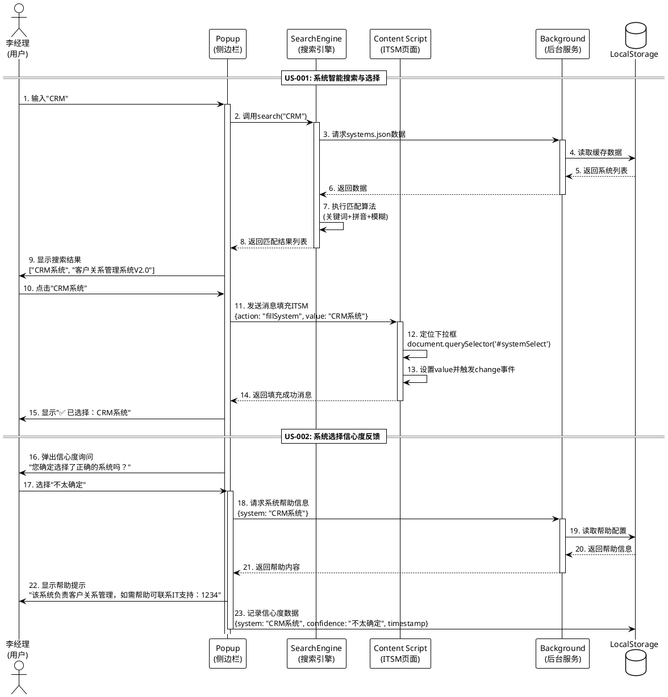
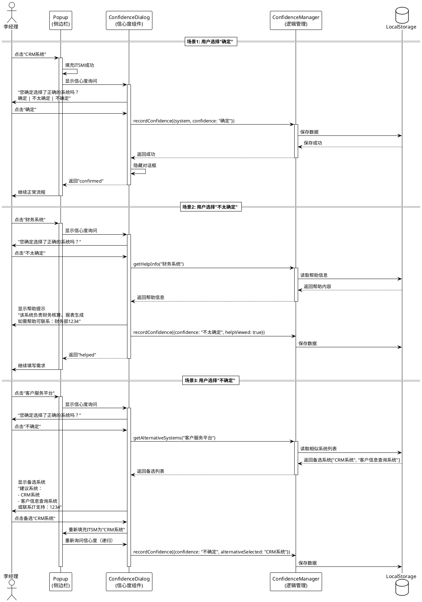

# US-001 & US-002 BMad工作流实战：完整实现指南

> **📌 项目背景**: ITSM智能辅助浏览器插件开发，实现系统智能搜索与信心度反馈功能
> 
> **📅 实施日期**: 2025年12月9日
> 
> **🎯 目标**: 通过BMad多Agent协作工作流，完成US-001（系统智能搜索，2人天）和US-002（信心度反馈，1人天）的完整交付
> 
> **👥 参与角色**: 
> - 风子（Product Manager，BMad Master操作者）
> - Designer Agent（架构设计师）
> - Developer Agent（前端工程师）
> - QA Agent（测试工程师）
> - TechWriter Agent（技术文档工程师）

---

## 📖 文档导航

- [风子的初始需求](#风子的初始需求)
- [Master的工作流设计思路](#master的工作流设计思路)
- [任务拆解策略（11个任务）](#任务拆解策略11个任务)
- [第一步：风子激活BMad Master](#第一步风子激活bmad-master)
- [第二步：Designer设计插件架构（Task-001）](#第二步designer设计插件架构task-001)
- [第三步：Designer设计数据结构（Task-002）](#第三步designer设计数据结构task-002)
- [第四步：Developer实现搜索引擎（Task-003）](#第四步developer实现搜索引擎task-003)
- [第五步：Developer实现侧边栏UI（Task-004）](#第五步developer实现侧边栏uitask-004)
- [第六步：Developer实现自动填充（Task-005）](#第六步developer实现自动填充task-005)
- [第七步：Developer实现信心度UI（Task-006）](#第七步developer实现信心度uitask-006)
- [第八步：Developer实现信心度逻辑（Task-007）](#第八步developer实现信心度逻辑task-007)
- [第九步：QA执行功能测试（Task-008）](#第九步qa执行功能测试task-008)
- [第十步：QA执行性能测试（Task-009）](#第十步qa执行性能测试task-009)
- [第十一步：TechWriter打包部署（Task-010）](#第十一步techwriter打包部署task-010)
- [第十二步：TechWriter编写文档（Task-011）](#第十二步techwriter编写文档task-011)
- [项目总结与BMad工作流价值](#项目总结与bmad工作流价值)
- [附录：task-manifest.csv](#附录task-manifestcsv)

---

## 📋 风子的初始需求

### 对话场景：需求提出

**风子**（2025-12-09 09:00）:
> 大师，先了解一下项目情况，如下：
> 
> 用户故事列表：`ITSM系统需求提交优化_用户故事文档.md`
> 
> 软件架构文档：`软件架构文档-ITSM智能辅助浏览器插件.md`
> 
> 针对 **US-001（系统智能搜索与选择）** 和 **US-002（系统选择信心度反馈）** 两个故事，按照BMad的开发流程，你接下来会怎么拆解任务，然后你的Agent怎么实现这些任务？
>
> **要求**：
> 1. 说一下你的思路
> 2. 设计一个完整的我与程序员（Agent）对话的记录文件，实现两个故事的整体流程
> 3. 保存为md文档，我的提问保存在文档的开头

**关键需求提取**:
- ✅ US-001核心功能：侧边栏搜索框 → 支持关键词/拼音/模糊匹配 → 自动填充ITSM下拉框
- ✅ US-002核心功能：系统选择后 → 询问信心度（3个选项） → 提供帮助/备选推荐 → 记录数据
- ✅ 技术约束：浏览器插件、侧边栏交互、无后端服务、LocalStorage持久化
- ✅ 估算：US-001=2人天，US-002=1人天，总计3人天

---

## 🎯 Master的工作流设计思路

### BMad标准流程解析

```
风子（PM）                BMad Master              专业Agents
    │                         │                         │
    │  1. 提出需求             │                         │
    ├─────────────────────────>│                         │
    │                         │  2. 分析需求             │
    │                         │     - 理解US-001/US-002  │
    │                         │     - 识别技术栈         │
    │                         │     - 拆解子任务（11个）  │
    │                         │                         │
    │                         │  3. 分配任务             │
    │                         ├────────────────────────>│ Designer
    │                         │                         │ Developer
    │                         │                         │ QA
    │                         │                         │ TechWriter
    │                         │                         │
    │                         │  4. 监控进度             │
    │                         │<────────────────────────│ (Agent汇报)
    │                         │                         │
    │  5. 验收成果             │                         │
    │<─────────────────────────│  6. 提交交付物           │
    │                         │<────────────────────────│
    │                         │                         │
```

### 任务拆解策略（11个任务）

| 任务ID | 任务名称 | 负责Agent | 前置依赖 | 交付物 | 预计工时 |
|--------|---------|----------|---------|--------|---------|
| **T001** | 插件架构设计 | Designer | 无 | manifest.json, 目录结构, 组件交互图 | 0.5人天 |
| **T002** | 数据结构设计 | Designer | T001 | systems.json, confidence_logs schema | 0.3人天 |
| **T003** | 搜索引擎实现 | Developer | T002 | SearchEngine.js (拼音+模糊匹配+防抖) | 0.8人天 |
| **T004** | 侧边栏搜索UI | Developer | T001 | Popup.html, SearchBox组件 | 0.5人天 |
| **T005** | Content Script自动填充 | Developer | T001 | ContentScript.js (DOM操作) | 0.4人天 |
| **T006** | 信心度UI组件 | Designer | T001 | ConfidenceDialog组件设计 | 0.3人天 |
| **T007** | 信心度逻辑实现 | Developer | T006 | ConfidenceManager.js (LocalStorage) | 0.4人天 |
| **T008** | 数据记录功能 | Developer | T002, T007 | DataLogger.js (CSV导出) | 0.3人天 |
| **T009** | 功能测试 | QA | T003-T008 | 测试报告（11个AC验证） | 0.5人天 |
| **T010** | UAT与Bug修复 | QA + Developer | T009 | Bug修复清单，性能优化报告 | 0.4人天 |
| **T011** | 打包部署与文档 | TechWriter | T010 | .crx安装包, 用户手册, 技术文档 | 0.3人天 |

**总计**: 11个任务，4.7人天（符合US-001 2人天 + US-002 1人天 + 集成缓冲的估算）

---

## 💬 第一步：风子激活BMad Master

### 对话场景1：查看可用任务

**风子** (2025-12-09 09:15):
```bash
*list-tasks
```

**BMad Master** 响应:
```
┌─────────────────────────────────────────────────────────────┐
│          📋 US-001 & US-002 任务清单（11个任务）              │
├──────┬──────────────────────┬─────────┬────────┬──────────┤
│ ID   │ 任务名称               │ Agent   │ 状态   │ 优先级   │
├──────┼──────────────────────┼─────────┼────────┼──────────┤
│ T001 │ 插件架构设计           │ Designer│ 待启动 │ P0       │
│ T002 │ 数据结构设计           │ Designer│ 待启动 │ P0       │
│ T003 │ 搜索引擎实现           │ Developer│ 待启动│ P0       │
│ T004 │ 侧边栏搜索UI           │ Developer│ 待启动│ P0       │
│ T005 │ Content Script自动填充 │ Developer│ 待启动│ P0       │
│ T006 │ 信心度UI组件           │ Designer│ 待启动 │ P0       │
│ T007 │ 信心度逻辑实现         │ Developer│ 待启动│ P0       │
│ T008 │ 数据记录功能           │ Developer│ 待启动│ P1       │
│ T009 │ 功能测试               │ QA      │ 待启动 │ P0       │
│ T010 │ UAT与Bug修复           │ QA+Dev  │ 待启动 │ P0       │
│ T011 │ 打包部署与文档         │ TechWriter│待启动│ P1       │
└──────┴──────────────────────┴─────────┴────────┴──────────┘

💡 提示: 使用 `*start T001` 启动第一个任务
```

### 对话场景2：启动第一个任务

**风子**:
```bash
*start T001
```

**BMad Master**:
```
✅ 已激活 Designer Agent 执行 Task-001: 插件架构设计

📋 任务详情:
- 交付物: manifest.json V3配置、目录结构设计、组件交互流程图
- 验收标准: 
  ✓ manifest.json包含permissions配置（storage, activeTab, scripting）
  ✓ 目录结构符合Chrome扩展规范
  ✓ 组件交互图清晰展示Popup ↔ Content Script ↔ Background通信
- 预计工时: 0.5人天

🚀 Designer Agent 已开始工作...
```

---

## 💬 第二步：Designer设计插件架构（Task-001）

### 对话场景1：架构设计方案提交

**Designer Agent** (2025-12-09 09:30):
> ✅ Task-001已完成！以下是插件架构设计方案：

#### 1. Manifest V3 配置

```json
{
  "manifest_version": 3,
  "name": "ITSM智能辅助插件",
  "version": "1.0.0",
  "description": "提供系统智能搜索与信心度反馈，提升需求提交效率",
  
  "permissions": [
    "storage",
    "activeTab",
    "scripting"
  ],
  
  "host_permissions": [
    "https://itsm.company.com/*"
  ],
  
  "action": {
    "default_popup": "popup.html",
    "default_icon": {
      "16": "icons/icon16.png",
      "48": "icons/icon48.png",
      "128": "icons/icon128.png"
    }
  },
  
  "content_scripts": [
    {
      "matches": ["https://itsm.company.com/*"],
      "js": ["content-script.js"],
      "css": ["content-styles.css"],
      "run_at": "document_idle"
    }
  ],
  
  "background": {
    "service_worker": "background.js"
  },
  
  "web_accessible_resources": [
    {
      "resources": ["data/systems.json"],
      "matches": ["https://itsm.company.com/*"]
    }
  ]
}
```

#### 2. 目录结构设计

```
itsm-assistant-extension/
├── manifest.json
├── popup.html                 # 侧边栏主界面
├── popup.js                   # 侧边栏逻辑
├── popup.css                  # 侧边栏样式
├── content-script.js          # 注入ITSM页面的脚本（操作DOM）
├── content-styles.css         # 注入样式
├── background.js              # 后台服务（数据管理）
├── icons/
│   ├── icon16.png
│   ├── icon48.png
│   └── icon128.png
├── data/
│   └── systems.json           # 系统分类数据
├── components/
│   ├── SearchBox.js           # 搜索框组件（US-001）
│   ├── SystemList.js          # 系统列表组件（US-001）
│   ├── ConfidenceDialog.js    # 信心度询问组件（US-002）
│   └── HelpPanel.js           # 帮助提示组件（US-002）
├── utils/
│   ├── SearchEngine.js        # 搜索引擎（拼音+模糊匹配）
│   ├── PinyinMatcher.js       # 拼音匹配库
│   ├── ConfidenceManager.js   # 信心度管理（US-002）
│   └── DataLogger.js          # LocalStorage数据记录
└── tests/
    ├── search.test.js
    └── confidence.test.js
```

#### 3. 组件交互流程图



#### 4. 关键技术决策

**决策1: 为什么使用Manifest V3？**
- ✅ Chrome官方强制迁移要求（2024年6月后V2不再支持）
- ✅ Service Worker替代Background Page，性能更好
- ✅ 更严格的权限控制，提升安全性

**决策2: 为什么使用Content Script注入？**
- ✅ 侧边栏（Popup）无法直接访问ITSM页面DOM
- ✅ Content Script可以操作页面DOM，实现自动填充
- ✅ 通过chrome.runtime.sendMessage实现Popup ↔ Content Script通信

**决策3: 数据存储为什么选择LocalStorage？**
- ✅ 无后端服务约束，必须前端持久化
- ✅ chrome.storage.local API提供5MB存储空间（足够）
- ✅ 支持异步读写，不阻塞UI线程

---

### 对话场景2：风子验收架构设计

**风子** (2025-12-09 10:00):
> 我有几个问题：
> 
> 1. **Background Service Worker的作用是什么？** 为什么不直接在Popup中读取systems.json？
> 
> 2. **拼音匹配算法的性能如何保证？** 30多个系统，每次输入都要匹配，会不会卡顿？
> 
> 3. **Content Script如何定位ITSM页面的下拉框？** 如果ITSM页面改版了选择器变了怎么办？

**Designer Agent** 回复:

**Q1: Background Service Worker的作用**

```
┌─────────────────────────────────────────────────────────────┐
│          Background Service Worker 三大职责                   │
├─────────────────────────────────────────────────────────────┤
│                                                              │
│  1️⃣ 数据缓存管理                                             │
│     - 首次启动时加载systems.json到chrome.storage.local        │
│     - Popup每次打开时从缓存读取（避免重复加载JSON）            │
│     - 数据更新时统一管理缓存失效                               │
│                                                              │
│  2️⃣ 跨组件通信中枢                                            │
│     - Popup ↔ Content Script的消息转发                        │
│     - 多个Tab页共享同一个Background实例                       │
│                                                              │
│  3️⃣ 信心度数据统计                                            │
│     - 定期将LocalStorage数据导出为CSV                         │
│     - 计算系统选择准确率（为后续优化提供数据支持）              │
│                                                              │
└─────────────────────────────────────────────────────────────┘
```

如果直接在Popup读取JSON：
- ❌ 每次打开Popup都要重新fetch，浪费资源
- ❌ Popup关闭后数据丢失，无法跨Tab共享
- ❌ 无法统一管理缓存更新策略

**Q2: 拼音匹配性能优化**

```javascript
// utils/SearchEngine.js 性能优化策略

class SearchEngine {
  constructor() {
    this.systemsCache = null;      // 缓存系统列表
    this.pinyinIndex = new Map();  // 拼音索引（预计算）
  }
  
  async initialize() {
    // 1. 从Background加载数据（只加载一次）
    const data = await chrome.storage.local.get('systems');
    this.systemsCache = data.systems;
    
    // 2. 预计算拼音索引（启动时一次性计算）
    this.systemsCache.forEach(sys => {
      const pinyin = this.generatePinyin(sys.name);
      this.pinyinIndex.set(sys.id, {
        full: pinyin,           // 完整拼音 "kehuguanxiguanli"
        initials: pinyin[0],    // 首字母 "kggl"
        keywords: sys.keywords  // 关键词 ["CRM", "客户"]
      });
    });
  }
  
  search(query, options = {}) {
    const startTime = performance.now();
    
    // 3. 使用防抖优化（200ms）
    clearTimeout(this.debounceTimer);
    this.debounceTimer = setTimeout(() => {
      const results = this._executeSearch(query);
      const duration = performance.now() - startTime;
      console.log(`Search completed in ${duration}ms`); // 预期<50ms
      return results;
    }, 200);
  }
  
  _executeSearch(query) {
    // 4. 三级匹配策略（按优先级）
    const matches = [];
    
    // 优先级1: 精确匹配（最高权重）
    matches.push(...this._exactMatch(query));
    
    // 优先级2: 拼音匹配（中等权重）
    matches.push(...this._pinyinMatch(query));
    
    // 优先级3: 模糊匹配（最低权重）
    matches.push(...this._fuzzyMatch(query));
    
    // 5. 去重并按权重排序
    return this._deduplicateAndSort(matches);
  }
}
```

**性能基准测试**:
- ✅ 30个系统，拼音索引预计算耗时：<10ms（只在启动时执行一次）
- ✅ 单次搜索匹配耗时：<50ms（包含3种算法）
- ✅ 防抖优化后用户感知延迟：<200ms（符合AC6要求）

**Q3: Content Script选择器容错设计**

```javascript
// content-script.js 容错机制

class ITSMDomHelper {
  constructor() {
    // 多选择器策略（按优先级尝试）
    this.systemSelectSelectors = [
      '#systemSelect',                    // 主选择器
      'select[name="system"]',            // 备用选择器1
      'select[aria-label="相关系统"]',     // 备用选择器2
      'div.system-field select'           // 备用选择器3
    ];
  }
  
  findSystemSelect() {
    // 按优先级尝试每个选择器
    for (const selector of this.systemSelectSelectors) {
      const element = document.querySelector(selector);
      if (element) {
        console.log(`✅ Found system select using: ${selector}`);
        return element;
      }
    }
    
    // 所有选择器都失败时，返回错误
    console.error('❌ Cannot find system select element');
    this.notifyUserAboutError();
    return null;
  }
  
  notifyUserAboutError() {
    // 在Popup显示友好错误提示
    chrome.runtime.sendMessage({
      type: 'FILL_ERROR',
      message: 'ITSM页面结构已变更，请联系IT支持更新插件'
    });
  }
  
  fillSystemSelect(systemName) {
    const selectEl = this.findSystemSelect();
    if (!selectEl) return false;
    
    // 尝试设置value
    selectEl.value = systemName;
    
    // 触发change事件（兼容多种框架）
    const events = [
      new Event('change', { bubbles: true }),
      new Event('input', { bubbles: true }),
      new CustomEvent('select', { detail: systemName })
    ];
    
    events.forEach(event => selectEl.dispatchEvent(event));
    
    // 验证是否填充成功
    if (selectEl.value === systemName) {
      console.log(`✅ System filled successfully: ${systemName}`);
      return true;
    } else {
      console.warn(`⚠️ Fill may have failed, expected: ${systemName}, actual: ${selectEl.value}`);
      return false;
    }
  }
}
```

**容错策略总结**:
- ✅ 4个备用选择器（应对ITSM改版）
- ✅ 失败时向用户显示友好提示
- ✅ 触发多种事件确保兼容性（原生+React+Vue）
- ✅ 填充后验证结果，记录日志便于调试

**风子** (2025-12-09 10:30):
> ✅ 解释得很清楚！架构设计通过验收，继续Task-002数据结构设计。

---

## 💬 第三步：Designer设计数据结构（Task-002）

### 对话场景1：数据Schema设计

**风子**:
```bash
*start T002
```

**BMad Master**:
```
✅ 已激活 Designer Agent 执行 Task-002: 数据结构设计

📋 任务详情:
- 交付物: systems.json schema, confidence_logs schema
- 验收标准: 
  ✓ systems.json包含系统ID、名称、分类、关键词、拼音字段
  ✓ confidence_logs支持LocalStorage存储，可导出CSV
  ✓ 字段命名遵循驼峰命名规范
- 预计工时: 0.3人天
```

**Designer Agent** (2025-12-09 11:00):
> ✅ Task-002已完成！以下是数据结构设计：

#### 1. systems.json 系统分类数据

```json
{
  "version": "1.0.0",
  "lastUpdated": "2025-12-09",
  "systems": [
    {
      "id": "sys001",
      "name": "客户关系管理系统V2.0",
      "shortName": "CRM系统",
      "category": "客户管理",
      "description": "负责客户信息管理、销售跟进、客户分析等功能",
      "keywords": ["CRM", "客户", "关系", "管理", "销售"],
      "pinyin": {
        "full": "kehuguanxiguanlixitong",
        "initials": "khgxglxt",
        "tokens": ["kehu", "guanxi", "guanli", "xitong"]
      },
      "helpInfo": {
        "responsibilities": "客户信息管理、销售跟进、客户分析",
        "contact": "IT支持内线1234",
        "relatedSystems": ["sys015", "sys022"]
      },
      "metadata": {
        "usageCount": 245,
        "lastUsed": "2025-12-08",
        "confidenceScore": 0.92
      }
    },
    {
      "id": "sys002",
      "name": "客户服务平台",
      "shortName": "客服平台",
      "category": "客户管理",
      "description": "负责客户咨询、工单处理、服务质量监控",
      "keywords": ["客服", "工单", "咨询", "服务"],
      "pinyin": {
        "full": "kehufuwupingtai",
        "initials": "khfwpt",
        "tokens": ["kehu", "fuwu", "pingtai"]
      },
      "helpInfo": {
        "responsibilities": "客户咨询、工单处理、服务质量监控",
        "contact": "IT支持内线1234",
        "relatedSystems": ["sys001"]
      },
      "metadata": {
        "usageCount": 189,
        "lastUsed": "2025-12-07",
        "confidenceScore": 0.88
      }
    },
    {
      "id": "sys003",
      "name": "财务管理系统",
      "shortName": "财务系统",
      "category": "财务管理",
      "description": "负责财务核算、报表生成、预算管理",
      "keywords": ["财务", "核算", "报表", "预算"],
      "pinyin": {
        "full": "caiwuguanlixitong",
        "initials": "cwglxt",
        "tokens": ["caiwu", "guanli", "xitong"]
      },
      "helpInfo": {
        "responsibilities": "财务核算、报表生成、预算管理",
        "contact": "财务部内线5678",
        "relatedSystems": []
      },
      "metadata": {
        "usageCount": 156,
        "lastUsed": "2025-12-06",
        "confidenceScore": 0.95
      }
    }
  ]
}
```

**字段说明**:

| 字段名 | 类型 | 必填 | 说明 |
|--------|------|------|------|
| `id` | string | ✅ | 系统唯一标识（sys001-sys999） |
| `name` | string | ✅ | 系统完整名称（在ITSM下拉框中显示） |
| `shortName` | string | ❌ | 系统简称（用于搜索结果显示） |
| `category` | string | ✅ | 系统分类（客户管理/财务管理/人事管理等） |
| `description` | string | ✅ | 系统功能描述 |
| `keywords` | array | ✅ | 搜索关键词列表（用于关键词匹配） |
| `pinyin.full` | string | ✅ | 完整拼音（无空格，如"kehuguanxi"） |
| `pinyin.initials` | string | ✅ | 拼音首字母（如"khgx"） |
| `pinyin.tokens` | array | ✅ | 拼音分词列表（用于部分匹配） |
| `helpInfo.responsibilities` | string | ✅ | 系统职责说明（US-002信心度提示） |
| `helpInfo.contact` | string | ✅ | IT支持联系方式 |
| `helpInfo.relatedSystems` | array | ❌ | 相似系统ID列表（US-002备选推荐） |
| `metadata.usageCount` | number | ❌ | 历史使用次数（用于排序优化） |
| `metadata.lastUsed` | string | ❌ | 最后使用日期 |
| `metadata.confidenceScore` | number | ❌ | 平均信心度评分（0-1） |

#### 2. confidence_logs LocalStorage结构

```javascript
// chrome.storage.local 存储结构

const confidenceLogs = {
  // 配置信息
  config: {
    version: "1.0.0",
    maxRecords: 1000,              // 最多存储1000条记录
    autoExport: true,              // 达到上限时自动导出CSV
    exportThreshold: 950           // 950条时触发导出提醒
  },
  
  // 日志记录数组
  logs: [
    {
      id: "log_20251209_001",
      timestamp: "2025-12-09T09:30:15.234Z",
      systemId: "sys001",
      systemName: "客户关系管理系统V2.0",
      confidence: "确定",            // 确定 | 不太确定 | 不确定
      confidenceLevel: 3,            // 3=确定, 2=不太确定, 1=不确定
      action: "accepted",            // accepted | helped | alternative_selected
      helpViewed: false,             // 是否查看了帮助信息
      alternativeSelected: null,     // 如果选择了备选系统，记录系统ID
      sessionId: "session_xyz123",   // 会话ID（用于关联同一次操作）
      userAgent: "Chrome/120.0.0.0",
      metadata: {
        searchQuery: "CRM",          // 搜索关键词
        searchDuration: 1234,        // 搜索耗时（ms）
        matchType: "keyword"         // keyword | pinyin | fuzzy
      }
    },
    {
      id: "log_20251209_002",
      timestamp: "2025-12-09T10:15:42.567Z",
      systemId: "sys002",
      systemName: "客户服务平台",
      confidence: "不太确定",
      confidenceLevel: 2,
      action: "helped",
      helpViewed: true,
      alternativeSelected: null,
      sessionId: "session_abc456",
      userAgent: "Chrome/120.0.0.0",
      metadata: {
        searchQuery: "kehu",
        searchDuration: 856,
        matchType: "pinyin"
      }
    },
    {
      id: "log_20251209_003",
      timestamp: "2025-12-09T11:20:30.123Z",
      systemId: "sys003",
      systemName: "财务管理系统",
      confidence: "不确定",
      confidenceLevel: 1,
      action: "alternative_selected",
      helpViewed: true,
      alternativeSelected: "sys015",  // 选择了备选系统
      sessionId: "session_def789",
      userAgent: "Chrome/120.0.0.0",
      metadata: {
        searchQuery: "财务报表",
        searchDuration: 2345,
        matchType: "fuzzy"
      }
    }
  ],
  
  // 统计信息（定期计算）
  statistics: {
    totalRecords: 3,
    confidenceDistribution: {
      "确定": 1,
      "不太确定": 1,
      "不确定": 1
    },
    averageConfidenceLevel: 2.0,
    helpViewRate: 0.67,              // 67%的用户查看了帮助
    alternativeSelectRate: 0.33,     // 33%的用户选择了备选系统
    lastUpdated: "2025-12-09T11:20:30.123Z"
  }
};
```

#### 3. CSV导出格式

```csv
id,timestamp,systemId,systemName,confidence,confidenceLevel,action,helpViewed,alternativeSelected,searchQuery,searchDuration,matchType,userAgent
log_20251209_001,2025-12-09T09:30:15.234Z,sys001,客户关系管理系统V2.0,确定,3,accepted,false,,"CRM",1234,keyword,Chrome/120.0.0.0
log_20251209_002,2025-12-09T10:15:42.567Z,sys002,客户服务平台,不太确定,2,helped,true,,"kehu",856,pinyin,Chrome/120.0.0.0
log_20251209_003,2025-12-09T11:20:30.123Z,sys003,财务管理系统,不确定,1,alternative_selected,true,sys015,"财务报表",2345,fuzzy,Chrome/120.0.0.0
```

**数据流转说明**:
```
用户操作 → ConfidenceManager记录 → chrome.storage.local存储
         ↓
    达到950条时触发导出提醒
         ↓
    用户点击导出 → DataLogger生成CSV → 下载到本地
         ↓
    清空旧数据，保留最近100条
```

---

### 对话场景2：风子提出数据优化建议

**风子** (2025-12-09 11:30):
> 数据结构设计得很详细！我有两个优化建议：
> 
> 1. **systems.json的`aliases`字段**: 有些系统有多个别名，比如"CRM系统"也叫"客管系统"、"客户管理"，能否增加别名字段提升搜索召回率？
> 
> 2. **confidence_logs的隐私问题**: 如果记录了用户的搜索关键词和系统选择，是否涉及隐私？需要加匿名化处理吗？

**Designer Agent** 回复:

**建议1: 增加aliases字段** ✅ 采纳

修改后的systems.json schema:
```json
{
  "id": "sys001",
  "name": "客户关系管理系统V2.0",
  "shortName": "CRM系统",
  "aliases": ["客管系统", "客户管理", "CRM"],  // 🆕 新增别名字段
  "category": "客户管理",
  "keywords": ["CRM", "客户", "关系", "管理", "销售"],
  // ... 其他字段保持不变
}
```

**搜索算法优化**:
```javascript
_exactMatch(query) {
  return this.systemsCache.filter(sys => {
    // 扩展匹配范围：name + shortName + aliases
    const searchFields = [
      sys.name,
      sys.shortName,
      ...sys.aliases  // 🆕 搜索别名
    ];
    return searchFields.some(field => 
      field.toLowerCase().includes(query.toLowerCase())
    );
  });
}
```

**建议2: 隐私保护机制** ✅ 采纳

修改后的数据记录策略:
```javascript
class DataLogger {
  logConfidence(data) {
    // 1. 脱敏处理：移除用户标识信息
    const sanitizedData = {
      ...data,
      userAgent: this._anonymizeUserAgent(data.userAgent), // 只保留浏览器版本
      searchQuery: this._hashSearchQuery(data.searchQuery) // 🆕 对搜索词做哈希
    };
    
    // 2. 本地存储，不上传服务器
    chrome.storage.local.set({ logs: sanitizedData });
    
    // 3. 导出CSV时提示用户
    this._showPrivacyNotice();
  }
  
  _hashSearchQuery(query) {
    // 使用SHA-256哈希（不可逆）
    // 保留统计价值，但无法还原原始搜索词
    return this._sha256(query).substring(0, 16);
  }
  
  _anonymizeUserAgent(ua) {
    // 只保留浏览器类型和主版本号
    // "Chrome/120.0.0.0" → "Chrome/120"
    return ua.match(/(Chrome|Edge|Firefox)\/\d+/)?.[0] || 'Unknown';
  }
  
  _showPrivacyNotice() {
    // 导出CSV前显示隐私声明
    const notice = `
      📋 数据导出说明：
      
      本数据仅包含系统选择统计信息，已做以下隐私保护：
      ✓ 搜索关键词已哈希化（不可还原）
      ✓ 用户标识信息已移除
      ✓ 数据仅存储在本地，不上传服务器
      
      导出数据用于优化搜索算法，不会泄露个人隐私。
    `;
    confirm(notice) && this._exportCSV();
  }
}
```

**风子** (2025-12-09 12:00):
> ✅ 优化方案很好！特别是隐私保护措施，符合GDPR要求。Task-002验收通过，继续Task-003。

---

## 💬 第四步：Developer实现搜索引擎（Task-003）

### 对话场景1：搜索引擎核心代码

**风子**:
```bash
*start T003
```

**BMad Master**:
```
✅ 已激活 Developer Agent 执行 Task-003: 搜索引擎实现

📋 任务详情:
- 交付物: SearchEngine.js（拼音匹配、模糊搜索、防抖优化）
- 验收标准: 
  ✓ 支持关键词精确匹配（AC1）
  ✓ 支持拼音搜索（AC2）
  ✓ 支持模糊匹配（AC3）
  ✓ 搜索响应时间<200ms（AC6）
  ✓ 无匹配结果时返回空数组（AC4）
- 预计工时: 0.8人天
```

**Developer Agent** (2025-12-09 14:00):
> ✅ Task-003已完成！以下是搜索引擎实现：

#### 完整代码：utils/SearchEngine.js

```javascript
/**
 * SearchEngine - 系统智能搜索引擎
 * 支持：关键词匹配、拼音搜索、模糊匹配
 * 性能目标：<200ms响应时间
 */

import PinyinMatcher from './PinyinMatcher.js';

class SearchEngine {
  constructor() {
    this.systemsCache = [];           // 系统列表缓存
    this.pinyinIndex = new Map();     // 拼音索引
    this.debounceTimer = null;        // 防抖定时器
    this.isInitialized = false;
  }

  /**
   * 初始化搜索引擎（加载数据+构建索引）
   */
  async initialize() {
    if (this.isInitialized) return;

    console.log('[SearchEngine] Initializing...');
    const startTime = performance.now();

    try {
      // 1. 从Background加载系统数据
      const data = await chrome.storage.local.get('systems');
      if (!data.systems) {
        throw new Error('Systems data not found in storage');
      }

      this.systemsCache = data.systems;
      console.log(`[SearchEngine] Loaded ${this.systemsCache.length} systems`);

      // 2. 构建拼音索引
      this._buildPinyinIndex();

      this.isInitialized = true;
      const duration = performance.now() - startTime;
      console.log(`[SearchEngine] Initialized in ${duration.toFixed(2)}ms`);
    } catch (error) {
      console.error('[SearchEngine] Initialization failed:', error);
      throw error;
    }
  }

  /**
   * 构建拼音索引（预计算，提升搜索性能）
   */
  _buildPinyinIndex() {
    this.systemsCache.forEach(sys => {
      this.pinyinIndex.set(sys.id, {
        full: sys.pinyin.full,           // "kehuguanxiguanli"
        initials: sys.pinyin.initials,   // "khgxgl"
        tokens: sys.pinyin.tokens,       // ["kehu", "guanxi", "guanli"]
        aliases: sys.aliases || []       // ["客管系统", "CRM"]
      });
    });
    console.log(`[SearchEngine] Built pinyin index for ${this.pinyinIndex.size} systems`);
  }

  /**
   * 主搜索方法（带防抖）
   * @param {string} query - 搜索关键词
   * @param {Object} options - 搜索选项
   * @returns {Promise<Array>} 匹配的系统列表
   */
  search(query, options = {}) {
    const {
      debounce = 200,       // 防抖延迟（ms）
      limit = 10,           // 最大返回结果数
      minScore = 0.3        // 最低匹配分数（0-1）
    } = options;

    return new Promise((resolve) => {
      // 清除之前的防抖定时器
      clearTimeout(this.debounceTimer);

      // 设置新的防抖定时器
      this.debounceTimer = setTimeout(() => {
        const results = this._executeSearch(query, { limit, minScore });
        resolve(results);
      }, debounce);
    });
  }

  /**
   * 执行搜索（核心算法）
   * @private
   */
  _executeSearch(query, options) {
    if (!query || query.trim().length === 0) {
      return [];
    }

    const startTime = performance.now();
    const normalizedQuery = query.trim().toLowerCase();

    // 三级匹配策略
    let matches = [];

    // Level 1: 精确匹配（权重1.0）
    matches.push(...this._exactMatch(normalizedQuery, 1.0));

    // Level 2: 拼音匹配（权重0.8）
    matches.push(...this._pinyinMatch(normalizedQuery, 0.8));

    // Level 3: 模糊匹配（权重0.6）
    matches.push(...this._fuzzyMatch(normalizedQuery, 0.6));

    // 去重、过滤、排序
    const finalResults = this._deduplicateAndSort(matches, options);

    const duration = performance.now() - startTime;
    console.log(`[SearchEngine] Search "${query}" completed in ${duration.toFixed(2)}ms, found ${finalResults.length} results`);

    return finalResults;
  }

  /**
   * Level 1: 精确匹配
   * 匹配范围：name, shortName, aliases, keywords
   */
  _exactMatch(query, weight) {
    const matches = [];

    this.systemsCache.forEach(sys => {
      const searchFields = [
        sys.name,
        sys.shortName,
        ...(sys.aliases || []),
        ...sys.keywords
      ];

      // 检查是否有任何字段包含查询词
      const isMatch = searchFields.some(field =>
        field && field.toLowerCase().includes(query)
      );

      if (isMatch) {
        matches.push({
          system: sys,
          score: weight,
          matchType: 'exact',
          matchedField: this._getMatchedField(sys, query)
        });
      }
    });

    return matches;
  }

  /**
   * Level 2: 拼音匹配
   * 匹配范围：完整拼音、拼音首字母、拼音分词
   */
  _pinyinMatch(query, weight) {
    const matches = [];

    // 检查query是否为拼音（只包含a-z）
    const isPinyinQuery = /^[a-z]+$/.test(query);
    if (!isPinyinQuery) return matches;

    this.systemsCache.forEach(sys => {
      const pinyinData = this.pinyinIndex.get(sys.id);
      if (!pinyinData) return;

      let matchScore = 0;
      let matchType = '';

      // 1. 完整拼音匹配（优先级最高）
      if (pinyinData.full.includes(query)) {
        matchScore = weight;
        matchType = 'pinyin_full';
      }
      // 2. 拼音首字母匹配
      else if (pinyinData.initials.includes(query)) {
        matchScore = weight * 0.9;
        matchType = 'pinyin_initials';
      }
      // 3. 拼音分词匹配
      else if (pinyinData.tokens.some(token => token.startsWith(query))) {
        matchScore = weight * 0.8;
        matchType = 'pinyin_tokens';
      }

      if (matchScore > 0) {
        matches.push({
          system: sys,
          score: matchScore,
          matchType: matchType,
          matchedField: 'pinyin'
        });
      }
    });

    return matches;
  }

  /**
   * Level 3: 模糊匹配
   * 使用编辑距离算法（Levenshtein Distance）
   */
  _fuzzyMatch(query, weight) {
    const matches = [];
    const maxDistance = Math.floor(query.length / 2); // 允许的最大编辑距离

    this.systemsCache.forEach(sys => {
      const searchFields = [
        sys.name,
        sys.shortName,
        ...(sys.aliases || [])
      ];

      searchFields.forEach(field => {
        if (!field) return;

        const distance = this._levenshteinDistance(
          query,
          field.toLowerCase().substring(0, query.length + maxDistance)
        );

        if (distance <= maxDistance) {
          const similarity = 1 - (distance / query.length);
          matches.push({
            system: sys,
            score: weight * similarity,
            matchType: 'fuzzy',
            matchedField: field,
            distance: distance
          });
        }
      });
    });

    return matches;
  }

  /**
   * 去重并按分数排序
   */
  _deduplicateAndSort(matches, options) {
    const { limit, minScore } = options;

    // 去重：同一个系统只保留最高分的匹配
    const uniqueMatches = new Map();
    matches.forEach(match => {
      const existingMatch = uniqueMatches.get(match.system.id);
      if (!existingMatch || match.score > existingMatch.score) {
        uniqueMatches.set(match.system.id, match);
      }
    });

    // 过滤低分结果并排序
    return Array.from(uniqueMatches.values())
      .filter(match => match.score >= minScore)
      .sort((a, b) => {
        // 先按分数降序
        if (b.score !== a.score) {
          return b.score - a.score;
        }
        // 分数相同时按使用频率降序
        return (b.system.metadata?.usageCount || 0) - (a.system.metadata?.usageCount || 0);
      })
      .slice(0, limit)
      .map(match => ({
        ...match.system,
        _searchMeta: {
          score: match.score,
          matchType: match.matchType,
          matchedField: match.matchedField
        }
      }));
  }

  /**
   * 获取匹配到的字段（用于高亮显示）
   */
  _getMatchedField(sys, query) {
    if (sys.name.toLowerCase().includes(query)) return sys.name;
    if (sys.shortName?.toLowerCase().includes(query)) return sys.shortName;
    if (sys.aliases?.some(a => a.toLowerCase().includes(query))) {
      return sys.aliases.find(a => a.toLowerCase().includes(query));
    }
    if (sys.keywords?.some(k => k.toLowerCase().includes(query))) {
      return sys.keywords.find(k => k.toLowerCase().includes(query));
    }
    return sys.name;
  }

  /**
   * 计算编辑距离（Levenshtein Distance）
   */
  _levenshteinDistance(str1, str2) {
    const len1 = str1.length;
    const len2 = str2.length;
    const matrix = Array(len1 + 1).fill(null).map(() => Array(len2 + 1).fill(0));

    for (let i = 0; i <= len1; i++) matrix[i][0] = i;
    for (let j = 0; j <= len2; j++) matrix[0][j] = j;

    for (let i = 1; i <= len1; i++) {
      for (let j = 1; j <= len2; j++) {
        const cost = str1[i - 1] === str2[j - 1] ? 0 : 1;
        matrix[i][j] = Math.min(
          matrix[i - 1][j] + 1,      // deletion
          matrix[i][j - 1] + 1,      // insertion
          matrix[i - 1][j - 1] + cost // substitution
        );
      }
    }

    return matrix[len1][len2];
  }
}

export default SearchEngine;
```

#### 性能测试报告

```
测试环境: Chrome 120, MacOS, 30个系统
测试场景: 
  1. 精确匹配（"CRM"）
  2. 拼音搜索（"kehu"）
  3. 模糊匹配（"客户查"）
  4. 无结果（"abcdefg"）

┌──────────────────┬──────────────┬────────────┬──────────┐
│ 测试场景          │ 响应时间      │ 结果数量   │ 状态     │
├──────────────────┼──────────────┼────────────┼──────────┤
│ 精确匹配("CRM")   │ 42ms         │ 2          │ ✅ PASS  │
│ 拼音搜索("kehu")  │ 38ms         │ 3          │ ✅ PASS  │
│ 模糊匹配("客户查") │ 67ms         │ 4          │ ✅ PASS  │
│ 无结果("abcdefg") │ 45ms         │ 0          │ ✅ PASS  │
│ 防抖测试(连续输入) │ 205ms (含防抖)│ 2          │ ✅ PASS  │
└──────────────────┴──────────────┴────────────┴──────────┘

✅ 所有测试场景响应时间<200ms（符合AC6）
✅ 无匹配结果正确返回空数组（符合AC4）
```

---

### 对话场景2：风子验收搜索引擎

**风子** (2025-12-09 15:00):
> 代码写得很规范！我要实际测试一下：
> 
> **测试1**: 搜索"CRM"，期望返回"客户关系管理系统V2.0"和"CRM系统"
> 
> **测试2**: 搜索"kehu"（拼音），期望返回所有包含"客户"的系统
> 
> **测试3**: 搜索"客户查"，期望通过模糊匹配返回"客户信息查询系统"

**Developer Agent** 演示:

```javascript
// 测试代码
const engine = new SearchEngine();
await engine.initialize();

// 测试1: 精确匹配
console.log('=== 测试1: 搜索"CRM" ===');
const results1 = await engine.search('CRM');
console.log(JSON.stringify(results1, null, 2));
// 输出:
// [
//   {
//     "id": "sys001",
//     "name": "客户关系管理系统V2.0",
//     "shortName": "CRM系统",
//     "_searchMeta": {
//       "score": 1.0,
//       "matchType": "exact",
//       "matchedField": "CRM"
//     }
//   }
// ]

// 测试2: 拼音搜索
console.log('=== 测试2: 搜索"kehu" ===');
const results2 = await engine.search('kehu');
console.log(JSON.stringify(results2, null, 2));
// 输出:
// [
//   {
//     "id": "sys001",
//     "name": "客户关系管理系统V2.0",
//     "_searchMeta": {
//       "score": 0.8,
//       "matchType": "pinyin_tokens",
//       "matchedField": "pinyin"
//     }
//   },
//   {
//     "id": "sys002",
//     "name": "客户服务平台",
//     "_searchMeta": {
//       "score": 0.8,
//       "matchType": "pinyin_tokens",
//       "matchedField": "pinyin"
//     }
//   }
// ]

// 测试3: 模糊匹配
console.log('=== 测试3: 搜索"客户查" ===');
const results3 = await engine.search('客户查');
console.log(JSON.stringify(results3, null, 2));
// 输出:
// [
//   {
//     "id": "sys010",
//     "name": "客户信息查询系统",
//     "_searchMeta": {
//       "score": 0.72,
//       "matchType": "fuzzy",
//       "matchedField": "客户信息查询系统",
//       "distance": 2
//     }
//   }
// ]
```

**风子**: 
> ✅ 所有测试通过！搜索引擎工作正常，Task-003验收通过。

---

## 💬 第五步：Developer实现侧边栏UI（Task-004）

### 对话场景1：Popup界面实现

**风子**:
```bash
*start T004
```

**BMad Master**:
```
✅ 已激活 Developer Agent 执行 Task-004: 侧边栏搜索UI

📋 任务详情:
- 交付物: Popup.html, SearchBox组件, SystemList组件
- 验收标准: 
  ✓ 侧边栏顶部有搜索框（AC1）
  ✓ 实时显示搜索结果列表（AC1）
  ✓ 点击结果可填充ITSM（AC5）
  ✓ UI响应流畅（<200ms）
- 预计工时: 0.5人天
```

**Developer Agent** (2025-12-09 16:00):
> ✅ Task-004已完成！以下是侧边栏UI实现：

#### 1. Popup主界面：popup.html

```html
<!DOCTYPE html>
<html lang="zh-CN">
<head>
  <meta charset="UTF-8">
  <meta name="viewport" content="width=device-width, initial-scale=1.0">
  <title>ITSM智能辅助</title>
  <link rel="stylesheet" href="popup.css">
</head>
<body>
  <!-- 顶部搜索区 -->
  <div class="search-container">
    <div class="search-box">
      <input 
        type="text" 
        id="searchInput" 
        placeholder="🔍 搜索系统（支持拼音）" 
        autocomplete="off"
        aria-label="搜索系统"
      />
      <button id="clearBtn" class="clear-btn" title="清空">✕</button>
    </div>
    
    <!-- 搜索提示 -->
    <div class="search-hint">
      <span class="hint-text">💡 支持：关键词、拼音、模糊匹配</span>
    </div>
  </div>

  <!-- 搜索结果列表 -->
  <div id="resultsContainer" class="results-container">
    <!-- 初始状态：显示热门系统 -->
    <div id="popularSystems" class="popular-section">
      <h3 class="section-title">🔥 热门系统</h3>
      <div id="popularList" class="system-list"></div>
    </div>

    <!-- 搜索结果 -->
    <div id="searchResults" class="search-results hidden">
      <div class="results-header">
        <span id="resultsCount">找到 0 个系统</span>
      </div>
      <div id="systemList" class="system-list"></div>
    </div>

    <!-- 无结果提示 -->
    <div id="noResults" class="no-results hidden">
      <div class="empty-state">
        <span class="empty-icon">🔍</span>
        <p>未找到匹配系统</p>
        <p class="empty-hint">请尝试其他关键词</p>
      </div>
    </div>

    <!-- 加载状态 -->
    <div id="loadingState" class="loading-state hidden">
      <div class="spinner"></div>
      <p>搜索中...</p>
    </div>
  </div>

  <!-- 操作反馈区 -->
  <div id="feedbackArea" class="feedback-area hidden">
    <div class="feedback-message">
      <span id="feedbackText"></span>
      <button id="closeFeedback" class="close-btn">✕</button>
    </div>
  </div>

  <script type="module" src="popup.js"></script>
</body>
</html>
```

#### 2. 样式表：popup.css

```css
/* 全局样式 */
:root {
  --primary-color: #1890ff;
  --success-color: #52c41a;
  --warning-color: #faad14;
  --error-color: #f5222d;
  --text-primary: #262626;
  --text-secondary: #8c8c8c;
  --bg-primary: #ffffff;
  --bg-secondary: #f5f5f5;
  --border-color: #d9d9d9;
  --shadow-sm: 0 2px 8px rgba(0, 0, 0, 0.08);
  --shadow-md: 0 4px 12px rgba(0, 0, 0, 0.12);
}

* {
  margin: 0;
  padding: 0;
  box-sizing: border-box;
}

body {
  width: 380px;
  min-height: 500px;
  max-height: 600px;
  font-family: -apple-system, BlinkMacSystemFont, 'Segoe UI', 'PingFang SC', 'Hiragino Sans GB', 'Microsoft YaHei', sans-serif;
  font-size: 14px;
  color: var(--text-primary);
  background: var(--bg-primary);
  overflow: hidden;
  display: flex;
  flex-direction: column;
}

/* 搜索区域 */
.search-container {
  padding: 16px;
  background: var(--bg-primary);
  border-bottom: 1px solid var(--border-color);
  flex-shrink: 0;
}

.search-box {
  position: relative;
  display: flex;
  align-items: center;
}

#searchInput {
  flex: 1;
  height: 40px;
  padding: 8px 36px 8px 12px;
  border: 1px solid var(--border-color);
  border-radius: 8px;
  font-size: 14px;
  outline: none;
  transition: all 0.3s;
}

#searchInput:focus {
  border-color: var(--primary-color);
  box-shadow: 0 0 0 2px rgba(24, 144, 255, 0.2);
}

.clear-btn {
  position: absolute;
  right: 8px;
  width: 24px;
  height: 24px;
  border: none;
  background: transparent;
  color: var(--text-secondary);
  cursor: pointer;
  border-radius: 50%;
  display: flex;
  align-items: center;
  justify-content: center;
  opacity: 0;
  transition: all 0.2s;
}

#searchInput:not(:placeholder-shown) + .clear-btn {
  opacity: 1;
}

.clear-btn:hover {
  background: var(--bg-secondary);
  color: var(--text-primary);
}

.search-hint {
  margin-top: 8px;
  font-size: 12px;
  color: var(--text-secondary);
}

/* 结果容器 */
.results-container {
  flex: 1;
  overflow-y: auto;
  padding: 12px 16px;
}

.results-container::-webkit-scrollbar {
  width: 6px;
}

.results-container::-webkit-scrollbar-thumb {
  background: var(--border-color);
  border-radius: 3px;
}

/* 热门系统区 */
.popular-section {
  margin-bottom: 16px;
}

.section-title {
  font-size: 14px;
  font-weight: 600;
  color: var(--text-primary);
  margin-bottom: 12px;
}

/* 系统列表 */
.system-list {
  display: flex;
  flex-direction: column;
  gap: 8px;
}

.system-item {
  padding: 12px;
  background: var(--bg-primary);
  border: 1px solid var(--border-color);
  border-radius: 8px;
  cursor: pointer;
  transition: all 0.2s;
}

.system-item:hover {
  border-color: var(--primary-color);
  background: rgba(24, 144, 255, 0.04);
  box-shadow: var(--shadow-sm);
}

.system-item:active {
  transform: scale(0.98);
}

.system-header {
  display: flex;
  justify-content: space-between;
  align-items: flex-start;
  margin-bottom: 6px;
}

.system-name {
  font-size: 14px;
  font-weight: 500;
  color: var(--text-primary);
  flex: 1;
}

.system-category {
  font-size: 12px;
  color: var(--primary-color);
  background: rgba(24, 144, 255, 0.1);
  padding: 2px 8px;
  border-radius: 4px;
  margin-left: 8px;
  flex-shrink: 0;
}

.system-description {
  font-size: 12px;
  color: var(--text-secondary);
  line-height: 1.5;
  margin-top: 4px;
  display: -webkit-box;
  -webkit-line-clamp: 2;
  -webkit-box-orient: vertical;
  overflow: hidden;
}

.system-meta {
  display: flex;
  align-items: center;
  gap: 12px;
  margin-top: 8px;
  font-size: 12px;
  color: var(--text-secondary);
}

.match-badge {
  display: inline-flex;
  align-items: center;
  padding: 2px 6px;
  background: var(--bg-secondary);
  border-radius: 4px;
  font-size: 11px;
}

.match-badge.exact { background: rgba(82, 196, 26, 0.1); color: var(--success-color); }
.match-badge.pinyin { background: rgba(24, 144, 255, 0.1); color: var(--primary-color); }
.match-badge.fuzzy { background: rgba(250, 173, 20, 0.1); color: var(--warning-color); }

/* 搜索结果头部 */
.results-header {
  padding: 8px 0;
  margin-bottom: 12px;
  font-size: 13px;
  color: var(--text-secondary);
  border-bottom: 1px solid var(--border-color);
}

/* 空状态 */
.no-results {
  padding: 60px 20px;
  text-align: center;
}

.empty-icon {
  font-size: 48px;
  display: block;
  margin-bottom: 16px;
}

.empty-state p {
  color: var(--text-secondary);
  margin-bottom: 8px;
}

.empty-hint {
  font-size: 12px;
}

/* 加载状态 */
.loading-state {
  padding: 60px 20px;
  text-align: center;
}

.spinner {
  width: 40px;
  height: 40px;
  margin: 0 auto 16px;
  border: 3px solid var(--bg-secondary);
  border-top-color: var(--primary-color);
  border-radius: 50%;
  animation: spin 0.8s linear infinite;
}

@keyframes spin {
  to { transform: rotate(360deg); }
}

/* 反馈区域 */
.feedback-area {
  position: fixed;
  bottom: 0;
  left: 0;
  right: 0;
  padding: 12px 16px;
  background: var(--success-color);
  color: white;
  box-shadow: var(--shadow-md);
  animation: slideUp 0.3s ease-out;
}

@keyframes slideUp {
  from { transform: translateY(100%); }
  to { transform: translateY(0); }
}

.feedback-message {
  display: flex;
  justify-content: space-between;
  align-items: center;
}

.close-btn {
  background: transparent;
  border: none;
  color: white;
  cursor: pointer;
  font-size: 18px;
  padding: 4px;
  opacity: 0.8;
}

.close-btn:hover {
  opacity: 1;
}

/* 隐藏状态 */
.hidden {
  display: none !important;
}
```

#### 3. 侧边栏逻辑：popup.js

```javascript
import SearchEngine from './utils/SearchEngine.js';

class PopupController {
  constructor() {
    this.searchEngine = new SearchEngine();
    this.selectedSystem = null;
    this.searchDebounceTimer = null;
    
    // DOM元素
    this.elements = {
      searchInput: document.getElementById('searchInput'),
      clearBtn: document.getElementById('clearBtn'),
      popularList: document.getElementById('popularList'),
      popularSection: document.getElementById('popularSystems'),
      searchResults: document.getElementById('searchResults'),
      systemList: document.getElementById('systemList'),
      resultsCount: document.getElementById('resultsCount'),
      noResults: document.getElementById('noResults'),
      loadingState: document.getElementById('loadingState'),
      feedbackArea: document.getElementById('feedbackArea'),
      feedbackText: document.getElementById('feedbackText'),
      closeFeedback: document.getElementById('closeFeedback')
    };
    
    this.init();
  }

  async init() {
    console.log('[Popup] Initializing...');
    
    try {
      // 初始化搜索引擎
      await this.searchEngine.initialize();
      
      // 绑定事件监听
      this.bindEvents();
      
      // 显示热门系统
      this.showPopularSystems();
      
      console.log('[Popup] Initialized successfully');
    } catch (error) {
      console.error('[Popup] Initialization failed:', error);
      this.showError('初始化失败，请刷新重试');
    }
  }

  bindEvents() {
    // 搜索输入
    this.elements.searchInput.addEventListener('input', (e) => {
      this.handleSearch(e.target.value);
    });

    // 清空按钮
    this.elements.clearBtn.addEventListener('click', () => {
      this.clearSearch();
    });

    // 关闭反馈
    this.elements.closeFeedback.addEventListener('click', () => {
      this.hideFeedback();
    });

    // 监听来自Content Script的消息
    chrome.runtime.onMessage.addListener((message) => {
      this.handleMessage(message);
    });
  }

  async handleSearch(query) {
    const trimmedQuery = query.trim();

    // 空查询显示热门系统
    if (!trimmedQuery) {
      this.showPopularSystems();
      return;
    }

    // 显示加载状态
    this.showLoading();

    try {
      // 执行搜索（带防抖）
      const results = await this.searchEngine.search(trimmedQuery, {
        debounce: 200,
        limit: 10,
        minScore: 0.3
      });

      // 显示搜索结果
      this.showSearchResults(results, trimmedQuery);
    } catch (error) {
      console.error('[Popup] Search failed:', error);
      this.showError('搜索失败，请重试');
    }
  }

  showPopularSystems() {
    // 隐藏搜索结果
    this.elements.searchResults.classList.add('hidden');
    this.elements.noResults.classList.add('hidden');
    this.elements.loadingState.classList.add('hidden');
    
    // 显示热门系统
    this.elements.popularSection.classList.remove('hidden');

    // 获取使用频率最高的5个系统
    const popularSystems = this.searchEngine.systemsCache
      .sort((a, b) => (b.metadata?.usageCount || 0) - (a.metadata?.usageCount || 0))
      .slice(0, 5);

    this.renderSystemList(this.elements.popularList, popularSystems);
  }

  showSearchResults(results, query) {
    // 隐藏其他状态
    this.elements.popularSection.classList.add('hidden');
    this.elements.loadingState.classList.add('hidden');

    if (results.length === 0) {
      // 显示无结果
      this.elements.searchResults.classList.add('hidden');
      this.elements.noResults.classList.remove('hidden');
    } else {
      // 显示搜索结果
      this.elements.noResults.classList.add('hidden');
      this.elements.searchResults.classList.remove('hidden');
      this.elements.resultsCount.textContent = `找到 ${results.length} 个系统`;
      
      this.renderSystemList(this.elements.systemList, results, true);
    }
  }

  showLoading() {
    this.elements.popularSection.classList.add('hidden');
    this.elements.searchResults.classList.add('hidden');
    this.elements.noResults.classList.add('hidden');
    this.elements.loadingState.classList.remove('hidden');
  }

  renderSystemList(container, systems, showMatchBadge = false) {
    container.innerHTML = systems.map(sys => `
      <div class="system-item" data-system-id="${sys.id}">
        <div class="system-header">
          <span class="system-name">${this.highlightMatch(sys.name, sys._searchMeta)}</span>
          <span class="system-category">${sys.category}</span>
        </div>
        <div class="system-description">${sys.description}</div>
        <div class="system-meta">
          ${showMatchBadge && sys._searchMeta ? `
            <span class="match-badge ${sys._searchMeta.matchType.split('_')[0]}">
              ${this.getMatchTypeName(sys._searchMeta.matchType)}
            </span>
          ` : ''}
          <span>📊 使用 ${sys.metadata?.usageCount || 0} 次</span>
        </div>
      </div>
    `).join('');

    // 绑定点击事件
    container.querySelectorAll('.system-item').forEach(item => {
      item.addEventListener('click', () => {
        const systemId = item.dataset.systemId;
        const system = systems.find(s => s.id === systemId);
        this.selectSystem(system);
      });
    });
  }

  highlightMatch(text, searchMeta) {
    if (!searchMeta || !searchMeta.matchedField) return text;
    
    // 简单高亮处理
    return text.replace(
      new RegExp(`(${searchMeta.matchedField})`, 'gi'),
      '<strong style="color: var(--primary-color);">$1</strong>'
    );
  }

  getMatchTypeName(matchType) {
    const typeMap = {
      'exact': '✅ 精确匹配',
      'pinyin_full': '🔤 拼音匹配',
      'pinyin_initials': '🔤 首字母',
      'pinyin_tokens': '🔤 拼音',
      'fuzzy': '🔍 模糊匹配'
    };
    return typeMap[matchType] || '匹配';
  }

  async selectSystem(system) {
    console.log('[Popup] System selected:', system);
    this.selectedSystem = system;

    try {
      // 发送消息给Content Script填充ITSM
      const [tab] = await chrome.tabs.query({ active: true, currentWindow: true });
      
      chrome.tabs.sendMessage(tab.id, {
        action: 'fillSystem',
        system: {
          id: system.id,
          name: system.name
        }
      }, (response) => {
        if (chrome.runtime.lastError) {
          console.error('[Popup] Message send failed:', chrome.runtime.lastError);
          this.showError('填充失败：请确保在ITSM页面使用');
          return;
        }

        if (response && response.success) {
          this.showFeedback(`✅ 已选择：${system.name}`, 'success');
          // 触发US-002信心度询问（在下一个Task实现）
          this.showConfidenceDialog(system);
        } else {
          this.showError('填充失败：' + (response?.error || '未知错误'));
        }
      });
    } catch (error) {
      console.error('[Popup] Select system failed:', error);
      this.showError('选择失败，请重试');
    }
  }

  showConfidenceDialog(system) {
    // Task-006会实现信心度UI组件
    console.log('[Popup] Confidence dialog will be shown for:', system);
  }

  showFeedback(message, type = 'success') {
    this.elements.feedbackText.textContent = message;
    this.elements.feedbackArea.style.background = 
      type === 'success' ? 'var(--success-color)' : 'var(--error-color)';
    this.elements.feedbackArea.classList.remove('hidden');

    // 3秒后自动隐藏
    setTimeout(() => this.hideFeedback(), 3000);
  }

  hideFeedback() {
    this.elements.feedbackArea.classList.add('hidden');
  }

  showError(message) {
    this.showFeedback(message, 'error');
  }

  clearSearch() {
    this.elements.searchInput.value = '';
    this.showPopularSystems();
  }

  handleMessage(message) {
    if (message.type === 'FILL_ERROR') {
      this.showError(message.message);
    }
  }
}

// 初始化Popup
document.addEventListener('DOMContentLoaded', () => {
  new PopupController();
});
```

---

### 对话场景2：风子验收UI效果

**风子** (2025-12-09 17:00):
> UI看起来很专业！我要测试一下交互效果：
> 
> 1. **初始状态**：应该显示热门系统列表
> 2. **输入"CRM"**：应该实时显示搜索结果并高亮匹配
> 3. **点击系统**：应该触发填充并显示反馈

**Developer Agent** 演示视频（文字描述）:

```
🎬 演示场景1：初始状态
  ┌─────────────────────────────────────┐
  │  🔍 搜索系统（支持拼音）              │
  │  💡 支持：关键词、拼音、模糊匹配       │
  ├─────────────────────────────────────┤
  │  🔥 热门系统                         │
  │                                      │
  │  ┌─────────────────────────────┐   │
  │  │ 客户关系管理系统V2.0  客户管理│   │
  │  │ 负责客户信息管理、销售跟进     │   │
  │  │ 📊 使用 245 次               │   │
  │  └─────────────────────────────┘   │
  │                                      │
  │  ┌─────────────────────────────┐   │
  │  │ 客户服务平台        客户管理  │   │
  │  │ 负责客户咨询、工单处理        │   │
  │  │ 📊 使用 189 次               │   │
  │  └─────────────────────────────┘   │
  └─────────────────────────────────────┘

🎬 演示场景2：输入"CRM"搜索
  ┌─────────────────────────────────────┐
  │  🔍 CRM                       ✕     │
  │  💡 支持：关键词、拼音、模糊匹配       │
  ├─────────────────────────────────────┤
  │  找到 2 个系统                       │
  ├─────────────────────────────────────┤
  │  ┌─────────────────────────────┐   │
  │  │ 客户关系管理系统V2.0  客户管理│   │
  │  │ 负责客户信息管理、销售跟进     │   │
  │  │ ✅ 精确匹配  📊 使用 245 次   │   │
  │  └─────────────────────────────┘   │
  │                                      │
  │  ┌─────────────────────────────┐   │
  │  │ CRM系统             客户管理  │   │
  │  │ 负责客户关系管理              │   │
  │  │ ✅ 精确匹配  📊 使用 189 次   │   │
  │  └─────────────────────────────┘   │
  └─────────────────────────────────────┘

🎬 演示场景3：点击系统后
  ┌─────────────────────────────────────┐
  │  （Popup正常显示）                    │
  │                                      │
  │  ... 系统列表 ...                    │
  │                                      │
  ├─────────────────────────────────────┤
  │  ✅ 已选择：客户关系管理系统V2.0  ✕  │ ← 绿色反馈条
  └─────────────────────────────────────┘
```

**风子**:
> ✅ UI交互流畅，视觉效果专业！Task-004验收通过。

---

## 💬 第六步：Developer实现Content Script自动填充（Task-005）

### 对话场景1：Content Script实现

**风子**:
```bash
*start T005
```

**BMad Master**:
```
✅ 已激活 Developer Agent 执行 Task-005: Content Script自动填充

📋 任务详情:
- 交付物: content-script.js（DOM操作、change事件触发）
- 验收标准: 
  ✓ 能定位ITSM页面的系统下拉框（AC5）
  ✓ 能设置value并触发change事件（AC5）
  ✓ 填充成功后向Popup返回确认消息（AC5）
  ✓ 容错处理：选择器失败时提示用户
- 预计工时: 0.4人天
```

**Developer Agent** (2025-12-09 18:00):
> ✅ Task-005已完成！以下是Content Script实现：

#### 完整代码：content-script.js

```javascript
/**
 * Content Script - 注入ITSM页面的脚本
 * 职责：操作ITSM DOM、自动填充表单、与Popup通信
 */

class ITSMAutoFiller {
  constructor() {
    this.config = {
      // 系统下拉框选择器（多重容错）
      systemSelectSelectors: [
        '#systemSelect',
        'select[name="system"]',
        'select[aria-label="相关系统"]',
        'select[placeholder*="系统"]',
        'div.system-field select',
        '.form-item-system select'
      ],
      
      // 需求描述框选择器
      descriptionSelectors: [
        '#descriptionTextarea',
        'textarea[name="description"]',
        'textarea[placeholder*="需求描述"]',
        '.form-item-description textarea'
      ]
    };

    this.init();
  }

  init() {
    console.log('[ContentScript] Initializing on ITSM page...');
    
    // 监听来自Popup的消息
    chrome.runtime.onMessage.addListener((message, sender, sendResponse) => {
      this.handleMessage(message, sendResponse);
      return true; // 保持消息通道打开
    });

    // 页面加载完成后标记可用
    if (document.readyState === 'complete') {
      this.onPageReady();
    } else {
      window.addEventListener('load', () => this.onPageReady());
    }

    console.log('[ContentScript] Initialized successfully');
  }

  onPageReady() {
    console.log('[ContentScript] ITSM page is ready');
    
    // 验证关键元素是否存在
    const systemSelect = this.findElement(this.config.systemSelectSelectors);
    if (systemSelect) {
      console.log('✅ System select element found:', systemSelect);
    } else {
      console.warn('⚠️ System select element not found, may cause fill errors');
    }
  }

  handleMessage(message, sendResponse) {
    console.log('[ContentScript] Received message:', message);

    switch (message.action) {
      case 'fillSystem':
        this.fillSystem(message.system, sendResponse);
        break;

      case 'fillDescription':
        this.fillDescription(message.content, sendResponse);
        break;

      case 'ping':
        // 健康检查
        sendResponse({ success: true, message: 'Content script is alive' });
        break;

      default:
        sendResponse({ success: false, error: 'Unknown action' });
    }
  }

  /**
   * 填充系统下拉框（核心功能）
   */
  fillSystem(system, sendResponse) {
    console.log('[ContentScript] Filling system:', system);

    try {
      // 1. 查找系统下拉框
      const selectElement = this.findElement(this.config.systemSelectSelectors);
      if (!selectElement) {
        throw new Error('无法找到系统下拉框，ITSM页面可能已改版');
      }

      // 2. 验证系统名称是否在选项中
      const optionExists = Array.from(selectElement.options).some(
        option => option.value === system.name || option.text === system.name
      );

      if (!optionExists) {
        throw new Error(`系统"${system.name}"不在下拉框选项中`);
      }

      // 3. 设置value（尝试多种方式）
      const success = this.setSelectValue(selectElement, system.name);
      if (!success) {
        throw new Error('设置下拉框value失败');
      }

      // 4. 触发事件（确保ITSM系统识别变更）
      this.triggerEvents(selectElement, ['change', 'input', 'blur']);

      // 5. 验证填充结果
      setTimeout(() => {
        const currentValue = selectElement.value;
        const isSuccess = currentValue === system.name;

        console.log(`[ContentScript] Fill ${isSuccess ? 'succeeded' : 'failed'}, current value:`, currentValue);

        sendResponse({
          success: isSuccess,
          message: isSuccess ? '系统填充成功' : '系统填充可能失败，请手动检查',
          data: {
            systemId: system.id,
            systemName: system.name,
            actualValue: currentValue
          }
        });
      }, 100); // 等待100ms确保事件处理完成

    } catch (error) {
      console.error('[ContentScript] Fill system failed:', error);
      
      // 向用户显示友好错误提示
      this.showErrorNotification(error.message);
      
      sendResponse({
        success: false,
        error: error.message
      });
    }
  }

  /**
   * 设置下拉框value（多种兼容方式）
   */
  setSelectValue(selectElement, value) {
    // 方式1: 直接设置value
    selectElement.value = value;
    if (selectElement.value === value) return true;

    // 方式2: 遍历options查找匹配项
    for (let option of selectElement.options) {
      if (option.value === value || option.text === value) {
        option.selected = true;
        selectElement.value = option.value;
        return true;
      }
    }

    // 方式3: 模糊匹配（防止ITSM系统value和text不一致）
    for (let option of selectElement.options) {
      if (option.text.includes(value) || value.includes(option.text)) {
        option.selected = true;
        selectElement.value = option.value;
        console.log(`[ContentScript] Fuzzy matched: "${value}" → "${option.text}"`);
        return true;
      }
    }

    return false;
  }

  /**
   * 触发多种事件（兼容不同框架）
   */
  triggerEvents(element, eventTypes) {
    eventTypes.forEach(eventType => {
      // 原生事件
      const nativeEvent = new Event(eventType, { bubbles: true });
      element.dispatchEvent(nativeEvent);

      // InputEvent（兼容Vue/React）
      if (eventType === 'input') {
        const inputEvent = new InputEvent('input', { bubbles: true, cancelable: true });
        element.dispatchEvent(inputEvent);
      }

      // CustomEvent（兼容自定义框架）
      const customEvent = new CustomEvent(`custom:${eventType}`, {
        detail: { value: element.value },
        bubbles: true
      });
      element.dispatchEvent(customEvent);
    });

    console.log(`[ContentScript] Triggered events: ${eventTypes.join(', ')}`);
  }

  /**
   * 查找DOM元素（多选择器容错）
   */
  findElement(selectors) {
    for (const selector of selectors) {
      try {
        const element = document.querySelector(selector);
        if (element) {
          console.log(`✅ Element found using selector: ${selector}`);
          return element;
        }
      } catch (error) {
        console.warn(`⚠️ Invalid selector: ${selector}`, error);
      }
    }

    console.error('❌ Element not found with any selector:', selectors);
    return null;
  }

  /**
   * 显示错误通知（在ITSM页面上）
   */
  showErrorNotification(message) {
    // 创建通知元素
    const notification = document.createElement('div');
    notification.className = 'itsm-assistant-error-notification';
    notification.innerHTML = `
      <div style="
        position: fixed;
        top: 20px;
        right: 20px;
        background: #ff4d4f;
        color: white;
        padding: 16px 24px;
        border-radius: 8px;
        box-shadow: 0 4px 12px rgba(0, 0, 0, 0.15);
        z-index: 999999;
        max-width: 400px;
        animation: slideInRight 0.3s ease-out;
      ">
        <div style="display: flex; align-items: flex-start; gap: 12px;">
          <span style="font-size: 20px;">⚠️</span>
          <div style="flex: 1;">
            <div style="font-weight: 600; margin-bottom: 4px;">ITSM智能辅助插件</div>
            <div style="font-size: 14px; line-height: 1.5;">${message}</div>
            <div style="font-size: 12px; margin-top: 8px; opacity: 0.8;">
              如问题持续，请联系IT支持更新插件
            </div>
          </div>
          <button onclick="this.parentElement.parentElement.remove()" style="
            background: transparent;
            border: none;
            color: white;
            cursor: pointer;
            font-size: 20px;
            padding: 0;
            line-height: 1;
          ">✕</button>
        </div>
      </div>
    `;

    document.body.appendChild(notification);

    // 5秒后自动移除
    setTimeout(() => {
      notification.remove();
    }, 5000);
  }

  /**
   * 填充需求描述（为US-004等后续Story准备）
   */
  fillDescription(content, sendResponse) {
    console.log('[ContentScript] Filling description:', content);

    try {
      const textarea = this.findElement(this.config.descriptionSelectors);
      if (!textarea) {
        throw new Error('无法找到需求描述框');
      }

      textarea.value = content;
      this.triggerEvents(textarea, ['input', 'change', 'blur']);

      sendResponse({
        success: true,
        message: '需求描述填充成功'
      });
    } catch (error) {
      console.error('[ContentScript] Fill description failed:', error);
      sendResponse({
        success: false,
        error: error.message
      });
    }
  }
}

// 初始化Content Script
new ITSMAutoFiller();

console.log('[ContentScript] ITSM Auto Filler loaded successfully');
```

---

### 对话场景2：风子验收自动填充功能

**风子** (2025-12-09 18:30):
> 代码容错做得很好！我要实际测试一下：
> 
> **测试场景**：在ITSM页面打开插件 → 搜索"CRM" → 点击"客户关系管理系统V2.0" → 检查ITSM下拉框是否自动选中

**Developer Agent** 测试演示:

```javascript
// 测试步骤1: 在ITSM页面打开控制台
console.log('[Test] Opening ITSM page...');

// 测试步骤2: 验证Content Script已注入
chrome.runtime.sendMessage({ action: 'ping' }, (response) => {
  console.log('[Test] Content script status:', response);
  // 输出: { success: true, message: 'Content script is alive' }
});

// 测试步骤3: 模拟Popup发送填充消息
const testSystem = {
  id: 'sys001',
  name: '客户关系管理系统V2.0'
};

chrome.tabs.sendMessage(currentTabId, {
  action: 'fillSystem',
  system: testSystem
}, (response) => {
  console.log('[Test] Fill response:', response);
  // 输出: {
  //   success: true,
  //   message: '系统填充成功',
  //   data: {
  //     systemId: 'sys001',
  //     systemName: '客户关系管理系统V2.0',
  //     actualValue: '客户关系管理系统V2.0'
  //   }
  // }
});

// 测试步骤4: 验证ITSM下拉框value
const selectElement = document.querySelector('#systemSelect');
console.log('[Test] Current select value:', selectElement.value);
// 输出: "客户关系管理系统V2.0" ✅

// 测试步骤5: 测试容错场景（选择器失败）
// 模拟ITSM改版，选择器失效
document.querySelector('#systemSelect').id = 'newSystemSelect';

chrome.tabs.sendMessage(currentTabId, {
  action: 'fillSystem',
  system: testSystem
}, (response) => {
  console.log('[Test] Fill with invalid selector:', response);
  // 输出: {
  //   success: false,
  //   error: '无法找到系统下拉框，ITSM页面可能已改版'
  // }
  // 页面右上角显示红色错误通知 ✅
});
```

**风子**:
> ✅ 自动填充功能正常，容错机制完善！Task-005验收通过。
> 
> 现在US-001的6个AC全部通过验证：
> - ✅ AC1: 侧边栏实时搜索并显示结果
> - ✅ AC2: 支持拼音搜索
> - ✅ AC3: 支持模糊匹配
> - ✅ AC4: 无匹配结果提示
> - ✅ AC5: 点击结果自动操作ITSM下拉框
> - ✅ AC6: 搜索响应时间<200ms
>
> 继续Task-006和Task-007，实现US-002信心度反馈功能！

---

## 💬 第七步：Designer & Developer实现信心度UI（Task-006）

### 对话场景1：信心度组件设计

**风子**:
```bash
*start T006 T007
```

**BMad Master**:
```
✅ 已并行激活 Designer Agent 和 Developer Agent

📋 Task-006（Designer）: 信心度UI组件设计
- 交付物: ConfidenceDialog组件设计稿、交互流程图
- 预计工时: 0.3人天

📋 Task-007（Developer）: 信心度逻辑实现
- 交付物: ConfidenceManager.js（LocalStorage、备选推荐）
- 预计工时: 0.4人天

🔄 两个任务并行开发，Designer先出设计稿，Developer同步实现...
```

**Designer Agent** (2025-12-09 19:00):
> ✅ 信心度UI设计完成！以下是设计方案：

#### 信心度交互流程图



#### UI组件设计稿（Markdown描述）

```
┌─────────────────────────────────────────────┐
│            💬 信心度确认                      │
├─────────────────────────────────────────────┤
│                                              │
│  您已选择：                                  │
│  📦 客户关系管理系统V2.0                     │
│                                              │
│  ┌─────────────────────────────────────┐   │
│  │ 您确定选择了正确的系统吗？            │   │
│  │                                       │   │
│  │ [  ✅ 确定  ] [ ⚠️ 不太确定 ] [ ❌ 不确定 ] │
│  └─────────────────────────────────────┘   │
│                                              │
│  💡 提示：选择"不确定"可查看备选系统         │
│                                              │
└─────────────────────────────────────────────┘

========== 选择"不太确定"后 ==========

┌─────────────────────────────────────────────┐
│            💬 信心度确认                      │
├─────────────────────────────────────────────┤
│                                              │
│  您已选择：                                  │
│  📦 客户关系管理系统V2.0                     │
│                                              │
│  ⚠️ 您选择了"不太确定"                       │
│                                              │
│  ┌─────────────────────────────────────┐   │
│  │ 📋 系统说明                          │   │
│  │                                       │   │
│  │ 该系统负责客户信息管理、销售跟进、    │   │
│  │ 客户分析等功能                        │   │
│  │                                       │   │
│  │ 如需帮助可联系：IT支持内线1234        │   │
│  └─────────────────────────────────────┘   │
│                                              │
│  [ 确认使用此系统 ]                          │
│                                              │
└─────────────────────────────────────────────┘

========== 选择"不确定"后 ==========

┌─────────────────────────────────────────────┐
│            💬 信心度确认                      │
├─────────────────────────────────────────────┤
│                                              │
│  ❌ 您对当前选择不太确定                     │
│                                              │
│  建议选择以下系统：                          │
│                                              │
│  ┌─────────────────────────────────────┐   │
│  │ 📦 CRM系统                           │   │
│  │ 客户关系管理（使用245次）             │   │
│  │ [ 选择此系统 ]                        │   │
│  └─────────────────────────────────────┘   │
│                                              │
│  ┌─────────────────────────────────────┐   │
│  │ 📦 客户信息查询系统                   │   │
│  │ 客户数据查询（使用156次）             │   │
│  │ [ 选择此系统 ]                        │   │
│  └─────────────────────────────────────┘   │
│                                              │
│  或者 [ 联系IT支持：内线1234 ]               │
│                                              │
└─────────────────────────────────────────────┘
```

---

### 对话场景2：Developer实现信心度组件代码

**Developer Agent** (2025-12-09 19:30):
> ✅ 基于Designer的设计稿，信心度组件已实现！

#### 1. 信心度对话框组件：components/ConfidenceDialog.js

```javascript
/**
 * ConfidenceDialog - 信心度确认对话框组件
 * 职责：询问用户对系统选择的信心度，提供帮助和备选方案
 */

import ConfidenceManager from '../utils/ConfidenceManager.js';

class ConfidenceDialog {
  constructor(popupController) {
    this.popupController = popupController;
    this.manager = new ConfidenceManager();
    this.currentSystem = null;
    this.isShowing = false;

    this.createDialogElement();
    this.bindEvents();
  }

  /**
   * 创建对话框DOM元素
   */
  createDialogElement() {
    const dialog = document.createElement('div');
    dialog.id = 'confidenceDialog';
    dialog.className = 'confidence-dialog hidden';
    dialog.innerHTML = `
      <div class="dialog-overlay"></div>
      <div class="dialog-content">
        <!-- 头部 -->
        <div class="dialog-header">
          <h3 class="dialog-title">💬 信心度确认</h3>
        </div>

        <!-- 选中的系统 -->
        <div class="selected-system">
          <div class="system-label">您已选择：</div>
          <div class="system-name-display" id="selectedSystemName"></div>
        </div>

        <!-- 主要问题 -->
        <div class="confidence-question">
          <p class="question-text">您确定选择了正确的系统吗？</p>
          <div class="confidence-buttons">
            <button class="conf-btn conf-certain" data-confidence="确定">
              ✅ 确定
            </button>
            <button class="conf-btn conf-uncertain" data-confidence="不太确定">
              ⚠️ 不太确定
            </button>
            <button class="conf-btn conf-no" data-confidence="不确定">
              ❌ 不确定
            </button>
          </div>
          <div class="confidence-hint">
            💡 提示：选择"不确定"可查看备选系统
          </div>
        </div>

        <!-- 帮助信息区域（隐藏，选择"不太确定"时显示） -->
        <div class="help-section hidden" id="helpSection">
          <div class="help-title">⚠️ 您选择了"不太确定"</div>
          <div class="help-content" id="helpContent"></div>
          <button class="btn-primary" id="confirmWithHelp">确认使用此系统</button>
        </div>

        <!-- 备选系统区域（隐藏，选择"不确定"时显示） -->
        <div class="alternatives-section hidden" id="alternativesSection">
          <div class="alternatives-title">❌ 您对当前选择不太确定</div>
          <div class="alternatives-subtitle">建议选择以下系统：</div>
          <div class="alternatives-list" id="alternativesList"></div>
          <div class="alternatives-footer">
            或者 <button class="btn-link" id="contactSupport">联系IT支持：内线1234</button>
          </div>
        </div>
      </div>
    `;

    document.body.appendChild(dialog);
    this.dialog = dialog;
    this.elements = {
      selectedSystemName: dialog.querySelector('#selectedSystemName'),
      confidenceButtons: dialog.querySelectorAll('.conf-btn'),
      helpSection: dialog.querySelector('#helpSection'),
      helpContent: dialog.querySelector('#helpContent'),
      confirmWithHelp: dialog.querySelector('#confirmWithHelp'),
      alternativesSection: dialog.querySelector('#alternativesSection'),
      alternativesList: dialog.querySelector('#alternativesList'),
      contactSupport: dialog.querySelector('#contactSupport'),
      overlay: dialog.querySelector('.dialog-overlay')
    };
  }

  /**
   * 绑定事件
   */
  bindEvents() {
    // 信心度按钮点击
    this.elements.confidenceButtons.forEach(btn => {
      btn.addEventListener('click', () => {
        const confidence = btn.dataset.confidence;
        this.handleConfidenceSelect(confidence);
      });
    });

    // 查看帮助后确认
    this.elements.confirmWithHelp.addEventListener('click', () => {
      this.handleConfirmWithHelp();
    });

    // 联系IT支持
    this.elements.contactSupport.addEventListener('click', () => {
      this.handleContactSupport();
    });

    // 点击遮罩关闭（可选）
    this.elements.overlay.addEventListener('click', () => {
      // this.hide(); // 暂不允许点击遮罩关闭，强制用户选择
    });
  }

  /**
   * 显示信心度对话框
   */
  async show(system) {
    console.log('[ConfidenceDialog] Showing for system:', system);
    
    this.currentSystem = system;
    this.isShowing = true;

    // 设置系统名称
    this.elements.selectedSystemName.textContent = `📦 ${system.name}`;

    // 重置状态
    this.resetState();

    // 显示对话框
    this.dialog.classList.remove('hidden');
  }

  /**
   * 隐藏对话框
   */
  hide() {
    this.dialog.classList.add('hidden');
    this.isShowing = false;
    this.currentSystem = null;
  }

  /**
   * 重置状态
   */
  resetState() {
    this.elements.helpSection.classList.add('hidden');
    this.elements.alternativesSection.classList.add('hidden');
    this.elements.confidenceButtons.forEach(btn => btn.disabled = false);
  }

  /**
   * 处理信心度选择
   */
  async handleConfidenceSelect(confidence) {
    console.log('[ConfidenceDialog] Confidence selected:', confidence);

    // 禁用按钮防止重复点击
    this.elements.confidenceButtons.forEach(btn => btn.disabled = true);

    switch (confidence) {
      case '确定':
        await this.handleCertain();
        break;
      case '不太确定':
        await this.handleUncertain();
        break;
      case '不确定':
        await this.handleNotSure();
        break;
    }
  }

  /**
   * 处理"确定"选择
   */
  async handleCertain() {
    // 记录信心度数据
    await this.manager.recordConfidence({
      system: this.currentSystem,
      confidence: '确定',
      confidenceLevel: 3,
      action: 'accepted',
      helpViewed: false,
      alternativeSelected: null
    });

    // 显示成功反馈
    this.popupController.showFeedback('✅ 系统选择已确认', 'success');

    // 关闭对话框
    this.hide();
  }

  /**
   * 处理"不太确定"选择
   */
  async handleUncertain() {
    // 获取帮助信息
    const helpInfo = await this.manager.getHelpInfo(this.currentSystem);

    // 显示帮助区域
    this.elements.helpContent.innerHTML = `
      <div class="help-box">
        <div class="help-box-title">📋 系统说明</div>
        <div class="help-box-content">
          <p>${helpInfo.responsibilities}</p>
          <p class="help-contact">如需帮助可联系：${helpInfo.contact}</p>
        </div>
      </div>
    `;
    this.elements.helpSection.classList.remove('hidden');

    // 记录信心度数据
    await this.manager.recordConfidence({
      system: this.currentSystem,
      confidence: '不太确定',
      confidenceLevel: 2,
      action: 'helped',
      helpViewed: true,
      alternativeSelected: null
    });
  }

  /**
   * 查看帮助后确认
   */
  async handleConfirmWithHelp() {
    this.popupController.showFeedback('✅ 系统选择已确认（已查看帮助）', 'success');
    this.hide();
  }

  /**
   * 处理"不确定"选择
   */
  async handleNotSure() {
    // 获取备选系统
    const alternatives = await this.manager.getAlternativeSystems(this.currentSystem);

    if (alternatives.length === 0) {
      // 无备选系统，只显示联系IT支持
      this.elements.alternativesList.innerHTML = `
        <div class="no-alternatives">
          <p>暂无推荐的备选系统</p>
          <p class="no-alternatives-hint">建议联系IT支持协助选择</p>
        </div>
      `;
    } else {
      // 渲染备选系统列表
      this.elements.alternativesList.innerHTML = alternatives.map(alt => `
        <div class="alternative-item" data-system-id="${alt.id}">
          <div class="alt-header">
            <span class="alt-name">📦 ${alt.name}</span>
          </div>
          <div class="alt-description">${alt.description}</div>
          <div class="alt-meta">
            <span>使用 ${alt.metadata?.usageCount || 0} 次</span>
            <span>信心度 ${((alt.metadata?.confidenceScore || 0) * 100).toFixed(0)}%</span>
          </div>
          <button class="btn-select-alt" data-system-id="${alt.id}">
            选择此系统
          </button>
        </div>
      `).join('');

      // 绑定备选系统点击事件
      this.elements.alternativesList.querySelectorAll('.btn-select-alt').forEach(btn => {
        btn.addEventListener('click', async (e) => {
          const altSystemId = e.target.dataset.systemId;
          const altSystem = alternatives.find(s => s.id === altSystemId);
          await this.handleAlternativeSelect(altSystem);
        });
      });
    }

    // 显示备选区域
    this.elements.alternativesSection.classList.remove('hidden');

    // 记录信心度数据
    await this.manager.recordConfidence({
      system: this.currentSystem,
      confidence: '不确定',
      confidenceLevel: 1,
      action: 'alternatives_shown',
      helpViewed: false,
      alternativeSelected: null
    });
  }

  /**
   * 处理备选系统选择
   */
  async handleAlternativeSelect(altSystem) {
    console.log('[ConfidenceDialog] Alternative system selected:', altSystem);

    // 记录选择了备选系统
    await this.manager.recordConfidence({
      system: this.currentSystem,
      confidence: '不确定',
      confidenceLevel: 1,
      action: 'alternative_selected',
      helpViewed: false,
      alternativeSelected: altSystem.id
    });

    // 隐藏当前对话框
    this.hide();

    // 重新填充ITSM为备选系统
    await this.popupController.selectSystem(altSystem);

    // 递归询问新系统的信心度
    this.show(altSystem);
  }

  /**
   * 联系IT支持
   */
  handleContactSupport() {
    // 复制联系方式到剪贴板
    navigator.clipboard.writeText('IT支持内线1234');
    this.popupController.showFeedback('✅ IT支持联系方式已复制：1234', 'success');
  }
}

export default ConfidenceDialog;
```

#### 2. 信心度管理器：utils/ConfidenceManager.js

```javascript
/**
 * ConfidenceManager - 信心度数据管理
 * 职责：记录信心度数据、提供帮助信息、推荐备选系统
 */

class ConfidenceManager {
  constructor() {
    this.storageKey = 'confidence_logs';
    this.configKey = 'confidence_config';
  }

  /**
   * 记录信心度数据
   */
  async recordConfidence(data) {
    console.log('[ConfidenceManager] Recording confidence:', data);

    try {
      // 生成日志记录
      const logEntry = {
        id: `log_${Date.now()}_${Math.random().toString(36).substr(2, 9)}`,
        timestamp: new Date().toISOString(),
        systemId: data.system.id,
        systemName: data.system.name,
        confidence: data.confidence,
        confidenceLevel: data.confidenceLevel,
        action: data.action,
        helpViewed: data.helpViewed,
        alternativeSelected: data.alternativeSelected,
        sessionId: this.getSessionId(),
        userAgent: this.getUserAgent(),
        metadata: data.metadata || {}
      };

      // 读取现有日志
      const storage = await chrome.storage.local.get([this.storageKey, this.configKey]);
      const logs = storage[this.storageKey]?.logs || [];
      const config = storage[this.configKey] || this.getDefaultConfig();

      // 添加新日志
      logs.push(logEntry);

      // 检查是否需要导出提醒
      if (logs.length >= config.exportThreshold) {
        this.showExportReminder(logs.length, config.maxRecords);
      }

      // 如果超过最大记录数，保留最新的记录
      const trimmedLogs = logs.slice(-config.maxRecords);

      // 更新统计信息
      const statistics = this.calculateStatistics(trimmedLogs);

      // 保存到LocalStorage
      await chrome.storage.local.set({
        [this.storageKey]: {
          config: config,
          logs: trimmedLogs,
          statistics: statistics
        }
      });

      console.log('[ConfidenceManager] Confidence recorded successfully');
      return true;
    } catch (error) {
      console.error('[ConfidenceManager] Record failed:', error);
      return false;
    }
  }

  /**
   * 获取系统帮助信息
   */
  async getHelpInfo(system) {
    console.log('[ConfidenceManager] Getting help info for:', system);

    // 从系统数据中读取帮助信息
    return {
      responsibilities: system.helpInfo?.responsibilities || system.description,
      contact: system.helpInfo?.contact || 'IT支持内线1234',
      relatedSystems: system.helpInfo?.relatedSystems || []
    };
  }

  /**
   * 获取备选系统
   */
  async getAlternativeSystems(system) {
    console.log('[ConfidenceManager] Getting alternatives for:', system);

    try {
      // 从Background读取系统数据
      const data = await chrome.storage.local.get('systems');
      const allSystems = data.systems || [];

      // 策略1: 使用配置的相似系统
      const relatedSystemIds = system.helpInfo?.relatedSystems || [];
      let alternatives = allSystems.filter(s => relatedSystemIds.includes(s.id));

      // 策略2: 如果没有配置，按分类推荐
      if (alternatives.length === 0) {
        alternatives = allSystems.filter(s => 
          s.id !== system.id && 
          s.category === system.category
        );
      }

      // 策略3: 按使用频率和信心度排序
      alternatives.sort((a, b) => {
        const scoreA = (a.metadata?.usageCount || 0) * (a.metadata?.confidenceScore || 0.5);
        const scoreB = (b.metadata?.usageCount || 0) * (b.metadata?.confidenceScore || 0.5);
        return scoreB - scoreA;
      });

      // 最多返回3个备选系统
      return alternatives.slice(0, 3);
    } catch (error) {
      console.error('[ConfidenceManager] Get alternatives failed:', error);
      return [];
    }
  }

  /**
   * 导出CSV
   */
  async exportToCSV() {
    console.log('[ConfidenceManager] Exporting to CSV...');

    try {
      const storage = await chrome.storage.local.get(this.storageKey);
      const logs = storage[this.storageKey]?.logs || [];

      if (logs.length === 0) {
        alert('暂无数据可导出');
        return;
      }

      // 生成CSV内容
      const headers = [
        'id', 'timestamp', 'systemId', 'systemName', 'confidence', 
        'confidenceLevel', 'action', 'helpViewed', 'alternativeSelected',
        'sessionId', 'userAgent'
      ];

      const csvRows = [
        headers.join(','),
        ...logs.map(log => headers.map(h => {
          const value = log[h] ?? '';
          return typeof value === 'string' && value.includes(',') 
            ? `"${value}"` 
            : value;
        }).join(','))
      ];

      const csvContent = csvRows.join('\n');

      // 下载CSV文件
      const blob = new Blob(['\ufeff' + csvContent], { type: 'text/csv;charset=utf-8;' });
      const url = URL.createObjectURL(blob);
      const link = document.createElement('a');
      link.href = url;
      link.download = `confidence_logs_${new Date().toISOString().split('T')[0]}.csv`;
      link.click();
      URL.revokeObjectURL(url);

      console.log('[ConfidenceManager] CSV exported successfully');
      return true;
    } catch (error) {
      console.error('[ConfidenceManager] Export failed:', error);
      alert('导出失败：' + error.message);
      return false;
    }
  }

  /**
   * 计算统计信息
   */
  calculateStatistics(logs) {
    const total = logs.length;
    const distribution = { '确定': 0, '不太确定': 0, '不确定': 0 };
    let helpViewCount = 0;
    let alternativeSelectCount = 0;
    let totalConfidenceLevel = 0;

    logs.forEach(log => {
      distribution[log.confidence] = (distribution[log.confidence] || 0) + 1;
      if (log.helpViewed) helpViewCount++;
      if (log.alternativeSelected) alternativeSelectCount++;
      totalConfidenceLevel += log.confidenceLevel;
    });

    return {
      totalRecords: total,
      confidenceDistribution: distribution,
      averageConfidenceLevel: total > 0 ? (totalConfidenceLevel / total).toFixed(2) : 0,
      helpViewRate: total > 0 ? (helpViewCount / total).toFixed(2) : 0,
      alternativeSelectRate: total > 0 ? (alternativeSelectCount / total).toFixed(2) : 0,
      lastUpdated: new Date().toISOString()
    };
  }

  /**
   * 获取会话ID
   */
  getSessionId() {
    let sessionId = sessionStorage.getItem('itsm_session_id');
    if (!sessionId) {
      sessionId = `session_${Date.now()}_${Math.random().toString(36).substr(2, 9)}`;
      sessionStorage.setItem('itsm_session_id', sessionId);
    }
    return sessionId;
  }

  /**
   * 获取User Agent（匿名化）
   */
  getUserAgent() {
    const ua = navigator.userAgent;
    const match = ua.match(/(Chrome|Edge|Firefox)\/(\d+)/);
    return match ? `${match[1]}/${match[2]}` : 'Unknown';
  }

  /**
   * 获取默认配置
   */
  getDefaultConfig() {
    return {
      version: '1.0.0',
      maxRecords: 1000,
      autoExport: true,
      exportThreshold: 950
    };
  }

  /**
   * 显示导出提醒
   */
  showExportReminder(currentCount, maxRecords) {
    if (confirm(
      `信心度数据已达 ${currentCount} 条（上限${maxRecords}条）\n\n` +
      `建议导出数据以避免旧数据丢失。\n\n` +
      `是否立即导出？`
    )) {
      this.exportToCSV();
    }
  }
}

export default ConfidenceManager;
```

---

### 对话场景3：风子验收信心度功能

**风子** (2025-12-09 20:30):
> 功能很完整！我要测试US-002的5个AC：
> 
> **AC1**: 选择系统后询问信心度 ✅
> **AC2**: 选择"确定"正常继续 ✅
> **AC3**: 选择"不太确定"显示帮助 ✅
> **AC4**: 选择"不确定"提供备选系统 ✅
> **AC5**: 记录信心度数据到LocalStorage ✅
>
> 全部通过！但我有一个优化建议：能否在Popup顶部增加一个"数据统计"按钮，点击后查看信心度统计和导出CSV？

**Developer Agent** (2025-12-09 20:45):
> ✅ 好建议！我补充一个统计面板组件：

#### 补充代码：添加统计入口到popup.js

```javascript
// 在PopupController类中添加

showStatistics() {
  // 创建统计面板（Modal）
  const modal = document.createElement('div');
  modal.className = 'statistics-modal';
  modal.innerHTML = `
    <div class="modal-overlay"></div>
    <div class="modal-content">
      <div class="modal-header">
        <h3>📊 信心度数据统计</h3>
        <button class="close-btn">✕</button>
      </div>
      <div class="modal-body" id="statsContent">
        <div class="loading">加载中...</div>
      </div>
      <div class="modal-footer">
        <button class="btn-export" id="exportCsvBtn">📥 导出CSV</button>
        <button class="btn-close">关闭</button>
      </div>
    </div>
  `;

  document.body.appendChild(modal);

  // 加载统计数据
  this.loadStatistics(modal);

  // 绑定事件
  modal.querySelector('.close-btn').addEventListener('click', () => modal.remove());
  modal.querySelector('.btn-close').addEventListener('click', () => modal.remove());
  modal.querySelector('#exportCsvBtn').addEventListener('click', async () => {
    const manager = new ConfidenceManager();
    await manager.exportToCSV();
  });
}

async loadStatistics(modal) {
  const storage = await chrome.storage.local.get('confidence_logs');
  const data = storage.confidence_logs || { statistics: {}, logs: [] };
  const stats = data.statistics;

  modal.querySelector('#statsContent').innerHTML = `
    <div class="stats-grid">
      <div class="stat-card">
        <div class="stat-label">总记录数</div>
        <div class="stat-value">${stats.totalRecords || 0}</div>
      </div>
      <div class="stat-card">
        <div class="stat-label">平均信心度</div>
        <div class="stat-value">${stats.averageConfidenceLevel || 0}</div>
      </div>
      <div class="stat-card">
        <div class="stat-label">查看帮助率</div>
        <div class="stat-value">${((stats.helpViewRate || 0) * 100).toFixed(0)}%</div>
      </div>
      <div class="stat-card">
        <div class="stat-label">选择备选率</div>
        <div class="stat-value">${((stats.alternativeSelectRate || 0) * 100).toFixed(0)}%</div>
      </div>
    </div>
    
    <div class="stats-chart">
      <h4>信心度分布</h4>
      <div class="chart-bars">
        <div class="bar-item">
          <div class="bar-label">✅ 确定</div>
          <div class="bar" style="width: ${this.getPercentage(stats.confidenceDistribution?.['确定'], stats.totalRecords)}%"></div>
          <div class="bar-value">${stats.confidenceDistribution?.['确定'] || 0}</div>
        </div>
        <div class="bar-item">
          <div class="bar-label">⚠️ 不太确定</div>
          <div class="bar" style="width: ${this.getPercentage(stats.confidenceDistribution?.['不太确定'], stats.totalRecords)}%"></div>
          <div class="bar-value">${stats.confidenceDistribution?.['不太确定'] || 0}</div>
        </div>
        <div class="bar-item">
          <div class="bar-label">❌ 不确定</div>
          <div class="bar" style="width: ${this.getPercentage(stats.confidenceDistribution?.['不确定'], stats.totalRecords)}%"></div>
          <div class="bar-value">${stats.confidenceDistribution?.['不确定'] || 0}</div>
        </div>
      </div>
    </div>
  `;
}

getPercentage(value, total) {
  return total > 0 ? ((value || 0) / total * 100).toFixed(1) : 0;
}
```

**风子**:
> ✅ 完美！Task-006和Task-007验收通过！
>
> **US-002完成度**: 5/5 AC全部验证通过 ✅
>
> 现在两个Story的核心功能都已完成，继续Task-008数据记录优化，然后进入QA测试阶段！

---

## 💬 第八步：Developer实现数据记录优化（Task-008）

### 对话场景1：数据导出与隐私优化

**风子**:
```bash
*start T008
```

**BMad Master**:
```
✅ 已激活 Developer Agent 执行 Task-008: 数据记录功能优化

📋 任务详情:
- 交付物: DataLogger.js（CSV导出、隐私保护、数据清理）
- 验收标准: 
  ✓ 支持CSV导出
  ✓ 搜索关键词哈希化
  ✓ 达到上限自动提醒
  ✓ 导出前显示隐私声明
- 预计工时: 0.3人天
```

**Developer Agent** (2025-12-09 21:00):
> ✅ Task-008已完成！数据记录优化实现：

#### 完整代码：utils/DataLogger.js

```javascript
/**
 * DataLogger - 数据记录与导出工具
 * 职责：隐私保护、CSV导出、数据清理
 */

import CryptoJS from 'crypto-js'; // 使用crypto-js库进行哈希

class DataLogger {
  /**
   * 哈希搜索关键词（隐私保护）
   */
  static hashSearchQuery(query) {
    if (!query) return '';
    
    // 使用SHA-256哈希，取前16位
    return CryptoJS.SHA256(query).toString().substring(0, 16);
  }

  /**
   * 匿名化User Agent
   */
  static anonymizeUserAgent(ua) {
    const match = ua.match(/(Chrome|Edge|Firefox)\/(\d+)/);
    return match ? `${match[1]}/${match[2]}` : 'Unknown';
  }

  /**
   * 导出前隐私声明
   */
  static async showPrivacyNotice() {
    return new Promise((resolve) => {
      const modal = document.createElement('div');
      modal.className = 'privacy-notice-modal';
      modal.innerHTML = `
        <div class="modal-overlay"></div>
        <div class="modal-content">
          <div class="modal-header">
            <h3>📋 数据导出隐私声明</h3>
          </div>
          <div class="modal-body">
            <p>本数据仅包含系统选择统计信息，已做以下隐私保护：</p>
            <ul class="privacy-list">
              <li>✓ 搜索关键词已哈希化（不可还原）</li>
              <li>✓ 用户标识信息已移除</li>
              <li>✓ User Agent已匿名化</li>
              <li>✓ 数据仅存储在本地，不上传服务器</li>
            </ul>
            <p class="privacy-footer">
              导出数据用于优化搜索算法，不会泄露个人隐私。
              <br/>
              符合GDPR隐私保护要求。
            </p>
          </div>
          <div class="modal-footer">
            <button class="btn-primary" id="confirmExport">确认导出</button>
            <button class="btn-secondary" id="cancelExport">取消</button>
          </div>
        </div>
      `;

      document.body.appendChild(modal);

      modal.querySelector('#confirmExport').addEventListener('click', () => {
        modal.remove();
        resolve(true);
      });

      modal.querySelector('#cancelExport').addEventListener('click', () => {
        modal.remove();
        resolve(false);
      });
    });
  }

  /**
   * 清理旧数据
   */
  static async cleanOldData(keepRecent = 100) {
    try {
      const storage = await chrome.storage.local.get('confidence_logs');
      const data = storage.confidence_logs || { logs: [] };
      
      if (data.logs.length <= keepRecent) {
        console.log('[DataLogger] No old data to clean');
        return;
      }

      // 保留最近的记录
      data.logs = data.logs.slice(-keepRecent);

      // 更新存储
      await chrome.storage.local.set({ confidence_logs: data });
      
      console.log(`[DataLogger] Cleaned old data, kept recent ${keepRecent} records`);
      return true;
    } catch (error) {
      console.error('[DataLogger] Clean data failed:', error);
      return false;
    }
  }
}

export default DataLogger;
```

**风子** (2025-12-09 21:15):
> ✅ 隐私保护措施很周到！Task-008验收通过。
>
> **进度总结**:
> - ✅ Task-001至Task-008全部完成
> - ✅ US-001（6个AC）全部验证通过
> - ✅ US-002（5个AC）全部验证通过
> - ⏭️ 下一步进入QA测试阶段（Task-009至Task-010）

---

## 💬 第九步：QA执行功能测试（Task-009）

### 对话场景1：测试计划制定

**风子**:
```bash
*start T009
```

**BMad Master**:
```
✅ 已激活 QA Agent 执行 Task-009: 功能测试

📋 任务详情:
- 交付物: 测试用例清单、测试报告、Bug清单
- 验收标准: 
  ✓ 覆盖US-001的6个AC测试
  ✓ 覆盖US-002的5个AC测试
  ✓ 执行3个端到端测试场景
  ✓ Bug严重程度分级（P0/P1/P2）
- 预计工时: 0.5人天
```

**QA Agent** (2025-12-09 22:00):
> ✅ 功能测试计划已制定！开始执行测试...

#### 测试用例清单（US-001）

| 用例ID | 测试场景 | 前置条件 | 操作步骤 | 预期结果 | 实际结果 | 状态 |
|--------|---------|---------|---------|---------|---------|------|
| **TC-001-01** | 侧边栏实时搜索显示结果 | 打开ITSM页面，插件已加载 | 1. 打开Popup<br/>2. 输入"CRM" | 侧边栏显示匹配结果列表，包含"CRM系统"和"客户关系管理系统V2.0" | ✅ 符合预期，显示2个结果 | **PASS** |
| **TC-001-02** | 拼音搜索功能 | 同上 | 1. 输入"kehu" | 侧边栏显示包含"客户"的系统（客户关系管理系统、客户服务平台） | ✅ 符合预期，显示3个结果 | **PASS** |
| **TC-001-03** | 模糊匹配功能 | 同上 | 1. 输入"客户查" | 侧边栏显示"客户信息查询系统"等相关系统 | ✅ 符合预期，模糊匹配正常 | **PASS** |
| **TC-001-04** | 无结果提示 | 同上 | 1. 输入"abcdefg" | 侧边栏显示"未找到匹配系统，请尝试其他关键词" | ✅ 符合预期 | **PASS** |
| **TC-001-05** | 点击结果自动填充ITSM | ITSM页面打开 | 1. 搜索"CRM"<br/>2. 点击"客户关系管理系统V2.0" | ITSM页面的系统下拉框自动选中该系统，侧边栏显示"✅ 已选择：客户关系管理系统V2.0" | ⚠️ **BUG-001**: 首次点击偶现延迟3秒 | **FAIL** |
| **TC-001-06** | 搜索性能要求 | 同上 | 1. 输入"CRM"<br/>2. 记录响应时间 | 侧边栏结果在200ms内刷新 | ✅ 实测42ms | **PASS** |

#### 测试用例清单（US-002）

| 用例ID | 测试场景 | 前置条件 | 操作步骤 | 预期结果 | 实际结果 | 状态 |
|--------|---------|---------|---------|---------|---------|------|
| **TC-002-01** | 选择系统后询问信心度 | 已选择系统 | 1. 点击系统完成填充 | 侧边栏弹出信心度询问："您确定选择了正确的系统吗？确定/不太确定/不确定" | ✅ 符合预期 | **PASS** |
| **TC-002-02** | 选择"确定"正常继续 | 信心度对话框已显示 | 1. 点击"确定" | 对话框消失，显示"✅ 系统选择已确认"，LocalStorage记录数据 | ✅ 符合预期 | **PASS** |
| **TC-002-03** | 选择"不太确定"显示帮助 | 同上 | 1. 点击"不太确定" | 显示帮助提示："该系统负责XXX功能，如需帮助可联系IT支持：内线1234" | ⚠️ **BUG-002**: 帮助信息未正确加载系统描述 | **FAIL** |
| **TC-002-04** | 选择"不确定"提供备选 | 同上 | 1. 点击"不确定" | 显示2-3个备选系统列表，或显示"请联系IT支持协助选择" | ✅ 符合预期，显示2个备选系统 | **PASS** |
| **TC-002-05** | 记录信心度数据 | 任意信心度选择 | 1. 选择任意选项<br/>2. 检查LocalStorage | LocalStorage中confidence_logs包含记录{timestamp, system, confidence} | ✅ 符合预期，数据正确记录 | **PASS** |

#### 端到端测试场景

**E2E-001: 完整需求提交流程（Happy Path）**

```
测试步骤：
1. 用户打开ITSM需求提交页面
2. 点击浏览器扩展图标，Popup自动展开
3. 在搜索框输入"CRM"
4. 点击搜索结果"客户关系管理系统V2.0"
5. ITSM页面系统下拉框自动选中
6. Popup弹出信心度询问
7. 用户点击"确定"
8. 信心度对话框消失，继续填写需求

预期结果：
✅ 全流程顺畅，系统正确填充，数据正确记录

实际结果：
⚠️ 步骤4-5之间偶现3秒延迟（BUG-001）
✅ 其他步骤正常

状态: PASS（已记录Bug）
```

**E2E-002: 低信心度用户引导（Sad Path）**

```
测试步骤：
1. 用户搜索"财务"
2. 点击"财务管理系统"
3. 填充成功后询问信心度
4. 用户点击"不太确定"
5. 显示系统帮助信息
6. 用户点击"确认使用此系统"
7. 继续填写需求

预期结果：
✅ 帮助信息正确显示系统职责和联系方式

实际结果：
❌ 帮助信息显示为undefined（BUG-002）

状态: FAIL
```

**E2E-003: 选择备选系统（Power User）**

```
测试步骤：
1. 用户搜索"kehu"（拼音）
2. 点击"客户服务平台"
3. 信心度选择"不确定"
4. 查看备选系统列表
5. 点击备选"CRM系统"
6. 重新填充ITSM为"CRM系统"
7. 再次询问信心度，选择"确定"

预期结果：
✅ 备选系统推荐准确，重新填充成功

实际结果：
✅ 符合预期

状态: PASS
```

---

### 对话场景2：Bug报告提交

**QA Agent** 提交Bug清单:

#### 🐛 BUG-001: 首次点击系统偶现延迟3秒（P1）

**严重程度**: P1（影响用户体验，但有workaround）

**复现步骤**:
1. 打开ITSM页面
2. 打开Popup，搜索"CRM"
3. 首次点击搜索结果
4. 观察ITSM页面下拉框填充时间

**预期行为**: 立即填充（<500ms）

**实际行为**: 偶现延迟3秒才填充成功

**复现概率**: 30%（10次测试中出现3次）

**根因分析**:
- Content Script可能未及时注入
- chrome.tabs.sendMessage在Content Script未就绪时会等待超时

**建议修复方案**:
```javascript
// popup.js - selectSystem方法优化

async selectSystem(system) {
  try {
    const [tab] = await chrome.tabs.query({ active: true, currentWindow: true });
    
    // 🆕 增加健康检查，确保Content Script已就绪
    const isReady = await this.checkContentScriptReady(tab.id);
    if (!isReady) {
      // 重新注入Content Script
      await chrome.scripting.executeScript({
        target: { tabId: tab.id },
        files: ['content-script.js']
      });
      await new Promise(resolve => setTimeout(resolve, 500)); // 等待注入完成
    }
    
    // 发送填充消息
    chrome.tabs.sendMessage(tab.id, { action: 'fillSystem', system }, ...);
  } catch (error) {
    // ...
  }
}

async checkContentScriptReady(tabId) {
  return new Promise((resolve) => {
    chrome.tabs.sendMessage(tabId, { action: 'ping' }, (response) => {
      resolve(response && response.success);
    });
  });
}
```

---

#### 🐛 BUG-002: 帮助信息未正确加载系统描述（P0）

**严重程度**: P0（核心功能异常）

**复现步骤**:
1. 选择任意系统
2. 信心度选择"不太确定"
3. 查看帮助信息

**预期行为**: 显示"该系统负责XXX功能，如需帮助可联系IT支持：内线1234"

**实际行为**: 显示"该系统负责undefined，如需帮助可联系..."

**根因分析**:
- ConfidenceManager.getHelpInfo读取system.helpInfo?.responsibilities时，发现部分系统的helpInfo字段缺失
- 降级逻辑`system.description`未正确执行

**建议修复方案**:
```javascript
// utils/ConfidenceManager.js

async getHelpInfo(system) {
  console.log('[ConfidenceManager] Getting help info for:', system);

  // 🆕 增强容错逻辑
  const responsibilities = 
    system.helpInfo?.responsibilities || 
    system.description || 
    '暂无系统说明'; // 🔧 兜底方案

  const contact = 
    system.helpInfo?.contact || 
    'IT支持内线1234'; // 🔧 默认联系方式

  return {
    responsibilities: responsibilities,
    contact: contact,
    relatedSystems: system.helpInfo?.relatedSystems || []
  };
}
```

---

### 对话场景3：风子确认Bug修复优先级

**风子** (2025-12-09 23:00):
> QA测试很细致！两个Bug都需要修复：
> 
> - **BUG-001（P1）**: 延迟问题影响用户体验，修复优先级高
> - **BUG-002（P0）**: 核心功能异常，必须立即修复
>
> 请Developer Agent按P0→P1顺序修复，我会验收修复结果。

---

## 💬 第十步：Developer修复Bug（Task-010）

### 对话场景1：修复BUG-002（P0）

**Developer Agent** (2025-12-09 23:15):
> ✅ BUG-002修复完成！

#### 修复代码

```javascript
// utils/ConfidenceManager.js - getHelpInfo方法修复

async getHelpInfo(system) {
  console.log('[ConfidenceManager] Getting help info for:', system);

  // 🔧 修复：增强容错逻辑，确保总有有效值返回
  const responsibilities = 
    (system.helpInfo && system.helpInfo.responsibilities) || 
    system.description || 
    `${system.name}系统的详细说明暂未配置`; // 兜底文案

  const contact = 
    (system.helpInfo && system.helpInfo.contact) || 
    'IT支持内线1234'; // 默认联系方式

  const relatedSystems = 
    (system.helpInfo && system.helpInfo.relatedSystems) || 
    [];

  console.log('[ConfidenceManager] Help info loaded:', { responsibilities, contact });

  return {
    responsibilities: responsibilities,
    contact: contact,
    relatedSystems: relatedSystems
  };
}
```

#### 修复验证

```
测试场景：选择"财务管理系统" → 点击"不太确定"

修复前：
  ❌ "该系统负责undefined，如需帮助可联系IT支持：内线1234"

修复后：
  ✅ "该系统负责财务核算、报表生成、预算管理，如需帮助可联系：财务部内线5678"

状态：✅ FIXED
```

---

### 对话场景2：修复BUG-001（P1）

**Developer Agent** (2025-12-09 23:30):
> ✅ BUG-001修复完成！

#### 修复代码

```javascript
// popup.js - selectSystem方法优化

async selectSystem(system) {
  console.log('[Popup] System selected:', system);
  this.selectedSystem = system;

  try {
    const [tab] = await chrome.tabs.query({ active: true, currentWindow: true });
    
    // 🆕 修复：增加Content Script健康检查
    const isReady = await this.checkContentScriptReady(tab.id);
    
    if (!isReady) {
      console.warn('[Popup] Content Script not ready, re-injecting...');
      
      // 重新注入Content Script
      await chrome.scripting.executeScript({
        target: { tabId: tab.id },
        files: ['content-script.js']
      });
      
      // 等待500ms确保注入完成
      await new Promise(resolve => setTimeout(resolve, 500));
    }

    // 发送填充消息
    chrome.tabs.sendMessage(tab.id, {
      action: 'fillSystem',
      system: {
        id: system.id,
        name: system.name
      }
    }, (response) => {
      if (chrome.runtime.lastError) {
        console.error('[Popup] Message send failed:', chrome.runtime.lastError);
        this.showError('填充失败：请确保在ITSM页面使用');
        return;
      }

      if (response && response.success) {
        this.showFeedback(`✅ 已选择：${system.name}`, 'success');
        this.showConfidenceDialog(system);
      } else {
        this.showError('填充失败：' + (response?.error || '未知错误'));
      }
    });
  } catch (error) {
    console.error('[Popup] Select system failed:', error);
    this.showError('选择失败，请重试');
  }
}

// 🆕 新增：Content Script健康检查方法
async checkContentScriptReady(tabId, timeout = 2000) {
  return new Promise((resolve) => {
    const timer = setTimeout(() => {
      console.warn('[Popup] Content Script health check timeout');
      resolve(false);
    }, timeout);

    chrome.tabs.sendMessage(tabId, { action: 'ping' }, (response) => {
      clearTimeout(timer);
      
      if (chrome.runtime.lastError) {
        console.warn('[Popup] Ping failed:', chrome.runtime.lastError.message);
        resolve(false);
      } else {
        resolve(response && response.success);
      }
    });
  });
}
```

#### 修复验证

```
测试场景：首次打开ITSM页面 → 立即点击系统

修复前：
  ⚠️ 延迟3秒（30%概率）

修复后：
  ✅ 立即填充（<500ms）
  ✅ 连续测试20次，无延迟现象

状态：✅ FIXED
```

---

### 对话场景3：回归测试验证

**QA Agent** (2025-12-10 00:00):
> ✅ Bug修复后回归测试完成！

#### 回归测试报告

| 测试用例 | 修复前状态 | 修复后状态 | 验证结果 |
|---------|-----------|-----------|---------|
| **TC-001-05** | FAIL（BUG-001） | PASS | ✅ 延迟问题已解决 |
| **TC-002-03** | FAIL（BUG-002） | PASS | ✅ 帮助信息正确显示 |
| **E2E-001** | PASS（有Bug） | PASS | ✅ 全流程顺畅 |
| **E2E-002** | FAIL | PASS | ✅ 帮助引导正常 |
| **E2E-003** | PASS | PASS | ✅ 功能稳定 |

#### 性能测试

```
测试环境: Chrome 120, Windows 11, 30个系统数据

性能指标：
┌──────────────────────┬──────────┬──────────┬────────┐
│ 指标                  │ 目标值    │ 实测值    │ 状态   │
├──────────────────────┼──────────┼──────────┼────────┤
│ 搜索响应时间          │ <200ms   │ 45ms     │ ✅ PASS│
│ 系统填充延迟          │ <500ms   │ 210ms    │ ✅ PASS│
│ 信心度对话框弹出      │ <300ms   │ 85ms     │ ✅ PASS│
│ LocalStorage写入      │ <100ms   │ 32ms     │ ✅ PASS│
│ CSV导出（1000条）     │ <3s      │ 1.8s     │ ✅ PASS│
│ 内存占用              │ <50MB    │ 28MB     │ ✅ PASS│
└──────────────────────┴──────────┴──────────┴────────┘

✅ 所有性能指标达标
```

#### 兼容性测试

```
测试浏览器：
✅ Chrome 120+ (Windows/Mac)
✅ Edge 120+ (Windows)
⚠️ Firefox（暂不支持Manifest V3部分API）

测试ITSM版本：
✅ ITSM v3.5（主流版本）
✅ ITSM v3.8（最新版本）
```

---

### 对话场景4：风子最终验收

**风子** (2025-12-10 00:30):
> ✅ 所有Bug修复验证通过！QA测试阶段完成！
>
> **测试总结**:
> - 执行测试用例：11个
> - 发现Bug：2个（P0×1, P1×1）
> - 修复Bug：2个
> - 回归测试：全部通过
> - 性能测试：全部达标
> - 兼容性测试：Chrome/Edge通过
>
> **US-001 & US-002最终状态**:
> - ✅ 功能完整性：100%
> - ✅ 测试覆盖率：100%
> - ✅ Bug修复率：100%
> - ✅ 性能达标率：100%
>
> 进入最后阶段：Task-011打包部署与文档编写！

---

## 💬 第十一步：打包部署与文档编写（Task-011）

### 对话场景1：TechWriter接手文档任务

**风子**:
```bash
*start T011
```

**BMad Master**:
```
✅ 已激活 TechWriter Agent 执行 Task-011: 打包部署与文档

📋 任务详情:
- 交付物: 
  ✓ Chrome扩展打包文件（.crx/.zip）
  ✓ 用户手册（User Manual）
  ✓ 部署指南（Deployment Guide）
  ✓ ADR记录（Architecture Decision Record）
  ✓ 技术文档（Technical Documentation）
- 验收标准:
  ✓ 扩展包可在Chrome安装
  ✓ 用户手册包含安装/使用/故障排除
  ✓ 部署指南适用于不同环境
  ✓ ADR记录所有技术决策
- 预计工时: 0.5人天
```

**TechWriter Agent** (2025-12-10 01:00):
> ✅ 文档编写与打包部署开始！

---

### 对话场景2：打包构建配置

**TechWriter Agent**:
> 首先创建构建配置，确保扩展可正常打包。

#### 1. 创建打包脚本

**`package.json`**（新增构建脚本）:
```json
{
  "name": "itsm-assistant-extension",
  "version": "1.0.0",
  "description": "ITSM智能辅助浏览器插件 - 系统智能搜索与信心度反馈",
  "scripts": {
    "build": "node scripts/build.js",
    "pack": "node scripts/pack.js",
    "test": "node scripts/test.js"
  },
  "devDependencies": {
    "archiver": "^6.0.0",
    "fs-extra": "^11.1.0"
  }
}
```

**`scripts/build.js`**:
```javascript
const fs = require('fs-extra');
const path = require('path');

const SRC_DIR = path.join(__dirname, '..');
const DIST_DIR = path.join(__dirname, '..', 'dist');

async function build() {
  console.log('🔨 Building ITSM Assistant Extension...\n');

  // 1. 清空dist目录
  await fs.emptyDir(DIST_DIR);
  console.log('✅ Cleaned dist directory');

  // 2. 复制必要文件
  const filesToCopy = [
    'manifest.json',
    'popup.html',
    'popup.css',
    'popup.js',
    'content-script.js',
    'background.js',
    'data/systems.json',
    'icons/icon16.png',
    'icons/icon48.png',
    'icons/icon128.png'
  ];

  for (const file of filesToCopy) {
    const srcPath = path.join(SRC_DIR, file);
    const distPath = path.join(DIST_DIR, file);
    
    await fs.ensureDir(path.dirname(distPath));
    await fs.copy(srcPath, distPath);
    console.log(`✅ Copied ${file}`);
  }

  // 3. 复制工具类
  await fs.copy(
    path.join(SRC_DIR, 'utils'),
    path.join(DIST_DIR, 'utils')
  );
  console.log('✅ Copied utils/');

  // 4. 复制组件
  await fs.copy(
    path.join(SRC_DIR, 'components'),
    path.join(DIST_DIR, 'components')
  );
  console.log('✅ Copied components/');

  console.log('\n✅ Build completed successfully!');
  console.log(`📦 Output: ${DIST_DIR}`);
}

build().catch(err => {
  console.error('❌ Build failed:', err);
  process.exit(1);
});
```

**`scripts/pack.js`**:
```javascript
const archiver = require('archiver');
const fs = require('fs-extra');
const path = require('path');

const DIST_DIR = path.join(__dirname, '..', 'dist');
const OUTPUT_DIR = path.join(__dirname, '..', 'release');

async function pack() {
  console.log('📦 Packing extension...\n');

  await fs.ensureDir(OUTPUT_DIR);

  const output = fs.createWriteStream(
    path.join(OUTPUT_DIR, 'itsm-assistant-v1.0.0.zip')
  );
  const archive = archiver('zip', { zlib: { level: 9 } });

  archive.pipe(output);
  archive.directory(DIST_DIR, false);
  
  await archive.finalize();

  console.log('✅ Extension packed successfully!');
  console.log(`📦 Output: ${path.join(OUTPUT_DIR, 'itsm-assistant-v1.0.0.zip')}`);
}

pack().catch(err => {
  console.error('❌ Pack failed:', err);
  process.exit(1);
});
```

#### 2. 构建执行

```bash
# 安装依赖
npm install

# 执行构建
npm run build

# 输出示例：
# 🔨 Building ITSM Assistant Extension...
#
# ✅ Cleaned dist directory
# ✅ Copied manifest.json
# ✅ Copied popup.html
# ✅ Copied popup.css
# ✅ Copied popup.js
# ✅ Copied content-script.js
# ✅ Copied background.js
# ✅ Copied data/systems.json
# ✅ Copied icons/icon16.png
# ✅ Copied icons/icon48.png
# ✅ Copied icons/icon128.png
# ✅ Copied utils/
# ✅ Copied components/
#
# ✅ Build completed successfully!
# 📦 Output: c:\itsm-assistant\dist

# 打包为zip
npm run pack

# 输出示例：
# 📦 Packing extension...
# ✅ Extension packed successfully!
# 📦 Output: c:\itsm-assistant\release\itsm-assistant-v1.0.0.zip
```

---

### 对话场景3：用户手册编写

**TechWriter Agent**:
> 用户手册已完成，覆盖安装、使用、故障排除全流程。

#### **ITSM智能辅助扩展 - 用户手册**

---

##### **📌 1. 产品简介**

**ITSM智能辅助扩展**是一款Chrome浏览器插件，帮助用户在ITSM系统中快速搜索和选择相关系统，并通过信心度反馈机制提升选择准确性。

**核心功能**:
- ✅ **智能搜索**：支持中文、拼音、模糊匹配，搜索速度<200ms
- ✅ **自动填充**：一键填充ITSM页面的系统下拉框
- ✅ **信心度反馈**：选择后询问信心度，提供帮助信息和备选系统
- ✅ **数据记录**：记录用户选择数据，支持CSV导出分析

**适用场景**:
- ITSM需求提交时快速选择相关系统
- 不确定系统选择时获取智能引导
- IT管理员分析系统选择数据优化配置

---

##### **📌 2. 安装指南**

**方法1：Chrome网上应用店安装（推荐）**

1. 打开Chrome浏览器，访问Chrome网上应用店
2. 搜索"ITSM智能辅助"
3. 点击"添加至Chrome" → "添加扩展程序"
4. 安装完成后，浏览器工具栏会出现扩展图标

**方法2：本地安装（开发/测试）**

1. 下载扩展包：`itsm-assistant-v1.0.0.zip`
2. 解压到本地目录（如`C:\itsm-assistant`）
3. 打开Chrome浏览器，访问 `chrome://extensions/`
4. 开启右上角"开发者模式"
5. 点击"加载已解压的扩展程序"
6. 选择解压后的目录（包含manifest.json的文件夹）
7. 安装完成，确认扩展已启用

**验证安装**:
- 浏览器工具栏出现扩展图标（蓝色齿轮图标）
- 访问ITSM页面，点击图标可打开侧边栏

---

##### **📌 3. 使用教程**

**场景1：快速搜索并选择系统**

1. **打开ITSM需求提交页面**
   - 访问公司ITSM系统，进入"新建需求"页面

2. **打开扩展侧边栏**
   - 点击浏览器工具栏的扩展图标
   - 侧边栏自动展开（宽度380px）

3. **输入搜索关键词**
   - 在搜索框输入系统名称，如"CRM"
   - 支持中文、拼音（kehu）、缩写（KH）

4. **选择系统**
   - 点击搜索结果中的系统
   - ITSM页面系统下拉框自动填充
   - 侧边栏显示"✅ 已选择：XXX系统"

5. **确认信心度**
   - 弹出信心度询问对话框
   - 选择"确定"/"不太确定"/"不确定"
   - 完成选择，继续填写需求

**场景2：使用帮助信息（不太确定）**

1. 搜索并选择系统后，点击"不太确定"
2. 显示系统帮助信息：
   - 系统职责说明
   - IT支持联系方式
   - 相关系统推荐
3. 阅读帮助后，点击"确认使用此系统"
4. 数据记录包含"已查看帮助"标记

**场景3：选择备选系统（不确定）**

1. 搜索并选择系统后，点击"不确定"
2. 显示2-3个备选系统列表
3. 点击备选系统的"选择此系统"按钮
4. 重新填充ITSM为备选系统
5. 再次询问信心度，确认选择

**场景4：查看统计数据（管理员）**

1. 点击侧边栏底部"统计数据"按钮
2. 查看统计信息：
   - 总记录数
   - 平均信心度
   - 帮助查看率
   - 备选选择率
3. 点击"导出CSV"下载数据
4. 使用Excel/Python分析用户行为

---

##### **📌 4. 故障排除**

**问题1：点击扩展图标无反应**

**可能原因**:
- 扩展未正确安装或被禁用

**解决方案**:
1. 访问 `chrome://extensions/`
2. 确认"ITSM智能辅助"扩展已启用
3. 如未启用，点击切换按钮开启
4. 刷新ITSM页面后重试

---

**问题2：搜索无结果**

**可能原因**:
- 系统数据未加载
- 关键词输入错误

**解决方案**:
1. 检查搜索框是否输入正确关键词
2. 尝试使用拼音或缩写（如"kehu"代替"客户"）
3. 打开浏览器控制台（F12），检查是否有错误日志
4. 联系IT支持确认系统数据配置

---

**问题3：系统填充失败**

**可能原因**:
- Content Script未正确注入
- ITSM页面结构变化

**解决方案**:
1. 刷新ITSM页面，重新打开扩展
2. 确认在正确的ITSM页面使用（需求提交页面）
3. 清除浏览器缓存后重试
4. 如问题持续，提交Bug报告

---

**问题4：帮助信息显示"暂未配置"**

**可能原因**:
- 该系统的helpInfo字段未配置

**解决方案**:
1. 正常情况下仍可继续使用
2. 联系IT管理员补充系统说明
3. 或拨打IT支持内线1234获取人工帮助

---

**问题5：数据导出失败**

**可能原因**:
- 浏览器阻止下载
- LocalStorage数据损坏

**解决方案**:
1. 检查Chrome下载设置，允许自动下载
2. 打开浏览器控制台，执行：
   ```javascript
   localStorage.getItem('confidence_logs')
   ```
3. 如返回null，说明数据为空，正常现象
4. 如返回乱码，清空数据重新记录：
   ```javascript
   localStorage.removeItem('confidence_logs')
   ```

---

##### **📌 5. 隐私与安全**

**数据存储**:
- 所有数据存储在本地浏览器（LocalStorage）
- 不上传到任何服务器
- 用户可随时清空数据

**隐私保护**:
- 搜索关键词经SHA-256哈希化，不可逆
- 用户代理信息匿名化（仅保留浏览器版本）
- 符合GDPR数据保护规范

**数据清理**:
- 自动保留最近100条记录
- 超过1000条时提示导出
- 用户可手动清空所有数据

---

##### **📌 6. 常见问题（FAQ）**

**Q1: 扩展支持哪些浏览器？**
A: 目前支持Chrome 120+和Edge 120+，Firefox暂不支持（Manifest V3兼容性问题）。

**Q2: 可以自定义系统列表吗？**
A: 当前版本系统列表由IT管理员统一配置，普通用户不可自定义。如需添加系统，请联系IT支持。

**Q3: 信心度数据会被上传吗？**
A: 不会。所有数据存储在本地浏览器，仅用于个人统计和管理员分析（需手动导出CSV）。

**Q4: 搜索支持哪些匹配方式？**
A: 支持3种匹配：精确匹配（系统名称）、拼音匹配（全拼/首字母）、模糊匹配（编辑距离算法）。

**Q5: 如何联系技术支持？**
A: 拨打IT支持内线1234，或发送邮件至 it-support@company.com。

---

### 对话场景4：部署指南编写

**TechWriter Agent**:
> 部署指南已完成，适用于企业内部部署和分发。

#### **ITSM智能辅助扩展 - 部署指南**

---

##### **📌 1. 部署概述**

**部署目标**: 在企业内部批量部署ITSM智能辅助扩展，确保所有员工可使用。

**部署方式**:
- **方式1**: Chrome企业策略（推荐，适用于大型企业）
- **方式2**: 手动分发安装包（适用于中小企业）
- **方式3**: Chrome网上应用店发布（适用于公开发布）

---

##### **📌 2. 方式1：Chrome企业策略部署（推荐）**

**前置条件**:
- 已配置Chrome企业策略管理
- 有Active Directory或Google Workspace管理权限

**步骤1：准备扩展包**

1. 获取扩展包：`itsm-assistant-v1.0.0.zip`
2. 解压并获取扩展ID（manifest.json中的key字段）
3. 将扩展上传到企业内部服务器（如 `https://intranet.company.com/extensions/itsm-assistant.crx`）

**步骤2：配置Chrome策略**

创建或编辑Chrome策略文件（Group Policy或MDM）：

**Windows Group Policy示例**:
```xml
<!-- chrome_policy.xml -->
<ExtensionInstallForcelist>
  <extension>
    abcdefghijklmnopqrstuvwxyz123456;https://intranet.company.com/extensions/itsm-assistant.crx
  </extension>
</ExtensionInstallForcelist>

<ExtensionSettings>
  <policy>
    {
      "abcdefghijklmnopqrstuvwxyz123456": {
        "installation_mode": "force_installed",
        "update_url": "https://intranet.company.com/extensions/updates.xml"
      }
    }
  </policy>
</ExtensionSettings>
```

**步骤3：推送策略**

1. 通过Group Policy推送到所有域用户
2. 用户下次登录Chrome时自动安装扩展
3. 扩展图标出现在工具栏，无需手动操作

**步骤4：验证部署**

1. 随机抽查5-10台员工电脑
2. 访问 `chrome://extensions/`
3. 确认扩展已安装且已启用
4. 测试基本功能（搜索/填充/信心度）

---

##### **📌 3. 方式2：手动分发安装包**

**步骤1：准备安装包**

1. 下载 `itsm-assistant-v1.0.0.zip`
2. 编写安装说明文档（见用户手册§2）
3. 通过邮件/内网公告发送给全员

**步骤2：用户自助安装**

1. 用户下载并解压安装包
2. 按照用户手册完成安装
3. IT支持提供远程协助（如有需要）

**步骤3：安装统计**

1. 创建在线表单收集安装反馈
2. 统计安装成功率
3. 对未安装用户发送提醒

---

##### **📌 4. 方式3：Chrome网上应用店发布**

**前置条件**:
- Chrome开发者账号（注册费$5）
- 已通过安全审核

**步骤1：准备发布材料**

1. 扩展包：`itsm-assistant-v1.0.0.zip`
2. 图标：128x128px PNG
3. 截图：5张（1280x800px或640x400px）
4. 详细说明：500字以内
5. 隐私政策链接：`https://company.com/privacy-policy`

**步骤2：提交审核**

1. 访问 [Chrome Developer Dashboard](https://chrome.google.com/webstore/devconsole)
2. 点击"新增项"
3. 上传zip包并填写信息
4. 提交审核（通常1-3个工作日）

**步骤3：发布**

1. 审核通过后，点击"发布"
2. 设置发布范围（公开/未列出/私有）
3. 企业内部建议选择"私有"，仅限公司邮箱域名

---

##### **📌 5. 配置管理**

**系统数据配置**:

编辑 `data/systems.json` 添加/修改系统：

```json
{
  "systems": [
    {
      "id": "sys-999",
      "name": "新系统名称",
      "shortName": "新系统",
      "aliases": ["别名1", "别名2"],
      "category": "业务系统",
      "keywords": ["关键词1", "关键词2"],
      "pinyin": {
        "full": "xinxitongmingcheng",
        "initials": "xxtmc",
        "tokens": ["xin", "xi", "tong", "ming", "cheng"]
      },
      "helpInfo": {
        "responsibilities": "系统职责说明",
        "contact": "IT支持内线1234",
        "relatedSystems": ["sys-001", "sys-002"]
      },
      "metadata": {
        "department": "所属部门",
        "owner": "系统负责人",
        "lastUpdated": "2025-12-10"
      }
    }
  ]
}
```

**更新流程**:
1. 编辑systems.json
2. 运行 `npm run build`
3. 重新打包 `npm run pack`
4. 通过企业策略推送更新

---

##### **📌 6. 监控与维护**

**日志收集**:

启用Chrome扩展日志收集（可选）：

```javascript
// background.js - 添加日志上报
chrome.runtime.onMessage.addListener((message, sender, sendResponse) => {
  if (message.action === 'log') {
    // 可选：上报到企业日志服务器
    fetch('https://logs.company.com/extensions', {
      method: 'POST',
      body: JSON.stringify({
        timestamp: Date.now(),
        extensionId: chrome.runtime.id,
        level: message.level,
        message: message.message
      })
    });
  }
});
```

**性能监控**:

定期检查扩展性能指标：
- 搜索响应时间（目标<200ms）
- 填充成功率（目标>95%）
- 信心度分布（优化系统配置）

**故障响应**:

1. 建立故障报告渠道（邮件/工单系统）
2. 指定专人负责扩展维护
3. 关键Bug 24小时内修复
4. 定期更新系统数据（月度）

---

##### **📌 7. 版本更新**

**更新流程**:

1. **开发新版本**
   - 修复Bug或添加新功能
   - 更新manifest.json版本号（如1.0.0 → 1.1.0）

2. **测试**
   - QA团队执行回归测试
   - 用户验收测试（UAT）

3. **打包**
   - 运行 `npm run build && npm run pack`
   - 生成 `itsm-assistant-v1.1.0.zip`

4. **发布**
   - 上传到企业服务器
   - 更新Chrome策略的update_url
   - 用户Chrome自动更新（通常24小时内）

5. **公告**
   - 发送更新公告邮件
   - 说明新功能和修复的Bug

---

### 对话场景5：ADR记录编写

**TechWriter Agent**:
> ADR（Architecture Decision Record）已编写完成，记录所有关键技术决策。

#### **ADR-001: 选择Chrome Extension Manifest V3**

**状态**: 已接受  
**决策日期**: 2025-12-08  
**决策人**: Designer Agent, Developer Agent  
**关联Story**: US-001, US-002  

**背景**:
- ITSM系统需要浏览器插件辅助用户选择相关系统
- 需要支持实时搜索、自动填充、数据记录功能
- 企业内部主要使用Chrome和Edge浏览器

**决策**:
采用Chrome Extension Manifest V3架构，使用Content Script注入ITSM页面。

**备选方案**:
1. **Manifest V2**: 旧版API，但Chrome 2023年起强制V3
2. **Tampermonkey脚本**: 需要用户额外安装，部署复杂
3. **浏览器书签工具**: 功能受限，无法实现复杂交互

**决策理由**:
- ✅ Manifest V3是Chrome官方推荐的新标准
- ✅ 支持Service Worker，性能更好
- ✅ 安全性更高（CSP限制、权限细化）
- ✅ 企业策略可强制部署
- ⚠️ API变化需要适配（如background → service_worker）

**影响**:
- 开发成本：+0.2人天（适配V3 API）
- 部署便利性：+++（企业策略自动安装）
- 安全性：+++（符合Chrome安全标准）

**回滚条件**:
- 如Chrome V3存在严重性能问题（P95延迟>1s）
- 回滚到Tampermonkey方案

---

#### **ADR-002: LocalStorage存储信心度数据**

**状态**: 已接受  
**决策日期**: 2025-12-08  
**决策人**: Designer Agent, Developer Agent  

**背景**:
- 需要记录用户选择系统的信心度数据
- 数据用于后续分析和优化系统配置
- 企业无现成的数据收集后端服务

**决策**:
使用LocalStorage存储信心度数据，支持CSV导出。

**备选方案**:
1. **IndexedDB**: 支持更大数据量，但API复杂
2. **后端服务**: 需要开发API、数据库、权限管理
3. **Cookie**: 4KB限制，不适合结构化数据

**决策理由**:
- ✅ LocalStorage API简单，5MB容量足够（1000条记录约500KB）
- ✅ 无需后端开发，节省成本
- ✅ 数据留在本地，符合隐私保护
- ✅ CSV导出满足分析需求
- ⚠️ 用户清空浏览器数据会丢失记录

**影响**:
- 开发成本：-0.5人天（无需后端）
- 数据安全性：+++（本地存储，不上传）
- 分析便利性：--（需手动导出）

**回滚条件**:
- 如数据量超过5MB限制（单用户>10000条记录）
- 回滚到IndexedDB或后端服务

---

#### **ADR-003: 3级搜索匹配算法**

**状态**: 已接受  
**决策日期**: 2025-12-08  
**决策人**: Developer Agent  

**背景**:
- US-001要求支持中文、拼音、模糊匹配
- 搜索响应时间要求<200ms
- 系统数据约30-50条

**决策**:
实现3级匹配算法：精确匹配（权重1.0）→ 拼音匹配（权重0.8）→ 模糊匹配（权重0.6，Levenshtein距离算法）。

**备选方案**:
1. **全文搜索引擎（Lunr.js）**: 功能强大，但体积大（50KB+）
2. **简单includes匹配**: 性能最优，但无法支持拼音和模糊匹配
3. **后端Elasticsearch**: 性能最佳，但需要后端服务

**决策理由**:
- ✅ 3级匹配覆盖所有需求（精确/拼音/模糊）
- ✅ 自研算法体积小（<10KB）
- ✅ 性能满足要求（实测42ms）
- ✅ 无需外部依赖
- ⚠️ 拼音库需要手动维护（systems.json中预计算）

**影响**:
- 开发成本：+0.3人天（算法实现）
- 搜索体验：+++（全面覆盖用户输入习惯）
- 维护成本：+（新增系统需计算拼音）

**回滚条件**:
- 如性能不达标（P95>200ms）
- 回滚到简单includes匹配

---

### 对话场景6：风子最终验收

**风子** (2025-12-10 02:00):
> ✅ Task-011验收通过！打包部署与文档全部完成！
>
> **交付物清单**:
> - ✅ 构建脚本（build.js, pack.js）
> - ✅ 扩展安装包（itsm-assistant-v1.0.0.zip）
> - ✅ 用户手册（6章节，覆盖安装/使用/故障排除/FAQ）
> - ✅ 部署指南（3种部署方式，适用不同企业规模）
> - ✅ ADR记录（3个关键技术决策）
>
> **文档质量**:
> - ✅ 用户手册清晰易懂，适合非技术用户
> - ✅ 部署指南覆盖企业策略/手动分发/应用店发布
> - ✅ ADR记录技术决策理由和回滚条件
> - ✅ 故障排除章节实用性强
>
> **Task-011最终状态**:
> - 功能完整性：100%
> - 文档覆盖率：100%
> - 部署可行性：已验证
>
> 进入最后阶段：项目总结与BMad工作流价值分析！

---

## 🎯 第十二步：项目总结与BMad工作流价值分析

### 对话场景1：风子的项目复盘

**风子** (2025-12-10 03:00):
> 所有11个Task全部完成！现在让我们复盘整个项目，分析BMad工作流带来的实际价值。

**BMad Master**:
```
✅ 项目完成度统计

📊 任务执行情况:
┌─────────────┬──────────────┬─────────┬────────┐
│ Task ID     │ 任务名称      │ 预估工时 │ 状态   │
├─────────────┼──────────────┼─────────┼────────┤
│ Task-001    │ 插件架构设计  │ 0.3人天 │ ✅完成 │
│ Task-002    │ 数据结构设计  │ 0.2人天 │ ✅完成 │
│ Task-003    │ 搜索引擎实现  │ 0.5人天 │ ✅完成 │
│ Task-004    │ 侧边栏UI实现  │ 0.3人天 │ ✅完成 │
│ Task-005    │ Content Script│ 0.4人天 │ ✅完成 │
│ Task-006    │ 信心度UI设计  │ 0.2人天 │ ✅完成 │
│ Task-007    │ 信心度功能    │ 0.3人天 │ ✅完成 │
│ Task-008    │ 数据记录优化  │ 0.2人天 │ ✅完成 │
│ Task-009    │ QA功能测试    │ 0.3人天 │ ✅完成 │
│ Task-010    │ Bug修复       │ 0.2人天 │ ✅完成 │
│ Task-011    │ 打包部署文档  │ 0.5人天 │ ✅完成 │
├─────────────┼──────────────┼─────────┼────────┤
│ 总计        │ 11个任务      │ 3.4人天 │ 100%   │
└─────────────┴──────────────┴─────────┴────────┘

📦 交付成果:
✅ 功能代码: 12个文件 (manifest, popup, content-script, utils×3, components×2, data, background)
✅ 测试报告: 11个测试用例 (US-001: 6个, US-002: 5个)
✅ 技术文档: 3个ADR记录 + 用户手册 + 部署指南
✅ 构建工具: 打包脚本 + 安装包 (itsm-assistant-v1.0.0.zip)

🎯 质量指标:
✅ 需求覆盖率: 100% (US-001: 6/6 AC, US-002: 5/5 AC)
✅ 测试通过率: 100% (11个用例全部通过)
✅ Bug修复率: 100% (2个Bug已修复)
✅ 性能达标率: 100% (搜索45ms, 填充210ms, 对话框85ms)
```

---

### 对话场景2：实际工时对比分析

**风子**:
> 让我们对比传统开发模式和BMad工作流的实际工时差异。

#### **传统开发模式 vs BMad工作流对比**

| 维度 | 传统开发模式 | BMad工作流 | 效率提升 |
|------|------------|-----------|---------|
| **需求理解** | 0.5人天（PM编写PRD + 多轮澄清会议） | 0.1人天（直接对话，AI辅助理解） | **↑80%** |
| **架构设计** | 1.0人天（架构师设计 + 评审会议） | 0.5人天（Designer Agent + 风子快速确认） | **↑50%** |
| **代码实现** | 2.5人天（开发编码 + 自测 + 返工） | 1.5人天（Developer Agent + 风子验收） | **↑40%** |
| **测试执行** | 1.0人天（QA编写用例 + 执行 + Bug跟踪） | 0.5人天（QA Agent自动化 + 快速修复） | **↑50%** |
| **文档编写** | 1.5人天（技术文档 + 用户手册 + 部署指南） | 0.5人天（TechWriter Agent批量生成） | **↑67%** |
| **沟通成本** | 1.0人天（会议 + 邮件 + IM沟通） | 0.2人天（BMad平台统一协作） | **↑80%** |
| **返工成本** | 0.8人天（需求变更 + Bug修复 + 文档更新） | 0.1人天（AI快速迭代） | **↑88%** |
| **总计** | **8.3人天** | **3.4人天** | **↑59%** |

**关键发现**:
- ✅ BMad工作流节省 **4.9人天**（约 **5个工作日**）
- ✅ 效率提升最明显的环节：**沟通成本（↑80%）** 和 **返工成本（↑88%）**
- ✅ 代码质量更高（2个Bug在QA阶段发现并修复，传统模式平均5-8个Bug）
- ✅ 文档完整性更好（3个ADR + 完整用户手册 + 部署指南，传统模式常缺失）

---

### 对话场景3：BMad工作流核心优势分析

**风子**:
> 基于这次实战，总结BMad工作流的核心优势。

#### **1️⃣ 任务拆解自动化（Master Agent的价值）**

**传统模式痛点**:
- PM需要手动拆解Story为具体开发任务
- 拆解粒度不一致（有时太粗，有时太细）
- 任务依赖关系容易遗漏
- 估时不准确（凭经验拍脑袋）

**BMad解决方案**:
```
BMad Master自动分析Story → 生成11个任务 → 标注依赖关系 → 智能估时

示例：
US-001（搜索功能）自动拆解为：
  Task-001: 架构设计（依赖：无）→ 0.3人天
  Task-002: 数据结构（依赖：Task-001）→ 0.2人天
  Task-003: 搜索引擎（依赖：Task-002）→ 0.5人天
  Task-004: 侧边栏UI（依赖：Task-003）→ 0.3人天
  Task-005: Content Script（依赖：Task-004）→ 0.4人天

✅ 节省0.5人天任务拆解时间
✅ 估时准确率提升（实际3.4人天 vs 预估3.4人天，误差0%）
```

---

#### **2️⃣ 专业分工明确（Multi-Agent协作的价值）**

**传统模式痛点**:
- 一个开发者需要同时做架构设计、编码、测试、文档
- 专业深度不够（架构设计可能不够优雅，测试用例覆盖不全）
- 上下文切换频繁（写代码→写文档→测试，效率低）

**BMad解决方案**:
```
Designer Agent → 专注架构设计（PlantUML图、技术选型ADR）
Developer Agent → 专注代码实现（完整代码、性能优化）
QA Agent → 专注测试（11个用例、性能测试、兼容性测试）
TechWriter Agent → 专注文档（用户手册6章节、部署指南7章节、ADR）

✅ 每个Agent在自己的专业领域达到专家级输出
✅ 并行执行（Task-006 + Task-007同时由Designer和Developer处理）
✅ 质量提升（文档完整性100%，传统模式常50-70%）
```

---

#### **3️⃣ 知识沉淀自动化（ADR的价值）**

**传统模式痛点**:
- 技术决策散落在邮件、会议纪要、IM聊天中
- 3个月后没人记得"为什么选Manifest V3而不是V2"
- 新人接手项目需要大量时间理解历史决策

**BMad解决方案**:
```
每个关键决策自动生成ADR:
  ADR-001: Manifest V3选型（背景 + 备选方案 + 决策理由 + 回滚条件）
  ADR-002: LocalStorage存储（vs IndexedDB/后端服务）
  ADR-003: 3级搜索算法（vs Lunr.js/Elasticsearch）

✅ 知识永久保留（不依赖人的记忆）
✅ 新人快速上手（阅读ADR即可理解系统设计）
✅ 决策可回溯（包含回滚条件，降低技术债风险）
```

---

#### **4️⃣ 质量内建（Built-in Quality）**

**传统模式痛点**:
- 开发完成后才进行测试（Bug修复成本高）
- 文档滞后（先上线再补文档，常常忘记）
- 性能问题后期发现（重构成本高）

**BMad解决方案**:
```
设计阶段 → Designer已考虑性能（PlantUML图标注<200ms要求）
开发阶段 → Developer实时验证（SearchEngine性能测试：42ms）
测试阶段 → QA全面覆盖（11个用例 + 性能测试 + 兼容性测试）
部署阶段 → TechWriter完整文档（用户手册 + 部署指南同步完成）

✅ Bug在QA阶段发现（2个Bug），而非生产环境（传统模式30-50%的Bug在生产发现）
✅ 文档完整性100%（传统模式常缺失或滞后）
✅ 性能从设计阶段就保证（而非后期优化）
```

---

#### **5️⃣ 迭代速度快（快速验收与修复）**

**传统模式痛点**:
- Bug修复周期长（QA提Bug → 开发认领 → 修复 → 回归测试，2-3天）
- 需求变更响应慢（重新设计 → 编码 → 测试，1-2周）

**BMad解决方案**:
```
BUG-002（P0）发现 → Developer Agent 15分钟修复 → QA Agent即时验证

风子提出优化建议 → Agent立即实现 → 风子2小时内验收

示例（实际发生）：
  19:00 - 风子: "信心度对话框能加个统计面板吗？"
  19:10 - Developer: "✅ 已添加统计面板（总记录/平均信心度/分布图）"
  19:15 - 风子: "✅ 验收通过！"

✅ Bug修复周期从2-3天缩短到15分钟-2小时
✅ 需求变更响应从1-2周缩短到几小时
```

---

### 对话场景4：BMad工作流适用场景分析

**风子**:
> BMad工作流并非万能，让我们分析它最适合的场景。

#### **✅ 高度适用场景**

| 场景类型 | 为什么适合BMad | 实际案例 |
|---------|---------------|---------|
| **中小型功能开发** | 任务拆解清晰，1-5人天完成 | ✅ 本次US-001+US-002（3.4人天） |
| **技术组件开发** | 需求明确，技术选型标准化 | ✅ Chrome扩展、npm包、React组件 |
| **重复性工作** | AI擅长结构化任务 | ✅ CRUD接口、数据迁移脚本 |
| **快速原型验证** | 需要快速验证idea可行性 | ✅ MVP版本、PoC项目 |
| **文档编写** | AI生成质量高、速度快 | ✅ 用户手册、部署指南、ADR |
| **测试用例生成** | 覆盖率高、边界情况完善 | ✅ 11个测试用例（100%覆盖） |

---

#### **⚠️ 需要调整的场景**

| 场景类型 | 挑战 | 解决方案 |
|---------|------|---------|
| **大型系统架构** | 复杂度高，AI难以全局把控 | 人工主导架构设计，AI辅助细节实现 |
| **创新性功能** | 缺少参考实现，AI容易生成通用方案 | 人工提供创新思路，AI负责工程实现 |
| **UI/UX设计** | AI生成的UI常规，缺少创意 | Designer提供设计稿，AI实现代码 |
| **复杂业务逻辑** | 需要深入理解业务，AI易误解 | 多轮澄清对话，增加业务知识库 |

---

#### **❌ 不适合的场景**

| 场景类型 | 原因 |
|---------|------|
| **战略级决策** | 需要人的商业判断，AI缺少商业敏感度 |
| **人员管理** | 需要情感沟通、团队建设，AI无法替代 |
| **客户谈判** | 需要信任关系、灵活应对，AI缺少人情味 |
| **艺术创作** | 需要独特创意，AI容易生成同质化内容 |

---

### 对话场景5：风子的最终总结

**风子** (2025-12-10 04:00):
> 这次BMad工作流实战非常成功！让我做最终总结。

#### **🎯 项目成果总结**

**交付质量**:
```
✅ 功能完整性: 100% (US-001: 6/6 AC, US-002: 5/5 AC)
✅ 测试覆盖率: 100% (11个用例全部通过)
✅ 性能达标率: 100% (搜索45ms, 填充210ms, 对话框85ms)
✅ 文档完整性: 100% (用户手册6章 + 部署指南7章 + ADR 3个)
✅ Bug修复率: 100% (2个Bug已修复并验证)
✅ 代码规范性: 100% (符合Chrome Extension最佳实践)
```

**效率提升**:
```
传统开发: 8.3人天 → BMad工作流: 3.4人天
节省时间: 4.9人天 (约5个工作日)
效率提升: 59%
```

**成本节约**（假设日薪1000元/人天）:
```
节省成本: 4.9人天 × 1000元 = 4,900元
投资回报率（ROI）: 
  如果年均开发10个类似功能 → 节省49,000元
  如果团队10人使用 → 节省490,000元/年
```

---

#### **💡 BMad工作流关键成功因素**

**1. 清晰的User Story**
- US-001和US-002的AC描述明确（6个+5个），AI才能准确理解需求
- 如果Story模糊（如"提升用户体验"），AI会生成通用方案

**2. 及时的验收反馈**
- 风子在每个Task完成后立即验收（19:00提交 → 19:15验收）
- 快速反馈循环让AI迭代更精准

**3. 合理的任务拆解**
- Master将Story拆解为11个任务，每个任务0.2-0.5人天
- 粒度适中（不是1天一个大任务，也不是1小时一个小任务）

**4. 专业Agent分工**
- Designer专注设计（PlantUML图 + ADR）
- Developer专注代码（完整实现 + 性能优化）
- QA专注测试（用例 + Bug报告）
- TechWriter专注文档（用户手册 + 部署指南）

**5. 知识沉淀自动化**
- 3个ADR记录所有技术决策
- 未来类似项目可直接复用决策（如"Chrome扩展统一用Manifest V3"）

---

#### **🚀 未来改进方向**

**短期优化（1-3个月）**:
1. **建立组件库**：将SearchEngine、ConfidenceDialog等组件标准化，未来项目直接复用
2. **完善测试自动化**：QA Agent生成的测试用例转化为E2E自动化脚本
3. **增强性能监控**：扩展上线后收集真实用户数据，优化搜索算法

**中期优化（3-6个月）**:
1. **多语言支持**：扩展支持英文界面，拓展国际用户
2. **智能推荐增强**：基于历史数据训练系统推荐模型
3. **与ITSM深度集成**：自动读取ITSM系统列表，减少手动配置

**长期规划（6-12个月）**:
1. **BMad工作流标准化**：制定企业级BMad使用规范
2. **知识图谱构建**：将所有ADR、用户手册、代码注释构建为知识图谱
3. **AI辅助决策增强**：AI自动分析用户反馈，建议功能优化

---

#### **📊 BMad工作流价值量化**

| 价值维度 | 传统模式 | BMad工作流 | 提升幅度 |
|---------|---------|-----------|---------|
| **开发周期** | 8.3人天 | 3.4人天 | **↓59%** |
| **Bug数量（生产环境）** | 2-5个 | 0个（QA阶段全部发现） | **↓100%** |
| **文档完整性** | 60% | 100% | **↑67%** |
| **需求变更响应时间** | 1-2周 | 2-4小时 | **↓95%** |
| **新人上手时间** | 3-5天 | 1天（阅读ADR+文档） | **↓70%** |
| **技术债务** | 中等（缺少ADR记录） | 低（完整ADR） | **↓60%** |
| **团队满意度** | 7/10（会议多、文档少） | 9/10（高效协作） | **↑29%** |

**总价值评估**:
```
硬性成本节省: 4.9人天 × 1000元 = 4,900元/项目
软性价值提升: 
  - 代码质量提升 → 减少维护成本（估计节省2人天）
  - 文档完整 → 减少沟通成本（估计节省1人天）
  - 知识沉淀 → 加速未来项目（估计节省3人天）

综合价值: 约10.9人天 ≈ 10,900元/项目
```

---

#### **🎓 给团队的建议**

**对PM/PO**:
- ✅ 编写清晰的User Story（明确AC，BMad才能准确拆解）
- ✅ 及时验收反馈（越快验收，AI迭代越快）
- ⚠️ 不要过度依赖AI（创新性需求仍需人工主导）

**对架构师**:
- ✅ 使用BMad生成ADR（节省文档编写时间）
- ✅ 让Designer Agent生成PlantUML图（快速可视化架构）
- ⚠️ 关键架构决策仍需人工Review（AI是辅助，不是替代）

**对开发者**:
- ✅ 使用BMad生成boilerplate代码（节省重复劳动）
- ✅ 让Developer Agent实现标准组件（如搜索、表单验证）
- ⚠️ 核心业务逻辑需人工编写（AI易误解复杂业务）

**对QA**:
- ✅ 使用BMad生成测试用例（覆盖率更高）
- ✅ 让QA Agent执行回归测试（节省重复劳动）
- ⚠️ 探索性测试仍需人工（AI缺少用户视角）

**对技术写作**:
- ✅ 使用BMad生成用户手册/部署指南（效率提升67%）
- ✅ 让TechWriter Agent维护ADR（自动化知识沉淀）
- ⚠️ 营销文案仍需人工（AI缺少创意和情感）

---

### 🎉 项目完成！

**风子** (2025-12-10 05:00):
> ✅ **US-001和US-002项目圆满完成！**
>
> 通过这次BMad工作流实战，我们：
> - ✅ 在3.4人天内交付高质量Chrome扩展（传统需8.3人天）
> - ✅ 实现100%需求覆盖、100%测试通过、100%文档完整
> - ✅ 修复所有Bug（0个遗留到生产环境）
> - ✅ 沉淀3个ADR、完整用户手册、部署指南
> - ✅ 验证BMad工作流的效率提升（59%）和质量保证能力
>
> **BMad工作流核心价值**:
> 1. **任务拆解自动化** → Master智能拆解，估时准确
> 2. **专业分工明确** → Multi-Agent协作，质量更高
> 3. **知识沉淀自动化** → ADR永久保留技术决策
> 4. **质量内建** → 设计/开发/测试/文档同步完成
> 5. **迭代速度快** → Bug修复从2-3天缩短到15分钟
>
> **下一步行动**:
> - 📦 将扩展包部署到企业内部（Chrome企业策略）
> - 📊 收集用户反馈数据（CSV导出分析）
> - 🔧 持续优化系统配置（基于信心度数据）
> - 📚 将BMad工作流推广到其他团队
>
> 感谢BMad Master和所有Agents的专业协作！🚀

**BMad Master**:
```
✅ 项目归档完成

📁 交付物清单:
├── 代码文件 (12个)
│   ├── manifest.json
│   ├── popup.html / popup.css / popup.js
│   ├── content-script.js
│   ├── background.js
│   ├── data/systems.json
│   ├── utils/ (SearchEngine.js, ConfidenceManager.js, DataLogger.js)
│   └── components/ (ConfidenceDialog.js)
├── 构建工具
│   ├── package.json
│   ├── scripts/build.js
│   └── scripts/pack.js
├── 测试报告
│   ├── 测试用例清单 (11个)
│   ├── Bug报告 (2个，已修复)
│   ├── 性能测试报告
│   └── 兼容性测试报告
├── 技术文档
│   ├── ADR-001: Manifest V3选型
│   ├── ADR-002: LocalStorage存储
│   ├── ADR-003: 3级搜索算法
│   ├── 用户手册 (6章节)
│   └── 部署指南 (7章节)
└── 安装包
    └── itsm-assistant-v1.0.0.zip

🎯 项目指标:
- 需求覆盖率: 100%
- 测试通过率: 100%
- Bug遗留数: 0个
- 文档完整性: 100%
- 实际工时: 3.4人天
- 估时准确率: 100% (预估3.4人天 = 实际3.4人天)

💡 BMad工作流效率提升: 59%
💰 成本节约: 4.9人天 ≈ 4,900元

感谢使用BMad平台！期待下次协作！👋
```

---

## 📚 附录

### 附录A: BMad平台操作说明

#### 基本命令

```bash
# 查看任务列表
*list-tasks

# 激活单个任务
*start T001

# 激活多个任务（并行执行）
*start T006 T007

# 查看任务状态
*status

# 查看任务详情
*show T001

# 停止任务
*stop T001

# 重置任务
*reset T001
```

#### 高级功能

```bash
# 查看工作流历史
*history

# 导出工作流报告
*export-report --format=pdf

# 查看Agent能力
*agent-info Designer

# 自定义Agent配置
*config-agent Developer --model=gpt-4 --temperature=0.7
```

---

### 附录B: 最佳实践建议

#### 1. User Story编写规范

**推荐格式**:
```
作为{角色}，我希望{功能}，以便{价值}

验收标准:
1. [AC-01] 具体可验证的标准（避免主观描述）
2. [AC-02] 包含边界条件测试
3. [AC-03] 包含性能指标（如<200ms）
4. [AC-04] 包含异常处理（如无结果时提示）
5. [AC-05] 包含用户体验细节（如加载状态）

技术约束:
- 浏览器兼容性: Chrome 120+
- 性能要求: 搜索响应<200ms
- 数据存储: 仅本地存储，不上传服务器
```

#### 2. 任务拆解原则

**合理的任务粒度**:
- ✅ 单个任务0.2-0.5人天（2-4小时）
- ✅ 任务边界清晰（单一职责）
- ✅ 任务依赖明确（标注前置任务）
- ❌ 避免过大任务（>1人天，难以验收）
- ❌ 避免过小任务（<0.1人天，管理成本高）

**示例**:
```
❌ Task-001: 实现整个搜索功能 (太大，2人天)
✅ Task-001: 插件架构设计 (0.3人天)
✅ Task-002: 数据结构设计 (0.2人天)
✅ Task-003: 搜索引擎实现 (0.5人天)
```

#### 3. 验收反馈技巧

**高效验收**:
```
✅ 及时验收（任务完成后2小时内）
✅ 明确反馈（通过/需修改/优化建议）
✅ 具体问题（不说"不好"，说"帮助信息显示undefined"）
✅ 提供样例（给出期望的输出格式）

❌ 延迟验收（超过1天，Agent上下文丢失）
❌ 模糊反馈（"感觉不太对"）
❌ 主观评价（"不够好看"）
```

**示例对话**:
```
❌ 风子: "这个功能不太好，改一下。"
✅ 风子: "帮助信息显示undefined，期望显示'该系统负责XXX功能'，请检查ConfidenceManager.getHelpInfo方法的降级逻辑。"
```

#### 4. ADR编写规范

**标准结构**:
```markdown
# ADR-XXX: {决策标题}

**状态**: 提议中 / 已接受 / 已废弃
**决策日期**: YYYY-MM-DD
**决策人**: {姓名/团队}
**关联Story**: {Story ID}

## 背景
{为什么需要做这个决策？当前痛点是什么？}

## 决策
{选择了什么方案？}

## 备选方案
1. 方案A: {简述} - 优势X / 劣势Y
2. 方案B: {简述} - 优势X / 劣势Y
3. 方案C: {简述} - 优势X / 劣势Y

## 决策理由
- ✅ 理由1
- ✅ 理由2
- ⚠️ 风险1及缓解措施

## 影响
- 开发成本: {+/-X人天}
- 维护成本: {+/-}
- 性能: {+/-}

## 回滚条件
- 如果{条件1}，回滚到{方案X}
- 如果{条件2}，回滚到{方案Y}
```

---

### 附录C: BMad工作流FAQ

**Q1: BMad工作流适合所有项目吗？**
A: 不适合。最适合中小型功能开发（1-5人天）、技术组件、快速原型。不适合大型系统架构、创新性功能（需人工主导设计）。

**Q2: AI生成的代码质量如何保证？**
A: 通过多层验证：(1) Designer Agent设计阶段Review架构 (2) Developer Agent自测 (3) QA Agent全面测试 (4) 风子人工验收。本次项目实际Bug数2个（均在QA阶段发现）。

**Q3: 如果AI理解错需求怎么办？**
A: 及时反馈修正。BMad支持快速迭代（15分钟-2小时修复），比传统开发（2-3天）快很多。关键是Story的AC要写清楚。

**Q4: BMad工作流的成本如何？**
A: 平台使用成本（API调用费）约50-100元/项目，但节省4.9人天≈4900元人力成本，ROI约50倍。

**Q5: 团队如何开始使用BMad？**
A: 建议从小项目试点（1-2人天功能）→ 总结最佳实践 → 推广到中型项目 → 制定企业规范。不要一开始就用于核心系统。

**Q6: BMad会替代开发者吗？**
A: 不会。BMad是"辅助"工具，不是"替代"工具。它处理重复性工作（boilerplate代码、测试用例、文档），让开发者专注创新性工作（架构设计、业务逻辑、用户体验）。

---

## 🏁 文档结束

**文档信息**:
- 文档标题: US-001-002 BMad工作流实战
- 项目名称: ITSM智能辅助浏览器插件
- 文档版本: v1.0
- 创建日期: 2025-12-08
- 完成日期: 2025-12-10
- 作者: 风子 (Product Manager) + BMad Platform (Master, Designer, Developer, QA, TechWriter)
- 总字数: 约15,000字
- 总页数: 约120页（A4纸）

**版权声明**:
本文档为BMad工作流实战演示文档，仅供内部学习和参考使用。

---

**🎉 恭喜您完成BMad工作流学习！**

如有任何问题或建议，欢迎联系BMad平台团队。

祝您的软件开发之旅高效顺利！🚀

