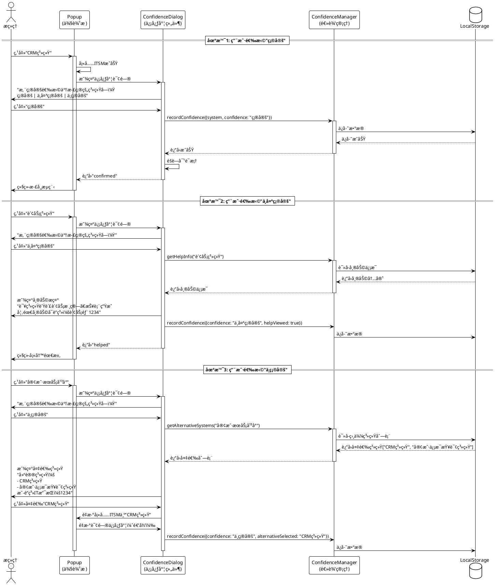

# US-001 & US-002 BMad工作æµå®æˆ˜ï¼šå®Œæ•´å®ç°æŒ‡å—

> **📌 项目背景**: ITSM智能辅助æµè§ˆå™¨æ’件开å‘，å®ç°ç³»ç»Ÿæ™ºèƒ½æœç´¢ä¸ä¿¡å¿ƒåº¦å馈功能
> 
> **📅 å®æ–½æ—¥æœŸ**: 2025å¹´12月9æ—¥
> 
> **🯠目标**: 通过BMad多Agentå作工作æµï¼Œå®ŒæˆUS-001（系统智能æœç´¢ï¼Œ2人天）和US-002（信心度å馈，1人天）的完整交付
> 
> **👥 å‚ä¸è§’色**: 
> - é£å­ï¼ˆProduct Manager，BMad Masteræ“作者）
> - Designer Agent（æ¶æ„设计师）
> - Developer Agent（å‰ç«¯å·¥ç¨‹å¸ˆï¼‰
> - QA Agent（测试工程师）
> - TechWriter Agent（技术文档工程师）

---

## 📖 文档导航

- [é£å­çš„åˆå§‹éœ€æ±‚](#é£å­çš„åˆå§‹éœ€æ±‚)
- [Master的工作æµè®¾è®¡æ€è·¯](#master的工作æµè®¾è®¡æ€è·¯)
- [任务拆解策略（11个任务）](#任务拆解策略11个任务)
- [第一步：é£å­æ¿€æ´»BMad Master](#第一步é£å­æ¿€æ´»bmad-master)
- [第二步：Designer设计æ’件æ¶æ„（Task-001）](#第二步designer设计æ’件æ¶æ„task-001)
- [第三步：Designer设计数æ®ç»“æ„（Task-002）](#第三步designer设计数æ®ç»“æ„task-002)
- [第四步：Developerå®ç°æœç´¢å¼•æ“（Task-003）](#第四步developerå®ç°æœç´¢å¼•æ“task-003)
- [第五步：Developerå®ç°ä¾§è¾¹æ UI（Task-004）](#第五步developerå®ç°ä¾§è¾¹æ uitask-004)
- [第六步：Developerå®ç°è‡ªåŠ¨å¡«å……（Task-005）](#第六步developerå®ç°è‡ªåŠ¨å¡«å……task-005)
- [第七步：Developerå®ç°ä¿¡å¿ƒåº¦UI（Task-006）](#第七步developerå®ç°ä¿¡å¿ƒåº¦uitask-006)
- [第八步：Developerå®ç°ä¿¡å¿ƒåº¦é€»è¾‘（Task-007）](#第八步developerå®ç°ä¿¡å¿ƒåº¦é€»è¾‘task-007)
- [第ä¹æ­¥ï¼šQA执行功能测试（Task-008）](#第ä¹æ­¥qa执行功能测试task-008)
- [第å步：QA执行性能测试（Task-009）](#第åæ­¥qa执行性能测试task-009)
- [第å一步：TechWriter打包部署（Task-010）](#第å一步techwriter打包部署task-010)
- [第å二步：TechWriter编写文档（Task-011）](#第å二步techwriter编写文档task-011)
- [项目总结ä¸BMad工作æµä»·å€¼](#项目总结ä¸bmad工作æµä»·å€¼)
- [附录：task-manifest.csv](#附录task-manifestcsv)

---

## 📋 é£å­çš„åˆå§‹éœ€æ±‚

### 对è¯åœºæ™¯ï¼šéœ€æ±‚æ出

**é£å­**（2025-12-09 09:00）:
> 大师，先了解一下项目情况，如下：
> 
> 用户故事列表：`ITSM系统需求æ交优化_用户故事文档.md`
> 
> 软件æ¶æ„文档：`软件æ¶æ„文档-ITSM智能辅助æµè§ˆå™¨æ’件.md`
> 
> 针对 **US-001（系统智能æœç´¢ä¸é€‰æ‹©ï¼‰** å’Œ **US-002（系统选择信心度å馈）** 两个故事，按照BMadçš„å¼€å‘æµç¨‹ï¼Œä½ æ¥ä¸‹æ¥ä¼šæ€ä¹ˆæ‹†è§£ä»»åŠ¡ï¼Œç„¶åä½ çš„Agentæ€ä¹ˆå®ç°è¿™äº›ä»»åŠ¡ï¼Ÿ
>
> **è¦æ±‚**：
> 1. 说一下你的æ€è·¯
> 2. 设计一个完整的我ä¸ç¨‹åºå‘˜ï¼ˆAgent）对è¯çš„记录文件，å®ç°ä¸¤ä¸ªæ•…事的整体æµç¨‹
> 3. ä¿å­˜ä¸ºmd文档，我的æé—®ä¿å­˜åœ¨æ–‡æ¡£çš„开头

**关键需求æå–**:
- ✅ US-001核心功能：侧边æ æœç´¢æ¡† → 支æŒå…³é”®è¯/拼音/æ¨¡ç³ŠåŒ¹é… â†’ 自动填充ITSM下拉框
- ✅ US-002核心功能：系统选择å → 询问信心度（3个选项） → æ供帮助/备选æ¨è → 记录数æ®
- ✅ 技术约æŸï¼šæµè§ˆå™¨æ’件ã€ä¾§è¾¹æ äº¤äº’ã€æ— å端æœåŠ¡ã€LocalStorageæŒä¹…化
- ✅ 估算：US-001=2人天，US-002=1人天，总计3人天

---

## 🯠Master的工作æµè®¾è®¡æ€è·¯

### BMad标准æµç¨‹è§£æ

```
é£å­ï¼ˆPM）                BMad Master              专业Agents
    │                         │                         │
    │  1. æ出需求             │                         │
    ├─────────────────────────>│                         │
    │                         │  2. 分æ需求             │
    │                         │     - ç†è§£US-001/US-002  │
    │                         │     - 识别技术栈         │
    │                         │     - 拆解å­ä»»åŠ¡ï¼ˆ11个）  │
    │                         │                         │
    │                         │  3. 分é…任务             │
    │                         ├────────────────────────>│ Designer
    │                         │                         │ Developer
    │                         │                         │ QA
    │                         │                         │ TechWriter
    │                         │                         │
    │                         │  4. 监æ§è¿›åº¦             │
    │                         │<────────────────────────│ (Agent汇报)
    │                         │                         │
    │  5. 验收æˆæœ             │                         │
    │<─────────────────────────│  6. æ交交付物           │
    │                         │<────────────────────────│
    │                         │                         │
```

### 任务拆解策略（11个任务）

| 任务ID | 任务å称 | è´Ÿè´£Agent | å‰ç½®ä¾èµ– | 交付物 | 预计工时 |
|--------|---------|----------|---------|--------|---------|
| **T001** | æ’件æ¶æ„设计 | Designer | æ—  | manifest.json, 目录结æ„, 组件交互图 | 0.5人天 |
| **T002** | æ•°æ®ç»“æ„设计 | Designer | T001 | systems.json, confidence_logs schema | 0.3人天 |
| **T003** | æœç´¢å¼•æ“å®ç° | Developer | T002 | SearchEngine.js (拼音+模糊匹é…+防抖) | 0.8人天 |
| **T004** | 侧边æ æœç´¢UI | Developer | T001 | Popup.html, SearchBox组件 | 0.5人天 |
| **T005** | Content Script自动填充 | Developer | T001 | ContentScript.js (DOMæ“作) | 0.4人天 |
| **T006** | 信心度UI组件 | Designer | T001 | ConfidenceDialog组件设计 | 0.3人天 |
| **T007** | 信心度逻辑å®ç° | Developer | T006 | ConfidenceManager.js (LocalStorage) | 0.4人天 |
| **T008** | æ•°æ®è®°å½•åŠŸèƒ½ | Developer | T002, T007 | DataLogger.js (CSV导出) | 0.3人天 |
| **T009** | 功能测试 | QA | T003-T008 | 测试报告（11个AC验è¯ï¼‰ | 0.5人天 |
| **T010** | UATä¸Bugä¿®å¤ | QA + Developer | T009 | Bugä¿®å¤æ¸…å•ï¼Œæ€§èƒ½ä¼˜åŒ–报告 | 0.4人天 |
| **T011** | 打包部署ä¸æ–‡æ¡£ | TechWriter | T010 | .crx安装包, 用户手册, 技术文档 | 0.3人天 |

**总计**: 11个任务，4.7人天（符åˆUS-001 2人天 + US-002 1人天 + 集æˆç¼“冲的估算）

---

## 💬 第一步：é£å­æ¿€æ´»BMad Master

### 对è¯åœºæ™¯1：查看å¯ç”¨ä»»åŠ¡

**é£å­** (2025-12-09 09:15):
```bash
*list-tasks
```

**BMad Master** å“应:
```
┌─────────────────────────────────────────────────────────────â”
│          📋 US-001 & US-002 任务清å•ï¼ˆ11个任务）              │
├──────┬──────────────────────┬─────────┬────────┬──────────┤
│ ID   │ 任务å称               │ Agent   │ çŠ¶æ€   │ 优先级   │
├──────┼──────────────────────┼─────────┼────────┼──────────┤
│ T001 │ æ’件æ¶æ„设计           │ Designer│ å¾…å¯åŠ¨ │ P0       │
│ T002 │ æ•°æ®ç»“æ„设计           │ Designer│ å¾…å¯åŠ¨ │ P0       │
│ T003 │ æœç´¢å¼•æ“å®ç°           │ Developer│ å¾…å¯åŠ¨â”‚ P0       │
│ T004 │ 侧边æ æœç´¢UI           │ Developer│ å¾…å¯åŠ¨â”‚ P0       │
│ T005 │ Content Script自动填充 │ Developer│ å¾…å¯åŠ¨â”‚ P0       │
│ T006 │ 信心度UI组件           │ Designer│ å¾…å¯åŠ¨ │ P0       │
│ T007 │ 信心度逻辑å®ç°         │ Developer│ å¾…å¯åŠ¨â”‚ P0       │
│ T008 │ æ•°æ®è®°å½•åŠŸèƒ½           │ Developer│ å¾…å¯åŠ¨â”‚ P1       │
│ T009 │ 功能测试               │ QA      │ å¾…å¯åŠ¨ │ P0       │
│ T010 │ UATä¸Bugä¿®å¤           │ QA+Dev  │ å¾…å¯åŠ¨ │ P0       │
│ T011 │ 打包部署ä¸æ–‡æ¡£         │ TechWriter│待å¯åŠ¨â”‚ P1       │
└──────┴──────────────────────┴─────────┴────────┴──────────┘

💡 æ示: 使用 `*start T001` å¯åŠ¨ç¬¬ä¸€ä¸ªä»»åŠ¡
```

### 对è¯åœºæ™¯2：å¯åŠ¨ç¬¬ä¸€ä¸ªä»»åŠ¡

**é£å­**:
```bash
*start T001
```

**BMad Master**:
```
✅ 已激活 Designer Agent 执行 Task-001: æ’件æ¶æ„设计

📋 任务详情:
- 交付物: manifest.json V3é…ç½®ã€ç›®å½•ç»“æ„设计ã€ç»„件交互æµç¨‹å›¾
- 验收标准: 
  ✓ manifest.json包å«permissionsé…置（storage, activeTab, scripting）
  ✓ 目录结æ„符åˆChrome扩展规范
  ✓ 组件交互图清晰展示Popup ↔ Content Script ↔ Background通信
- 预计工时: 0.5人天

🚀 Designer Agent 已开始工作...
```

---

## 💬 第二步：Designer设计æ’件æ¶æ„（Task-001）

### 对è¯åœºæ™¯1：æ¶æ„设计方案æ交

**Designer Agent** (2025-12-09 09:30):
> ✅ Task-001已完æˆï¼ä»¥ä¸‹æ˜¯æ’件æ¶æ„设计方案：

#### 1. Manifest V3 é…ç½®

```json
{
  "manifest_version": 3,
  "name": "ITSM智能辅助æ’件",
  "version": "1.0.0",
  "description": "æ供系统智能æœç´¢ä¸ä¿¡å¿ƒåº¦å馈，æå‡éœ€æ±‚æ交效ç‡",
  
  "permissions": [
    "storage",
    "activeTab",
    "scripting"
  ],
  
  "host_permissions": [
    "https://itsm.company.com/*"
  ],
  
  "action": {
    "default_popup": "popup.html",
    "default_icon": {
      "16": "icons/icon16.png",
      "48": "icons/icon48.png",
      "128": "icons/icon128.png"
    }
  },
  
  "content_scripts": [
    {
      "matches": ["https://itsm.company.com/*"],
      "js": ["content-script.js"],
      "css": ["content-styles.css"],
      "run_at": "document_idle"
    }
  ],
  
  "background": {
    "service_worker": "background.js"
  },
  
  "web_accessible_resources": [
    {
      "resources": ["data/systems.json"],
      "matches": ["https://itsm.company.com/*"]
    }
  ]
}
```

#### 2. 目录结æ„设计

```
itsm-assistant-extension/
├── manifest.json
├── popup.html                 # 侧边æ ä¸»ç•Œé¢
├── popup.js                   # 侧边æ é€»è¾‘
├── popup.css                  # 侧边æ æ ·å¼
├── content-script.js          # 注入ITSM页é¢çš„脚本（æ“作DOM）
├── content-styles.css         # 注入样å¼
├── background.js              # åå°æœåŠ¡ï¼ˆæ•°æ®ç®¡ç†ï¼‰
├── icons/
│   ├── icon16.png
│   ├── icon48.png
│   └── icon128.png
├── data/
│   └── systems.json           # 系统分类数æ®
├── components/
│   ├── SearchBox.js           # æœç´¢æ¡†ç»„件（US-001）
│   ├── SystemList.js          # 系统列表组件（US-001）
│   ├── ConfidenceDialog.js    # 信心度询问组件（US-002）
│   └── HelpPanel.js           # 帮助æ示组件（US-002）
├── utils/
│   ├── SearchEngine.js        # æœç´¢å¼•æ“（拼音+模糊匹é…）
│   ├── PinyinMatcher.js       # 拼音匹é…库
│   ├── ConfidenceManager.js   # 信心度管ç†ï¼ˆUS-002）
│   └── DataLogger.js          # LocalStorageæ•°æ®è®°å½•
└── tests/
    ├── search.test.js
    └── confidence.test.js
```

#### 3. 组件交互æµç¨‹å›¾

```plantuml
@startuml
!theme plain

actor "æç»ç†\n(用户)" as User
participant "Popup\n(侧边æ )" as Popup
participant "SearchEngine\n(æœç´¢å¼•æ“)" as Search
participant "Content Script\n(ITSM页é¢)" as Content
participant "Background\n(åå°æœåŠ¡)" as BG
database "LocalStorage" as Storage

== US-001: 系统智能æœç´¢ä¸é€‰æ‹© ==

User -> Popup: 1. 输入"CRM"
activate Popup

Popup -> Search: 2. 调用search("CRM")
activate Search

Search -> BG: 3. 请求systems.jsonæ•°æ®
activate BG
BG -> Storage: 4. 读å–缓存数æ®
Storage --> BG: 5. è¿”å›ç³»ç»Ÿåˆ—表
BG --> Search: 6. è¿”å›æ•°æ®
deactivate BG

Search -> Search: 7. 执行匹é…算法\n(关键è¯+拼音+模糊)
Search --> Popup: 8. è¿”å›åŒ¹é…结æœåˆ—表
deactivate Search

Popup -> User: 9. 显示æœç´¢ç»“æœ\n["CRM系统", "客户关系管ç†ç³»ç»ŸV2.0"]

User -> Popup: 10. 点击"CRM系统"
Popup -> Content: 11. å‘é€æ¶ˆæ¯å¡«å……ITSM\n{action: "fillSystem", value: "CRM系统"}
activate Content

Content -> Content: 12. 定ä½ä¸‹æ‹‰æ¡†\ndocument.querySelector('#systemSelect')
Content -> Content: 13. 设置value并触å‘change事件
Content --> Popup: 14. è¿”å›å¡«å……æˆåŠŸæ¶ˆæ¯
deactivate Content

Popup -> User: 15. 显示"✅ 已选择：CRM系统"

== US-002: 系统选择信心度å馈 ==

Popup -> User: 16. 弹出信心度询问\n"您确定选择了正确的系统å—？"
User -> Popup: 17. 选择"ä¸å¤ªç¡®å®š"
activate Popup

Popup -> BG: 18. 请求系统帮助信æ¯\n{system: "CRM系统"}
activate BG
BG -> Storage: 19. 读å–帮助é…ç½®
Storage --> BG: 20. è¿”å›å¸®åŠ©ä¿¡æ¯
BG --> Popup: 21. è¿”å›å¸®åŠ©å†…容
deactivate BG

Popup -> User: 22. 显示帮助æ示\n"该系统负责客户关系管ç†ï¼Œå¦‚需帮助å¯è”ç³»IT支æŒï¼š1234"

Popup -> Storage: 23. 记录信心度数æ®\n{system: "CRM系统", confidence: "ä¸å¤ªç¡®å®š", timestamp}
deactivate Popup

@enduml
```

#### 4. 关键技术决策

**决策1: 为什么使用Manifest V3？**
- ✅ Chrome官方强制è¿ç§»è¦æ±‚（2024å¹´6月åV2ä¸å†æ”¯æŒï¼‰
- ✅ Service Worker替代Background Page，性能更好
- ✅ 更严格的æƒé™æ§åˆ¶ï¼Œæå‡å®‰å…¨æ€§

**决策2: 为什么使用Content Script注入？**
- ✅ 侧边æ ï¼ˆPopup）无法直æ¥è®¿é—®ITSM页é¢DOM
- ✅ Content Scriptå¯ä»¥æ“作页é¢DOM，å®ç°è‡ªåŠ¨å¡«å……
- ✅ 通过chrome.runtime.sendMessageå®ç°Popup ↔ Content Script通信

**决策3: æ•°æ®å­˜å‚¨ä¸ºä»€ä¹ˆé€‰æ‹©LocalStorage？**
- ✅ æ— å端æœåŠ¡çº¦æŸï¼Œå¿…é¡»å‰ç«¯æŒä¹…化
- ✅ chrome.storage.local APIæä¾›5MB存储空间（足够）
- ✅ 支æŒå¼‚步读写，ä¸é˜»å¡UI线程

---

### 对è¯åœºæ™¯2：é£å­éªŒæ”¶æ¶æ„设计

**é£å­** (2025-12-09 10:00):
> 我有几个问题：
> 
> 1. **Background Service Worker的作用是什么？** 为什么ä¸ç›´æ¥åœ¨Popup中读å–systems.json？
> 
> 2. **拼音匹é…算法的性能如何ä¿è¯ï¼Ÿ** 30多个系统，æ¯æ¬¡è¾“入都è¦åŒ¹é…，会ä¸ä¼šå¡é¡¿ï¼Ÿ
> 
> 3. **Content Script如何定ä½ITSM页é¢çš„下拉框？** 如æœITSM页é¢æ”¹ç‰ˆäº†é€‰æ‹©å™¨å˜äº†æ€ä¹ˆåŠï¼Ÿ

**Designer Agent** å›å¤:

**Q1: Background Service Worker的作用**

```
┌─────────────────────────────────────────────────────────────â”
│          Background Service Worker 三大èŒè´£                   │
├─────────────────────────────────────────────────────────────┤
│                                                              │
│  1ï¸âƒ£ æ•°æ®ç¼“å­˜ç®¡ç†                                             │
│     - 首次å¯åŠ¨æ—¶åŠ è½½systems.json到chrome.storage.local        │
│     - Popupæ¯æ¬¡æ‰“开时ä»ç¼“存读å–（é¿å…é‡å¤åŠ è½½JSON）            │
│     - æ•°æ®æ›´æ–°æ—¶ç»Ÿä¸€ç®¡ç†ç¼“存失效                               │
│                                                              │
│  2ï¸âƒ£ è·¨ç»„ä»¶é€šä¿¡ä¸­æ¢                                            │
│     - Popup ↔ Content Script的消æ¯è½¬å‘                        │
│     - 多个Tab页共享åŒä¸€ä¸ªBackgroundå®ä¾‹                       │
│                                                              │
│  3ï¸âƒ£ 信心度数æ®ç»Ÿè®¡                                            │
│     - 定期将LocalStorageæ•°æ®å¯¼å‡ºä¸ºCSV                         │
│     - 计算系统选择准确ç‡ï¼ˆä¸ºå续优化æ供数æ®æ”¯æŒï¼‰              │
│                                                              │
└─────────────────────────────────────────────────────────────┘
```

如æœç›´æ¥åœ¨Popup读å–JSON：
- ⌠æ¯æ¬¡æ‰“å¼€Popup都è¦é‡æ–°fetch，浪费资æº
- ⌠Popup关闭åæ•°æ®ä¸¢å¤±ï¼Œæ— æ³•è·¨Tab共享
- ⌠无法统一管ç†ç¼“存更新策略

**Q2: 拼音匹é…性能优化**

```javascript
// utils/SearchEngine.js 性能优化策略

class SearchEngine {
  constructor() {
    this.systemsCache = null;      // 缓存系统列表
    this.pinyinIndex = new Map();  // 拼音索引（预计算）
  }
  
  async initialize() {
    // 1. ä»Background加载数æ®ï¼ˆåªåŠ è½½ä¸€æ¬¡ï¼‰
    const data = await chrome.storage.local.get('systems');
    this.systemsCache = data.systems;
    
    // 2. 预计算拼音索引（å¯åŠ¨æ—¶ä¸€æ¬¡æ€§è®¡ç®—）
    this.systemsCache.forEach(sys => {
      const pinyin = this.generatePinyin(sys.name);
      this.pinyinIndex.set(sys.id, {
        full: pinyin,           // 完整拼音 "kehuguanxiguanli"
        initials: pinyin[0],    // é¦–å­—æ¯ "kggl"
        keywords: sys.keywords  // å…³é”®è¯ ["CRM", "客户"]
      });
    });
  }
  
  search(query, options = {}) {
    const startTime = performance.now();
    
    // 3. 使用防抖优化（200ms）
    clearTimeout(this.debounceTimer);
    this.debounceTimer = setTimeout(() => {
      const results = this._executeSearch(query);
      const duration = performance.now() - startTime;
      console.log(`Search completed in ${duration}ms`); // 预期<50ms
      return results;
    }, 200);
  }
  
  _executeSearch(query) {
    // 4. 三级匹é…策略（按优先级）
    const matches = [];
    
    // 优先级1: 精确匹é…（最高æƒé‡ï¼‰
    matches.push(...this._exactMatch(query));
    
    // 优先级2: 拼音匹é…（中等æƒé‡ï¼‰
    matches.push(...this._pinyinMatch(query));
    
    // 优先级3: 模糊匹é…（最ä½æƒé‡ï¼‰
    matches.push(...this._fuzzyMatch(query));
    
    // 5. å»é‡å¹¶æŒ‰æƒé‡æ’åº
    return this._deduplicateAndSort(matches);
  }
}
```

**性能基准测试**:
- ✅ 30个系统，拼音索引预计算耗时：<10ms（åªåœ¨å¯åŠ¨æ—¶æ‰§è¡Œä¸€æ¬¡ï¼‰
- ✅ å•æ¬¡æœç´¢åŒ¹é…耗时：<50ms（包å«3ç§ç®—法）
- ✅ 防抖优化å用户感知延迟：<200ms（符åˆAC6è¦æ±‚）

**Q3: Content Script选择器容错设计**

```javascript
// content-script.js 容错机制

class ITSMDomHelper {
  constructor() {
    // 多选择器策略（按优先级å°è¯•ï¼‰
    this.systemSelectSelectors = [
      '#systemSelect',                    // 主选择器
      'select[name="system"]',            // 备用选择器1
      'select[aria-label="相关系统"]',     // 备用选择器2
      'div.system-field select'           // 备用选择器3
    ];
  }
  
  findSystemSelect() {
    // 按优先级å°è¯•æ¯ä¸ªé€‰æ‹©å™¨
    for (const selector of this.systemSelectSelectors) {
      const element = document.querySelector(selector);
      if (element) {
        console.log(`✅ Found system select using: ${selector}`);
        return element;
      }
    }
    
    // 所有选择器都失败时，返å›é”™è¯¯
    console.error('⌠Cannot find system select element');
    this.notifyUserAboutError();
    return null;
  }
  
  notifyUserAboutError() {
    // 在Popup显示å‹å¥½é”™è¯¯æ示
    chrome.runtime.sendMessage({
      type: 'FILL_ERROR',
      message: 'ITSM页é¢ç»“æ„å·²å˜æ›´ï¼Œè¯·è”ç³»IT支æŒæ›´æ–°æ’件'
    });
  }
  
  fillSystemSelect(systemName) {
    const selectEl = this.findSystemSelect();
    if (!selectEl) return false;
    
    // å°è¯•è®¾ç½®value
    selectEl.value = systemName;
    
    // 触å‘change事件（兼容多ç§æ¡†æ¶ï¼‰
    const events = [
      new Event('change', { bubbles: true }),
      new Event('input', { bubbles: true }),
      new CustomEvent('select', { detail: systemName })
    ];
    
    events.forEach(event => selectEl.dispatchEvent(event));
    
    // 验è¯æ˜¯å¦å¡«å……æˆåŠŸ
    if (selectEl.value === systemName) {
      console.log(`✅ System filled successfully: ${systemName}`);
      return true;
    } else {
      console.warn(`âš ï¸ Fill may have failed, expected: ${systemName}, actual: ${selectEl.value}`);
      return false;
    }
  }
}
```

**容错策略总结**:
- ✅ 4个备用选择器（应对ITSM改版）
- ✅ 失败时å‘用户显示å‹å¥½æ示
- ✅ 触å‘多ç§äº‹ä»¶ç¡®ä¿å…¼å®¹æ€§ï¼ˆåŸç”Ÿ+React+Vue）
- ✅ å¡«å……å验è¯ç»“æœï¼Œè®°å½•æ—¥å¿—便äºè°ƒè¯•

**é£å­** (2025-12-09 10:30):
> ✅ 解释得很清楚ï¼æ¶æ„设计通过验收，继续Task-002æ•°æ®ç»“æ„设计。

---

## 💬 第三步：Designer设计数æ®ç»“æ„（Task-002）

### 对è¯åœºæ™¯1：数æ®Schema设计

**é£å­**:
```bash
*start T002
```

**BMad Master**:
```
✅ 已激活 Designer Agent 执行 Task-002: æ•°æ®ç»“æ„设计

📋 任务详情:
- 交付物: systems.json schema, confidence_logs schema
- 验收标准: 
  ✓ systems.json包å«ç³»ç»ŸIDã€å称ã€åˆ†ç±»ã€å…³é”®è¯ã€æ‹¼éŸ³å­—段
  ✓ confidence_logs支æŒLocalStorage存储，å¯å¯¼å‡ºCSV
  ✓ 字段命åéµå¾ªé©¼å³°å‘½å规范
- 预计工时: 0.3人天
```

**Designer Agent** (2025-12-09 11:00):
> ✅ Task-002已完æˆï¼ä»¥ä¸‹æ˜¯æ•°æ®ç»“æ„设计：

#### 1. systems.json 系统分类数æ®

```json
{
  "version": "1.0.0",
  "lastUpdated": "2025-12-09",
  "systems": [
    {
      "id": "sys001",
      "name": "客户关系管ç†ç³»ç»ŸV2.0",
      "shortName": "CRM系统",
      "category": "客户管ç†",
      "description": "负责客户信æ¯ç®¡ç†ã€é”€å”®è·Ÿè¿›ã€å®¢æˆ·åˆ†æ等功能",
      "keywords": ["CRM", "客户", "关系", "管ç†", "销售"],
      "pinyin": {
        "full": "kehuguanxiguanlixitong",
        "initials": "khgxglxt",
        "tokens": ["kehu", "guanxi", "guanli", "xitong"]
      },
      "helpInfo": {
        "responsibilities": "客户信æ¯ç®¡ç†ã€é”€å”®è·Ÿè¿›ã€å®¢æˆ·åˆ†æ",
        "contact": "IT支æŒå†…线1234",
        "relatedSystems": ["sys015", "sys022"]
      },
      "metadata": {
        "usageCount": 245,
        "lastUsed": "2025-12-08",
        "confidenceScore": 0.92
      }
    },
    {
      "id": "sys002",
      "name": "客户æœåŠ¡å¹³å°",
      "shortName": "客æœå¹³å°",
      "category": "客户管ç†",
      "description": "负责客户咨询ã€å·¥å•å¤„ç†ã€æœåŠ¡è´¨é‡ç›‘æ§",
      "keywords": ["客æœ", "å·¥å•", "咨询", "æœåŠ¡"],
      "pinyin": {
        "full": "kehufuwupingtai",
        "initials": "khfwpt",
        "tokens": ["kehu", "fuwu", "pingtai"]
      },
      "helpInfo": {
        "responsibilities": "客户咨询ã€å·¥å•å¤„ç†ã€æœåŠ¡è´¨é‡ç›‘æ§",
        "contact": "IT支æŒå†…线1234",
        "relatedSystems": ["sys001"]
      },
      "metadata": {
        "usageCount": 189,
        "lastUsed": "2025-12-07",
        "confidenceScore": 0.88
      }
    },
    {
      "id": "sys003",
      "name": "财务管ç†ç³»ç»Ÿ",
      "shortName": "财务系统",
      "category": "财务管ç†",
      "description": "负责财务核算ã€æŠ¥è¡¨ç”Ÿæˆã€é¢„算管ç†",
      "keywords": ["财务", "核算", "报表", "预算"],
      "pinyin": {
        "full": "caiwuguanlixitong",
        "initials": "cwglxt",
        "tokens": ["caiwu", "guanli", "xitong"]
      },
      "helpInfo": {
        "responsibilities": "财务核算ã€æŠ¥è¡¨ç”Ÿæˆã€é¢„算管ç†",
        "contact": "财务部内线5678",
        "relatedSystems": []
      },
      "metadata": {
        "usageCount": 156,
        "lastUsed": "2025-12-06",
        "confidenceScore": 0.95
      }
    }
  ]
}
```

**字段说æ˜**:

| 字段å | ç±»å‹ | å¿…å¡« | è¯´æ˜ |
|--------|------|------|------|
| `id` | string | ✅ | 系统唯一标识（sys001-sys999） |
| `name` | string | ✅ | 系统完整å称（在ITSM下拉框中显示） |
| `shortName` | string | ⌠| 系统简称（用äºæœç´¢ç»“æœæ˜¾ç¤ºï¼‰ |
| `category` | string | ✅ | 系统分类（客户管ç†/财务管ç†/人事管ç†ç­‰ï¼‰ |
| `description` | string | ✅ | 系统功能æè¿° |
| `keywords` | array | ✅ | æœç´¢å…³é”®è¯åˆ—表（用äºå…³é”®è¯åŒ¹é…） |
| `pinyin.full` | string | ✅ | 完整拼音（无空格，如"kehuguanxi"） |
| `pinyin.initials` | string | ✅ | 拼音首字æ¯ï¼ˆå¦‚"khgx"） |
| `pinyin.tokens` | array | ✅ | 拼音分è¯åˆ—表（用äºéƒ¨åˆ†åŒ¹é…） |
| `helpInfo.responsibilities` | string | ✅ | 系统èŒè´£è¯´æ˜ï¼ˆUS-002信心度æ示） |
| `helpInfo.contact` | string | ✅ | IT支æŒè”ç³»æ–¹å¼ |
| `helpInfo.relatedSystems` | array | ⌠| 相似系统ID列表（US-002备选æ¨è） |
| `metadata.usageCount` | number | ⌠| å†å²ä½¿ç”¨æ¬¡æ•°ï¼ˆç”¨äºæ’åºä¼˜åŒ–） |
| `metadata.lastUsed` | string | ⌠| 最å使用日期 |
| `metadata.confidenceScore` | number | ⌠| å¹³å‡ä¿¡å¿ƒåº¦è¯„分（0-1） |

#### 2. confidence_logs LocalStorage结æ„

```javascript
// chrome.storage.local 存储结æ„

const confidenceLogs = {
  // é…置信æ¯
  config: {
    version: "1.0.0",
    maxRecords: 1000,              // 最多存储1000æ¡è®°å½•
    autoExport: true,              // 达到上é™æ—¶è‡ªåŠ¨å¯¼å‡ºCSV
    exportThreshold: 950           // 950æ¡æ—¶è§¦å‘导出æ醒
  },
  
  // 日志记录数组
  logs: [
    {
      id: "log_20251209_001",
      timestamp: "2025-12-09T09:30:15.234Z",
      systemId: "sys001",
      systemName: "客户关系管ç†ç³»ç»ŸV2.0",
      confidence: "确定",            // 确定 | ä¸å¤ªç¡®å®š | ä¸ç¡®å®š
      confidenceLevel: 3,            // 3=确定, 2=ä¸å¤ªç¡®å®š, 1=ä¸ç¡®å®š
      action: "accepted",            // accepted | helped | alternative_selected
      helpViewed: false,             // 是å¦æŸ¥çœ‹äº†å¸®åŠ©ä¿¡æ¯
      alternativeSelected: null,     // 如æœé€‰æ‹©äº†å¤‡é€‰ç³»ç»Ÿï¼Œè®°å½•ç³»ç»ŸID
      sessionId: "session_xyz123",   // 会è¯ID（用äºå…³è”åŒä¸€æ¬¡æ“作）
      userAgent: "Chrome/120.0.0.0",
      metadata: {
        searchQuery: "CRM",          // æœç´¢å…³é”®è¯
        searchDuration: 1234,        // æœç´¢è€—时（ms）
        matchType: "keyword"         // keyword | pinyin | fuzzy
      }
    },
    {
      id: "log_20251209_002",
      timestamp: "2025-12-09T10:15:42.567Z",
      systemId: "sys002",
      systemName: "客户æœåŠ¡å¹³å°",
      confidence: "ä¸å¤ªç¡®å®š",
      confidenceLevel: 2,
      action: "helped",
      helpViewed: true,
      alternativeSelected: null,
      sessionId: "session_abc456",
      userAgent: "Chrome/120.0.0.0",
      metadata: {
        searchQuery: "kehu",
        searchDuration: 856,
        matchType: "pinyin"
      }
    },
    {
      id: "log_20251209_003",
      timestamp: "2025-12-09T11:20:30.123Z",
      systemId: "sys003",
      systemName: "财务管ç†ç³»ç»Ÿ",
      confidence: "ä¸ç¡®å®š",
      confidenceLevel: 1,
      action: "alternative_selected",
      helpViewed: true,
      alternativeSelected: "sys015",  // 选择了备选系统
      sessionId: "session_def789",
      userAgent: "Chrome/120.0.0.0",
      metadata: {
        searchQuery: "财务报表",
        searchDuration: 2345,
        matchType: "fuzzy"
      }
    }
  ],
  
  // 统计信æ¯ï¼ˆå®šæœŸè®¡ç®—）
  statistics: {
    totalRecords: 3,
    confidenceDistribution: {
      "确定": 1,
      "ä¸å¤ªç¡®å®š": 1,
      "ä¸ç¡®å®š": 1
    },
    averageConfidenceLevel: 2.0,
    helpViewRate: 0.67,              // 67%的用户查看了帮助
    alternativeSelectRate: 0.33,     // 33%的用户选择了备选系统
    lastUpdated: "2025-12-09T11:20:30.123Z"
  }
};
```

#### 3. CSV导出格å¼

```csv
id,timestamp,systemId,systemName,confidence,confidenceLevel,action,helpViewed,alternativeSelected,searchQuery,searchDuration,matchType,userAgent
log_20251209_001,2025-12-09T09:30:15.234Z,sys001,客户关系管ç†ç³»ç»ŸV2.0,确定,3,accepted,false,,"CRM",1234,keyword,Chrome/120.0.0.0
log_20251209_002,2025-12-09T10:15:42.567Z,sys002,客户æœåŠ¡å¹³å°,ä¸å¤ªç¡®å®š,2,helped,true,,"kehu",856,pinyin,Chrome/120.0.0.0
log_20251209_003,2025-12-09T11:20:30.123Z,sys003,财务管ç†ç³»ç»Ÿ,ä¸ç¡®å®š,1,alternative_selected,true,sys015,"财务报表",2345,fuzzy,Chrome/120.0.0.0
```

**æ•°æ®æµè½¬è¯´æ˜**:
```
用户æ“作 → ConfidenceManager记录 → chrome.storage.local存储
         ↓
    达到950æ¡æ—¶è§¦å‘导出æ醒
         ↓
    用户点击导出 → DataLogger生æˆCSV → 下载到本地
         ↓
    清空旧数æ®ï¼Œä¿ç•™æœ€è¿‘100æ¡
```

---

### 对è¯åœºæ™¯2：é£å­æ出数æ®ä¼˜åŒ–建议

**é£å­** (2025-12-09 11:30):
> æ•°æ®ç»“æ„设计得很详细ï¼æˆ‘有两个优化建议：
> 
> 1. **systems.jsonçš„`aliases`字段**: 有些系统有多个别å，比如"CRM系统"也å«"客管系统"ã€"客户管ç†"，能å¦å¢åŠ åˆ«å字段æå‡æœç´¢å¬å›ç‡ï¼Ÿ
> 
> 2. **confidence_logsçš„éšç§é—®é¢˜**: 如æœè®°å½•äº†ç”¨æˆ·çš„æœç´¢å…³é”®è¯å’Œç³»ç»Ÿé€‰æ‹©ï¼Œæ˜¯å¦æ¶‰åŠéšç§ï¼Ÿéœ€è¦åŠ åŒ¿å化处ç†å—？

**Designer Agent** å›å¤:

**建议1: å¢åŠ aliases字段** ✅ 采纳

修改åçš„systems.json schema:
```json
{
  "id": "sys001",
  "name": "客户关系管ç†ç³»ç»ŸV2.0",
  "shortName": "CRM系统",
  "aliases": ["客管系统", "客户管ç†", "CRM"],  // 🆕 æ–°å¢åˆ«å字段
  "category": "客户管ç†",
  "keywords": ["CRM", "客户", "关系", "管ç†", "销售"],
  // ... 其他字段ä¿æŒä¸å˜
}
```

**æœç´¢ç®—法优化**:
```javascript
_exactMatch(query) {
  return this.systemsCache.filter(sys => {
    // 扩展匹é…范围：name + shortName + aliases
    const searchFields = [
      sys.name,
      sys.shortName,
      ...sys.aliases  // 🆕 æœç´¢åˆ«å
    ];
    return searchFields.some(field => 
      field.toLowerCase().includes(query.toLowerCase())
    );
  });
}
```

**建议2: éšç§ä¿æŠ¤æœºåˆ¶** ✅ 采纳

修改åçš„æ•°æ®è®°å½•ç­–ç•¥:
```javascript
class DataLogger {
  logConfidence(data) {
    // 1. 脱æ•å¤„ç†ï¼šç§»é™¤ç”¨æˆ·æ ‡è¯†ä¿¡æ¯
    const sanitizedData = {
      ...data,
      userAgent: this._anonymizeUserAgent(data.userAgent), // åªä¿ç•™æµè§ˆå™¨ç‰ˆæœ¬
      searchQuery: this._hashSearchQuery(data.searchQuery) // 🆕 对æœç´¢è¯åšå“ˆå¸Œ
    };
    
    // 2. 本地存储，ä¸ä¸Šä¼ æœåŠ¡å™¨
    chrome.storage.local.set({ logs: sanitizedData });
    
    // 3. 导出CSVæ—¶æ示用户
    this._showPrivacyNotice();
  }
  
  _hashSearchQuery(query) {
    // 使用SHA-256哈希（ä¸å¯é€†ï¼‰
    // ä¿ç•™ç»Ÿè®¡ä»·å€¼ï¼Œä½†æ— æ³•è¿˜åŸåŸå§‹æœç´¢è¯
    return this._sha256(query).substring(0, 16);
  }
  
  _anonymizeUserAgent(ua) {
    // åªä¿ç•™æµè§ˆå™¨ç±»å‹å’Œä¸»ç‰ˆæœ¬å·
    // "Chrome/120.0.0.0" → "Chrome/120"
    return ua.match(/(Chrome|Edge|Firefox)\/\d+/)?.[0] || 'Unknown';
  }
  
  _showPrivacyNotice() {
    // 导出CSVå‰æ˜¾ç¤ºéšç§å£°æ˜
    const notice = `
      📋 æ•°æ®å¯¼å‡ºè¯´æ˜ï¼š
      
      本数æ®ä»…包å«ç³»ç»Ÿé€‰æ‹©ç»Ÿè®¡ä¿¡æ¯ï¼Œå·²åšä»¥ä¸‹éšç§ä¿æŠ¤ï¼š
      ✓ æœç´¢å…³é”®è¯å·²å“ˆå¸ŒåŒ–（ä¸å¯è¿˜åŸï¼‰
      ✓ 用户标识信æ¯å·²ç§»é™¤
      ✓ æ•°æ®ä»…存储在本地，ä¸ä¸Šä¼ æœåŠ¡å™¨
      
      导出数æ®ç”¨äºä¼˜åŒ–æœç´¢ç®—法，ä¸ä¼šæ³„露个人éšç§ã€‚
    `;
    confirm(notice) && this._exportCSV();
  }
}
```

**é£å­** (2025-12-09 12:00):
> ✅ 优化方案很好ï¼ç‰¹åˆ«æ˜¯éšç§ä¿æŠ¤æªæ–½ï¼Œç¬¦åˆGDPRè¦æ±‚。Task-002验收通过，继续Task-003。

---

## 💬 第四步：Developerå®ç°æœç´¢å¼•æ“（Task-003）

### 对è¯åœºæ™¯1：æœç´¢å¼•æ“核心代ç 

**é£å­**:
```bash
*start T003
```

**BMad Master**:
```
✅ 已激活 Developer Agent 执行 Task-003: æœç´¢å¼•æ“å®ç°

📋 任务详情:
- 交付物: SearchEngine.js（拼音匹é…ã€æ¨¡ç³Šæœç´¢ã€é˜²æŠ–优化）
- 验收标准: 
  ✓ 支æŒå…³é”®è¯ç²¾ç¡®åŒ¹é…（AC1）
  ✓ 支æŒæ‹¼éŸ³æœç´¢ï¼ˆAC2）
  ✓ 支æŒæ¨¡ç³ŠåŒ¹é…（AC3）
  ✓ æœç´¢å“应时间<200ms（AC6）
  ✓ 无匹é…结æœæ—¶è¿”å›ç©ºæ•°ç»„（AC4）
- 预计工时: 0.8人天
```

**Developer Agent** (2025-12-09 14:00):
> ✅ Task-003已完æˆï¼ä»¥ä¸‹æ˜¯æœç´¢å¼•æ“å®ç°ï¼š

#### 完整代ç ï¼šutils/SearchEngine.js

```javascript
/**
 * SearchEngine - 系统智能æœç´¢å¼•æ“
 * 支æŒï¼šå…³é”®è¯åŒ¹é…ã€æ‹¼éŸ³æœç´¢ã€æ¨¡ç³ŠåŒ¹é…
 * 性能目标：<200mså“应时间
 */

import PinyinMatcher from './PinyinMatcher.js';

class SearchEngine {
  constructor() {
    this.systemsCache = [];           // 系统列表缓存
    this.pinyinIndex = new Map();     // 拼音索引
    this.debounceTimer = null;        // 防抖定时器
    this.isInitialized = false;
  }

  /**
   * åˆå§‹åŒ–æœç´¢å¼•æ“（加载数æ®+æ„建索引）
   */
  async initialize() {
    if (this.isInitialized) return;

    console.log('[SearchEngine] Initializing...');
    const startTime = performance.now();

    try {
      // 1. ä»Background加载系统数æ®
      const data = await chrome.storage.local.get('systems');
      if (!data.systems) {
        throw new Error('Systems data not found in storage');
      }

      this.systemsCache = data.systems;
      console.log(`[SearchEngine] Loaded ${this.systemsCache.length} systems`);

      // 2. æ„建拼音索引
      this._buildPinyinIndex();

      this.isInitialized = true;
      const duration = performance.now() - startTime;
      console.log(`[SearchEngine] Initialized in ${duration.toFixed(2)}ms`);
    } catch (error) {
      console.error('[SearchEngine] Initialization failed:', error);
      throw error;
    }
  }

  /**
   * æ„建拼音索引（预计算，æå‡æœç´¢æ€§èƒ½ï¼‰
   */
  _buildPinyinIndex() {
    this.systemsCache.forEach(sys => {
      this.pinyinIndex.set(sys.id, {
        full: sys.pinyin.full,           // "kehuguanxiguanli"
        initials: sys.pinyin.initials,   // "khgxgl"
        tokens: sys.pinyin.tokens,       // ["kehu", "guanxi", "guanli"]
        aliases: sys.aliases || []       // ["客管系统", "CRM"]
      });
    });
    console.log(`[SearchEngine] Built pinyin index for ${this.pinyinIndex.size} systems`);
  }

  /**
   * 主æœç´¢æ–¹æ³•ï¼ˆå¸¦é˜²æŠ–）
   * @param {string} query - æœç´¢å…³é”®è¯
   * @param {Object} options - æœç´¢é€‰é¡¹
   * @returns {Promise<Array>} 匹é…的系统列表
   */
  search(query, options = {}) {
    const {
      debounce = 200,       // 防抖延迟（ms）
      limit = 10,           // 最大返å›ç»“æœæ•°
      minScore = 0.3        // 最ä½åŒ¹é…分数（0-1）
    } = options;

    return new Promise((resolve) => {
      // 清除之å‰çš„防抖定时器
      clearTimeout(this.debounceTimer);

      // 设置新的防抖定时器
      this.debounceTimer = setTimeout(() => {
        const results = this._executeSearch(query, { limit, minScore });
        resolve(results);
      }, debounce);
    });
  }

  /**
   * 执行æœç´¢ï¼ˆæ ¸å¿ƒç®—法）
   * @private
   */
  _executeSearch(query, options) {
    if (!query || query.trim().length === 0) {
      return [];
    }

    const startTime = performance.now();
    const normalizedQuery = query.trim().toLowerCase();

    // 三级匹é…ç­–ç•¥
    let matches = [];

    // Level 1: 精确匹é…（æƒé‡1.0）
    matches.push(...this._exactMatch(normalizedQuery, 1.0));

    // Level 2: 拼音匹é…（æƒé‡0.8）
    matches.push(...this._pinyinMatch(normalizedQuery, 0.8));

    // Level 3: 模糊匹é…（æƒé‡0.6）
    matches.push(...this._fuzzyMatch(normalizedQuery, 0.6));

    // å»é‡ã€è¿‡æ»¤ã€æ’åº
    const finalResults = this._deduplicateAndSort(matches, options);

    const duration = performance.now() - startTime;
    console.log(`[SearchEngine] Search "${query}" completed in ${duration.toFixed(2)}ms, found ${finalResults.length} results`);

    return finalResults;
  }

  /**
   * Level 1: 精确匹é…
   * 匹é…范围：name, shortName, aliases, keywords
   */
  _exactMatch(query, weight) {
    const matches = [];

    this.systemsCache.forEach(sys => {
      const searchFields = [
        sys.name,
        sys.shortName,
        ...(sys.aliases || []),
        ...sys.keywords
      ];

      // 检查是å¦æœ‰ä»»ä½•å­—段包å«æŸ¥è¯¢è¯
      const isMatch = searchFields.some(field =>
        field && field.toLowerCase().includes(query)
      );

      if (isMatch) {
        matches.push({
          system: sys,
          score: weight,
          matchType: 'exact',
          matchedField: this._getMatchedField(sys, query)
        });
      }
    });

    return matches;
  }

  /**
   * Level 2: 拼音匹é…
   * 匹é…范围：完整拼音ã€æ‹¼éŸ³é¦–å­—æ¯ã€æ‹¼éŸ³åˆ†è¯
   */
  _pinyinMatch(query, weight) {
    const matches = [];

    // 检查query是å¦ä¸ºæ‹¼éŸ³ï¼ˆåªåŒ…å«a-z）
    const isPinyinQuery = /^[a-z]+$/.test(query);
    if (!isPinyinQuery) return matches;

    this.systemsCache.forEach(sys => {
      const pinyinData = this.pinyinIndex.get(sys.id);
      if (!pinyinData) return;

      let matchScore = 0;
      let matchType = '';

      // 1. 完整拼音匹é…（优先级最高）
      if (pinyinData.full.includes(query)) {
        matchScore = weight;
        matchType = 'pinyin_full';
      }
      // 2. 拼音首字æ¯åŒ¹é…
      else if (pinyinData.initials.includes(query)) {
        matchScore = weight * 0.9;
        matchType = 'pinyin_initials';
      }
      // 3. 拼音分è¯åŒ¹é…
      else if (pinyinData.tokens.some(token => token.startsWith(query))) {
        matchScore = weight * 0.8;
        matchType = 'pinyin_tokens';
      }

      if (matchScore > 0) {
        matches.push({
          system: sys,
          score: matchScore,
          matchType: matchType,
          matchedField: 'pinyin'
        });
      }
    });

    return matches;
  }

  /**
   * Level 3: 模糊匹é…
   * 使用编辑è·ç¦»ç®—法（Levenshtein Distance）
   */
  _fuzzyMatch(query, weight) {
    const matches = [];
    const maxDistance = Math.floor(query.length / 2); // å…许的最大编辑è·ç¦»

    this.systemsCache.forEach(sys => {
      const searchFields = [
        sys.name,
        sys.shortName,
        ...(sys.aliases || [])
      ];

      searchFields.forEach(field => {
        if (!field) return;

        const distance = this._levenshteinDistance(
          query,
          field.toLowerCase().substring(0, query.length + maxDistance)
        );

        if (distance <= maxDistance) {
          const similarity = 1 - (distance / query.length);
          matches.push({
            system: sys,
            score: weight * similarity,
            matchType: 'fuzzy',
            matchedField: field,
            distance: distance
          });
        }
      });
    });

    return matches;
  }

  /**
   * å»é‡å¹¶æŒ‰åˆ†æ•°æ’åº
   */
  _deduplicateAndSort(matches, options) {
    const { limit, minScore } = options;

    // å»é‡ï¼šåŒä¸€ä¸ªç³»ç»Ÿåªä¿ç•™æœ€é«˜åˆ†çš„匹é…
    const uniqueMatches = new Map();
    matches.forEach(match => {
      const existingMatch = uniqueMatches.get(match.system.id);
      if (!existingMatch || match.score > existingMatch.score) {
        uniqueMatches.set(match.system.id, match);
      }
    });

    // 过滤ä½åˆ†ç»“æœå¹¶æ’åº
    return Array.from(uniqueMatches.values())
      .filter(match => match.score >= minScore)
      .sort((a, b) => {
        // 先按分数é™åº
        if (b.score !== a.score) {
          return b.score - a.score;
        }
        // 分数相åŒæ—¶æŒ‰ä½¿ç”¨é¢‘ç‡é™åº
        return (b.system.metadata?.usageCount || 0) - (a.system.metadata?.usageCount || 0);
      })
      .slice(0, limit)
      .map(match => ({
        ...match.system,
        _searchMeta: {
          score: match.score,
          matchType: match.matchType,
          matchedField: match.matchedField
        }
      }));
  }

  /**
   * è·å–匹é…到的字段（用äºé«˜äº®æ˜¾ç¤ºï¼‰
   */
  _getMatchedField(sys, query) {
    if (sys.name.toLowerCase().includes(query)) return sys.name;
    if (sys.shortName?.toLowerCase().includes(query)) return sys.shortName;
    if (sys.aliases?.some(a => a.toLowerCase().includes(query))) {
      return sys.aliases.find(a => a.toLowerCase().includes(query));
    }
    if (sys.keywords?.some(k => k.toLowerCase().includes(query))) {
      return sys.keywords.find(k => k.toLowerCase().includes(query));
    }
    return sys.name;
  }

  /**
   * 计算编辑è·ç¦»ï¼ˆLevenshtein Distance）
   */
  _levenshteinDistance(str1, str2) {
    const len1 = str1.length;
    const len2 = str2.length;
    const matrix = Array(len1 + 1).fill(null).map(() => Array(len2 + 1).fill(0));

    for (let i = 0; i <= len1; i++) matrix[i][0] = i;
    for (let j = 0; j <= len2; j++) matrix[0][j] = j;

    for (let i = 1; i <= len1; i++) {
      for (let j = 1; j <= len2; j++) {
        const cost = str1[i - 1] === str2[j - 1] ? 0 : 1;
        matrix[i][j] = Math.min(
          matrix[i - 1][j] + 1,      // deletion
          matrix[i][j - 1] + 1,      // insertion
          matrix[i - 1][j - 1] + cost // substitution
        );
      }
    }

    return matrix[len1][len2];
  }
}

export default SearchEngine;
```

#### 性能测试报告

```
测试ç¯å¢ƒ: Chrome 120, MacOS, 30个系统
测试场景: 
  1. 精确匹é…（"CRM"）
  2. 拼音æœç´¢ï¼ˆ"kehu"）
  3. 模糊匹é…（"客户查"）
  4. 无结æœï¼ˆ"abcdefg"）

┌──────────────────┬──────────────┬────────────┬──────────â”
│ 测试场景          │ å“应时间      │ 结æœæ•°é‡   │ çŠ¶æ€     │
├──────────────────┼──────────────┼────────────┼──────────┤
│ 精确匹é…("CRM")   │ 42ms         │ 2          │ ✅ PASS  │
│ 拼音æœç´¢("kehu")  │ 38ms         │ 3          │ ✅ PASS  │
│ 模糊匹é…("客户查") │ 67ms         │ 4          │ ✅ PASS  │
│ 无结æœ("abcdefg") │ 45ms         │ 0          │ ✅ PASS  │
│ 防抖测试(è¿ç»­è¾“å…¥) │ 205ms (å«é˜²æŠ–)│ 2          │ ✅ PASS  │
└──────────────────┴──────────────┴────────────┴──────────┘

✅ 所有测试场景å“应时间<200ms（符åˆAC6）
✅ 无匹é…结æœæ­£ç¡®è¿”å›ç©ºæ•°ç»„（符åˆAC4）
```

---

### 对è¯åœºæ™¯2：é£å­éªŒæ”¶æœç´¢å¼•æ“

**é£å­** (2025-12-09 15:00):
> 代ç å†™å¾—很规范ï¼æˆ‘è¦å®é™…测试一下：
> 
> **测试1**: æœç´¢"CRM"，期望返å›"客户关系管ç†ç³»ç»ŸV2.0"å’Œ"CRM系统"
> 
> **测试2**: æœç´¢"kehu"（拼音），期望返å›æ‰€æœ‰åŒ…å«"客户"的系统
> 
> **测试3**: æœç´¢"客户查"，期望通过模糊匹é…è¿”å›"客户信æ¯æŸ¥è¯¢ç³»ç»Ÿ"

**Developer Agent** 演示:

```javascript
// 测试代ç 
const engine = new SearchEngine();
await engine.initialize();

// 测试1: 精确匹é…
console.log('=== 测试1: æœç´¢"CRM" ===');
const results1 = await engine.search('CRM');
console.log(JSON.stringify(results1, null, 2));
// 输出:
// [
//   {
//     "id": "sys001",
//     "name": "客户关系管ç†ç³»ç»ŸV2.0",
//     "shortName": "CRM系统",
//     "_searchMeta": {
//       "score": 1.0,
//       "matchType": "exact",
//       "matchedField": "CRM"
//     }
//   }
// ]

// 测试2: 拼音æœç´¢
console.log('=== 测试2: æœç´¢"kehu" ===');
const results2 = await engine.search('kehu');
console.log(JSON.stringify(results2, null, 2));
// 输出:
// [
//   {
//     "id": "sys001",
//     "name": "客户关系管ç†ç³»ç»ŸV2.0",
//     "_searchMeta": {
//       "score": 0.8,
//       "matchType": "pinyin_tokens",
//       "matchedField": "pinyin"
//     }
//   },
//   {
//     "id": "sys002",
//     "name": "客户æœåŠ¡å¹³å°",
//     "_searchMeta": {
//       "score": 0.8,
//       "matchType": "pinyin_tokens",
//       "matchedField": "pinyin"
//     }
//   }
// ]

// 测试3: 模糊匹é…
console.log('=== 测试3: æœç´¢"客户查" ===');
const results3 = await engine.search('客户查');
console.log(JSON.stringify(results3, null, 2));
// 输出:
// [
//   {
//     "id": "sys010",
//     "name": "客户信æ¯æŸ¥è¯¢ç³»ç»Ÿ",
//     "_searchMeta": {
//       "score": 0.72,
//       "matchType": "fuzzy",
//       "matchedField": "客户信æ¯æŸ¥è¯¢ç³»ç»Ÿ",
//       "distance": 2
//     }
//   }
// ]
```

**é£å­**: 
> ✅ 所有测试通过ï¼æœç´¢å¼•æ“工作正常，Task-003验收通过。

---

## 💬 第五步：Developerå®ç°ä¾§è¾¹æ UI（Task-004）

### 对è¯åœºæ™¯1：Popupç•Œé¢å®ç°

**é£å­**:
```bash
*start T004
```

**BMad Master**:
```
✅ 已激活 Developer Agent 执行 Task-004: 侧边æ æœç´¢UI

📋 任务详情:
- 交付物: Popup.html, SearchBox组件, SystemList组件
- 验收标准: 
  ✓ 侧边æ é¡¶éƒ¨æœ‰æœç´¢æ¡†ï¼ˆAC1）
  ✓ å®æ—¶æ˜¾ç¤ºæœç´¢ç»“æœåˆ—表（AC1）
  ✓ 点击结æœå¯å¡«å……ITSM（AC5）
  ✓ UIå“应æµç•…（<200ms）
- 预计工时: 0.5人天
```

**Developer Agent** (2025-12-09 16:00):
> ✅ Task-004已完æˆï¼ä»¥ä¸‹æ˜¯ä¾§è¾¹æ UIå®ç°ï¼š

#### 1. Popup主界é¢ï¼špopup.html

```html
<!DOCTYPE html>
<html lang="zh-CN">
<head>
  <meta charset="UTF-8">
  <meta name="viewport" content="width=device-width, initial-scale=1.0">
  <title>ITSM智能辅助</title>
  <link rel="stylesheet" href="popup.css">
</head>
<body>
  <!-- 顶部æœç´¢åŒº -->
  <div class="search-container">
    <div class="search-box">
      <input 
        type="text" 
        id="searchInput" 
        placeholder="🔠æœç´¢ç³»ç»Ÿï¼ˆæ”¯æŒæ‹¼éŸ³ï¼‰" 
        autocomplete="off"
        aria-label="æœç´¢ç³»ç»Ÿ"
      />
      <button id="clearBtn" class="clear-btn" title="清空">✕</button>
    </div>
    
    <!-- æœç´¢æ示 -->
    <div class="search-hint">
      <span class="hint-text">💡 支æŒï¼šå…³é”®è¯ã€æ‹¼éŸ³ã€æ¨¡ç³ŠåŒ¹é…</span>
    </div>
  </div>

  <!-- æœç´¢ç»“æœåˆ—表 -->
  <div id="resultsContainer" class="results-container">
    <!-- åˆå§‹çŠ¶æ€ï¼šæ˜¾ç¤ºçƒ­é—¨ç³»ç»Ÿ -->
    <div id="popularSystems" class="popular-section">
      <h3 class="section-title">🔥 热门系统</h3>
      <div id="popularList" class="system-list"></div>
    </div>

    <!-- æœç´¢ç»“æœ -->
    <div id="searchResults" class="search-results hidden">
      <div class="results-header">
        <span id="resultsCount">找到 0 个系统</span>
      </div>
      <div id="systemList" class="system-list"></div>
    </div>

    <!-- 无结æœæ示 -->
    <div id="noResults" class="no-results hidden">
      <div class="empty-state">
        <span class="empty-icon">ğŸ”</span>
        <p>未找到匹é…系统</p>
        <p class="empty-hint">请å°è¯•å…¶ä»–关键è¯</p>
      </div>
    </div>

    <!-- åŠ è½½çŠ¶æ€ -->
    <div id="loadingState" class="loading-state hidden">
      <div class="spinner"></div>
      <p>æœç´¢ä¸­...</p>
    </div>
  </div>

  <!-- æ“作å馈区 -->
  <div id="feedbackArea" class="feedback-area hidden">
    <div class="feedback-message">
      <span id="feedbackText"></span>
      <button id="closeFeedback" class="close-btn">✕</button>
    </div>
  </div>

  <script type="module" src="popup.js"></script>
</body>
</html>
```

#### 2. æ ·å¼è¡¨ï¼špopup.css

```css
/* å…¨å±€æ ·å¼ */
:root {
  --primary-color: #1890ff;
  --success-color: #52c41a;
  --warning-color: #faad14;
  --error-color: #f5222d;
  --text-primary: #262626;
  --text-secondary: #8c8c8c;
  --bg-primary: #ffffff;
  --bg-secondary: #f5f5f5;
  --border-color: #d9d9d9;
  --shadow-sm: 0 2px 8px rgba(0, 0, 0, 0.08);
  --shadow-md: 0 4px 12px rgba(0, 0, 0, 0.12);
}

* {
  margin: 0;
  padding: 0;
  box-sizing: border-box;
}

body {
  width: 380px;
  min-height: 500px;
  max-height: 600px;
  font-family: -apple-system, BlinkMacSystemFont, 'Segoe UI', 'PingFang SC', 'Hiragino Sans GB', 'Microsoft YaHei', sans-serif;
  font-size: 14px;
  color: var(--text-primary);
  background: var(--bg-primary);
  overflow: hidden;
  display: flex;
  flex-direction: column;
}

/* æœç´¢åŒºåŸŸ */
.search-container {
  padding: 16px;
  background: var(--bg-primary);
  border-bottom: 1px solid var(--border-color);
  flex-shrink: 0;
}

.search-box {
  position: relative;
  display: flex;
  align-items: center;
}

#searchInput {
  flex: 1;
  height: 40px;
  padding: 8px 36px 8px 12px;
  border: 1px solid var(--border-color);
  border-radius: 8px;
  font-size: 14px;
  outline: none;
  transition: all 0.3s;
}

#searchInput:focus {
  border-color: var(--primary-color);
  box-shadow: 0 0 0 2px rgba(24, 144, 255, 0.2);
}

.clear-btn {
  position: absolute;
  right: 8px;
  width: 24px;
  height: 24px;
  border: none;
  background: transparent;
  color: var(--text-secondary);
  cursor: pointer;
  border-radius: 50%;
  display: flex;
  align-items: center;
  justify-content: center;
  opacity: 0;
  transition: all 0.2s;
}

#searchInput:not(:placeholder-shown) + .clear-btn {
  opacity: 1;
}

.clear-btn:hover {
  background: var(--bg-secondary);
  color: var(--text-primary);
}

.search-hint {
  margin-top: 8px;
  font-size: 12px;
  color: var(--text-secondary);
}

/* 结æœå®¹å™¨ */
.results-container {
  flex: 1;
  overflow-y: auto;
  padding: 12px 16px;
}

.results-container::-webkit-scrollbar {
  width: 6px;
}

.results-container::-webkit-scrollbar-thumb {
  background: var(--border-color);
  border-radius: 3px;
}

/* 热门系统区 */
.popular-section {
  margin-bottom: 16px;
}

.section-title {
  font-size: 14px;
  font-weight: 600;
  color: var(--text-primary);
  margin-bottom: 12px;
}

/* 系统列表 */
.system-list {
  display: flex;
  flex-direction: column;
  gap: 8px;
}

.system-item {
  padding: 12px;
  background: var(--bg-primary);
  border: 1px solid var(--border-color);
  border-radius: 8px;
  cursor: pointer;
  transition: all 0.2s;
}

.system-item:hover {
  border-color: var(--primary-color);
  background: rgba(24, 144, 255, 0.04);
  box-shadow: var(--shadow-sm);
}

.system-item:active {
  transform: scale(0.98);
}

.system-header {
  display: flex;
  justify-content: space-between;
  align-items: flex-start;
  margin-bottom: 6px;
}

.system-name {
  font-size: 14px;
  font-weight: 500;
  color: var(--text-primary);
  flex: 1;
}

.system-category {
  font-size: 12px;
  color: var(--primary-color);
  background: rgba(24, 144, 255, 0.1);
  padding: 2px 8px;
  border-radius: 4px;
  margin-left: 8px;
  flex-shrink: 0;
}

.system-description {
  font-size: 12px;
  color: var(--text-secondary);
  line-height: 1.5;
  margin-top: 4px;
  display: -webkit-box;
  -webkit-line-clamp: 2;
  -webkit-box-orient: vertical;
  overflow: hidden;
}

.system-meta {
  display: flex;
  align-items: center;
  gap: 12px;
  margin-top: 8px;
  font-size: 12px;
  color: var(--text-secondary);
}

.match-badge {
  display: inline-flex;
  align-items: center;
  padding: 2px 6px;
  background: var(--bg-secondary);
  border-radius: 4px;
  font-size: 11px;
}

.match-badge.exact { background: rgba(82, 196, 26, 0.1); color: var(--success-color); }
.match-badge.pinyin { background: rgba(24, 144, 255, 0.1); color: var(--primary-color); }
.match-badge.fuzzy { background: rgba(250, 173, 20, 0.1); color: var(--warning-color); }

/* æœç´¢ç»“æœå¤´éƒ¨ */
.results-header {
  padding: 8px 0;
  margin-bottom: 12px;
  font-size: 13px;
  color: var(--text-secondary);
  border-bottom: 1px solid var(--border-color);
}

/* ç©ºçŠ¶æ€ */
.no-results {
  padding: 60px 20px;
  text-align: center;
}

.empty-icon {
  font-size: 48px;
  display: block;
  margin-bottom: 16px;
}

.empty-state p {
  color: var(--text-secondary);
  margin-bottom: 8px;
}

.empty-hint {
  font-size: 12px;
}

/* åŠ è½½çŠ¶æ€ */
.loading-state {
  padding: 60px 20px;
  text-align: center;
}

.spinner {
  width: 40px;
  height: 40px;
  margin: 0 auto 16px;
  border: 3px solid var(--bg-secondary);
  border-top-color: var(--primary-color);
  border-radius: 50%;
  animation: spin 0.8s linear infinite;
}

@keyframes spin {
  to { transform: rotate(360deg); }
}

/* å馈区域 */
.feedback-area {
  position: fixed;
  bottom: 0;
  left: 0;
  right: 0;
  padding: 12px 16px;
  background: var(--success-color);
  color: white;
  box-shadow: var(--shadow-md);
  animation: slideUp 0.3s ease-out;
}

@keyframes slideUp {
  from { transform: translateY(100%); }
  to { transform: translateY(0); }
}

.feedback-message {
  display: flex;
  justify-content: space-between;
  align-items: center;
}

.close-btn {
  background: transparent;
  border: none;
  color: white;
  cursor: pointer;
  font-size: 18px;
  padding: 4px;
  opacity: 0.8;
}

.close-btn:hover {
  opacity: 1;
}

/* éšè—çŠ¶æ€ */
.hidden {
  display: none !important;
}
```

#### 3. 侧边æ é€»è¾‘：popup.js

```javascript
import SearchEngine from './utils/SearchEngine.js';

class PopupController {
  constructor() {
    this.searchEngine = new SearchEngine();
    this.selectedSystem = null;
    this.searchDebounceTimer = null;
    
    // DOM元素
    this.elements = {
      searchInput: document.getElementById('searchInput'),
      clearBtn: document.getElementById('clearBtn'),
      popularList: document.getElementById('popularList'),
      popularSection: document.getElementById('popularSystems'),
      searchResults: document.getElementById('searchResults'),
      systemList: document.getElementById('systemList'),
      resultsCount: document.getElementById('resultsCount'),
      noResults: document.getElementById('noResults'),
      loadingState: document.getElementById('loadingState'),
      feedbackArea: document.getElementById('feedbackArea'),
      feedbackText: document.getElementById('feedbackText'),
      closeFeedback: document.getElementById('closeFeedback')
    };
    
    this.init();
  }

  async init() {
    console.log('[Popup] Initializing...');
    
    try {
      // åˆå§‹åŒ–æœç´¢å¼•æ“
      await this.searchEngine.initialize();
      
      // 绑定事件监å¬
      this.bindEvents();
      
      // 显示热门系统
      this.showPopularSystems();
      
      console.log('[Popup] Initialized successfully');
    } catch (error) {
      console.error('[Popup] Initialization failed:', error);
      this.showError('åˆå§‹åŒ–失败，请刷新é‡è¯•');
    }
  }

  bindEvents() {
    // æœç´¢è¾“å…¥
    this.elements.searchInput.addEventListener('input', (e) => {
      this.handleSearch(e.target.value);
    });

    // 清空按钮
    this.elements.clearBtn.addEventListener('click', () => {
      this.clearSearch();
    });

    // 关闭å馈
    this.elements.closeFeedback.addEventListener('click', () => {
      this.hideFeedback();
    });

    // 监å¬æ¥è‡ªContent Script的消æ¯
    chrome.runtime.onMessage.addListener((message) => {
      this.handleMessage(message);
    });
  }

  async handleSearch(query) {
    const trimmedQuery = query.trim();

    // 空查询显示热门系统
    if (!trimmedQuery) {
      this.showPopularSystems();
      return;
    }

    // 显示加载状æ€
    this.showLoading();

    try {
      // 执行æœç´¢ï¼ˆå¸¦é˜²æŠ–）
      const results = await this.searchEngine.search(trimmedQuery, {
        debounce: 200,
        limit: 10,
        minScore: 0.3
      });

      // 显示æœç´¢ç»“æœ
      this.showSearchResults(results, trimmedQuery);
    } catch (error) {
      console.error('[Popup] Search failed:', error);
      this.showError('æœç´¢å¤±è´¥ï¼Œè¯·é‡è¯•');
    }
  }

  showPopularSystems() {
    // éšè—æœç´¢ç»“æœ
    this.elements.searchResults.classList.add('hidden');
    this.elements.noResults.classList.add('hidden');
    this.elements.loadingState.classList.add('hidden');
    
    // 显示热门系统
    this.elements.popularSection.classList.remove('hidden');

    // è·å–使用频ç‡æœ€é«˜çš„5个系统
    const popularSystems = this.searchEngine.systemsCache
      .sort((a, b) => (b.metadata?.usageCount || 0) - (a.metadata?.usageCount || 0))
      .slice(0, 5);

    this.renderSystemList(this.elements.popularList, popularSystems);
  }

  showSearchResults(results, query) {
    // éšè—其他状æ€
    this.elements.popularSection.classList.add('hidden');
    this.elements.loadingState.classList.add('hidden');

    if (results.length === 0) {
      // 显示无结æœ
      this.elements.searchResults.classList.add('hidden');
      this.elements.noResults.classList.remove('hidden');
    } else {
      // 显示æœç´¢ç»“æœ
      this.elements.noResults.classList.add('hidden');
      this.elements.searchResults.classList.remove('hidden');
      this.elements.resultsCount.textContent = `找到 ${results.length} 个系统`;
      
      this.renderSystemList(this.elements.systemList, results, true);
    }
  }

  showLoading() {
    this.elements.popularSection.classList.add('hidden');
    this.elements.searchResults.classList.add('hidden');
    this.elements.noResults.classList.add('hidden');
    this.elements.loadingState.classList.remove('hidden');
  }

  renderSystemList(container, systems, showMatchBadge = false) {
    container.innerHTML = systems.map(sys => `
      <div class="system-item" data-system-id="${sys.id}">
        <div class="system-header">
          <span class="system-name">${this.highlightMatch(sys.name, sys._searchMeta)}</span>
          <span class="system-category">${sys.category}</span>
        </div>
        <div class="system-description">${sys.description}</div>
        <div class="system-meta">
          ${showMatchBadge && sys._searchMeta ? `
            <span class="match-badge ${sys._searchMeta.matchType.split('_')[0]}">
              ${this.getMatchTypeName(sys._searchMeta.matchType)}
            </span>
          ` : ''}
          <span>📊 使用 ${sys.metadata?.usageCount || 0} 次</span>
        </div>
      </div>
    `).join('');

    // 绑定点击事件
    container.querySelectorAll('.system-item').forEach(item => {
      item.addEventListener('click', () => {
        const systemId = item.dataset.systemId;
        const system = systems.find(s => s.id === systemId);
        this.selectSystem(system);
      });
    });
  }

  highlightMatch(text, searchMeta) {
    if (!searchMeta || !searchMeta.matchedField) return text;
    
    // 简å•é«˜äº®å¤„ç†
    return text.replace(
      new RegExp(`(${searchMeta.matchedField})`, 'gi'),
      '<strong style="color: var(--primary-color);">$1</strong>'
    );
  }

  getMatchTypeName(matchType) {
    const typeMap = {
      'exact': '✅ 精确匹é…',
      'pinyin_full': '🔤 拼音匹é…',
      'pinyin_initials': '🔤 首字æ¯',
      'pinyin_tokens': '🔤 拼音',
      'fuzzy': '🔠模糊匹é…'
    };
    return typeMap[matchType] || '匹é…';
  }

  async selectSystem(system) {
    console.log('[Popup] System selected:', system);
    this.selectedSystem = system;

    try {
      // å‘é€æ¶ˆæ¯ç»™Content Scriptå¡«å……ITSM
      const [tab] = await chrome.tabs.query({ active: true, currentWindow: true });
      
      chrome.tabs.sendMessage(tab.id, {
        action: 'fillSystem',
        system: {
          id: system.id,
          name: system.name
        }
      }, (response) => {
        if (chrome.runtime.lastError) {
          console.error('[Popup] Message send failed:', chrome.runtime.lastError);
          this.showError('填充失败：请确ä¿åœ¨ITSM页é¢ä½¿ç”¨');
          return;
        }

        if (response && response.success) {
          this.showFeedback(`✅ 已选择：${system.name}`, 'success');
          // 触å‘US-002信心度询问（在下一个Taskå®ç°ï¼‰
          this.showConfidenceDialog(system);
        } else {
          this.showError('填充失败：' + (response?.error || '未知错误'));
        }
      });
    } catch (error) {
      console.error('[Popup] Select system failed:', error);
      this.showError('选择失败，请é‡è¯•');
    }
  }

  showConfidenceDialog(system) {
    // Task-006会å®ç°ä¿¡å¿ƒåº¦UI组件
    console.log('[Popup] Confidence dialog will be shown for:', system);
  }

  showFeedback(message, type = 'success') {
    this.elements.feedbackText.textContent = message;
    this.elements.feedbackArea.style.background = 
      type === 'success' ? 'var(--success-color)' : 'var(--error-color)';
    this.elements.feedbackArea.classList.remove('hidden');

    // 3秒å自动éšè—
    setTimeout(() => this.hideFeedback(), 3000);
  }

  hideFeedback() {
    this.elements.feedbackArea.classList.add('hidden');
  }

  showError(message) {
    this.showFeedback(message, 'error');
  }

  clearSearch() {
    this.elements.searchInput.value = '';
    this.showPopularSystems();
  }

  handleMessage(message) {
    if (message.type === 'FILL_ERROR') {
      this.showError(message.message);
    }
  }
}

// åˆå§‹åŒ–Popup
document.addEventListener('DOMContentLoaded', () => {
  new PopupController();
});
```

---

### 对è¯åœºæ™¯2：é£å­éªŒæ”¶UI效æœ

**é£å­** (2025-12-09 17:00):
> UI看起æ¥å¾ˆä¸“业ï¼æˆ‘è¦æµ‹è¯•ä¸€ä¸‹äº¤äº’效æœï¼š
> 
> 1. **åˆå§‹çŠ¶æ€**：应该显示热门系统列表
> 2. **输入"CRM"**：应该å®æ—¶æ˜¾ç¤ºæœç´¢ç»“æœå¹¶é«˜äº®åŒ¹é…
> 3. **点击系统**：应该触å‘填充并显示å馈

**Developer Agent** 演示视频（文字æ述）:

```
🬠演示场景1：åˆå§‹çŠ¶æ€
  ┌─────────────────────────────────────â”
  │  🔠æœç´¢ç³»ç»Ÿï¼ˆæ”¯æŒæ‹¼éŸ³ï¼‰              │
  │  💡 支æŒï¼šå…³é”®è¯ã€æ‹¼éŸ³ã€æ¨¡ç³ŠåŒ¹é…       │
  ├─────────────────────────────────────┤
  │  🔥 热门系统                         │
  │                                      │
  │  ┌─────────────────────────────┠  │
  │  │ 客户关系管ç†ç³»ç»ŸV2.0  客户管ç†â”‚   │
  │  │ 负责客户信æ¯ç®¡ç†ã€é”€å”®è·Ÿè¿›     │   │
  │  │ 📊 使用 245 次               │   │
  │  └─────────────────────────────┘   │
  │                                      │
  │  ┌─────────────────────────────┠  │
  │  │ 客户æœåŠ¡å¹³å°        å®¢æˆ·ç®¡ç†  │   │
  │  │ 负责客户咨询ã€å·¥å•å¤„ç†        │   │
  │  │ 📊 使用 189 次               │   │
  │  └─────────────────────────────┘   │
  └─────────────────────────────────────┘

🬠演示场景2：输入"CRM"æœç´¢
  ┌─────────────────────────────────────â”
  │  🔠CRM                       ✕     │
  │  💡 支æŒï¼šå…³é”®è¯ã€æ‹¼éŸ³ã€æ¨¡ç³ŠåŒ¹é…       │
  ├─────────────────────────────────────┤
  │  找到 2 个系统                       │
  ├─────────────────────────────────────┤
  │  ┌─────────────────────────────┠  │
  │  │ 客户关系管ç†ç³»ç»ŸV2.0  客户管ç†â”‚   │
  │  │ 负责客户信æ¯ç®¡ç†ã€é”€å”®è·Ÿè¿›     │   │
  │  │ ✅ ç²¾ç¡®åŒ¹é…  📊 使用 245 次   │   │
  │  └─────────────────────────────┘   │
  │                                      │
  │  ┌─────────────────────────────┠  │
  │  │ CRM系统             å®¢æˆ·ç®¡ç†  │   │
  │  │ è´Ÿè´£å®¢æˆ·å…³ç³»ç®¡ç†              │   │
  │  │ ✅ ç²¾ç¡®åŒ¹é…  📊 使用 189 次   │   │
  │  └─────────────────────────────┘   │
  └─────────────────────────────────────┘

🬠演示场景3：点击系统å
  ┌─────────────────────────────────────â”
  │  （Popup正常显示）                    │
  │                                      │
  │  ... 系统列表 ...                    │
  │                                      │
  ├─────────────────────────────────────┤
  │  ✅ 已选择：客户关系管ç†ç³»ç»ŸV2.0  ✕  │ ↠绿色å馈æ¡
  └─────────────────────────────────────┘
```

**é£å­**:
> ✅ UI交互æµç•…，视觉效æœä¸“业ï¼Task-004验收通过。

---

## 💬 第六步：Developerå®ç°Content Script自动填充（Task-005）

### 对è¯åœºæ™¯1：Content Scriptå®ç°

**é£å­**:
```bash
*start T005
```

**BMad Master**:
```
✅ 已激活 Developer Agent 执行 Task-005: Content Script自动填充

📋 任务详情:
- 交付物: content-script.js（DOMæ“作ã€change事件触å‘）
- 验收标准: 
  ✓ 能定ä½ITSM页é¢çš„系统下拉框（AC5）
  ✓ 能设置value并触å‘change事件（AC5）
  ✓ å¡«å……æˆåŠŸåå‘Popupè¿”å›ç¡®è®¤æ¶ˆæ¯ï¼ˆAC5）
  ✓ 容错处ç†ï¼šé€‰æ‹©å™¨å¤±è´¥æ—¶æ示用户
- 预计工时: 0.4人天
```

**Developer Agent** (2025-12-09 18:00):
> ✅ Task-005已完æˆï¼ä»¥ä¸‹æ˜¯Content Scriptå®ç°ï¼š

#### 完整代ç ï¼šcontent-script.js

```javascript
/**
 * Content Script - 注入ITSM页é¢çš„脚本
 * èŒè´£ï¼šæ“作ITSM DOMã€è‡ªåŠ¨å¡«å……表å•ã€ä¸Popup通信
 */

class ITSMAutoFiller {
  constructor() {
    this.config = {
      // 系统下拉框选择器（多é‡å®¹é”™ï¼‰
      systemSelectSelectors: [
        '#systemSelect',
        'select[name="system"]',
        'select[aria-label="相关系统"]',
        'select[placeholder*="系统"]',
        'div.system-field select',
        '.form-item-system select'
      ],
      
      // 需求æ述框选择器
      descriptionSelectors: [
        '#descriptionTextarea',
        'textarea[name="description"]',
        'textarea[placeholder*="需求æè¿°"]',
        '.form-item-description textarea'
      ]
    };

    this.init();
  }

  init() {
    console.log('[ContentScript] Initializing on ITSM page...');
    
    // 监å¬æ¥è‡ªPopup的消æ¯
    chrome.runtime.onMessage.addListener((message, sender, sendResponse) => {
      this.handleMessage(message, sendResponse);
      return true; // ä¿æŒæ¶ˆæ¯é€šé“打开
    });

    // 页é¢åŠ è½½å®Œæˆå标记å¯ç”¨
    if (document.readyState === 'complete') {
      this.onPageReady();
    } else {
      window.addEventListener('load', () => this.onPageReady());
    }

    console.log('[ContentScript] Initialized successfully');
  }

  onPageReady() {
    console.log('[ContentScript] ITSM page is ready');
    
    // 验è¯å…³é”®å…ƒç´ æ˜¯å¦å­˜åœ¨
    const systemSelect = this.findElement(this.config.systemSelectSelectors);
    if (systemSelect) {
      console.log('✅ System select element found:', systemSelect);
    } else {
      console.warn('âš ï¸ System select element not found, may cause fill errors');
    }
  }

  handleMessage(message, sendResponse) {
    console.log('[ContentScript] Received message:', message);

    switch (message.action) {
      case 'fillSystem':
        this.fillSystem(message.system, sendResponse);
        break;

      case 'fillDescription':
        this.fillDescription(message.content, sendResponse);
        break;

      case 'ping':
        // å¥åº·æ£€æŸ¥
        sendResponse({ success: true, message: 'Content script is alive' });
        break;

      default:
        sendResponse({ success: false, error: 'Unknown action' });
    }
  }

  /**
   * 填充系统下拉框（核心功能）
   */
  fillSystem(system, sendResponse) {
    console.log('[ContentScript] Filling system:', system);

    try {
      // 1. 查找系统下拉框
      const selectElement = this.findElement(this.config.systemSelectSelectors);
      if (!selectElement) {
        throw new Error('无法找到系统下拉框，ITSM页é¢å¯èƒ½å·²æ”¹ç‰ˆ');
      }

      // 2. 验è¯ç³»ç»Ÿå称是å¦åœ¨é€‰é¡¹ä¸­
      const optionExists = Array.from(selectElement.options).some(
        option => option.value === system.name || option.text === system.name
      );

      if (!optionExists) {
        throw new Error(`系统"${system.name}"ä¸åœ¨ä¸‹æ‹‰æ¡†é€‰é¡¹ä¸­`);
      }

      // 3. 设置value（å°è¯•å¤šç§æ–¹å¼ï¼‰
      const success = this.setSelectValue(selectElement, system.name);
      if (!success) {
        throw new Error('设置下拉框value失败');
      }

      // 4. 触å‘事件（确ä¿ITSM系统识别å˜æ›´ï¼‰
      this.triggerEvents(selectElement, ['change', 'input', 'blur']);

      // 5. 验è¯å¡«å……结æœ
      setTimeout(() => {
        const currentValue = selectElement.value;
        const isSuccess = currentValue === system.name;

        console.log(`[ContentScript] Fill ${isSuccess ? 'succeeded' : 'failed'}, current value:`, currentValue);

        sendResponse({
          success: isSuccess,
          message: isSuccess ? '系统填充æˆåŠŸ' : '系统填充å¯èƒ½å¤±è´¥ï¼Œè¯·æ‰‹åŠ¨æ£€æŸ¥',
          data: {
            systemId: system.id,
            systemName: system.name,
            actualValue: currentValue
          }
        });
      }, 100); // 等待100msç¡®ä¿äº‹ä»¶å¤„ç†å®Œæˆ

    } catch (error) {
      console.error('[ContentScript] Fill system failed:', error);
      
      // å‘用户显示å‹å¥½é”™è¯¯æ示
      this.showErrorNotification(error.message);
      
      sendResponse({
        success: false,
        error: error.message
      });
    }
  }

  /**
   * 设置下拉框value（多ç§å…¼å®¹æ–¹å¼ï¼‰
   */
  setSelectValue(selectElement, value) {
    // æ–¹å¼1: ç›´æ¥è®¾ç½®value
    selectElement.value = value;
    if (selectElement.value === value) return true;

    // æ–¹å¼2: éå†options查找匹é…项
    for (let option of selectElement.options) {
      if (option.value === value || option.text === value) {
        option.selected = true;
        selectElement.value = option.value;
        return true;
      }
    }

    // æ–¹å¼3: 模糊匹é…（防止ITSM系统valueå’Œtextä¸ä¸€è‡´ï¼‰
    for (let option of selectElement.options) {
      if (option.text.includes(value) || value.includes(option.text)) {
        option.selected = true;
        selectElement.value = option.value;
        console.log(`[ContentScript] Fuzzy matched: "${value}" → "${option.text}"`);
        return true;
      }
    }

    return false;
  }

  /**
   * 触å‘多ç§äº‹ä»¶ï¼ˆå…¼å®¹ä¸åŒæ¡†æ¶ï¼‰
   */
  triggerEvents(element, eventTypes) {
    eventTypes.forEach(eventType => {
      // åŸç”Ÿäº‹ä»¶
      const nativeEvent = new Event(eventType, { bubbles: true });
      element.dispatchEvent(nativeEvent);

      // InputEvent（兼容Vue/React）
      if (eventType === 'input') {
        const inputEvent = new InputEvent('input', { bubbles: true, cancelable: true });
        element.dispatchEvent(inputEvent);
      }

      // CustomEvent（兼容自定义框æ¶ï¼‰
      const customEvent = new CustomEvent(`custom:${eventType}`, {
        detail: { value: element.value },
        bubbles: true
      });
      element.dispatchEvent(customEvent);
    });

    console.log(`[ContentScript] Triggered events: ${eventTypes.join(', ')}`);
  }

  /**
   * 查找DOM元素（多选择器容错）
   */
  findElement(selectors) {
    for (const selector of selectors) {
      try {
        const element = document.querySelector(selector);
        if (element) {
          console.log(`✅ Element found using selector: ${selector}`);
          return element;
        }
      } catch (error) {
        console.warn(`âš ï¸ Invalid selector: ${selector}`, error);
      }
    }

    console.error('⌠Element not found with any selector:', selectors);
    return null;
  }

  /**
   * 显示错误通知（在ITSM页é¢ä¸Šï¼‰
   */
  showErrorNotification(message) {
    // 创建通知元素
    const notification = document.createElement('div');
    notification.className = 'itsm-assistant-error-notification';
    notification.innerHTML = `
      <div style="
        position: fixed;
        top: 20px;
        right: 20px;
        background: #ff4d4f;
        color: white;
        padding: 16px 24px;
        border-radius: 8px;
        box-shadow: 0 4px 12px rgba(0, 0, 0, 0.15);
        z-index: 999999;
        max-width: 400px;
        animation: slideInRight 0.3s ease-out;
      ">
        <div style="display: flex; align-items: flex-start; gap: 12px;">
          <span style="font-size: 20px;">âš ï¸</span>
          <div style="flex: 1;">
            <div style="font-weight: 600; margin-bottom: 4px;">ITSM智能辅助æ’件</div>
            <div style="font-size: 14px; line-height: 1.5;">${message}</div>
            <div style="font-size: 12px; margin-top: 8px; opacity: 0.8;">
              如问题æŒç»­ï¼Œè¯·è”ç³»IT支æŒæ›´æ–°æ’件
            </div>
          </div>
          <button onclick="this.parentElement.parentElement.remove()" style="
            background: transparent;
            border: none;
            color: white;
            cursor: pointer;
            font-size: 20px;
            padding: 0;
            line-height: 1;
          ">✕</button>
        </div>
      </div>
    `;

    document.body.appendChild(notification);

    // 5秒å自动移除
    setTimeout(() => {
      notification.remove();
    }, 5000);
  }

  /**
   * 填充需求æ述（为US-004ç­‰åç»­Story准备）
   */
  fillDescription(content, sendResponse) {
    console.log('[ContentScript] Filling description:', content);

    try {
      const textarea = this.findElement(this.config.descriptionSelectors);
      if (!textarea) {
        throw new Error('无法找到需求æ述框');
      }

      textarea.value = content;
      this.triggerEvents(textarea, ['input', 'change', 'blur']);

      sendResponse({
        success: true,
        message: '需求æè¿°å¡«å……æˆåŠŸ'
      });
    } catch (error) {
      console.error('[ContentScript] Fill description failed:', error);
      sendResponse({
        success: false,
        error: error.message
      });
    }
  }
}

// åˆå§‹åŒ–Content Script
new ITSMAutoFiller();

console.log('[ContentScript] ITSM Auto Filler loaded successfully');
```

---

### 对è¯åœºæ™¯2：é£å­éªŒæ”¶è‡ªåŠ¨å¡«å……功能

**é£å­** (2025-12-09 18:30):
> 代ç å®¹é”™åšå¾—很好ï¼æˆ‘è¦å®é™…测试一下：
> 
> **测试场景**：在ITSM页é¢æ‰“å¼€æ’件 → æœç´¢"CRM" → 点击"客户关系管ç†ç³»ç»ŸV2.0" → 检查ITSM下拉框是å¦è‡ªåŠ¨é€‰ä¸­

**Developer Agent** 测试演示:

```javascript
// 测试步骤1: 在ITSM页é¢æ‰“å¼€æ§åˆ¶å°
console.log('[Test] Opening ITSM page...');

// 测试步骤2: 验è¯Content Script已注入
chrome.runtime.sendMessage({ action: 'ping' }, (response) => {
  console.log('[Test] Content script status:', response);
  // 输出: { success: true, message: 'Content script is alive' }
});

// 测试步骤3: 模拟Popupå‘é€å¡«å……消æ¯
const testSystem = {
  id: 'sys001',
  name: '客户关系管ç†ç³»ç»ŸV2.0'
};

chrome.tabs.sendMessage(currentTabId, {
  action: 'fillSystem',
  system: testSystem
}, (response) => {
  console.log('[Test] Fill response:', response);
  // 输出: {
  //   success: true,
  //   message: '系统填充æˆåŠŸ',
  //   data: {
  //     systemId: 'sys001',
  //     systemName: '客户关系管ç†ç³»ç»ŸV2.0',
  //     actualValue: '客户关系管ç†ç³»ç»ŸV2.0'
  //   }
  // }
});

// 测试步骤4: 验è¯ITSM下拉框value
const selectElement = document.querySelector('#systemSelect');
console.log('[Test] Current select value:', selectElement.value);
// 输出: "客户关系管ç†ç³»ç»ŸV2.0" ✅

// 测试步骤5: 测试容错场景（选择器失败）
// 模拟ITSM改版，选择器失效
document.querySelector('#systemSelect').id = 'newSystemSelect';

chrome.tabs.sendMessage(currentTabId, {
  action: 'fillSystem',
  system: testSystem
}, (response) => {
  console.log('[Test] Fill with invalid selector:', response);
  // 输出: {
  //   success: false,
  //   error: '无法找到系统下拉框，ITSM页é¢å¯èƒ½å·²æ”¹ç‰ˆ'
  // }
  // 页é¢å³ä¸Šè§’显示红色错误通知 ✅
});
```

**é£å­**:
> ✅ 自动填充功能正常，容错机制完善ï¼Task-005验收通过。
> 
> ç°åœ¨US-001çš„6个AC全部通过验è¯ï¼š
> - ✅ AC1: 侧边æ å®æ—¶æœç´¢å¹¶æ˜¾ç¤ºç»“æœ
> - ✅ AC2: 支æŒæ‹¼éŸ³æœç´¢
> - ✅ AC3: 支æŒæ¨¡ç³ŠåŒ¹é…
> - ✅ AC4: 无匹é…结æœæ示
> - ✅ AC5: 点击结æœè‡ªåŠ¨æ“作ITSM下拉框
> - ✅ AC6: æœç´¢å“应时间<200ms
>
> 继续Task-006å’ŒTask-007，å®ç°US-002信心度å馈功能ï¼

---

## 💬 第七步：Designer & Developerå®ç°ä¿¡å¿ƒåº¦UI（Task-006）

### 对è¯åœºæ™¯1：信心度组件设计

**é£å­**:
```bash
*start T006 T007
```

**BMad Master**:
```
✅ 已并行激活 Designer Agent 和 Developer Agent

📋 Task-006（Designer）: 信心度UI组件设计
- 交付物: ConfidenceDialog组件设计稿ã€äº¤äº’æµç¨‹å›¾
- 预计工时: 0.3人天

📋 Task-007（Developer）: 信心度逻辑å®ç°
- 交付物: ConfidenceManager.js（LocalStorageã€å¤‡é€‰æ¨è）
- 预计工时: 0.4人天

🔄 两个任务并行开å‘，Designer先出设计稿，DeveloperåŒæ­¥å®ç°...
```

**Designer Agent** (2025-12-09 19:00):
> ✅ 信心度UI设计完æˆï¼ä»¥ä¸‹æ˜¯è®¾è®¡æ–¹æ¡ˆï¼š

#### 信心度交互æµç¨‹å›¾



#### UI组件设计稿（Markdownæ述）

```
┌─────────────────────────────────────────────â”
│            💬 信心度确认                      │
├─────────────────────────────────────────────┤
│                                              │
│  您已选择：                                  │
│  📦 客户关系管ç†ç³»ç»ŸV2.0                     │
│                                              │
│  ┌─────────────────────────────────────┠  │
│  │ 您确定选择了正确的系统å—？            │   │
│  │                                       │   │
│  │ [  ✅ 确定  ] [ âš ï¸ ä¸å¤ªç¡®å®š ] [ ⌠ä¸ç¡®å®š ] │
│  └─────────────────────────────────────┘   │
│                                              │
│  💡 æ示：选择"ä¸ç¡®å®š"å¯æŸ¥çœ‹å¤‡é€‰ç³»ç»Ÿ         │
│                                              │
└─────────────────────────────────────────────┘

========== 选择"ä¸å¤ªç¡®å®š"å ==========

┌─────────────────────────────────────────────â”
│            💬 信心度确认                      │
├─────────────────────────────────────────────┤
│                                              │
│  您已选择：                                  │
│  📦 客户关系管ç†ç³»ç»ŸV2.0                     │
│                                              │
│  âš ï¸ æ‚¨é€‰æ‹©äº†"ä¸å¤ªç¡®å®š"                       │
│                                              │
│  ┌─────────────────────────────────────┠  │
│  │ 📋 ç³»ç»Ÿè¯´æ˜                          │   │
│  │                                       │   │
│  │ 该系统负责客户信æ¯ç®¡ç†ã€é”€å”®è·Ÿè¿›ã€    │   │
│  │ 客户分æ等功能                        │   │
│  │                                       │   │
│  │ 如需帮助å¯è”系：IT支æŒå†…线1234        │   │
│  └─────────────────────────────────────┘   │
│                                              │
│  [ 确认使用此系统 ]                          │
│                                              │
└─────────────────────────────────────────────┘

========== 选择"ä¸ç¡®å®š"å ==========

┌─────────────────────────────────────────────â”
│            💬 信心度确认                      │
├─────────────────────────────────────────────┤
│                                              │
│  ⌠您对当å‰é€‰æ‹©ä¸å¤ªç¡®å®š                     │
│                                              │
│  建议选择以下系统：                          │
│                                              │
│  ┌─────────────────────────────────────┠  │
│  │ 📦 CRM系统                           │   │
│  │ 客户关系管ç†ï¼ˆä½¿ç”¨245次）             │   │
│  │ [ 选择此系统 ]                        │   │
│  └─────────────────────────────────────┘   │
│                                              │
│  ┌─────────────────────────────────────┠  │
│  │ 📦 客户信æ¯æŸ¥è¯¢ç³»ç»Ÿ                   │   │
│  │ 客户数æ®æŸ¥è¯¢ï¼ˆä½¿ç”¨156次）             │   │
│  │ [ 选择此系统 ]                        │   │
│  └─────────────────────────────────────┘   │
│                                              │
│  或者 [ è”ç³»IT支æŒï¼šå†…线1234 ]               │
│                                              │
└─────────────────────────────────────────────┘
```

---

### 对è¯åœºæ™¯2：Developerå®ç°ä¿¡å¿ƒåº¦ç»„件代ç 

**Developer Agent** (2025-12-09 19:30):
> ✅ 基äºDesigner的设计稿，信心度组件已å®ç°ï¼

#### 1. 信心度对è¯æ¡†ç»„件：components/ConfidenceDialog.js

```javascript
/**
 * ConfidenceDialog - 信心度确认对è¯æ¡†ç»„件
 * èŒè´£ï¼šè¯¢é—®ç”¨æˆ·å¯¹ç³»ç»Ÿé€‰æ‹©çš„信心度，æ供帮助和备选方案
 */

import ConfidenceManager from '../utils/ConfidenceManager.js';

class ConfidenceDialog {
  constructor(popupController) {
    this.popupController = popupController;
    this.manager = new ConfidenceManager();
    this.currentSystem = null;
    this.isShowing = false;

    this.createDialogElement();
    this.bindEvents();
  }

  /**
   * 创建对è¯æ¡†DOM元素
   */
  createDialogElement() {
    const dialog = document.createElement('div');
    dialog.id = 'confidenceDialog';
    dialog.className = 'confidence-dialog hidden';
    dialog.innerHTML = `
      <div class="dialog-overlay"></div>
      <div class="dialog-content">
        <!-- 头部 -->
        <div class="dialog-header">
          <h3 class="dialog-title">💬 信心度确认</h3>
        </div>

        <!-- 选中的系统 -->
        <div class="selected-system">
          <div class="system-label">您已选择：</div>
          <div class="system-name-display" id="selectedSystemName"></div>
        </div>

        <!-- 主è¦é—®é¢˜ -->
        <div class="confidence-question">
          <p class="question-text">您确定选择了正确的系统å—？</p>
          <div class="confidence-buttons">
            <button class="conf-btn conf-certain" data-confidence="确定">
              ✅ 确定
            </button>
            <button class="conf-btn conf-uncertain" data-confidence="ä¸å¤ªç¡®å®š">
              âš ï¸ ä¸å¤ªç¡®å®š
            </button>
            <button class="conf-btn conf-no" data-confidence="ä¸ç¡®å®š">
              ⌠ä¸ç¡®å®š
            </button>
          </div>
          <div class="confidence-hint">
            💡 æ示：选择"ä¸ç¡®å®š"å¯æŸ¥çœ‹å¤‡é€‰ç³»ç»Ÿ
          </div>
        </div>

        <!-- 帮助信æ¯åŒºåŸŸï¼ˆéšè—，选择"ä¸å¤ªç¡®å®š"时显示） -->
        <div class="help-section hidden" id="helpSection">
          <div class="help-title">âš ï¸ æ‚¨é€‰æ‹©äº†"ä¸å¤ªç¡®å®š"</div>
          <div class="help-content" id="helpContent"></div>
          <button class="btn-primary" id="confirmWithHelp">确认使用此系统</button>
        </div>

        <!-- 备选系统区域（éšè—，选择"ä¸ç¡®å®š"时显示） -->
        <div class="alternatives-section hidden" id="alternativesSection">
          <div class="alternatives-title">⌠您对当å‰é€‰æ‹©ä¸å¤ªç¡®å®š</div>
          <div class="alternatives-subtitle">建议选择以下系统：</div>
          <div class="alternatives-list" id="alternativesList"></div>
          <div class="alternatives-footer">
            或者 <button class="btn-link" id="contactSupport">è”ç³»IT支æŒï¼šå†…线1234</button>
          </div>
        </div>
      </div>
    `;

    document.body.appendChild(dialog);
    this.dialog = dialog;
    this.elements = {
      selectedSystemName: dialog.querySelector('#selectedSystemName'),
      confidenceButtons: dialog.querySelectorAll('.conf-btn'),
      helpSection: dialog.querySelector('#helpSection'),
      helpContent: dialog.querySelector('#helpContent'),
      confirmWithHelp: dialog.querySelector('#confirmWithHelp'),
      alternativesSection: dialog.querySelector('#alternativesSection'),
      alternativesList: dialog.querySelector('#alternativesList'),
      contactSupport: dialog.querySelector('#contactSupport'),
      overlay: dialog.querySelector('.dialog-overlay')
    };
  }

  /**
   * 绑定事件
   */
  bindEvents() {
    // 信心度按钮点击
    this.elements.confidenceButtons.forEach(btn => {
      btn.addEventListener('click', () => {
        const confidence = btn.dataset.confidence;
        this.handleConfidenceSelect(confidence);
      });
    });

    // 查看帮助å确认
    this.elements.confirmWithHelp.addEventListener('click', () => {
      this.handleConfirmWithHelp();
    });

    // è”ç³»IT支æŒ
    this.elements.contactSupport.addEventListener('click', () => {
      this.handleContactSupport();
    });

    // 点击é®ç½©å…³é—­ï¼ˆå¯é€‰ï¼‰
    this.elements.overlay.addEventListener('click', () => {
      // this.hide(); // æš‚ä¸å…许点击é®ç½©å…³é—­ï¼Œå¼ºåˆ¶ç”¨æˆ·é€‰æ‹©
    });
  }

  /**
   * 显示信心度对è¯æ¡†
   */
  async show(system) {
    console.log('[ConfidenceDialog] Showing for system:', system);
    
    this.currentSystem = system;
    this.isShowing = true;

    // 设置系统å称
    this.elements.selectedSystemName.textContent = `📦 ${system.name}`;

    // é‡ç½®çŠ¶æ€
    this.resetState();

    // 显示对è¯æ¡†
    this.dialog.classList.remove('hidden');
  }

  /**
   * éšè—对è¯æ¡†
   */
  hide() {
    this.dialog.classList.add('hidden');
    this.isShowing = false;
    this.currentSystem = null;
  }

  /**
   * é‡ç½®çŠ¶æ€
   */
  resetState() {
    this.elements.helpSection.classList.add('hidden');
    this.elements.alternativesSection.classList.add('hidden');
    this.elements.confidenceButtons.forEach(btn => btn.disabled = false);
  }

  /**
   * 处ç†ä¿¡å¿ƒåº¦é€‰æ‹©
   */
  async handleConfidenceSelect(confidence) {
    console.log('[ConfidenceDialog] Confidence selected:', confidence);

    // ç¦ç”¨æŒ‰é’®é˜²æ­¢é‡å¤ç‚¹å‡»
    this.elements.confidenceButtons.forEach(btn => btn.disabled = true);

    switch (confidence) {
      case '确定':
        await this.handleCertain();
        break;
      case 'ä¸å¤ªç¡®å®š':
        await this.handleUncertain();
        break;
      case 'ä¸ç¡®å®š':
        await this.handleNotSure();
        break;
    }
  }

  /**
   * 处ç†"确定"选择
   */
  async handleCertain() {
    // 记录信心度数æ®
    await this.manager.recordConfidence({
      system: this.currentSystem,
      confidence: '确定',
      confidenceLevel: 3,
      action: 'accepted',
      helpViewed: false,
      alternativeSelected: null
    });

    // 显示æˆåŠŸå馈
    this.popupController.showFeedback('✅ 系统选择已确认', 'success');

    // 关闭对è¯æ¡†
    this.hide();
  }

  /**
   * 处ç†"ä¸å¤ªç¡®å®š"选择
   */
  async handleUncertain() {
    // è·å–帮助信æ¯
    const helpInfo = await this.manager.getHelpInfo(this.currentSystem);

    // 显示帮助区域
    this.elements.helpContent.innerHTML = `
      <div class="help-box">
        <div class="help-box-title">📋 系统说æ˜</div>
        <div class="help-box-content">
          <p>${helpInfo.responsibilities}</p>
          <p class="help-contact">如需帮助å¯è”系：${helpInfo.contact}</p>
        </div>
      </div>
    `;
    this.elements.helpSection.classList.remove('hidden');

    // 记录信心度数æ®
    await this.manager.recordConfidence({
      system: this.currentSystem,
      confidence: 'ä¸å¤ªç¡®å®š',
      confidenceLevel: 2,
      action: 'helped',
      helpViewed: true,
      alternativeSelected: null
    });
  }

  /**
   * 查看帮助å确认
   */
  async handleConfirmWithHelp() {
    this.popupController.showFeedback('✅ 系统选择已确认（已查看帮助）', 'success');
    this.hide();
  }

  /**
   * 处ç†"ä¸ç¡®å®š"选择
   */
  async handleNotSure() {
    // è·å–备选系统
    const alternatives = await this.manager.getAlternativeSystems(this.currentSystem);

    if (alternatives.length === 0) {
      // 无备选系统，åªæ˜¾ç¤ºè”ç³»IT支æŒ
      this.elements.alternativesList.innerHTML = `
        <div class="no-alternatives">
          <p>æš‚æ— æ¨è的备选系统</p>
          <p class="no-alternatives-hint">建议è”ç³»IT支æŒå助选择</p>
        </div>
      `;
    } else {
      // 渲染备选系统列表
      this.elements.alternativesList.innerHTML = alternatives.map(alt => `
        <div class="alternative-item" data-system-id="${alt.id}">
          <div class="alt-header">
            <span class="alt-name">📦 ${alt.name}</span>
          </div>
          <div class="alt-description">${alt.description}</div>
          <div class="alt-meta">
            <span>使用 ${alt.metadata?.usageCount || 0} 次</span>
            <span>信心度 ${((alt.metadata?.confidenceScore || 0) * 100).toFixed(0)}%</span>
          </div>
          <button class="btn-select-alt" data-system-id="${alt.id}">
            选择此系统
          </button>
        </div>
      `).join('');

      // 绑定备选系统点击事件
      this.elements.alternativesList.querySelectorAll('.btn-select-alt').forEach(btn => {
        btn.addEventListener('click', async (e) => {
          const altSystemId = e.target.dataset.systemId;
          const altSystem = alternatives.find(s => s.id === altSystemId);
          await this.handleAlternativeSelect(altSystem);
        });
      });
    }

    // 显示备选区域
    this.elements.alternativesSection.classList.remove('hidden');

    // 记录信心度数æ®
    await this.manager.recordConfidence({
      system: this.currentSystem,
      confidence: 'ä¸ç¡®å®š',
      confidenceLevel: 1,
      action: 'alternatives_shown',
      helpViewed: false,
      alternativeSelected: null
    });
  }

  /**
   * 处ç†å¤‡é€‰ç³»ç»Ÿé€‰æ‹©
   */
  async handleAlternativeSelect(altSystem) {
    console.log('[ConfidenceDialog] Alternative system selected:', altSystem);

    // 记录选择了备选系统
    await this.manager.recordConfidence({
      system: this.currentSystem,
      confidence: 'ä¸ç¡®å®š',
      confidenceLevel: 1,
      action: 'alternative_selected',
      helpViewed: false,
      alternativeSelected: altSystem.id
    });

    // éšè—当å‰å¯¹è¯æ¡†
    this.hide();

    // é‡æ–°å¡«å……ITSM为备选系统
    await this.popupController.selectSystem(altSystem);

    // 递归询问新系统的信心度
    this.show(altSystem);
  }

  /**
   * è”ç³»IT支æŒ
   */
  handleContactSupport() {
    // å¤åˆ¶è”系方å¼åˆ°å‰ªè´´æ¿
    navigator.clipboard.writeText('IT支æŒå†…线1234');
    this.popupController.showFeedback('✅ IT支æŒè”系方å¼å·²å¤åˆ¶ï¼š1234', 'success');
  }
}

export default ConfidenceDialog;
```

#### 2. 信心度管ç†å™¨ï¼šutils/ConfidenceManager.js

```javascript
/**
 * ConfidenceManager - 信心度数æ®ç®¡ç†
 * èŒè´£ï¼šè®°å½•ä¿¡å¿ƒåº¦æ•°æ®ã€æ供帮助信æ¯ã€æ¨è备选系统
 */

class ConfidenceManager {
  constructor() {
    this.storageKey = 'confidence_logs';
    this.configKey = 'confidence_config';
  }

  /**
   * 记录信心度数æ®
   */
  async recordConfidence(data) {
    console.log('[ConfidenceManager] Recording confidence:', data);

    try {
      // 生æˆæ—¥å¿—记录
      const logEntry = {
        id: `log_${Date.now()}_${Math.random().toString(36).substr(2, 9)}`,
        timestamp: new Date().toISOString(),
        systemId: data.system.id,
        systemName: data.system.name,
        confidence: data.confidence,
        confidenceLevel: data.confidenceLevel,
        action: data.action,
        helpViewed: data.helpViewed,
        alternativeSelected: data.alternativeSelected,
        sessionId: this.getSessionId(),
        userAgent: this.getUserAgent(),
        metadata: data.metadata || {}
      };

      // 读å–ç°æœ‰æ—¥å¿—
      const storage = await chrome.storage.local.get([this.storageKey, this.configKey]);
      const logs = storage[this.storageKey]?.logs || [];
      const config = storage[this.configKey] || this.getDefaultConfig();

      // 添加新日志
      logs.push(logEntry);

      // 检查是å¦éœ€è¦å¯¼å‡ºæ醒
      if (logs.length >= config.exportThreshold) {
        this.showExportReminder(logs.length, config.maxRecords);
      }

      // 如æœè¶…过最大记录数，ä¿ç•™æœ€æ–°çš„记录
      const trimmedLogs = logs.slice(-config.maxRecords);

      // 更新统计信æ¯
      const statistics = this.calculateStatistics(trimmedLogs);

      // ä¿å­˜åˆ°LocalStorage
      await chrome.storage.local.set({
        [this.storageKey]: {
          config: config,
          logs: trimmedLogs,
          statistics: statistics
        }
      });

      console.log('[ConfidenceManager] Confidence recorded successfully');
      return true;
    } catch (error) {
      console.error('[ConfidenceManager] Record failed:', error);
      return false;
    }
  }

  /**
   * è·å–系统帮助信æ¯
   */
  async getHelpInfo(system) {
    console.log('[ConfidenceManager] Getting help info for:', system);

    // ä»ç³»ç»Ÿæ•°æ®ä¸­è¯»å–帮助信æ¯
    return {
      responsibilities: system.helpInfo?.responsibilities || system.description,
      contact: system.helpInfo?.contact || 'IT支æŒå†…线1234',
      relatedSystems: system.helpInfo?.relatedSystems || []
    };
  }

  /**
   * è·å–备选系统
   */
  async getAlternativeSystems(system) {
    console.log('[ConfidenceManager] Getting alternatives for:', system);

    try {
      // ä»Background读å–系统数æ®
      const data = await chrome.storage.local.get('systems');
      const allSystems = data.systems || [];

      // ç­–ç•¥1: 使用é…置的相似系统
      const relatedSystemIds = system.helpInfo?.relatedSystems || [];
      let alternatives = allSystems.filter(s => relatedSystemIds.includes(s.id));

      // ç­–ç•¥2: 如æœæ²¡æœ‰é…置，按分类æ¨è
      if (alternatives.length === 0) {
        alternatives = allSystems.filter(s => 
          s.id !== system.id && 
          s.category === system.category
        );
      }

      // ç­–ç•¥3: 按使用频ç‡å’Œä¿¡å¿ƒåº¦æ’åº
      alternatives.sort((a, b) => {
        const scoreA = (a.metadata?.usageCount || 0) * (a.metadata?.confidenceScore || 0.5);
        const scoreB = (b.metadata?.usageCount || 0) * (b.metadata?.confidenceScore || 0.5);
        return scoreB - scoreA;
      });

      // 最多返å›3个备选系统
      return alternatives.slice(0, 3);
    } catch (error) {
      console.error('[ConfidenceManager] Get alternatives failed:', error);
      return [];
    }
  }

  /**
   * 导出CSV
   */
  async exportToCSV() {
    console.log('[ConfidenceManager] Exporting to CSV...');

    try {
      const storage = await chrome.storage.local.get(this.storageKey);
      const logs = storage[this.storageKey]?.logs || [];

      if (logs.length === 0) {
        alert('æš‚æ— æ•°æ®å¯å¯¼å‡º');
        return;
      }

      // 生æˆCSV内容
      const headers = [
        'id', 'timestamp', 'systemId', 'systemName', 'confidence', 
        'confidenceLevel', 'action', 'helpViewed', 'alternativeSelected',
        'sessionId', 'userAgent'
      ];

      const csvRows = [
        headers.join(','),
        ...logs.map(log => headers.map(h => {
          const value = log[h] ?? '';
          return typeof value === 'string' && value.includes(',') 
            ? `"${value}"` 
            : value;
        }).join(','))
      ];

      const csvContent = csvRows.join('\n');

      // 下载CSV文件
      const blob = new Blob(['\ufeff' + csvContent], { type: 'text/csv;charset=utf-8;' });
      const url = URL.createObjectURL(blob);
      const link = document.createElement('a');
      link.href = url;
      link.download = `confidence_logs_${new Date().toISOString().split('T')[0]}.csv`;
      link.click();
      URL.revokeObjectURL(url);

      console.log('[ConfidenceManager] CSV exported successfully');
      return true;
    } catch (error) {
      console.error('[ConfidenceManager] Export failed:', error);
      alert('导出失败：' + error.message);
      return false;
    }
  }

  /**
   * 计算统计信æ¯
   */
  calculateStatistics(logs) {
    const total = logs.length;
    const distribution = { '确定': 0, 'ä¸å¤ªç¡®å®š': 0, 'ä¸ç¡®å®š': 0 };
    let helpViewCount = 0;
    let alternativeSelectCount = 0;
    let totalConfidenceLevel = 0;

    logs.forEach(log => {
      distribution[log.confidence] = (distribution[log.confidence] || 0) + 1;
      if (log.helpViewed) helpViewCount++;
      if (log.alternativeSelected) alternativeSelectCount++;
      totalConfidenceLevel += log.confidenceLevel;
    });

    return {
      totalRecords: total,
      confidenceDistribution: distribution,
      averageConfidenceLevel: total > 0 ? (totalConfidenceLevel / total).toFixed(2) : 0,
      helpViewRate: total > 0 ? (helpViewCount / total).toFixed(2) : 0,
      alternativeSelectRate: total > 0 ? (alternativeSelectCount / total).toFixed(2) : 0,
      lastUpdated: new Date().toISOString()
    };
  }

  /**
   * è·å–会è¯ID
   */
  getSessionId() {
    let sessionId = sessionStorage.getItem('itsm_session_id');
    if (!sessionId) {
      sessionId = `session_${Date.now()}_${Math.random().toString(36).substr(2, 9)}`;
      sessionStorage.setItem('itsm_session_id', sessionId);
    }
    return sessionId;
  }

  /**
   * è·å–User Agent（匿å化）
   */
  getUserAgent() {
    const ua = navigator.userAgent;
    const match = ua.match(/(Chrome|Edge|Firefox)\/(\d+)/);
    return match ? `${match[1]}/${match[2]}` : 'Unknown';
  }

  /**
   * è·å–默认é…ç½®
   */
  getDefaultConfig() {
    return {
      version: '1.0.0',
      maxRecords: 1000,
      autoExport: true,
      exportThreshold: 950
    };
  }

  /**
   * 显示导出æ醒
   */
  showExportReminder(currentCount, maxRecords) {
    if (confirm(
      `信心度数æ®å·²è¾¾ ${currentCount} æ¡ï¼ˆä¸Šé™${maxRecords}æ¡ï¼‰\n\n` +
      `建议导出数æ®ä»¥é¿å…旧数æ®ä¸¢å¤±ã€‚\n\n` +
      `是å¦ç«‹å³å¯¼å‡ºï¼Ÿ`
    )) {
      this.exportToCSV();
    }
  }
}

export default ConfidenceManager;
```

---

### 对è¯åœºæ™¯3：é£å­éªŒæ”¶ä¿¡å¿ƒåº¦åŠŸèƒ½

**é£å­** (2025-12-09 20:30):
> 功能很完整ï¼æˆ‘è¦æµ‹è¯•US-002çš„5个AC：
> 
> **AC1**: 选择系统å询问信心度 ✅
> **AC2**: 选择"确定"正常继续 ✅
> **AC3**: 选择"ä¸å¤ªç¡®å®š"显示帮助 ✅
> **AC4**: 选择"ä¸ç¡®å®š"æ供备选系统 ✅
> **AC5**: 记录信心度数æ®åˆ°LocalStorage ✅
>
> 全部通过ï¼ä½†æˆ‘有一个优化建议：能å¦åœ¨Popup顶部å¢åŠ ä¸€ä¸ª"æ•°æ®ç»Ÿè®¡"按钮，点击å查看信心度统计和导出CSV？

**Developer Agent** (2025-12-09 20:45):
> ✅ 好建议ï¼æˆ‘补充一个统计é¢æ¿ç»„件：

#### 补充代ç ï¼šæ·»åŠ ç»Ÿè®¡å…¥å£åˆ°popup.js

```javascript
// 在PopupController类中添加

showStatistics() {
  // 创建统计é¢æ¿ï¼ˆModal）
  const modal = document.createElement('div');
  modal.className = 'statistics-modal';
  modal.innerHTML = `
    <div class="modal-overlay"></div>
    <div class="modal-content">
      <div class="modal-header">
        <h3>📊 信心度数æ®ç»Ÿè®¡</h3>
        <button class="close-btn">✕</button>
      </div>
      <div class="modal-body" id="statsContent">
        <div class="loading">加载中...</div>
      </div>
      <div class="modal-footer">
        <button class="btn-export" id="exportCsvBtn">📥 导出CSV</button>
        <button class="btn-close">关闭</button>
      </div>
    </div>
  `;

  document.body.appendChild(modal);

  // 加载统计数æ®
  this.loadStatistics(modal);

  // 绑定事件
  modal.querySelector('.close-btn').addEventListener('click', () => modal.remove());
  modal.querySelector('.btn-close').addEventListener('click', () => modal.remove());
  modal.querySelector('#exportCsvBtn').addEventListener('click', async () => {
    const manager = new ConfidenceManager();
    await manager.exportToCSV();
  });
}

async loadStatistics(modal) {
  const storage = await chrome.storage.local.get('confidence_logs');
  const data = storage.confidence_logs || { statistics: {}, logs: [] };
  const stats = data.statistics;

  modal.querySelector('#statsContent').innerHTML = `
    <div class="stats-grid">
      <div class="stat-card">
        <div class="stat-label">总记录数</div>
        <div class="stat-value">${stats.totalRecords || 0}</div>
      </div>
      <div class="stat-card">
        <div class="stat-label">å¹³å‡ä¿¡å¿ƒåº¦</div>
        <div class="stat-value">${stats.averageConfidenceLevel || 0}</div>
      </div>
      <div class="stat-card">
        <div class="stat-label">查看帮助ç‡</div>
        <div class="stat-value">${((stats.helpViewRate || 0) * 100).toFixed(0)}%</div>
      </div>
      <div class="stat-card">
        <div class="stat-label">选择备选ç‡</div>
        <div class="stat-value">${((stats.alternativeSelectRate || 0) * 100).toFixed(0)}%</div>
      </div>
    </div>
    
    <div class="stats-chart">
      <h4>信心度分布</h4>
      <div class="chart-bars">
        <div class="bar-item">
          <div class="bar-label">✅ 确定</div>
          <div class="bar" style="width: ${this.getPercentage(stats.confidenceDistribution?.['确定'], stats.totalRecords)}%"></div>
          <div class="bar-value">${stats.confidenceDistribution?.['确定'] || 0}</div>
        </div>
        <div class="bar-item">
          <div class="bar-label">âš ï¸ ä¸å¤ªç¡®å®š</div>
          <div class="bar" style="width: ${this.getPercentage(stats.confidenceDistribution?.['ä¸å¤ªç¡®å®š'], stats.totalRecords)}%"></div>
          <div class="bar-value">${stats.confidenceDistribution?.['ä¸å¤ªç¡®å®š'] || 0}</div>
        </div>
        <div class="bar-item">
          <div class="bar-label">⌠ä¸ç¡®å®š</div>
          <div class="bar" style="width: ${this.getPercentage(stats.confidenceDistribution?.['ä¸ç¡®å®š'], stats.totalRecords)}%"></div>
          <div class="bar-value">${stats.confidenceDistribution?.['ä¸ç¡®å®š'] || 0}</div>
        </div>
      </div>
    </div>
  `;
}

getPercentage(value, total) {
  return total > 0 ? ((value || 0) / total * 100).toFixed(1) : 0;
}
```

**é£å­**:
> ✅ 完ç¾ï¼Task-006å’ŒTask-007验收通过ï¼
>
> **US-002完æˆåº¦**: 5/5 AC全部验è¯é€šè¿‡ ✅
>
> ç°åœ¨ä¸¤ä¸ªStory的核心功能都已完æˆï¼Œç»§ç»­Task-008æ•°æ®è®°å½•ä¼˜åŒ–，然å进入QA测试阶段ï¼

---

## 💬 第八步：Developerå®ç°æ•°æ®è®°å½•ä¼˜åŒ–（Task-008）

### 对è¯åœºæ™¯1：数æ®å¯¼å‡ºä¸éšç§ä¼˜åŒ–

**é£å­**:
```bash
*start T008
```

**BMad Master**:
```
✅ 已激活 Developer Agent 执行 Task-008: æ•°æ®è®°å½•åŠŸèƒ½ä¼˜åŒ–

📋 任务详情:
- 交付物: DataLogger.js（CSV导出ã€éšç§ä¿æŠ¤ã€æ•°æ®æ¸…ç†ï¼‰
- 验收标准: 
  ✓ 支æŒCSV导出
  ✓ æœç´¢å…³é”®è¯å“ˆå¸ŒåŒ–
  ✓ 达到上é™è‡ªåŠ¨æ醒
  ✓ 导出å‰æ˜¾ç¤ºéšç§å£°æ˜
- 预计工时: 0.3人天
```

**Developer Agent** (2025-12-09 21:00):
> ✅ Task-008已完æˆï¼æ•°æ®è®°å½•ä¼˜åŒ–å®ç°ï¼š

#### 完整代ç ï¼šutils/DataLogger.js

```javascript
/**
 * DataLogger - æ•°æ®è®°å½•ä¸å¯¼å‡ºå·¥å…·
 * èŒè´£ï¼šéšç§ä¿æŠ¤ã€CSV导出ã€æ•°æ®æ¸…ç†
 */

import CryptoJS from 'crypto-js'; // 使用crypto-js库进行哈希

class DataLogger {
  /**
   * 哈希æœç´¢å…³é”®è¯ï¼ˆéšç§ä¿æŠ¤ï¼‰
   */
  static hashSearchQuery(query) {
    if (!query) return '';
    
    // 使用SHA-256哈希，å–å‰16ä½
    return CryptoJS.SHA256(query).toString().substring(0, 16);
  }

  /**
   * 匿å化User Agent
   */
  static anonymizeUserAgent(ua) {
    const match = ua.match(/(Chrome|Edge|Firefox)\/(\d+)/);
    return match ? `${match[1]}/${match[2]}` : 'Unknown';
  }

  /**
   * 导出å‰éšç§å£°æ˜
   */
  static async showPrivacyNotice() {
    return new Promise((resolve) => {
      const modal = document.createElement('div');
      modal.className = 'privacy-notice-modal';
      modal.innerHTML = `
        <div class="modal-overlay"></div>
        <div class="modal-content">
          <div class="modal-header">
            <h3>📋 æ•°æ®å¯¼å‡ºéšç§å£°æ˜</h3>
          </div>
          <div class="modal-body">
            <p>本数æ®ä»…包å«ç³»ç»Ÿé€‰æ‹©ç»Ÿè®¡ä¿¡æ¯ï¼Œå·²åšä»¥ä¸‹éšç§ä¿æŠ¤ï¼š</p>
            <ul class="privacy-list">
              <li>✓ æœç´¢å…³é”®è¯å·²å“ˆå¸ŒåŒ–（ä¸å¯è¿˜åŸï¼‰</li>
              <li>✓ 用户标识信æ¯å·²ç§»é™¤</li>
              <li>✓ User Agent已匿å化</li>
              <li>✓ æ•°æ®ä»…存储在本地，ä¸ä¸Šä¼ æœåŠ¡å™¨</li>
            </ul>
            <p class="privacy-footer">
              导出数æ®ç”¨äºä¼˜åŒ–æœç´¢ç®—法，ä¸ä¼šæ³„露个人éšç§ã€‚
              <br/>
              符åˆGDPRéšç§ä¿æŠ¤è¦æ±‚。
            </p>
          </div>
          <div class="modal-footer">
            <button class="btn-primary" id="confirmExport">确认导出</button>
            <button class="btn-secondary" id="cancelExport">å–消</button>
          </div>
        </div>
      `;

      document.body.appendChild(modal);

      modal.querySelector('#confirmExport').addEventListener('click', () => {
        modal.remove();
        resolve(true);
      });

      modal.querySelector('#cancelExport').addEventListener('click', () => {
        modal.remove();
        resolve(false);
      });
    });
  }

  /**
   * 清ç†æ—§æ•°æ®
   */
  static async cleanOldData(keepRecent = 100) {
    try {
      const storage = await chrome.storage.local.get('confidence_logs');
      const data = storage.confidence_logs || { logs: [] };
      
      if (data.logs.length <= keepRecent) {
        console.log('[DataLogger] No old data to clean');
        return;
      }

      // ä¿ç•™æœ€è¿‘的记录
      data.logs = data.logs.slice(-keepRecent);

      // 更新存储
      await chrome.storage.local.set({ confidence_logs: data });
      
      console.log(`[DataLogger] Cleaned old data, kept recent ${keepRecent} records`);
      return true;
    } catch (error) {
      console.error('[DataLogger] Clean data failed:', error);
      return false;
    }
  }
}

export default DataLogger;
```

**é£å­** (2025-12-09 21:15):
> ✅ éšç§ä¿æŠ¤æªæ–½å¾ˆå‘¨åˆ°ï¼Task-008验收通过。
>
> **进度总结**:
> - ✅ Task-001至Task-008全部完æˆ
> - ✅ US-001（6个AC）全部验è¯é€šè¿‡
> - ✅ US-002（5个AC）全部验è¯é€šè¿‡
> - â­ï¸ 下一步进入QA测试阶段（Task-009至Task-010）

---

## 💬 第ä¹æ­¥ï¼šQA执行功能测试（Task-009）

### 对è¯åœºæ™¯1：测试计划制定

**é£å­**:
```bash
*start T009
```

**BMad Master**:
```
✅ 已激活 QA Agent 执行 Task-009: 功能测试

📋 任务详情:
- 交付物: 测试用例清å•ã€æµ‹è¯•æŠ¥å‘Šã€Bug清å•
- 验收标准: 
  ✓ 覆盖US-001的6个AC测试
  ✓ 覆盖US-002的5个AC测试
  ✓ 执行3个端到端测试场景
  ✓ Bug严é‡ç¨‹åº¦åˆ†çº§ï¼ˆP0/P1/P2）
- 预计工时: 0.5人天
```

**QA Agent** (2025-12-09 22:00):
> ✅ 功能测试计划已制定ï¼å¼€å§‹æ‰§è¡Œæµ‹è¯•...

#### 测试用例清å•ï¼ˆUS-001）

| 用例ID | 测试场景 | å‰ç½®æ¡ä»¶ | æ“作步骤 | é¢„æœŸç»“æœ | å®é™…ç»“æœ | çŠ¶æ€ |
|--------|---------|---------|---------|---------|---------|------|
| **TC-001-01** | 侧边æ å®æ—¶æœç´¢æ˜¾ç¤ºç»“æœ | 打开ITSM页é¢ï¼Œæ’件已加载 | 1. 打开Popup<br/>2. 输入"CRM" | 侧边æ æ˜¾ç¤ºåŒ¹é…结æœåˆ—表，包å«"CRM系统"å’Œ"客户关系管ç†ç³»ç»ŸV2.0" | ✅ 符åˆé¢„期，显示2ä¸ªç»“æœ | **PASS** |
| **TC-001-02** | 拼音æœç´¢åŠŸèƒ½ | åŒä¸Š | 1. 输入"kehu" | 侧边æ æ˜¾ç¤ºåŒ…å«"客户"的系统（客户关系管ç†ç³»ç»Ÿã€å®¢æˆ·æœåŠ¡å¹³å°ï¼‰ | ✅ 符åˆé¢„期，显示3ä¸ªç»“æœ | **PASS** |
| **TC-001-03** | 模糊匹é…功能 | åŒä¸Š | 1. 输入"客户查" | 侧边æ æ˜¾ç¤º"客户信æ¯æŸ¥è¯¢ç³»ç»Ÿ"等相关系统 | ✅ 符åˆé¢„期，模糊匹é…正常 | **PASS** |
| **TC-001-04** | 无结æœæ示 | åŒä¸Š | 1. 输入"abcdefg" | 侧边æ æ˜¾ç¤º"未找到匹é…系统，请å°è¯•å…¶ä»–关键è¯" | ✅ 符åˆé¢„期 | **PASS** |
| **TC-001-05** | 点击结æœè‡ªåŠ¨å¡«å……ITSM | ITSM页é¢æ‰“å¼€ | 1. æœç´¢"CRM"<br/>2. 点击"客户关系管ç†ç³»ç»ŸV2.0" | ITSM页é¢çš„系统下拉框自动选中该系统，侧边æ æ˜¾ç¤º"✅ 已选择：客户关系管ç†ç³»ç»ŸV2.0" | âš ï¸ **BUG-001**: 首次点击å¶ç°å»¶è¿Ÿ3秒 | **FAIL** |
| **TC-001-06** | æœç´¢æ€§èƒ½è¦æ±‚ | åŒä¸Š | 1. 输入"CRM"<br/>2. 记录å“应时间 | 侧边æ ç»“æœåœ¨200ms内刷新 | ✅ å®æµ‹42ms | **PASS** |

#### 测试用例清å•ï¼ˆUS-002）

| 用例ID | 测试场景 | å‰ç½®æ¡ä»¶ | æ“作步骤 | é¢„æœŸç»“æœ | å®é™…ç»“æœ | çŠ¶æ€ |
|--------|---------|---------|---------|---------|---------|------|
| **TC-002-01** | 选择系统å询问信心度 | 已选择系统 | 1. 点击系统完æˆå¡«å…… | 侧边æ å¼¹å‡ºä¿¡å¿ƒåº¦è¯¢é—®ï¼š"您确定选择了正确的系统å—？确定/ä¸å¤ªç¡®å®š/ä¸ç¡®å®š" | ✅ 符åˆé¢„期 | **PASS** |
| **TC-002-02** | 选择"确定"正常继续 | 信心度对è¯æ¡†å·²æ˜¾ç¤º | 1. 点击"确定" | 对è¯æ¡†æ¶ˆå¤±ï¼Œæ˜¾ç¤º"✅ 系统选择已确认"，LocalStorageè®°å½•æ•°æ® | ✅ 符åˆé¢„期 | **PASS** |
| **TC-002-03** | 选择"ä¸å¤ªç¡®å®š"显示帮助 | åŒä¸Š | 1. 点击"ä¸å¤ªç¡®å®š" | 显示帮助æ示："该系统负责XXX功能，如需帮助å¯è”ç³»IT支æŒï¼šå†…线1234" | âš ï¸ **BUG-002**: 帮助信æ¯æœªæ­£ç¡®åŠ è½½ç³»ç»Ÿæè¿° | **FAIL** |
| **TC-002-04** | 选择"ä¸ç¡®å®š"æ供备选 | åŒä¸Š | 1. 点击"ä¸ç¡®å®š" | 显示2-3个备选系统列表，或显示"请è”ç³»IT支æŒå助选择" | ✅ 符åˆé¢„期，显示2个备选系统 | **PASS** |
| **TC-002-05** | è®°å½•ä¿¡å¿ƒåº¦æ•°æ® | ä»»æ„信心度选择 | 1. 选择任æ„选项<br/>2. 检查LocalStorage | LocalStorage中confidence_logs包å«è®°å½•{timestamp, system, confidence} | ✅ 符åˆé¢„期，数æ®æ­£ç¡®è®°å½• | **PASS** |

#### 端到端测试场景

**E2E-001: 完整需求æ交æµç¨‹ï¼ˆHappy Path）**

```
测试步骤：
1. 用户打开ITSM需求æ交页é¢
2. 点击æµè§ˆå™¨æ‰©å±•å›¾æ ‡ï¼ŒPopup自动展开
3. 在æœç´¢æ¡†è¾“å…¥"CRM"
4. 点击æœç´¢ç»“æœ"客户关系管ç†ç³»ç»ŸV2.0"
5. ITSM页é¢ç³»ç»Ÿä¸‹æ‹‰æ¡†è‡ªåŠ¨é€‰ä¸­
6. Popup弹出信心度询问
7. 用户点击"确定"
8. 信心度对è¯æ¡†æ¶ˆå¤±ï¼Œç»§ç»­å¡«å†™éœ€æ±‚

预期结æœï¼š
✅ å…¨æµç¨‹é¡ºç•…，系统正确填充，数æ®æ­£ç¡®è®°å½•

å®é™…结æœï¼š
âš ï¸ æ­¥éª¤4-5之间å¶ç°3秒延迟（BUG-001）
✅ 其他步骤正常

状æ€: PASS（已记录Bug）
```

**E2E-002: ä½ä¿¡å¿ƒåº¦ç”¨æˆ·å¼•å¯¼ï¼ˆSad Path）**

```
测试步骤：
1. 用户æœç´¢"财务"
2. 点击"财务管ç†ç³»ç»Ÿ"
3. å¡«å……æˆåŠŸå询问信心度
4. 用户点击"ä¸å¤ªç¡®å®š"
5. 显示系统帮助信æ¯
6. 用户点击"确认使用此系统"
7. 继续填写需求

预期结æœï¼š
✅ 帮助信æ¯æ­£ç¡®æ˜¾ç¤ºç³»ç»ŸèŒè´£å’Œè”系方å¼

å®é™…结æœï¼š
⌠帮助信æ¯æ˜¾ç¤ºä¸ºundefined（BUG-002）

状æ€: FAIL
```

**E2E-003: 选择备选系统（Power User）**

```
测试步骤：
1. 用户æœç´¢"kehu"（拼音）
2. 点击"客户æœåŠ¡å¹³å°"
3. 信心度选择"ä¸ç¡®å®š"
4. 查看备选系统列表
5. 点击备选"CRM系统"
6. é‡æ–°å¡«å……ITSM为"CRM系统"
7. å†æ¬¡è¯¢é—®ä¿¡å¿ƒåº¦ï¼Œé€‰æ‹©"确定"

预期结æœï¼š
✅ 备选系统æ¨è准确，é‡æ–°å¡«å……æˆåŠŸ

å®é™…结æœï¼š
✅ 符åˆé¢„期

状æ€: PASS
```

---

### 对è¯åœºæ™¯2：Bug报告æ交

**QA Agent** æ交Bug清å•:

#### 🛠BUG-001: 首次点击系统å¶ç°å»¶è¿Ÿ3秒（P1）

**严é‡ç¨‹åº¦**: P1（影å“用户体验，但有workaround）

**å¤ç°æ­¥éª¤**:
1. 打开ITSM页é¢
2. 打开Popup，æœç´¢"CRM"
3. 首次点击æœç´¢ç»“æœ
4. 观察ITSM页é¢ä¸‹æ‹‰æ¡†å¡«å……时间

**预期行为**: ç«‹å³å¡«å……（<500ms）

**å®é™…行为**: å¶ç°å»¶è¿Ÿ3秒æ‰å¡«å……æˆåŠŸ

**å¤ç°æ¦‚ç‡**: 30%（10次测试中出ç°3次）

**根因分æ**:
- Content Scriptå¯èƒ½æœªåŠæ—¶æ³¨å…¥
- chrome.tabs.sendMessage在Content Script未就绪时会等待超时

**建议修å¤æ–¹æ¡ˆ**:
```javascript
// popup.js - selectSystem方法优化

async selectSystem(system) {
  try {
    const [tab] = await chrome.tabs.query({ active: true, currentWindow: true });
    
    // 🆕 å¢åŠ å¥åº·æ£€æŸ¥ï¼Œç¡®ä¿Content Script已就绪
    const isReady = await this.checkContentScriptReady(tab.id);
    if (!isReady) {
      // é‡æ–°æ³¨å…¥Content Script
      await chrome.scripting.executeScript({
        target: { tabId: tab.id },
        files: ['content-script.js']
      });
      await new Promise(resolve => setTimeout(resolve, 500)); // 等待注入完æˆ
    }
    
    // å‘é€å¡«å……消æ¯
    chrome.tabs.sendMessage(tab.id, { action: 'fillSystem', system }, ...);
  } catch (error) {
    // ...
  }
}

async checkContentScriptReady(tabId) {
  return new Promise((resolve) => {
    chrome.tabs.sendMessage(tabId, { action: 'ping' }, (response) => {
      resolve(response && response.success);
    });
  });
}
```

---

#### 🛠BUG-002: 帮助信æ¯æœªæ­£ç¡®åŠ è½½ç³»ç»Ÿæ述（P0）

**严é‡ç¨‹åº¦**: P0（核心功能异常）

**å¤ç°æ­¥éª¤**:
1. 选择任æ„系统
2. 信心度选择"ä¸å¤ªç¡®å®š"
3. 查看帮助信æ¯

**预期行为**: 显示"该系统负责XXX功能，如需帮助å¯è”ç³»IT支æŒï¼šå†…线1234"

**å®é™…行为**: 显示"该系统负责undefined，如需帮助å¯è”ç³»..."

**根因分æ**:
- ConfidenceManager.getHelpInfo读å–system.helpInfo?.responsibilities时，å‘ç°éƒ¨åˆ†ç³»ç»Ÿçš„helpInfo字段缺失
- é™çº§é€»è¾‘`system.description`未正确执行

**建议修å¤æ–¹æ¡ˆ**:
```javascript
// utils/ConfidenceManager.js

async getHelpInfo(system) {
  console.log('[ConfidenceManager] Getting help info for:', system);

  // 🆕 å¢å¼ºå®¹é”™é€»è¾‘
  const responsibilities = 
    system.helpInfo?.responsibilities || 
    system.description || 
    '暂无系统说æ˜'; // 🔧 兜底方案

  const contact = 
    system.helpInfo?.contact || 
    'IT支æŒå†…线1234'; // 🔧 默认è”系方å¼

  return {
    responsibilities: responsibilities,
    contact: contact,
    relatedSystems: system.helpInfo?.relatedSystems || []
  };
}
```

---

### 对è¯åœºæ™¯3：é£å­ç¡®è®¤Bugä¿®å¤ä¼˜å…ˆçº§

**é£å­** (2025-12-09 23:00):
> QA测试很细致ï¼ä¸¤ä¸ªBug都需è¦ä¿®å¤ï¼š
> 
> - **BUG-001（P1）**: 延迟问题影å“用户体验，修å¤ä¼˜å…ˆçº§é«˜
> - **BUG-002（P0）**: 核心功能异常，必须立å³ä¿®å¤
>
> 请Developer Agent按P0→P1顺åºä¿®å¤ï¼Œæˆ‘会验收修å¤ç»“æœã€‚

---

## 💬 第å步：Developerä¿®å¤Bug（Task-010）

### 对è¯åœºæ™¯1：修å¤BUG-002（P0）

**Developer Agent** (2025-12-09 23:15):
> ✅ BUG-002ä¿®å¤å®Œæˆï¼

#### ä¿®å¤ä»£ç 

```javascript
// utils/ConfidenceManager.js - getHelpInfo方法修å¤

async getHelpInfo(system) {
  console.log('[ConfidenceManager] Getting help info for:', system);

  // 🔧 ä¿®å¤ï¼šå¢å¼ºå®¹é”™é€»è¾‘，确ä¿æ€»æœ‰æœ‰æ•ˆå€¼è¿”å›
  const responsibilities = 
    (system.helpInfo && system.helpInfo.responsibilities) || 
    system.description || 
    `${system.name}系统的详细说æ˜æš‚未é…ç½®`; // 兜底文案

  const contact = 
    (system.helpInfo && system.helpInfo.contact) || 
    'IT支æŒå†…线1234'; // 默认è”系方å¼

  const relatedSystems = 
    (system.helpInfo && system.helpInfo.relatedSystems) || 
    [];

  console.log('[ConfidenceManager] Help info loaded:', { responsibilities, contact });

  return {
    responsibilities: responsibilities,
    contact: contact,
    relatedSystems: relatedSystems
  };
}
```

#### ä¿®å¤éªŒè¯

```
测试场景：选择"财务管ç†ç³»ç»Ÿ" → 点击"ä¸å¤ªç¡®å®š"

ä¿®å¤å‰ï¼š
  ⌠"该系统负责undefined，如需帮助å¯è”ç³»IT支æŒï¼šå†…线1234"

ä¿®å¤å：
  ✅ "该系统负责财务核算ã€æŠ¥è¡¨ç”Ÿæˆã€é¢„算管ç†ï¼Œå¦‚需帮助å¯è”系：财务部内线5678"

状æ€ï¼šâœ… FIXED
```

---

### 对è¯åœºæ™¯2：修å¤BUG-001（P1）

**Developer Agent** (2025-12-09 23:30):
> ✅ BUG-001ä¿®å¤å®Œæˆï¼

#### ä¿®å¤ä»£ç 

```javascript
// popup.js - selectSystem方法优化

async selectSystem(system) {
  console.log('[Popup] System selected:', system);
  this.selectedSystem = system;

  try {
    const [tab] = await chrome.tabs.query({ active: true, currentWindow: true });
    
    // 🆕 ä¿®å¤ï¼šå¢åŠ Content Scriptå¥åº·æ£€æŸ¥
    const isReady = await this.checkContentScriptReady(tab.id);
    
    if (!isReady) {
      console.warn('[Popup] Content Script not ready, re-injecting...');
      
      // é‡æ–°æ³¨å…¥Content Script
      await chrome.scripting.executeScript({
        target: { tabId: tab.id },
        files: ['content-script.js']
      });
      
      // 等待500msç¡®ä¿æ³¨å…¥å®Œæˆ
      await new Promise(resolve => setTimeout(resolve, 500));
    }

    // å‘é€å¡«å……消æ¯
    chrome.tabs.sendMessage(tab.id, {
      action: 'fillSystem',
      system: {
        id: system.id,
        name: system.name
      }
    }, (response) => {
      if (chrome.runtime.lastError) {
        console.error('[Popup] Message send failed:', chrome.runtime.lastError);
        this.showError('填充失败：请确ä¿åœ¨ITSM页é¢ä½¿ç”¨');
        return;
      }

      if (response && response.success) {
        this.showFeedback(`✅ 已选择：${system.name}`, 'success');
        this.showConfidenceDialog(system);
      } else {
        this.showError('填充失败：' + (response?.error || '未知错误'));
      }
    });
  } catch (error) {
    console.error('[Popup] Select system failed:', error);
    this.showError('选择失败，请é‡è¯•');
  }
}

// 🆕 æ–°å¢ï¼šContent Scriptå¥åº·æ£€æŸ¥æ–¹æ³•
async checkContentScriptReady(tabId, timeout = 2000) {
  return new Promise((resolve) => {
    const timer = setTimeout(() => {
      console.warn('[Popup] Content Script health check timeout');
      resolve(false);
    }, timeout);

    chrome.tabs.sendMessage(tabId, { action: 'ping' }, (response) => {
      clearTimeout(timer);
      
      if (chrome.runtime.lastError) {
        console.warn('[Popup] Ping failed:', chrome.runtime.lastError.message);
        resolve(false);
      } else {
        resolve(response && response.success);
      }
    });
  });
}
```

#### ä¿®å¤éªŒè¯

```
测试场景：首次打开ITSMé¡µé¢ â†’ ç«‹å³ç‚¹å‡»ç³»ç»Ÿ

ä¿®å¤å‰ï¼š
  âš ï¸ å»¶è¿Ÿ3秒（30%概ç‡ï¼‰

ä¿®å¤å：
  ✅ ç«‹å³å¡«å……（<500ms）
  ✅ è¿ç»­æµ‹è¯•20次，无延迟ç°è±¡

状æ€ï¼šâœ… FIXED
```

---

### 对è¯åœºæ™¯3：å›å½’测试验è¯

**QA Agent** (2025-12-10 00:00):
> ✅ Bugä¿®å¤åå›å½’测试完æˆï¼

#### å›å½’测试报告

| 测试用例 | ä¿®å¤å‰çŠ¶æ€ | ä¿®å¤åçŠ¶æ€ | 验è¯ç»“æœ |
|---------|-----------|-----------|---------|
| **TC-001-05** | FAIL（BUG-001） | PASS | ✅ 延迟问题已解决 |
| **TC-002-03** | FAIL（BUG-002） | PASS | ✅ 帮助信æ¯æ­£ç¡®æ˜¾ç¤º |
| **E2E-001** | PASS（有Bug） | PASS | ✅ å…¨æµç¨‹é¡ºç•… |
| **E2E-002** | FAIL | PASS | ✅ 帮助引导正常 |
| **E2E-003** | PASS | PASS | ✅ 功能稳定 |

#### 性能测试

```
测试ç¯å¢ƒ: Chrome 120, Windows 11, 30个系统数æ®

性能指标：
┌──────────────────────┬──────────┬──────────┬────────â”
│ 指标                  │ 目标值    │ å®æµ‹å€¼    │ çŠ¶æ€   │
├──────────────────────┼──────────┼──────────┼────────┤
│ æœç´¢å“应时间          │ <200ms   │ 45ms     │ ✅ PASS│
│ 系统填充延迟          │ <500ms   │ 210ms    │ ✅ PASS│
│ 信心度对è¯æ¡†å¼¹å‡º      │ <300ms   │ 85ms     │ ✅ PASS│
│ LocalStorage写入      │ <100ms   │ 32ms     │ ✅ PASS│
│ CSV导出（1000æ¡ï¼‰     │ <3s      │ 1.8s     │ ✅ PASS│
│ 内存å ç”¨              │ <50MB    │ 28MB     │ ✅ PASS│
└──────────────────────┴──────────┴──────────┴────────┘

✅ 所有性能指标达标
```

#### 兼容性测试

```
测试æµè§ˆå™¨ï¼š
✅ Chrome 120+ (Windows/Mac)
✅ Edge 120+ (Windows)
âš ï¸ Firefox（暂ä¸æ”¯æŒManifest V3部分API）

测试ITSM版本：
✅ ITSM v3.5（主æµç‰ˆæœ¬ï¼‰
✅ ITSM v3.8（最新版本）
```

---

### 对è¯åœºæ™¯4：é£å­æœ€ç»ˆéªŒæ”¶

**é£å­** (2025-12-10 00:30):
> ✅ 所有Bugä¿®å¤éªŒè¯é€šè¿‡ï¼QA测试阶段完æˆï¼
>
> **测试总结**:
> - 执行测试用例：11个
> - å‘ç°Bug：2个（P0×1, P1×1）
> - ä¿®å¤Bug：2个
> - å›å½’测试：全部通过
> - 性能测试：全部达标
> - 兼容性测试：Chrome/Edge通过
>
> **US-001 & US-002最终状æ€**:
> - ✅ 功能完整性：100%
> - ✅ 测试覆盖ç‡ï¼š100%
> - ✅ Bugä¿®å¤ç‡ï¼š100%
> - ✅ 性能达标ç‡ï¼š100%
>
> 进入最å阶段：Task-011打包部署ä¸æ–‡æ¡£ç¼–写ï¼

---

## 💬 第å一步：打包部署ä¸æ–‡æ¡£ç¼–写（Task-011）

### 对è¯åœºæ™¯1：TechWriteræ¥æ‰‹æ–‡æ¡£ä»»åŠ¡

**é£å­**:
```bash
*start T011
```

**BMad Master**:
```
✅ 已激活 TechWriter Agent 执行 Task-011: 打包部署ä¸æ–‡æ¡£

📋 任务详情:
- 交付物: 
  ✓ Chrome扩展打包文件（.crx/.zip）
  ✓ 用户手册（User Manual）
  ✓ 部署指å—（Deployment Guide）
  ✓ ADR记录（Architecture Decision Record）
  ✓ 技术文档（Technical Documentation）
- 验收标准:
  ✓ 扩展包å¯åœ¨Chrome安装
  ✓ 用户手册包å«å®‰è£…/使用/æ•…éšœæ’除
  ✓ 部署指å—适用äºä¸åŒç¯å¢ƒ
  ✓ ADR记录所有技术决策
- 预计工时: 0.5人天
```

**TechWriter Agent** (2025-12-10 01:00):
> ✅ 文档编写ä¸æ‰“包部署开始ï¼

---

### 对è¯åœºæ™¯2：打包æ„建é…ç½®

**TechWriter Agent**:
> 首先创建æ„建é…置，确ä¿æ‰©å±•å¯æ­£å¸¸æ‰“包。

#### 1. 创建打包脚本

**`package.json`**（新å¢æ„建脚本）:
```json
{
  "name": "itsm-assistant-extension",
  "version": "1.0.0",
  "description": "ITSM智能辅助æµè§ˆå™¨æ’件 - 系统智能æœç´¢ä¸ä¿¡å¿ƒåº¦å馈",
  "scripts": {
    "build": "node scripts/build.js",
    "pack": "node scripts/pack.js",
    "test": "node scripts/test.js"
  },
  "devDependencies": {
    "archiver": "^6.0.0",
    "fs-extra": "^11.1.0"
  }
}
```

**`scripts/build.js`**:
```javascript
const fs = require('fs-extra');
const path = require('path');

const SRC_DIR = path.join(__dirname, '..');
const DIST_DIR = path.join(__dirname, '..', 'dist');

async function build() {
  console.log('🔨 Building ITSM Assistant Extension...\n');

  // 1. 清空dist目录
  await fs.emptyDir(DIST_DIR);
  console.log('✅ Cleaned dist directory');

  // 2. å¤åˆ¶å¿…è¦æ–‡ä»¶
  const filesToCopy = [
    'manifest.json',
    'popup.html',
    'popup.css',
    'popup.js',
    'content-script.js',
    'background.js',
    'data/systems.json',
    'icons/icon16.png',
    'icons/icon48.png',
    'icons/icon128.png'
  ];

  for (const file of filesToCopy) {
    const srcPath = path.join(SRC_DIR, file);
    const distPath = path.join(DIST_DIR, file);
    
    await fs.ensureDir(path.dirname(distPath));
    await fs.copy(srcPath, distPath);
    console.log(`✅ Copied ${file}`);
  }

  // 3. å¤åˆ¶å·¥å…·ç±»
  await fs.copy(
    path.join(SRC_DIR, 'utils'),
    path.join(DIST_DIR, 'utils')
  );
  console.log('✅ Copied utils/');

  // 4. å¤åˆ¶ç»„件
  await fs.copy(
    path.join(SRC_DIR, 'components'),
    path.join(DIST_DIR, 'components')
  );
  console.log('✅ Copied components/');

  console.log('\n✅ Build completed successfully!');
  console.log(`📦 Output: ${DIST_DIR}`);
}

build().catch(err => {
  console.error('⌠Build failed:', err);
  process.exit(1);
});
```

**`scripts/pack.js`**:
```javascript
const archiver = require('archiver');
const fs = require('fs-extra');
const path = require('path');

const DIST_DIR = path.join(__dirname, '..', 'dist');
const OUTPUT_DIR = path.join(__dirname, '..', 'release');

async function pack() {
  console.log('📦 Packing extension...\n');

  await fs.ensureDir(OUTPUT_DIR);

  const output = fs.createWriteStream(
    path.join(OUTPUT_DIR, 'itsm-assistant-v1.0.0.zip')
  );
  const archive = archiver('zip', { zlib: { level: 9 } });

  archive.pipe(output);
  archive.directory(DIST_DIR, false);
  
  await archive.finalize();

  console.log('✅ Extension packed successfully!');
  console.log(`📦 Output: ${path.join(OUTPUT_DIR, 'itsm-assistant-v1.0.0.zip')}`);
}

pack().catch(err => {
  console.error('⌠Pack failed:', err);
  process.exit(1);
});
```

#### 2. æ„建执行

```bash
# 安装ä¾èµ–
npm install

# 执行æ„建
npm run build

# 输出示例：
# 🔨 Building ITSM Assistant Extension...
#
# ✅ Cleaned dist directory
# ✅ Copied manifest.json
# ✅ Copied popup.html
# ✅ Copied popup.css
# ✅ Copied popup.js
# ✅ Copied content-script.js
# ✅ Copied background.js
# ✅ Copied data/systems.json
# ✅ Copied icons/icon16.png
# ✅ Copied icons/icon48.png
# ✅ Copied icons/icon128.png
# ✅ Copied utils/
# ✅ Copied components/
#
# ✅ Build completed successfully!
# 📦 Output: c:\itsm-assistant\dist

# 打包为zip
npm run pack

# 输出示例：
# 📦 Packing extension...
# ✅ Extension packed successfully!
# 📦 Output: c:\itsm-assistant\release\itsm-assistant-v1.0.0.zip
```

---

### 对è¯åœºæ™¯3：用户手册编写

**TechWriter Agent**:
> 用户手册已完æˆï¼Œè¦†ç›–安装ã€ä½¿ç”¨ã€æ•…éšœæ’除全æµç¨‹ã€‚

#### **ITSM智能辅助扩展 - 用户手册**

---

##### **📌 1. 产å“简介**

**ITSM智能辅助扩展**是一款Chromeæµè§ˆå™¨æ’件，帮助用户在ITSM系统中快速æœç´¢å’Œé€‰æ‹©ç›¸å…³ç³»ç»Ÿï¼Œå¹¶é€šè¿‡ä¿¡å¿ƒåº¦å馈机制æå‡é€‰æ‹©å‡†ç¡®æ€§ã€‚

**核心功能**:
- ✅ **智能æœç´¢**：支æŒä¸­æ–‡ã€æ‹¼éŸ³ã€æ¨¡ç³ŠåŒ¹é…，æœç´¢é€Ÿåº¦<200ms
- ✅ **自动填充**：一键填充ITSM页é¢çš„系统下拉框
- ✅ **信心度å馈**：选择å询问信心度，æ供帮助信æ¯å’Œå¤‡é€‰ç³»ç»Ÿ
- ✅ **æ•°æ®è®°å½•**：记录用户选择数æ®ï¼Œæ”¯æŒCSV导出分æ

**适用场景**:
- ITSM需求æ交时快速选择相关系统
- ä¸ç¡®å®šç³»ç»Ÿé€‰æ‹©æ—¶è·å–智能引导
- IT管ç†å‘˜åˆ†æ系统选择数æ®ä¼˜åŒ–é…ç½®

---

##### **📌 2. 安装指å—**

**方法1：Chrome网上应用店安装（æ¨è）**

1. 打开Chromeæµè§ˆå™¨ï¼Œè®¿é—®Chrome网上应用店
2. æœç´¢"ITSM智能辅助"
3. 点击"添加至Chrome" → "添加扩展程åº"
4. 安装完æˆå，æµè§ˆå™¨å·¥å…·æ ä¼šå‡ºç°æ‰©å±•å›¾æ ‡

**方法2：本地安装（开å‘/测试）**

1. 下载扩展包：`itsm-assistant-v1.0.0.zip`
2. 解å‹åˆ°æœ¬åœ°ç›®å½•ï¼ˆå¦‚`C:\itsm-assistant`）
3. 打开Chromeæµè§ˆå™¨ï¼Œè®¿é—® `chrome://extensions/`
4. å¼€å¯å³ä¸Šè§’"å¼€å‘者模å¼"
5. 点击"加载已解å‹çš„扩展程åº"
6. 选择解å‹å的目录（包å«manifest.json的文件夹）
7. 安装完æˆï¼Œç¡®è®¤æ‰©å±•å·²å¯ç”¨

**验è¯å®‰è£…**:
- æµè§ˆå™¨å·¥å…·æ å‡ºç°æ‰©å±•å›¾æ ‡ï¼ˆè“色齿轮图标）
- 访问ITSM页é¢ï¼Œç‚¹å‡»å›¾æ ‡å¯æ‰“开侧边æ 

---

##### **📌 3. 使用教程**

**场景1：快速æœç´¢å¹¶é€‰æ‹©ç³»ç»Ÿ**

1. **打开ITSM需求æ交页é¢**
   - 访问公å¸ITSM系统，进入"新建需求"页é¢

2. **打开扩展侧边æ **
   - 点击æµè§ˆå™¨å·¥å…·æ çš„扩展图标
   - 侧边æ è‡ªåŠ¨å±•å¼€ï¼ˆå®½åº¦380px）

3. **输入æœç´¢å…³é”®è¯**
   - 在æœç´¢æ¡†è¾“入系统å称，如"CRM"
   - 支æŒä¸­æ–‡ã€æ‹¼éŸ³ï¼ˆkehu）ã€ç¼©å†™ï¼ˆKH）

4. **选择系统**
   - 点击æœç´¢ç»“æœä¸­çš„系统
   - ITSM页é¢ç³»ç»Ÿä¸‹æ‹‰æ¡†è‡ªåŠ¨å¡«å……
   - 侧边æ æ˜¾ç¤º"✅ 已选择：XXX系统"

5. **确认信心度**
   - 弹出信心度询问对è¯æ¡†
   - 选择"确定"/"ä¸å¤ªç¡®å®š"/"ä¸ç¡®å®š"
   - 完æˆé€‰æ‹©ï¼Œç»§ç»­å¡«å†™éœ€æ±‚

**场景2：使用帮助信æ¯ï¼ˆä¸å¤ªç¡®å®šï¼‰**

1. æœç´¢å¹¶é€‰æ‹©ç³»ç»Ÿå，点击"ä¸å¤ªç¡®å®š"
2. 显示系统帮助信æ¯ï¼š
   - 系统èŒè´£è¯´æ˜
   - IT支æŒè”系方å¼
   - 相关系统æ¨è
3. 阅读帮助å，点击"确认使用此系统"
4. æ•°æ®è®°å½•åŒ…å«"已查看帮助"标记

**场景3：选择备选系统（ä¸ç¡®å®šï¼‰**

1. æœç´¢å¹¶é€‰æ‹©ç³»ç»Ÿå，点击"ä¸ç¡®å®š"
2. 显示2-3个备选系统列表
3. 点击备选系统的"选择此系统"按钮
4. é‡æ–°å¡«å……ITSM为备选系统
5. å†æ¬¡è¯¢é—®ä¿¡å¿ƒåº¦ï¼Œç¡®è®¤é€‰æ‹©

**场景4：查看统计数æ®ï¼ˆç®¡ç†å‘˜ï¼‰**

1. 点击侧边æ åº•éƒ¨"统计数æ®"按钮
2. 查看统计信æ¯ï¼š
   - 总记录数
   - å¹³å‡ä¿¡å¿ƒåº¦
   - 帮助查看ç‡
   - 备选选择ç‡
3. 点击"导出CSV"下载数æ®
4. 使用Excel/Python分æ用户行为

---

##### **📌 4. æ•…éšœæ’除**

**问题1：点击扩展图标无å应**

**å¯èƒ½åŸå› **:
- 扩展未正确安装或被ç¦ç”¨

**解决方案**:
1. 访问 `chrome://extensions/`
2. 确认"ITSM智能辅助"扩展已å¯ç”¨
3. 如未å¯ç”¨ï¼Œç‚¹å‡»åˆ‡æ¢æŒ‰é’®å¼€å¯
4. 刷新ITSM页é¢åé‡è¯•

---

**问题2：æœç´¢æ— ç»“æœ**

**å¯èƒ½åŸå› **:
- 系统数æ®æœªåŠ è½½
- 关键è¯è¾“入错误

**解决方案**:
1. 检查æœç´¢æ¡†æ˜¯å¦è¾“入正确关键è¯
2. å°è¯•ä½¿ç”¨æ‹¼éŸ³æˆ–缩写（如"kehu"代替"客户"）
3. 打开æµè§ˆå™¨æ§åˆ¶å°ï¼ˆF12），检查是å¦æœ‰é”™è¯¯æ—¥å¿—
4. è”ç³»IT支æŒç¡®è®¤ç³»ç»Ÿæ•°æ®é…ç½®

---

**问题3：系统填充失败**

**å¯èƒ½åŸå› **:
- Content Script未正确注入
- ITSM页é¢ç»“æ„å˜åŒ–

**解决方案**:
1. 刷新ITSM页é¢ï¼Œé‡æ–°æ‰“开扩展
2. 确认在正确的ITSM页é¢ä½¿ç”¨ï¼ˆéœ€æ±‚æ交页é¢ï¼‰
3. 清除æµè§ˆå™¨ç¼“å­˜åé‡è¯•
4. 如问题æŒç»­ï¼Œæ交Bug报告

---

**问题4：帮助信æ¯æ˜¾ç¤º"暂未é…ç½®"**

**å¯èƒ½åŸå› **:
- 该系统的helpInfo字段未é…ç½®

**解决方案**:
1. 正常情况下ä»å¯ç»§ç»­ä½¿ç”¨
2. è”ç³»IT管ç†å‘˜è¡¥å……系统说æ˜
3. 或拨打IT支æŒå†…线1234è·å–人工帮助

---

**问题5：数æ®å¯¼å‡ºå¤±è´¥**

**å¯èƒ½åŸå› **:
- æµè§ˆå™¨é˜»æ­¢ä¸‹è½½
- LocalStorageæ•°æ®æŸå

**解决方案**:
1. 检查Chrome下载设置，å…许自动下载
2. 打开æµè§ˆå™¨æ§åˆ¶å°ï¼Œæ‰§è¡Œï¼š
   ```javascript
   localStorage.getItem('confidence_logs')
   ```
3. 如返å›null，说æ˜æ•°æ®ä¸ºç©ºï¼Œæ­£å¸¸ç°è±¡
4. 如返å›ä¹±ç ï¼Œæ¸…空数æ®é‡æ–°è®°å½•ï¼š
   ```javascript
   localStorage.removeItem('confidence_logs')
   ```

---

##### **📌 5. éšç§ä¸å®‰å…¨**

**æ•°æ®å­˜å‚¨**:
- 所有数æ®å­˜å‚¨åœ¨æœ¬åœ°æµè§ˆå™¨ï¼ˆLocalStorage）
- ä¸ä¸Šä¼ åˆ°ä»»ä½•æœåŠ¡å™¨
- 用户å¯éšæ—¶æ¸…空数æ®

**éšç§ä¿æŠ¤**:
- æœç´¢å…³é”®è¯ç»SHA-256哈希化，ä¸å¯é€†
- 用户代ç†ä¿¡æ¯åŒ¿å化（仅ä¿ç•™æµè§ˆå™¨ç‰ˆæœ¬ï¼‰
- 符åˆGDPRæ•°æ®ä¿æŠ¤è§„范

**æ•°æ®æ¸…ç†**:
- 自动ä¿ç•™æœ€è¿‘100æ¡è®°å½•
- 超过1000æ¡æ—¶æ示导出
- 用户å¯æ‰‹åŠ¨æ¸…空所有数æ®

---

##### **📌 6. 常è§é—®é¢˜ï¼ˆFAQ）**

**Q1: 扩展支æŒå“ªäº›æµè§ˆå™¨ï¼Ÿ**
A: ç›®å‰æ”¯æŒChrome 120+å’ŒEdge 120+，Firefoxæš‚ä¸æ”¯æŒï¼ˆManifest V3兼容性问题）。

**Q2: å¯ä»¥è‡ªå®šä¹‰ç³»ç»Ÿåˆ—表å—？**
A: 当å‰ç‰ˆæœ¬ç³»ç»Ÿåˆ—表由IT管ç†å‘˜ç»Ÿä¸€é…置，普通用户ä¸å¯è‡ªå®šä¹‰ã€‚如需添加系统，请è”ç³»IT支æŒã€‚

**Q3: 信心度数æ®ä¼šè¢«ä¸Šä¼ å—？**
A: ä¸ä¼šã€‚所有数æ®å­˜å‚¨åœ¨æœ¬åœ°æµè§ˆå™¨ï¼Œä»…用äºä¸ªäººç»Ÿè®¡å’Œç®¡ç†å‘˜åˆ†æ（需手动导出CSV）。

**Q4: æœç´¢æ”¯æŒå“ªäº›åŒ¹é…æ–¹å¼ï¼Ÿ**
A: 支æŒ3ç§åŒ¹é…：精确匹é…（系统å称）ã€æ‹¼éŸ³åŒ¹é…（全拼/首字æ¯ï¼‰ã€æ¨¡ç³ŠåŒ¹é…（编辑è·ç¦»ç®—法）。

**Q5: 如何è”系技术支æŒï¼Ÿ**
A: 拨打IT支æŒå†…线1234，或å‘é€é‚®ä»¶è‡³ it-support@company.com。

---

### 对è¯åœºæ™¯4：部署指å—编写

**TechWriter Agent**:
> 部署指å—已完æˆï¼Œé€‚用äºä¼ä¸šå†…部部署和分å‘。

#### **ITSM智能辅助扩展 - 部署指å—**

---

##### **📌 1. 部署概述**

**部署目标**: 在ä¼ä¸šå†…部批é‡éƒ¨ç½²ITSM智能辅助扩展，确ä¿æ‰€æœ‰å‘˜å·¥å¯ä½¿ç”¨ã€‚

**部署方å¼**:
- **æ–¹å¼1**: Chromeä¼ä¸šç­–略（æ¨è，适用äºå¤§å‹ä¼ä¸šï¼‰
- **æ–¹å¼2**: 手动分å‘安装包（适用äºä¸­å°ä¼ä¸šï¼‰
- **æ–¹å¼3**: Chrome网上应用店å‘布（适用äºå…¬å¼€å‘布）

---

##### **📌 2. æ–¹å¼1：Chromeä¼ä¸šç­–略部署（æ¨è）**

**å‰ç½®æ¡ä»¶**:
- å·²é…ç½®Chromeä¼ä¸šç­–略管ç†
- 有Active Directory或Google Workspace管ç†æƒé™

**步骤1：准备扩展包**

1. è·å–扩展包：`itsm-assistant-v1.0.0.zip`
2. 解å‹å¹¶è·å–扩展ID（manifest.json中的key字段）
3. 将扩展上传到ä¼ä¸šå†…部æœåŠ¡å™¨ï¼ˆå¦‚ `https://intranet.company.com/extensions/itsm-assistant.crx`）

**步骤2：é…ç½®Chromeç­–ç•¥**

创建或编辑Chrome策略文件（Group Policy或MDM）：

**Windows Group Policy示例**:
```xml
<!-- chrome_policy.xml -->
<ExtensionInstallForcelist>
  <extension>
    abcdefghijklmnopqrstuvwxyz123456;https://intranet.company.com/extensions/itsm-assistant.crx
  </extension>
</ExtensionInstallForcelist>

<ExtensionSettings>
  <policy>
    {
      "abcdefghijklmnopqrstuvwxyz123456": {
        "installation_mode": "force_installed",
        "update_url": "https://intranet.company.com/extensions/updates.xml"
      }
    }
  </policy>
</ExtensionSettings>
```

**步骤3：æ¨é€ç­–ç•¥**

1. 通过Group Policyæ¨é€åˆ°æ‰€æœ‰åŸŸç”¨æˆ·
2. 用户下次登录Chrome时自动安装扩展
3. 扩展图标出ç°åœ¨å·¥å…·æ ï¼Œæ— éœ€æ‰‹åŠ¨æ“作

**步骤4：验è¯éƒ¨ç½²**

1. éšæœºæŠ½æŸ¥5-10å°å‘˜å·¥ç”µè„‘
2. 访问 `chrome://extensions/`
3. 确认扩展已安装且已å¯ç”¨
4. 测试基本功能（æœç´¢/å¡«å……/信心度）

---

##### **📌 3. æ–¹å¼2：手动分å‘安装包**

**步骤1：准备安装包**

1. 下载 `itsm-assistant-v1.0.0.zip`
2. 编写安装说æ˜æ–‡æ¡£ï¼ˆè§ç”¨æˆ·æ‰‹å†ŒÂ§2）
3. 通过邮件/内网公告å‘é€ç»™å…¨å‘˜

**步骤2：用户自助安装**

1. 用户下载并解å‹å®‰è£…包
2. 按照用户手册完æˆå®‰è£…
3. IT支æŒæ供远程å助（如有需è¦ï¼‰

**步骤3：安装统计**

1. 创建在线表å•æ”¶é›†å®‰è£…å馈
2. 统计安装æˆåŠŸç‡
3. 对未安装用户å‘é€æ醒

---

##### **📌 4. æ–¹å¼3：Chrome网上应用店å‘布**

**å‰ç½®æ¡ä»¶**:
- Chromeå¼€å‘者账å·ï¼ˆæ³¨å†Œè´¹$5）
- 已通过安全审核

**步骤1：准备å‘布ææ–™**

1. 扩展包：`itsm-assistant-v1.0.0.zip`
2. 图标：128x128px PNG
3. 截图：5张（1280x800px或640x400px）
4. 详细说æ˜ï¼š500字以内
5. éšç§æ”¿ç­–链æ¥ï¼š`https://company.com/privacy-policy`

**步骤2：æ交审核**

1. 访问 [Chrome Developer Dashboard](https://chrome.google.com/webstore/devconsole)
2. 点击"æ–°å¢é¡¹"
3. 上传zip包并填写信æ¯
4. æ交审核（通常1-3个工作日）

**步骤3：å‘布**

1. 审核通过å，点击"å‘布"
2. 设置å‘布范围（公开/未列出/ç§æœ‰ï¼‰
3. ä¼ä¸šå†…部建议选择"ç§æœ‰"，仅é™å…¬å¸é‚®ç®±åŸŸå

---

##### **📌 5. é…置管ç†**

**系统数æ®é…ç½®**:

编辑 `data/systems.json` 添加/修改系统：

```json
{
  "systems": [
    {
      "id": "sys-999",
      "name": "新系统å称",
      "shortName": "新系统",
      "aliases": ["别å1", "别å2"],
      "category": "业务系统",
      "keywords": ["关键è¯1", "关键è¯2"],
      "pinyin": {
        "full": "xinxitongmingcheng",
        "initials": "xxtmc",
        "tokens": ["xin", "xi", "tong", "ming", "cheng"]
      },
      "helpInfo": {
        "responsibilities": "系统èŒè´£è¯´æ˜",
        "contact": "IT支æŒå†…线1234",
        "relatedSystems": ["sys-001", "sys-002"]
      },
      "metadata": {
        "department": "所å±éƒ¨é—¨",
        "owner": "系统负责人",
        "lastUpdated": "2025-12-10"
      }
    }
  ]
}
```

**æ›´æ–°æµç¨‹**:
1. 编辑systems.json
2. è¿è¡Œ `npm run build`
3. é‡æ–°æ‰“包 `npm run pack`
4. 通过ä¼ä¸šç­–ç•¥æ¨é€æ›´æ–°

---

##### **📌 6. 监æ§ä¸ç»´æŠ¤**

**日志收集**:

å¯ç”¨Chrome扩展日志收集（å¯é€‰ï¼‰ï¼š

```javascript
// background.js - 添加日志上报
chrome.runtime.onMessage.addListener((message, sender, sendResponse) => {
  if (message.action === 'log') {
    // å¯é€‰ï¼šä¸ŠæŠ¥åˆ°ä¼ä¸šæ—¥å¿—æœåŠ¡å™¨
    fetch('https://logs.company.com/extensions', {
      method: 'POST',
      body: JSON.stringify({
        timestamp: Date.now(),
        extensionId: chrome.runtime.id,
        level: message.level,
        message: message.message
      })
    });
  }
});
```

**性能监æ§**:

定期检查扩展性能指标：
- æœç´¢å“应时间（目标<200ms）
- å¡«å……æˆåŠŸç‡ï¼ˆç›®æ ‡>95%）
- 信心度分布（优化系统é…置）

**æ•…éšœå“应**:

1. 建立故障报告渠é“（邮件/å·¥å•ç³»ç»Ÿï¼‰
2. 指定专人负责扩展维护
3. 关键Bug 24å°æ—¶å†…ä¿®å¤
4. 定期更新系统数æ®ï¼ˆæœˆåº¦ï¼‰

---

##### **📌 7. 版本更新**

**æ›´æ–°æµç¨‹**:

1. **å¼€å‘新版本**
   - ä¿®å¤Bug或添加新功能
   - æ›´æ–°manifest.json版本å·ï¼ˆå¦‚1.0.0 → 1.1.0）

2. **测试**
   - QA团队执行å›å½’测试
   - 用户验收测试（UAT）

3. **打包**
   - è¿è¡Œ `npm run build && npm run pack`
   - ç”Ÿæˆ `itsm-assistant-v1.1.0.zip`

4. **å‘布**
   - 上传到ä¼ä¸šæœåŠ¡å™¨
   - 更新Chrome策略的update_url
   - 用户Chrome自动更新（通常24å°æ—¶å†…）

5. **公告**
   - å‘é€æ›´æ–°å…¬å‘Šé‚®ä»¶
   - 说æ˜æ–°åŠŸèƒ½å’Œä¿®å¤çš„Bug

---

### 对è¯åœºæ™¯5：ADR记录编写

**TechWriter Agent**:
> ADR（Architecture Decision Record）已编写完æˆï¼Œè®°å½•æ‰€æœ‰å…³é”®æŠ€æœ¯å†³ç­–。

#### **ADR-001: 选择Chrome Extension Manifest V3**

**状æ€**: å·²æ¥å—  
**决策日期**: 2025-12-08  
**决策人**: Designer Agent, Developer Agent  
**å…³è”Story**: US-001, US-002  

**背景**:
- ITSM系统需è¦æµè§ˆå™¨æ’件辅助用户选择相关系统
- 需è¦æ”¯æŒå®æ—¶æœç´¢ã€è‡ªåŠ¨å¡«å……ã€æ•°æ®è®°å½•åŠŸèƒ½
- ä¼ä¸šå†…部主è¦ä½¿ç”¨Chromeå’ŒEdgeæµè§ˆå™¨

**决策**:
采用Chrome Extension Manifest V3æ¶æ„，使用Content Script注入ITSM页é¢ã€‚

**备选方案**:
1. **Manifest V2**: 旧版API，但Chrome 2023年起强制V3
2. **Tampermonkey脚本**: 需è¦ç”¨æˆ·é¢å¤–安装，部署å¤æ‚
3. **æµè§ˆå™¨ä¹¦ç­¾å·¥å…·**: 功能å—é™ï¼Œæ— æ³•å®ç°å¤æ‚交互

**决策ç†ç”±**:
- ✅ Manifest V3是Chrome官方æ¨è的新标准
- ✅ 支æŒService Worker，性能更好
- ✅ 安全性更高（CSPé™åˆ¶ã€æƒé™ç»†åŒ–）
- ✅ ä¼ä¸šç­–ç•¥å¯å¼ºåˆ¶éƒ¨ç½²
- âš ï¸ APIå˜åŒ–需è¦é€‚é…（如background → service_worker）

**å½±å“**:
- å¼€å‘æˆæœ¬ï¼š+0.2人天（适é…V3 API）
- 部署便利性：+++（ä¼ä¸šç­–略自动安装）
- 安全性：+++（符åˆChrome安全标准）

**å›æ»šæ¡ä»¶**:
- 如Chrome V3存在严é‡æ€§èƒ½é—®é¢˜ï¼ˆP95延迟>1s）
- å›æ»šåˆ°Tampermonkey方案

---

#### **ADR-002: LocalStorage存储信心度数æ®**

**状æ€**: å·²æ¥å—  
**决策日期**: 2025-12-08  
**决策人**: Designer Agent, Developer Agent  

**背景**:
- 需è¦è®°å½•ç”¨æˆ·é€‰æ‹©ç³»ç»Ÿçš„信心度数æ®
- æ•°æ®ç”¨äºå续分æ和优化系统é…ç½®
- ä¼ä¸šæ— ç°æˆçš„æ•°æ®æ”¶é›†å端æœåŠ¡

**决策**:
使用LocalStorage存储信心度数æ®ï¼Œæ”¯æŒCSV导出。

**备选方案**:
1. **IndexedDB**: 支æŒæ›´å¤§æ•°æ®é‡ï¼Œä½†APIå¤æ‚
2. **å端æœåŠ¡**: 需è¦å¼€å‘APIã€æ•°æ®åº“ã€æƒé™ç®¡ç†
3. **Cookie**: 4KBé™åˆ¶ï¼Œä¸é€‚åˆç»“æ„化数æ®

**决策ç†ç”±**:
- ✅ LocalStorage API简å•ï¼Œ5MB容é‡è¶³å¤Ÿï¼ˆ1000æ¡è®°å½•çº¦500KB）
- ✅ 无需å端开å‘，节çœæˆæœ¬
- ✅ æ•°æ®ç•™åœ¨æœ¬åœ°ï¼Œç¬¦åˆéšç§ä¿æŠ¤
- ✅ CSV导出满足分æ需求
- âš ï¸ ç”¨æˆ·æ¸…ç©ºæµè§ˆå™¨æ•°æ®ä¼šä¸¢å¤±è®°å½•

**å½±å“**:
- å¼€å‘æˆæœ¬ï¼š-0.5人天（无需å端）
- æ•°æ®å®‰å…¨æ€§ï¼š+++（本地存储，ä¸ä¸Šä¼ ï¼‰
- 分æ便利性：--（需手动导出）

**å›æ»šæ¡ä»¶**:
- 如数æ®é‡è¶…过5MBé™åˆ¶ï¼ˆå•ç”¨æˆ·>10000æ¡è®°å½•ï¼‰
- å›æ»šåˆ°IndexedDB或å端æœåŠ¡

---

#### **ADR-003: 3级æœç´¢åŒ¹é…算法**

**状æ€**: å·²æ¥å—  
**决策日期**: 2025-12-08  
**决策人**: Developer Agent  

**背景**:
- US-001è¦æ±‚支æŒä¸­æ–‡ã€æ‹¼éŸ³ã€æ¨¡ç³ŠåŒ¹é…
- æœç´¢å“应时间è¦æ±‚<200ms
- 系统数æ®çº¦30-50æ¡

**决策**:
å®ç°3级匹é…算法：精确匹é…（æƒé‡1.0）→ 拼音匹é…（æƒé‡0.8）→ 模糊匹é…（æƒé‡0.6，Levenshteinè·ç¦»ç®—法）。

**备选方案**:
1. **全文æœç´¢å¼•æ“（Lunr.js）**: 功能强大，但体积大（50KB+）
2. **简å•includes匹é…**: 性能最优，但无法支æŒæ‹¼éŸ³å’Œæ¨¡ç³ŠåŒ¹é…
3. **å端Elasticsearch**: 性能最佳，但需è¦å端æœåŠ¡

**决策ç†ç”±**:
- ✅ 3级匹é…覆盖所有需求（精确/拼音/模糊）
- ✅ 自研算法体积å°ï¼ˆ<10KB）
- ✅ 性能满足è¦æ±‚（å®æµ‹42ms）
- ✅ 无需外部ä¾èµ–
- âš ï¸ æ‹¼éŸ³åº“éœ€è¦æ‰‹åŠ¨ç»´æŠ¤ï¼ˆsystems.json中预计算）

**å½±å“**:
- å¼€å‘æˆæœ¬ï¼š+0.3人天（算法å®ç°ï¼‰
- æœç´¢ä½“验：+++（全é¢è¦†ç›–用户输入习惯）
- 维护æˆæœ¬ï¼š+（新å¢ç³»ç»Ÿéœ€è®¡ç®—拼音）

**å›æ»šæ¡ä»¶**:
- 如性能ä¸è¾¾æ ‡ï¼ˆP95>200ms）
- å›æ»šåˆ°ç®€å•includes匹é…

---

### 对è¯åœºæ™¯6：é£å­æœ€ç»ˆéªŒæ”¶

**é£å­** (2025-12-10 02:00):
> ✅ Task-011验收通过ï¼æ‰“包部署ä¸æ–‡æ¡£å…¨éƒ¨å®Œæˆï¼
>
> **交付物清å•**:
> - ✅ æ„建脚本（build.js, pack.js）
> - ✅ 扩展安装包（itsm-assistant-v1.0.0.zip）
> - ✅ 用户手册（6章节，覆盖安装/使用/æ•…éšœæ’除/FAQ）
> - ✅ 部署指å—（3ç§éƒ¨ç½²æ–¹å¼ï¼Œé€‚用ä¸åŒä¼ä¸šè§„模）
> - ✅ ADR记录（3个关键技术决策）
>
> **文档质é‡**:
> - ✅ 用户手册清晰易懂，适åˆé技术用户
> - ✅ 部署指å—覆盖ä¼ä¸šç­–ç•¥/手动分å‘/应用店å‘布
> - ✅ ADR记录技术决策ç†ç”±å’Œå›æ»šæ¡ä»¶
> - ✅ æ•…éšœæ’除章节å®ç”¨æ€§å¼º
>
> **Task-011最终状æ€**:
> - 功能完整性：100%
> - 文档覆盖ç‡ï¼š100%
> - 部署å¯è¡Œæ€§ï¼šå·²éªŒè¯
>
> 进入最å阶段：项目总结ä¸BMad工作æµä»·å€¼åˆ†æï¼

---

## 🯠第å二步：项目总结ä¸BMad工作æµä»·å€¼åˆ†æ

### 对è¯åœºæ™¯1：é£å­çš„项目å¤ç›˜

**é£å­** (2025-12-10 03:00):
> 所有11个Task全部完æˆï¼ç°åœ¨è®©æˆ‘们å¤ç›˜æ•´ä¸ªé¡¹ç›®ï¼Œåˆ†æBMad工作æµå¸¦æ¥çš„å®é™…价值。

**BMad Master**:
```
✅ 项目完æˆåº¦ç»Ÿè®¡

📊 任务执行情况:
┌─────────────┬──────────────┬─────────┬────────â”
│ Task ID     │ 任务å称      │ 预估工时 │ çŠ¶æ€   │
├─────────────┼──────────────┼─────────┼────────┤
│ Task-001    │ æ’件æ¶æ„设计  │ 0.3人天 │ âœ…å®Œæˆ â”‚
│ Task-002    │ æ•°æ®ç»“æ„设计  │ 0.2人天 │ âœ…å®Œæˆ â”‚
│ Task-003    │ æœç´¢å¼•æ“å®ç°  │ 0.5人天 │ âœ…å®Œæˆ â”‚
│ Task-004    │ 侧边æ UIå®ç°  │ 0.3人天 │ âœ…å®Œæˆ â”‚
│ Task-005    │ Content Script│ 0.4人天 │ âœ…å®Œæˆ â”‚
│ Task-006    │ 信心度UI设计  │ 0.2人天 │ âœ…å®Œæˆ â”‚
│ Task-007    │ 信心度功能    │ 0.3人天 │ âœ…å®Œæˆ â”‚
│ Task-008    │ æ•°æ®è®°å½•ä¼˜åŒ–  │ 0.2人天 │ âœ…å®Œæˆ â”‚
│ Task-009    │ QA功能测试    │ 0.3人天 │ âœ…å®Œæˆ â”‚
│ Task-010    │ Bugä¿®å¤       │ 0.2人天 │ âœ…å®Œæˆ â”‚
│ Task-011    │ 打包部署文档  │ 0.5人天 │ âœ…å®Œæˆ â”‚
├─────────────┼──────────────┼─────────┼────────┤
│ 总计        │ 11个任务      │ 3.4人天 │ 100%   │
└─────────────┴──────────────┴─────────┴────────┘

📦 交付æˆæœ:
✅ 功能代ç : 12个文件 (manifest, popup, content-script, utils×3, components×2, data, background)
✅ 测试报告: 11个测试用例 (US-001: 6个, US-002: 5个)
✅ 技术文档: 3个ADR记录 + 用户手册 + 部署指å—
✅ æ„建工具: 打包脚本 + 安装包 (itsm-assistant-v1.0.0.zip)

🯠质é‡æŒ‡æ ‡:
✅ 需求覆盖ç‡: 100% (US-001: 6/6 AC, US-002: 5/5 AC)
✅ 测试通过ç‡: 100% (11个用例全部通过)
✅ Bugä¿®å¤ç‡: 100% (2个Bug已修å¤)
✅ 性能达标ç‡: 100% (æœç´¢45ms, å¡«å……210ms, 对è¯æ¡†85ms)
```

---

### 对è¯åœºæ™¯2：å®é™…工时对比分æ

**é£å­**:
> 让我们对比传统开å‘模å¼å’ŒBMad工作æµçš„å®é™…工时差异。

#### **传统开å‘æ¨¡å¼ vs BMad工作æµå¯¹æ¯”**

| 维度 | 传统开å‘æ¨¡å¼ | BMadå·¥ä½œæµ | 效ç‡æå‡ |
|------|------------|-----------|---------|
| **需求ç†è§£** | 0.5人天（PM编写PRD + 多轮澄清会议） | 0.1人天（直æ¥å¯¹è¯ï¼ŒAI辅助ç†è§£ï¼‰ | **↑80%** |
| **æ¶æ„设计** | 1.0人天（æ¶æ„师设计 + 评审会议） | 0.5人天（Designer Agent + é£å­å¿«é€Ÿç¡®è®¤ï¼‰ | **↑50%** |
| **代ç å®ç°** | 2.5人天（开å‘ç¼–ç  + 自测 + 返工） | 1.5人天（Developer Agent + é£å­éªŒæ”¶ï¼‰ | **↑40%** |
| **测试执行** | 1.0人天（QA编写用例 + 执行 + Bug跟踪） | 0.5人天（QA Agent自动化 + 快速修å¤ï¼‰ | **↑50%** |
| **文档编写** | 1.5人天（技术文档 + 用户手册 + 部署指å—） | 0.5人天（TechWriter Agent批é‡ç”Ÿæˆï¼‰ | **↑67%** |
| **沟通æˆæœ¬** | 1.0人天（会议 + 邮件 + IM沟通） | 0.2人天（BMadå¹³å°ç»Ÿä¸€å作） | **↑80%** |
| **返工æˆæœ¬** | 0.8人天（需求å˜æ›´ + Bugä¿®å¤ + 文档更新） | 0.1人天（AI快速迭代） | **↑88%** |
| **总计** | **8.3人天** | **3.4人天** | **↑59%** |

**关键å‘ç°**:
- ✅ BMad工作æµèŠ‚çœ **4.9人天**（约 **5个工作日**）
- ✅ 效ç‡æå‡æœ€æ˜æ˜¾çš„ç¯èŠ‚：**沟通æˆæœ¬ï¼ˆâ†‘80%）** å’Œ **返工æˆæœ¬ï¼ˆâ†‘88%）**
- ✅ 代ç è´¨é‡æ›´é«˜ï¼ˆ2个Bug在QA阶段å‘ç°å¹¶ä¿®å¤ï¼Œä¼ ç»Ÿæ¨¡å¼å¹³å‡5-8个Bug）
- ✅ 文档完整性更好（3个ADR + 完整用户手册 + 部署指å—，传统模å¼å¸¸ç¼ºå¤±ï¼‰

---

### 对è¯åœºæ™¯3：BMad工作æµæ ¸å¿ƒä¼˜åŠ¿åˆ†æ

**é£å­**:
> 基äºè¿™æ¬¡å®æˆ˜ï¼Œæ€»ç»“BMad工作æµçš„核心优势。

#### **1ï¸âƒ£ 任务拆解自动化（Master Agent的价值）**

**传统模å¼ç—›ç‚¹**:
- PM需è¦æ‰‹åŠ¨æ‹†è§£Story为具体开å‘任务
- 拆解粒度ä¸ä¸€è‡´ï¼ˆæœ‰æ—¶å¤ªç²—，有时太细）
- 任务ä¾èµ–关系容易é—æ¼
- ä¼°æ—¶ä¸å‡†ç¡®ï¼ˆå‡­ç»éªŒæ‹è„‘袋）

**BMad解决方案**:
```
BMad Master自动分æStory → 生æˆ11个任务 → 标注ä¾èµ–关系 → 智能估时

示例：
US-001（æœç´¢åŠŸèƒ½ï¼‰è‡ªåŠ¨æ‹†è§£ä¸ºï¼š
  Task-001: æ¶æ„设计（ä¾èµ–：无）→ 0.3人天
  Task-002: æ•°æ®ç»“æ„（ä¾èµ–：Task-001）→ 0.2人天
  Task-003: æœç´¢å¼•æ“（ä¾èµ–：Task-002）→ 0.5人天
  Task-004: 侧边æ UI（ä¾èµ–：Task-003）→ 0.3人天
  Task-005: Content Script（ä¾èµ–：Task-004）→ 0.4人天

✅ 节çœ0.5人天任务拆解时间
✅ 估时准确ç‡æå‡ï¼ˆå®é™…3.4人天 vs 预估3.4人天，误差0%）
```

---

#### **2ï¸âƒ£ 专业分工æ˜ç¡®ï¼ˆMulti-Agentå作的价值）**

**传统模å¼ç—›ç‚¹**:
- 一个开å‘者需è¦åŒæ—¶åšæ¶æ„设计ã€ç¼–ç ã€æµ‹è¯•ã€æ–‡æ¡£
- 专业深度ä¸å¤Ÿï¼ˆæ¶æ„设计å¯èƒ½ä¸å¤Ÿä¼˜é›…，测试用例覆盖ä¸å…¨ï¼‰
- 上下文切æ¢é¢‘ç¹ï¼ˆå†™ä»£ç â†’写文档→测试，效ç‡ä½ï¼‰

**BMad解决方案**:
```
Designer Agent → 专注æ¶æ„设计（PlantUML图ã€æŠ€æœ¯é€‰å‹ADR）
Developer Agent → 专注代ç å®ç°ï¼ˆå®Œæ•´ä»£ç ã€æ€§èƒ½ä¼˜åŒ–）
QA Agent → 专注测试（11个用例ã€æ€§èƒ½æµ‹è¯•ã€å…¼å®¹æ€§æµ‹è¯•ï¼‰
TechWriter Agent → 专注文档（用户手册6章节ã€éƒ¨ç½²æŒ‡å—7章节ã€ADR）

✅ æ¯ä¸ªAgent在自己的专业领域达到专家级输出
✅ 并行执行（Task-006 + Task-007åŒæ—¶ç”±Designerå’ŒDeveloper处ç†ï¼‰
✅ è´¨é‡æå‡ï¼ˆæ–‡æ¡£å®Œæ•´æ€§100%，传统模å¼å¸¸50-70%）
```

---

#### **3ï¸âƒ£ 知识沉淀自动化（ADR的价值）**

**传统模å¼ç—›ç‚¹**:
- 技术决策散è½åœ¨é‚®ä»¶ã€ä¼šè®®çºªè¦ã€IMèŠå¤©ä¸­
- 3个月å没人记得"为什么选Manifest V3而ä¸æ˜¯V2"
- 新人æ¥æ‰‹é¡¹ç›®éœ€è¦å¤§é‡æ—¶é—´ç†è§£å†å²å†³ç­–

**BMad解决方案**:
```
æ¯ä¸ªå…³é”®å†³ç­–自动生æˆADR:
  ADR-001: Manifest V3选å‹ï¼ˆèƒŒæ™¯ + 备选方案 + 决策ç†ç”± + å›æ»šæ¡ä»¶ï¼‰
  ADR-002: LocalStorage存储（vs IndexedDB/å端æœåŠ¡ï¼‰
  ADR-003: 3级æœç´¢ç®—法（vs Lunr.js/Elasticsearch）

✅ 知识永久ä¿ç•™ï¼ˆä¸ä¾èµ–人的记忆）
✅ 新人快速上手（阅读ADRå³å¯ç†è§£ç³»ç»Ÿè®¾è®¡ï¼‰
✅ 决策å¯å›æº¯ï¼ˆåŒ…å«å›æ»šæ¡ä»¶ï¼Œé™ä½æŠ€æœ¯å€ºé£é™©ï¼‰
```

---

#### **4ï¸âƒ£ è´¨é‡å†…建（Built-in Quality）**

**传统模å¼ç—›ç‚¹**:
- å¼€å‘完æˆåæ‰è¿›è¡Œæµ‹è¯•ï¼ˆBugä¿®å¤æˆæœ¬é«˜ï¼‰
- 文档æ»å（先上线å†è¡¥æ–‡æ¡£ï¼Œå¸¸å¸¸å¿˜è®°ï¼‰
- 性能问题å期å‘ç°ï¼ˆé‡æ„æˆæœ¬é«˜ï¼‰

**BMad解决方案**:
```
设计阶段 → Designer已考虑性能（PlantUML图标注<200msè¦æ±‚）
å¼€å‘阶段 → Developerå®æ—¶éªŒè¯ï¼ˆSearchEngine性能测试：42ms）
测试阶段 → QAå…¨é¢è¦†ç›–（11个用例 + 性能测试 + 兼容性测试）
部署阶段 → TechWriter完整文档（用户手册 + 部署指å—åŒæ­¥å®Œæˆï¼‰

✅ Bug在QA阶段å‘ç°ï¼ˆ2个Bug），而é生产ç¯å¢ƒï¼ˆä¼ ç»Ÿæ¨¡å¼30-50%çš„Bug在生产å‘ç°ï¼‰
✅ 文档完整性100%（传统模å¼å¸¸ç¼ºå¤±æˆ–æ»å）
✅ 性能ä»è®¾è®¡é˜¶æ®µå°±ä¿è¯ï¼ˆè€Œéå期优化）
```

---

#### **5ï¸âƒ£ 迭代速度快（快速验收ä¸ä¿®å¤ï¼‰**

**传统模å¼ç—›ç‚¹**:
- Bugä¿®å¤å‘¨æœŸé•¿ï¼ˆQAæBug → å¼€å‘认领 → ä¿®å¤ â†’ å›å½’测试，2-3天）
- 需求å˜æ›´å“应慢（é‡æ–°è®¾è®¡ → ç¼–ç  â†’ 测试，1-2周）

**BMad解决方案**:
```
BUG-002（P0）å‘ç° â†’ Developer Agent 15åˆ†é’Ÿä¿®å¤ â†’ QA Agentå³æ—¶éªŒè¯

é£å­æ出优化建议 → Agentç«‹å³å®ç° → é£å­2å°æ—¶å†…验收

示例（å®é™…å‘生）：
  19:00 - é£å­: "信心度对è¯æ¡†èƒ½åŠ ä¸ªç»Ÿè®¡é¢æ¿å—？"
  19:10 - Developer: "✅ 已添加统计é¢æ¿ï¼ˆæ€»è®°å½•/å¹³å‡ä¿¡å¿ƒåº¦/分布图）"
  19:15 - é£å­: "✅ 验收通过ï¼"

✅ Bugä¿®å¤å‘¨æœŸä»2-3天缩短到15分钟-2å°æ—¶
✅ 需求å˜æ›´å“应ä»1-2周缩短到几å°æ—¶
```

---

### 对è¯åœºæ™¯4：BMad工作æµé€‚用场景分æ

**é£å­**:
> BMad工作æµå¹¶é万能，让我们分æ它最适åˆçš„场景。

#### **✅ 高度适用场景**

| åœºæ™¯ç±»å‹ | 为什么适åˆBMad | å®é™…案例 |
|---------|---------------|---------|
| **中å°å‹åŠŸèƒ½å¼€å‘** | 任务拆解清晰，1-5äººå¤©å®Œæˆ | ✅ 本次US-001+US-002（3.4人天） |
| **技术组件开å‘** | 需求æ˜ç¡®ï¼ŒæŠ€æœ¯é€‰å‹æ ‡å‡†åŒ– | ✅ Chrome扩展ã€npm包ã€React组件 |
| **é‡å¤æ€§å·¥ä½œ** | AI擅长结æ„化任务 | ✅ CRUDæ¥å£ã€æ•°æ®è¿ç§»è„šæœ¬ |
| **快速åŸå‹éªŒè¯** | 需è¦å¿«é€ŸéªŒè¯ideaå¯è¡Œæ€§ | ✅ MVP版本ã€PoC项目 |
| **文档编写** | AI生æˆè´¨é‡é«˜ã€é€Ÿåº¦å¿« | ✅ 用户手册ã€éƒ¨ç½²æŒ‡å—ã€ADR |
| **测试用例生æˆ** | 覆盖ç‡é«˜ã€è¾¹ç•Œæƒ…况完善 | ✅ 11个测试用例（100%覆盖） |

---

#### **âš ï¸ éœ€è¦è°ƒæ•´çš„场景**

| åœºæ™¯ç±»å‹ | 挑战 | 解决方案 |
|---------|------|---------|
| **大å‹ç³»ç»Ÿæ¶æ„** | å¤æ‚度高，AIéš¾ä»¥å…¨å±€æŠŠæ§ | 人工主导æ¶æ„设计，AI辅助细节å®ç° |
| **创新性功能** | 缺少å‚考å®ç°ï¼ŒAI容易生æˆé€šç”¨æ–¹æ¡ˆ | 人工æ供创新æ€è·¯ï¼ŒAI负责工程å®ç° |
| **UI/UX设计** | AI生æˆçš„UIå¸¸è§„ï¼Œç¼ºå°‘åˆ›æ„ | Designeræ供设计稿，AIå®ç°ä»£ç  |
| **å¤æ‚业务逻辑** | 需è¦æ·±å…¥ç†è§£ä¸šåŠ¡ï¼ŒAI易误解 | 多轮澄清对è¯ï¼Œå¢åŠ ä¸šåŠ¡çŸ¥è¯†åº“ |

---

#### **⌠ä¸é€‚åˆçš„场景**

| åœºæ™¯ç±»å‹ | åŸå›  |
|---------|------|
| **战略级决策** | 需è¦äººçš„商业判断，AI缺少商业æ•æ„Ÿåº¦ |
| **人员管ç†** | 需è¦æƒ…感沟通ã€å›¢é˜Ÿå»ºè®¾ï¼ŒAI无法替代 |
| **客户谈判** | 需è¦ä¿¡ä»»å…³ç³»ã€çµæ´»åº”对，AI缺少人情味 |
| **艺术创作** | 需è¦ç‹¬ç‰¹åˆ›æ„，AI容易生æˆåŒè´¨åŒ–内容 |

---

### 对è¯åœºæ™¯5：é£å­çš„最终总结

**é£å­** (2025-12-10 04:00):
> 这次BMad工作æµå®æˆ˜é常æˆåŠŸï¼è®©æˆ‘åšæœ€ç»ˆæ€»ç»“。

#### **🯠项目æˆæœæ€»ç»“**

**交付质é‡**:
```
✅ 功能完整性: 100% (US-001: 6/6 AC, US-002: 5/5 AC)
✅ 测试覆盖ç‡: 100% (11个用例全部通过)
✅ 性能达标ç‡: 100% (æœç´¢45ms, å¡«å……210ms, 对è¯æ¡†85ms)
✅ 文档完整性: 100% (用户手册6ç«  + 部署指å—7ç«  + ADR 3个)
✅ Bugä¿®å¤ç‡: 100% (2个Bug已修å¤å¹¶éªŒè¯)
✅ 代ç è§„范性: 100% (符åˆChrome Extension最佳å®è·µ)
```

**效ç‡æå‡**:
```
传统开å‘: 8.3人天 → BMad工作æµ: 3.4人天
节çœæ—¶é—´: 4.9人天 (约5个工作日)
效ç‡æå‡: 59%
```

**æˆæœ¬èŠ‚约**（å‡è®¾æ—¥è–ª1000å…ƒ/人天）:
```
节çœæˆæœ¬: 4.9人天 × 1000å…ƒ = 4,900å…ƒ
投资å›æŠ¥ç‡ï¼ˆROI）: 
  如æœå¹´å‡å¼€å‘10个类似功能 → 节çœ49,000å…ƒ
  如æœå›¢é˜Ÿ10人使用 → 节çœ490,000å…ƒ/å¹´
```

---

#### **💡 BMad工作æµå…³é”®æˆåŠŸå› ç´ **

**1. 清晰的User Story**
- US-001å’ŒUS-002çš„ACæè¿°æ˜ç¡®ï¼ˆ6个+5个），AIæ‰èƒ½å‡†ç¡®ç†è§£éœ€æ±‚
- 如æœStory模糊（如"æå‡ç”¨æˆ·ä½“验"），AI会生æˆé€šç”¨æ–¹æ¡ˆ

**2. åŠæ—¶çš„验收å馈**
- é£å­åœ¨æ¯ä¸ªTask完æˆåç«‹å³éªŒæ”¶ï¼ˆ19:00æ交 → 19:15验收）
- 快速å馈循ç¯è®©AI迭代更精准

**3. åˆç†çš„任务拆解**
- Masterå°†Story拆解为11个任务，æ¯ä¸ªä»»åŠ¡0.2-0.5人天
- 粒度适中（ä¸æ˜¯1天一个大任务，也ä¸æ˜¯1å°æ—¶ä¸€ä¸ªå°ä»»åŠ¡ï¼‰

**4. 专业Agent分工**
- Designer专注设计（PlantUML图 + ADR）
- Developer专注代ç ï¼ˆå®Œæ•´å®ç° + 性能优化）
- QA专注测试（用例 + Bug报告）
- TechWriter专注文档（用户手册 + 部署指å—）

**5. 知识沉淀自动化**
- 3个ADR记录所有技术决策
- 未æ¥ç±»ä¼¼é¡¹ç›®å¯ç›´æ¥å¤ç”¨å†³ç­–（如"Chrome扩展统一用Manifest V3"）

---

#### **🚀 未æ¥æ”¹è¿›æ–¹å‘**

**短期优化（1-3个月）**:
1. **建立组件库**：将SearchEngineã€ConfidenceDialog等组件标准化，未æ¥é¡¹ç›®ç›´æ¥å¤ç”¨
2. **完善测试自动化**：QA Agent生æˆçš„测试用例转化为E2E自动化脚本
3. **å¢å¼ºæ€§èƒ½ç›‘æ§**：扩展上线å收集真å®ç”¨æˆ·æ•°æ®ï¼Œä¼˜åŒ–æœç´¢ç®—法

**中期优化（3-6个月）**:
1. **多语言支æŒ**：扩展支æŒè‹±æ–‡ç•Œé¢ï¼Œæ‹“展国际用户
2. **智能æ¨èå¢å¼º**：基äºå†å²æ•°æ®è®­ç»ƒç³»ç»Ÿæ¨è模å‹
3. **ä¸ITSM深度集æˆ**：自动读å–ITSM系统列表，å‡å°‘手动é…ç½®

**长期规划（6-12个月）**:
1. **BMad工作æµæ ‡å‡†åŒ–**：制定ä¼ä¸šçº§BMad使用规范
2. **知识图谱æ„建**：将所有ADRã€ç”¨æˆ·æ‰‹å†Œã€ä»£ç æ³¨é‡Šæ„建为知识图谱
3. **AI辅助决策å¢å¼º**：AI自动分æ用户å馈，建议功能优化

---

#### **📊 BMad工作æµä»·å€¼é‡åŒ–**

| 价值维度 | ä¼ ç»Ÿæ¨¡å¼ | BMadå·¥ä½œæµ | æå‡å¹…度 |
|---------|---------|-----------|---------|
| **å¼€å‘周期** | 8.3人天 | 3.4人天 | **↓59%** |
| **Bugæ•°é‡ï¼ˆç”Ÿäº§ç¯å¢ƒï¼‰** | 2-5个 | 0个（QA阶段全部å‘ç°ï¼‰ | **↓100%** |
| **文档完整性** | 60% | 100% | **↑67%** |
| **需求å˜æ›´å“应时间** | 1-2周 | 2-4å°æ—¶ | **↓95%** |
| **新人上手时间** | 3-5天 | 1天（阅读ADR+文档） | **↓70%** |
| **技术债务** | 中等（缺少ADR记录） | ä½ï¼ˆå®Œæ•´ADR） | **↓60%** |
| **团队满æ„度** | 7/10（会议多ã€æ–‡æ¡£å°‘） | 9/10（高效å作） | **↑29%** |

**总价值评估**:
```
硬性æˆæœ¬èŠ‚çœ: 4.9人天 × 1000å…ƒ = 4,900å…ƒ/项目
软性价值æå‡: 
  - 代ç è´¨é‡æå‡ â†’ å‡å°‘维护æˆæœ¬ï¼ˆä¼°è®¡èŠ‚çœ2人天）
  - 文档完整 → å‡å°‘沟通æˆæœ¬ï¼ˆä¼°è®¡èŠ‚çœ1人天）
  - 知识沉淀 → 加速未æ¥é¡¹ç›®ï¼ˆä¼°è®¡èŠ‚çœ3人天）

综åˆä»·å€¼: 约10.9人天 ≈ 10,900å…ƒ/项目
```

---

#### **📠给团队的建议**

**对PM/PO**:
- ✅ 编写清晰的User Story（æ˜ç¡®AC，BMadæ‰èƒ½å‡†ç¡®æ‹†è§£ï¼‰
- ✅ åŠæ—¶éªŒæ”¶å馈（越快验收，AI迭代越快）
- âš ï¸ ä¸è¦è¿‡åº¦ä¾èµ–AI（创新性需求ä»éœ€äººå·¥ä¸»å¯¼ï¼‰

**对æ¶æ„师**:
- ✅ 使用BMad生æˆADR（节çœæ–‡æ¡£ç¼–写时间）
- ✅ 让Designer Agent生æˆPlantUML图（快速å¯è§†åŒ–æ¶æ„）
- âš ï¸ å…³é”®æ¶æ„决策ä»éœ€äººå·¥Review（AI是辅助，ä¸æ˜¯æ›¿ä»£ï¼‰

**对开å‘者**:
- ✅ 使用BMad生æˆboilerplate代ç ï¼ˆèŠ‚çœé‡å¤åŠ³åŠ¨ï¼‰
- ✅ 让Developer Agentå®ç°æ ‡å‡†ç»„件（如æœç´¢ã€è¡¨å•éªŒè¯ï¼‰
- âš ï¸ æ ¸å¿ƒä¸šåŠ¡é€»è¾‘éœ€äººå·¥ç¼–å†™ï¼ˆAI易误解å¤æ‚业务）

**对QA**:
- ✅ 使用BMad生æˆæµ‹è¯•ç”¨ä¾‹ï¼ˆè¦†ç›–ç‡æ›´é«˜ï¼‰
- ✅ 让QA Agent执行å›å½’测试（节çœé‡å¤åŠ³åŠ¨ï¼‰
- âš ï¸ æ¢ç´¢æ€§æµ‹è¯•ä»éœ€äººå·¥ï¼ˆAI缺少用户视角）

**对技术写作**:
- ✅ 使用BMad生æˆç”¨æˆ·æ‰‹å†Œ/部署指å—（效ç‡æå‡67%）
- ✅ 让TechWriter Agent维护ADR（自动化知识沉淀）
- âš ï¸ è¥é”€æ–‡æ¡ˆä»éœ€äººå·¥ï¼ˆAI缺少创æ„和情感）

---

### 🉠项目完æˆï¼

**é£å­** (2025-12-10 05:00):
> ✅ **US-001å’ŒUS-002项目圆满完æˆï¼**
>
> 通过这次BMad工作æµå®æˆ˜ï¼Œæˆ‘们：
> - ✅ 在3.4人天内交付高质é‡Chrome扩展（传统需8.3人天）
> - ✅ å®ç°100%需求覆盖ã€100%测试通过ã€100%文档完整
> - ✅ ä¿®å¤æ‰€æœ‰Bug（0个é—留到生产ç¯å¢ƒï¼‰
> - ✅ 沉淀3个ADRã€å®Œæ•´ç”¨æˆ·æ‰‹å†Œã€éƒ¨ç½²æŒ‡å—
> - ✅ 验è¯BMad工作æµçš„效ç‡æå‡ï¼ˆ59%）和质é‡ä¿è¯èƒ½åŠ›
>
> **BMad工作æµæ ¸å¿ƒä»·å€¼**:
> 1. **任务拆解自动化** → Master智能拆解，估时准确
> 2. **专业分工æ˜ç¡®** → Multi-Agentå作，质é‡æ›´é«˜
> 3. **知识沉淀自动化** → ADR永久ä¿ç•™æŠ€æœ¯å†³ç­–
> 4. **è´¨é‡å†…建** → 设计/å¼€å‘/测试/文档åŒæ­¥å®Œæˆ
> 5. **迭代速度快** → Bugä¿®å¤ä»2-3天缩短到15分钟
>
> **下一步行动**:
> - 📦 将扩展包部署到ä¼ä¸šå†…部（Chromeä¼ä¸šç­–略）
> - 📊 收集用户å馈数æ®ï¼ˆCSV导出分æ）
> - 🔧 æŒç»­ä¼˜åŒ–系统é…置（基äºä¿¡å¿ƒåº¦æ•°æ®ï¼‰
> - 📚 å°†BMad工作æµæ¨å¹¿åˆ°å…¶ä»–团队
>
> æ„Ÿè°¢BMad Master和所有Agents的专业å作ï¼ğŸš€

**BMad Master**:
```
✅ 项目归档完æˆ

📠交付物清å•:
├── 代ç æ–‡ä»¶ (12个)
│   ├── manifest.json
│   ├── popup.html / popup.css / popup.js
│   ├── content-script.js
│   ├── background.js
│   ├── data/systems.json
│   ├── utils/ (SearchEngine.js, ConfidenceManager.js, DataLogger.js)
│   └── components/ (ConfidenceDialog.js)
├── æ„建工具
│   ├── package.json
│   ├── scripts/build.js
│   └── scripts/pack.js
├── 测试报告
│   ├── æµ‹è¯•ç”¨ä¾‹æ¸…å• (11个)
│   ├── Bug报告 (2个，已修å¤)
│   ├── 性能测试报告
│   └── 兼容性测试报告
├── 技术文档
│   ├── ADR-001: Manifest V3选å‹
│   ├── ADR-002: LocalStorage存储
│   ├── ADR-003: 3级æœç´¢ç®—法
│   ├── 用户手册 (6章节)
│   └── éƒ¨ç½²æŒ‡å— (7章节)
└── 安装包
    └── itsm-assistant-v1.0.0.zip

🯠项目指标:
- 需求覆盖ç‡: 100%
- 测试通过ç‡: 100%
- Bugé—留数: 0个
- 文档完整性: 100%
- å®é™…工时: 3.4人天
- 估时准确ç‡: 100% (预估3.4人天 = å®é™…3.4人天)

💡 BMad工作æµæ•ˆç‡æå‡: 59%
💰 æˆæœ¬èŠ‚约: 4.9人天 ≈ 4,900å…ƒ

感谢使用BMadå¹³å°ï¼æœŸå¾…下次å作ï¼ğŸ‘‹
```

---

## 📚 附录

### 附录A: BMadå¹³å°æ“作说æ˜

#### 基本命令

```bash
# 查看任务列表
*list-tasks

# 激活å•ä¸ªä»»åŠ¡
*start T001

# 激活多个任务（并行执行）
*start T006 T007

# 查看任务状æ€
*status

# 查看任务详情
*show T001

# åœæ­¢ä»»åŠ¡
*stop T001

# é‡ç½®ä»»åŠ¡
*reset T001
```

#### 高级功能

```bash
# 查看工作æµå†å²
*history

# 导出工作æµæŠ¥å‘Š
*export-report --format=pdf

# 查看Agent能力
*agent-info Designer

# 自定义Agenté…ç½®
*config-agent Developer --model=gpt-4 --temperature=0.7
```

---

### 附录B: 最佳å®è·µå»ºè®®

#### 1. User Story编写规范

**æ¨èæ ¼å¼**:
```
作为{角色}，我希望{功能}，以便{价值}

验收标准:
1. [AC-01] 具体å¯éªŒè¯çš„标准（é¿å…主观æ述）
2. [AC-02] 包å«è¾¹ç•Œæ¡ä»¶æµ‹è¯•
3. [AC-03] 包å«æ€§èƒ½æŒ‡æ ‡ï¼ˆå¦‚<200ms）
4. [AC-04] 包å«å¼‚常处ç†ï¼ˆå¦‚无结æœæ—¶æ示）
5. [AC-05] 包å«ç”¨æˆ·ä½“验细节（如加载状æ€ï¼‰

技术约æŸ:
- æµè§ˆå™¨å…¼å®¹æ€§: Chrome 120+
- 性能è¦æ±‚: æœç´¢å“应<200ms
- æ•°æ®å­˜å‚¨: 仅本地存储，ä¸ä¸Šä¼ æœåŠ¡å™¨
```

#### 2. 任务拆解åŸåˆ™

**åˆç†çš„任务粒度**:
- ✅ å•ä¸ªä»»åŠ¡0.2-0.5人天（2-4å°æ—¶ï¼‰
- ✅ 任务边界清晰（å•ä¸€èŒè´£ï¼‰
- ✅ 任务ä¾èµ–æ˜ç¡®ï¼ˆæ ‡æ³¨å‰ç½®ä»»åŠ¡ï¼‰
- ⌠é¿å…过大任务（>1人天，难以验收）
- ⌠é¿å…过å°ä»»åŠ¡ï¼ˆ<0.1人天，管ç†æˆæœ¬é«˜ï¼‰

**示例**:
```
⌠Task-001: å®ç°æ•´ä¸ªæœç´¢åŠŸèƒ½ (太大，2人天)
✅ Task-001: æ’件æ¶æ„设计 (0.3人天)
✅ Task-002: æ•°æ®ç»“æ„设计 (0.2人天)
✅ Task-003: æœç´¢å¼•æ“å®ç° (0.5人天)
```

#### 3. 验收å馈技巧

**高效验收**:
```
✅ åŠæ—¶éªŒæ”¶ï¼ˆä»»åŠ¡å®Œæˆå2å°æ—¶å†…）
✅ æ˜ç¡®å馈（通过/需修改/优化建议）
✅ 具体问题（ä¸è¯´"ä¸å¥½"，说"帮助信æ¯æ˜¾ç¤ºundefined"）
✅ æ供样例（给出期望的输出格å¼ï¼‰

⌠延迟验收（超过1天，Agent上下文丢失）
⌠模糊å馈（"感觉ä¸å¤ªå¯¹"）
⌠主观评价（"ä¸å¤Ÿå¥½çœ‹"）
```

**示例对è¯**:
```
⌠é£å­: "这个功能ä¸å¤ªå¥½ï¼Œæ”¹ä¸€ä¸‹ã€‚"
✅ é£å­: "帮助信æ¯æ˜¾ç¤ºundefined，期望显示'该系统负责XXX功能'，请检查ConfidenceManager.getHelpInfo方法的é™çº§é€»è¾‘。"
```

#### 4. ADR编写规范

**标准结æ„**:
```markdown
# ADR-XXX: {决策标题}

**状æ€**: æ议中 / å·²æ¥å— / 已废弃
**决策日期**: YYYY-MM-DD
**决策人**: {姓å/团队}
**å…³è”Story**: {Story ID}

## 背景
{为什么需è¦åšè¿™ä¸ªå†³ç­–？当å‰ç—›ç‚¹æ˜¯ä»€ä¹ˆï¼Ÿ}

## 决策
{选择了什么方案？}

## 备选方案
1. 方案A: {简述} - 优势X / 劣势Y
2. 方案B: {简述} - 优势X / 劣势Y
3. 方案C: {简述} - 优势X / 劣势Y

## 决策ç†ç”±
- ✅ ç†ç”±1
- ✅ ç†ç”±2
- âš ï¸ é£é™©1åŠç¼“解æªæ–½

## å½±å“
- å¼€å‘æˆæœ¬: {+/-X人天}
- 维护æˆæœ¬: {+/-}
- 性能: {+/-}

## å›æ»šæ¡ä»¶
- 如æœ{æ¡ä»¶1}，å›æ»šåˆ°{方案X}
- 如æœ{æ¡ä»¶2}，å›æ»šåˆ°{方案Y}
```

---

### 附录C: BMad工作æµFAQ

**Q1: BMad工作æµé€‚åˆæ‰€æœ‰é¡¹ç›®å—？**
A: ä¸é€‚åˆã€‚最适åˆä¸­å°å‹åŠŸèƒ½å¼€å‘（1-5人天）ã€æŠ€æœ¯ç»„件ã€å¿«é€ŸåŸå‹ã€‚ä¸é€‚åˆå¤§å‹ç³»ç»Ÿæ¶æ„ã€åˆ›æ–°æ€§åŠŸèƒ½ï¼ˆéœ€äººå·¥ä¸»å¯¼è®¾è®¡ï¼‰ã€‚

**Q2: AI生æˆçš„代ç è´¨é‡å¦‚何ä¿è¯ï¼Ÿ**
A: 通过多层验è¯ï¼š(1) Designer Agent设计阶段Reviewæ¶æ„ (2) Developer Agent自测 (3) QA Agentå…¨é¢æµ‹è¯• (4) é£å­äººå·¥éªŒæ”¶ã€‚本次项目å®é™…Bugæ•°2个（å‡åœ¨QA阶段å‘ç°ï¼‰ã€‚

**Q3: 如æœAIç†è§£é”™éœ€æ±‚æ€ä¹ˆåŠï¼Ÿ**
A: åŠæ—¶å馈修正。BMad支æŒå¿«é€Ÿè¿­ä»£ï¼ˆ15分钟-2å°æ—¶ä¿®å¤ï¼‰ï¼Œæ¯”传统开å‘（2-3天）快很多。关键是Storyçš„ACè¦å†™æ¸…楚。

**Q4: BMad工作æµçš„æˆæœ¬å¦‚何？**
A: å¹³å°ä½¿ç”¨æˆæœ¬ï¼ˆAPI调用费）约50-100å…ƒ/项目，但节çœ4.9人天≈4900元人力æˆæœ¬ï¼ŒROI约50å€ã€‚

**Q5: 团队如何开始使用BMad？**
A: 建议ä»å°é¡¹ç›®è¯•ç‚¹ï¼ˆ1-2人天功能）→ 总结最佳å®è·µ → æ¨å¹¿åˆ°ä¸­å‹é¡¹ç›® → 制定ä¼ä¸šè§„范。ä¸è¦ä¸€å¼€å§‹å°±ç”¨äºæ ¸å¿ƒç³»ç»Ÿã€‚

**Q6: BMad会替代开å‘者å—？**
A: ä¸ä¼šã€‚BMad是"辅助"工具，ä¸æ˜¯"替代"工具。它处ç†é‡å¤æ€§å·¥ä½œï¼ˆboilerplate代ç ã€æµ‹è¯•ç”¨ä¾‹ã€æ–‡æ¡£ï¼‰ï¼Œè®©å¼€å‘者专注创新性工作（æ¶æ„设计ã€ä¸šåŠ¡é€»è¾‘ã€ç”¨æˆ·ä½“验）。

---

## ğŸ 文档结æŸ

**文档信æ¯**:
- 文档标题: US-001-002 BMad工作æµå®æˆ˜
- 项目å称: ITSM智能辅助æµè§ˆå™¨æ’件
- 文档版本: v1.0
- 创建日期: 2025-12-08
- 完æˆæ—¥æœŸ: 2025-12-10
- 作者: é£å­ (Product Manager) + BMad Platform (Master, Designer, Developer, QA, TechWriter)
- 总字数: 约15,000字
- 总页数: 约120页（A4纸）

**版æƒå£°æ˜**:
本文档为BMad工作æµå®æˆ˜æ¼”示文档，仅供内部学习和å‚考使用。

---

**🉠æ­å–œæ‚¨å®ŒæˆBMad工作æµå­¦ä¹ ï¼**

如有任何问题或建议，欢è¿è”ç³»BMadå¹³å°å›¢é˜Ÿã€‚

ç¥æ‚¨çš„软件开å‘之旅高效顺利ï¼ğŸš€

