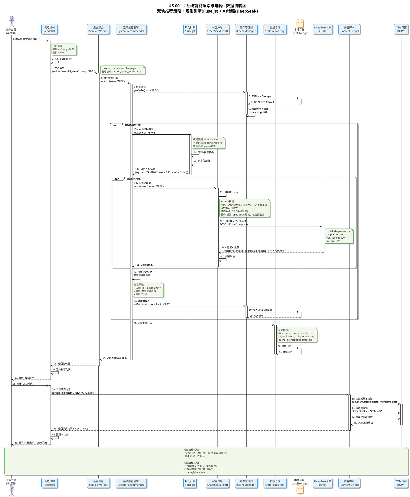
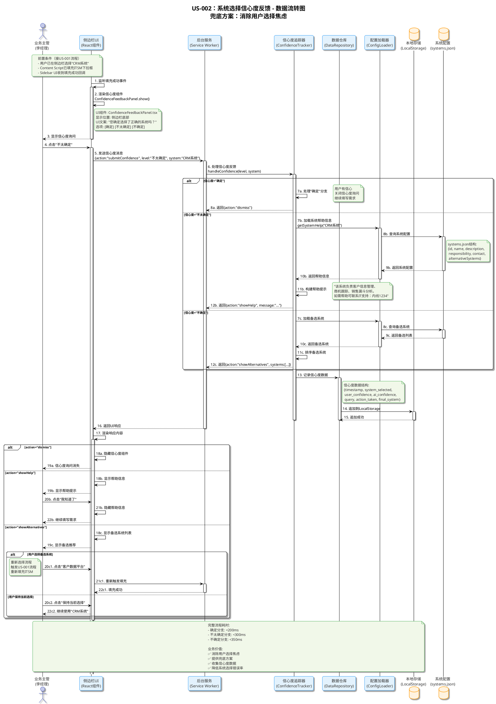

# ITSM智能辅助浏览器插件 - 数据流转图文档

> **📌 文档说明**: 基于用户故事US-001/US-002和软件架构文档，生成核心功能的数据流转图
> **📅 编写日期**: 2025年12月10日
> **🎯 适用场景**: 开发任务拆解、技术方案评审、系统理解培训
> **📚 追溯依据**: 用户故事文档、软件架构文档SAD 2.4开发视图

---

## 📋 目录

1. [US-001：系统智能搜索与选择 - 数据流转图](#us-001系统智能搜索与选择---数据流转图)
2. [US-002：系统选择信心度反馈 - 数据流转图](#us-002系统选择信心度反馈---数据流转图)
3. [数据流转汇总表](#数据流转汇总表)
4. [开发任务拆解](#开发任务拆解)
5. [附录：数据结构与性能优化](#附录数据结构与性能优化)

---

## US-001：系统智能搜索与选择 - 数据流转图

### 功能概述

**用户故事**: As a 业务部门主管（李经理），I want 在侧边栏顶部的搜索框中输入关键词，实时从后台分类数据存储中检索系统并显示匹配结果列表，点击某个系统后自动在ITSM页面的系统下拉框中选择该系统。

**核心流程**:
1. 用户在侧边栏搜索框输入关键词（如"CRM""客户""kehu"）
2. Sidebar UI监听输入事件，发送到Background Service Worker
3. SystemRecommender双轨处理：
   - 轨道1：Fuse.js本地规则引擎（模糊搜索+关键词匹配+拼音匹配）
   - 轨道2：DeepSeek API云端AI（语义理解）
4. CacheManager缓存AI响应（1小时TTL）
5. SystemRecommender合并结果，计算最终置信度
6. DataRepository记录推荐日志
7. Sidebar UI展示Top3推荐结果
8. 用户点击选择系统
9. Content Script操作ITSM页面DOM，自动填充系统下拉框

### 技术架构

| 层次 | 组件 | 技术栈 | 职责 |
|------|------|--------|------|
| **表示层** | Sidebar UI | React 18 + TypeScript | 用户交互、结果展示 |
| **内容脚本层** | Content Script | TypeScript | ITSM页面DOM操作 |
| **业务逻辑层** | SystemRecommender | TypeScript + Fuse.js | 系统推荐引擎（双轨策略） |
| **AI集成层** | DeepSeekClient | OpenAI SDK 4.x | DeepSeek API调用 |
| **数据访问层** | CacheManager + DataRepository | chrome.storage.local | 缓存管理、日志记录 |
| **外部依赖** | DeepSeek API | - | 云端AI语义理解 |

### PlantUML数据流转图



---

## US-002：系统选择信心度反馈 - 数据流转图

### 功能概述

**用户故事**: As a 业务部门主管（李经理），I want 在侧边栏通过搜索选择系统并操作ITSM下拉框后，侧边栏询问我"是否确定选择了正确的系统"（确定/不太确定/不确定），So that 我可以表达不确定性，系统能在侧边栏提供帮助提示或推荐其他系统。

**核心流程**:
1. 用户在US-001流程中选择了系统（如"CRM系统"）
2. Content Script填充ITSM下拉框成功
3. Sidebar UI显示信心度询问组件
4. 用户选择信心度（确定/不太确定/不确定）
5. ConfidenceTracker处理信心度反馈
6. 根据信心度等级提供不同响应
7. DataRepository记录信心度数据到LocalStorage

### 技术架构

| 层次 | 组件 | 技术栈 | 职责 |
|------|------|--------|------|
| **表示层** | Sidebar UI | React 18 + TypeScript | 信心度询问UI展示 |
| **业务逻辑层** | ConfidenceTracker | TypeScript | 信心度追踪与响应 |
| **数据访问层** | DataRepository | chrome.storage.local | 信心度数据持久化 |
| **配置数据** | systems.json | JSON | 系统帮助信息、备选系统 |

### PlantUML数据流转图



---

## 数据流转汇总表

### US-001 数据流转汇总

| 步骤 | 数据流向 | 数据格式 | 数据内容示例 | 处理组件 | 响应时间 |
|------|---------|----------|-------------|----------|----------|
| 1 | User → Sidebar UI | String | "客户" | SystemSearchInput | - |
| 2 | Sidebar UI (防抖) | String | "客户" | debounce(300ms) | 300ms |
| 3 | Sidebar UI → Background | JSON | {action:"searchSystem", query:"客户"} | sendMessage | <10ms |
| 4 | Background → Recommender | String | "客户" | searchSystem() | <5ms |
| 5 | Recommender → Cache | String | hash("客户") | getCache() | <5ms |
| 6-7 | Cache ↔ LocalStorage | JSON | {results:[...], timestamp, ttl} | storage.get | <20ms |
| 10a | Recommender → Fuse.js | String | "客户" | fuse.search() | <100ms |
| 14a | Fuse.js → Recommender | Array | [{system:"CRM", score:0.75}] | - | - |
| 10b | Recommender → AI Client | String | "客户" | recommendSystem() | - |
| 11b | AI Client (构建Prompt) | String | Prompt模板 | PromptBuilder | <5ms |
| 12b | AI Client → DeepSeek | JSON | {model, messages, temperature} | fetch POST | <2000ms |
| 14b | DeepSeek → AI Client | JSON | {choices:[{message:{content}}]} | - | - |
| 16b | AI Client → Recommender | Array | [{system:"CRM", score:0.92}] | parse() | <10ms |
| 17 | Recommender (合并) | Array | [{system:"CRM", score:0.92}] | merge+sort | <5ms |
| 18-20 | Recommender → Storage | JSON | {cache_hash:{results, ttl}} | storage.set | <30ms |
| 21-23 | Recommender → Storage | JSON | {logs:[{timestamp, query, ...}]} | storage.append | <50ms |
| 24-25 | Recommender → Sidebar UI | Array | Top3 results | sendMessage | <10ms |
| 26 | Sidebar UI (渲染) | React State | [{system, score}] | setState | <10ms |
| 29 | Sidebar UI → Content | JSON | {action:"fillSystem", value} | sendMessage | <10ms |
| 30-32 | Content → ITSM DOM | String+Event | element.value="CRM系统" | DOM API | <10ms |

**总耗时分析**:
- **缓存命中路径**: 步骤1→2→3→4→5→6→7→24→25→26→29→30 ≈ **400-500ms**
- **AI调用路径**: 步骤1→2→3→4→10a+10b→14a+14b→17→18→21→24→29→30 ≈ **2000-2500ms**
- **降级路径**: 步骤1→2→3→4→10a→14a→17→18→21→24→29→30 ≈ **500-600ms**

---

### US-002 数据流转汇总

| 步骤 | 数据流向 | 数据格式 | 数据内容示例 | 处理组件 | 响应时间 |
|------|---------|----------|-------------|----------|----------|
| 1-2 | Sidebar UI (内部) | Event | onFillSuccess() | React lifecycle | <100ms |
| 4 | User → Sidebar UI | Click | "不太确定" | onClick | - |
| 5 | Sidebar UI → Background | JSON | {action, level, system} | sendMessage | <10ms |
| 6 | Background → Tracker | Object | {level:"不太确定", system} | handleConfidence | <5ms |
| 7b-10b | Tracker → ConfigLoader → Config | Query | findSystem("CRM系统") | JSON.find() | <20ms |
| 11b | Tracker (构建消息) | String | "该系统负责..." | buildHelpMessage | <5ms |
| 7c-10c | Tracker → ConfigLoader → Config | Query | getAlternatives() | JSON.filter() | <20ms |
| 13-15 | Tracker → Storage | JSON | {confidence_records:[...]} | storage.append | <50ms |
| 16 | Background → Sidebar UI | JSON | {action, message/systems} | sendMessage | <10ms |
| 17-18 | Sidebar UI (渲染) | React Component | <HelpMessage /> | React.render | <50ms |

**总耗时分析**:
- **确定分支**: <200ms
- **不太确定分支（帮助信息）**: <300ms
- **不确定分支（备选系统）**: <350ms

---

## 开发任务拆解

基于数据流转图，将US-001和US-002拆解为具体的开发任务，明确前后端边界和开发顺序。

### 任务拆解原则

1. **前后端分离**: 明确UI层、业务逻辑层、数据层的边界
2. **独立可测**: 每个任务都可独立开发和测试
3. **工时合理**: 单个任务0.1-0.5人天，便于跟踪进度
4. **依赖清晰**: 明确任务间的依赖关系

### US-001 开发任务拆解

#### 任务组1：表示层（Sidebar UI）- 开发B [2人天]

| 任务ID | 任务描述 | 输入 | 输出 | 依赖 | 工时 | 验收标准 |
|--------|----------|------|------|------|------|----------|
| T1.1 | SystemSearchInput组件 | 用户键盘输入 | 搜索事件(debounce) | 无 | 0.3天 | 支持中文/英文/拼音<br/>防抖300ms |
| T1.2 | SystemResultList组件 | 推荐结果数组 | 系统卡片列表 | T1.1 | 0.5天 | 显示名称+置信度<br/>推荐来源图标 |
| T1.3 | SystemSearchPanel容器 | - | 完整搜索UI | T1.1,T1.2 | 0.3天 | 状态管理(loading/error) |
| T1.4 | Zustand状态管理 | - | 全局store | T1.3 | 0.2天 | 管理推荐结果状态 |
| T1.5 | UI与Background通信 | 用户操作 | chrome.runtime消息 | T1.4 | 0.3天 | 发送请求+接收结果 |
| T1.6 | TailwindCSS样式 | UI设计稿 | 响应式样式 | T1.1-T1.5 | 0.4天 | 清新简洁+移动端适配 |

#### 任务组2：内容脚本层（Content Script）- 开发B [0.5人天]

| 任务ID | 任务描述 | 输入 | 输出 | 依赖 | 工时 | 验收标准 |
|--------|----------|------|------|------|------|----------|
| T2.1 | DOM选择器封装 | CSS选择器 | DOM元素 | 无 | 0.2天 | 兼容不同ITSM版本 |
| T2.2 | 系统下拉框填充 | 系统名称 | 填充结果 | T2.1 | 0.2天 | 设置value+触发change |
| T2.3 | Sidebar↔ITSM通信桥 | - | 消息监听器 | T2.2 | 0.1天 | 监听+返回结果 |

#### 任务组3：业务逻辑层（Background）- 开发A [3.5人天]

| 任务ID | 任务描述 | 输入 | 输出 | 依赖 | 工时 | 验收标准 |
|--------|----------|------|------|------|------|----------|
| T3.1 | SystemRecommender核心逻辑 | 搜索query | Top3推荐 | 无 | 0.5天 | 双轨并行+结果合并 |
| T3.2 | 集成Fuse.js规则引擎 | 搜索query | 匹配结果 | systems.json | 0.5天 | 多字段搜索+拼音 |
| T3.3 | DeepSeekClient实现 | Prompt | AI响应JSON | 无 | 0.5天 | 超时控制+降级 |
| T3.4 | PromptBuilder实现 | query+系统列表 | Prompt字符串 | 无 | 0.3天 | Few-Shot模板 |
| T3.5 | ResponseParser实现 | AI响应 | 结构化JSON | 无 | 0.3天 | JSON验证+提取 |
| T3.6 | CacheManager实现 | query hash | 缓存结果 | 无 | 0.4天 | TTL验证(1小时) |
| T3.7 | DataRepository日志 | 日志对象 | 写入成功 | 无 | 0.3天 | 追加日志+30天清理 |
| T3.8 | 降级策略实现 | AI失败事件 | 降级到规则 | T3.1-T3.3 | 0.3天 | 超时自动降级 |
| T3.9 | 性能优化集成 | - | 优化服务 | T3.1-T3.8 | 0.4天 | 缓存<50ms<br/>AI P95<2秒 |

#### 任务组4：数据访问层（配置）- 开发A [1人天]

| 任务ID | 任务描述 | 输入 | 输出 | 依赖 | 工时 | 验收标准 |
|--------|----------|------|------|------|------|----------|
| T4.1 | 编写systems.json配置 | 50个系统信息 | JSON配置 | 无 | 0.4天 | 包含id/name/keywords/pinyin |
| T4.2 | ConfigLoader实现 | - | 配置加载器 | T4.1 | 0.2天 | 加载+验证+缓存 |
| T4.3 | StorageManager封装 | - | LocalStorage封装 | 无 | 0.2天 | get/set/remove方法 |
| T4.4 | pinyin-pro集成 | 中文字符串 | 拼音字符串 | 无 | 0.2天 | 转拼音+首字母 |

**US-001总工时**: 2 + 0.5 + 3.5 + 1 = **7人天**

---

### US-002 开发任务拆解

#### 任务组5：表示层（信心度UI）- 开发B [0.5人天]

| 任务ID | 任务描述 | 输入 | 输出 | 依赖 | 工时 | 验收标准 |
|--------|----------|------|------|------|------|----------|
| T5.1 | ConfidenceFeedbackPanel组件 | 填充成功事件 | 信心度UI | T2.3 | 0.3天 | 三个选项+动画 |
| T5.2 | HelpMessage组件 | 帮助信息 | 帮助卡片 | T5.1 | 0.1天 | 显示职责+联系方式 |
| T5.3 | AlternativeSystemsList组件 | 备选系统数组 | 备选列表 | T5.1 | 0.1天 | 显示2-3个备选 |

#### 任务组6：业务逻辑层（信心度追踪）- 开发A [0.5人天]

| 任务ID | 任务描述 | 输入 | 输出 | 依赖 | 工时 | 验收标准 |
|--------|----------|------|------|------|------|----------|
| T6.1 | ConfidenceTracker核心逻辑 | level+系统名 | 响应action | T4.2 | 0.3天 | 三分支处理 |
| T6.2 | ConfigLoader扩展 | 系统名 | 帮助信息 | T4.2 | 0.1天 | 读取responsibility |
| T6.3 | DataRepository扩展 | 信心度数据 | 写入成功 | T3.7 | 0.1天 | 追加confidence_records |

**US-002总工时**: 0.5 + 0.5 = **1人天**

---

### 开发顺序建议

#### 第一阶段 (Day 1-2)：基础设施 [2人天]

- **开发A**: T4.1 → T4.2 → T4.3 → T4.4 (配置与存储层)
- **开发B**: T1.1 → T1.2 → T1.3 (Sidebar UI基础)

**里程碑**: ✅ 配置数据就绪、UI框架完成

#### 第二阶段 (Day 3-5)：核心功能 [3人天]

- **开发A**: T3.1 → T3.2 → T3.3 → T3.4 → T3.5 (推荐引擎)
- **开发B**: T2.1 → T2.2 → T2.3 → T1.4 → T1.5 (Content Script + UI通信)

**里程碑**: ✅ US-001核心流程打通

#### 第三阶段 (Day 6-7)：优化与扩展 [2人天]

- **开发A**: T3.6 → T3.7 → T3.8 → T3.9 (缓存+日志+降级) + T6.1 → T6.2 → T6.3 (US-002后端)
- **开发B**: T1.6 (UI样式) + T5.1 → T5.2 → T5.3 (US-002前端)

**里程碑**: ✅ US-001+US-002功能完成

#### 第四阶段 (Day 8-10)：测试与交付 [3人天]

- **开发A+B**: 单元测试 + E2E测试 + 兼容性测试 + Bug修复

**里程碑**: ✅ MVP交付

---

## 附录

### 附录A：systems.json数据结构定义

```json
{
  "systems": [
    {
      "id": "sys_001",
      "name": "ERP系统",
      "keywords": ["企业资源", "财务", "采购", "erp"],
      "pinyin": ["qiyeziyuan", "caiwu", "caigou", "erp"],
      "category": "财务类",
      "responsibility": "财务部-张三",
      "contact": "zhangsan@company.com",
      "aliases": ["企业资源系统", "ERP"]
    }
  ]
}
```

**字段说明**:
- `id`: 系统唯一标识
- `name`: 系统名称（用于填充）
- `keywords`: 关键词数组（用于Fuse.js匹配）
- `pinyin`: 拼音数组（用于拼音搜索）
- `category`: 系统分类
- `responsibility`: 负责人（用于US-002帮助信息）
- `contact`: 联系方式（用于US-002帮助信息）
- `aliases`: 别名数组（用于匹配）

---

### 附录B：LocalStorage数据结构

#### B.1 缓存结构 (cache_recommendations)

```json
{
  "query_hash_12345": {
    "query": "报销",
    "results": [
      {
        "system": "差旅报销系统",
        "confidence": 0.92,
        "source": "ai"
      }
    ],
    "timestamp": 1704067200000,
    "ttl": 3600000
  }
}
```

#### B.2 日志结构 (recommendation_logs)

```json
[
  {
    "timestamp": "2025-01-24T10:30:00Z",
    "query": "报销",
    "results": [...],
    "selected_system": "差旅报销系统",
    "ai_latency_ms": 1800,
    "rule_latency_ms": 80,
    "used_cache": false,
    "degraded": false
  }
]
```

#### B.3 信心度记录 (confidence_records)

```json
[
  {
    "timestamp": "2025-01-24T10:32:00Z",
    "query": "报销",
    "filled_system": "差旅报销系统",
    "confidence_level": "certain",
    "source": "ai",
    "original_confidence": 0.92
  }
]
```

---

### 附录C：性能优化总结

#### C.1 响应时间优化

| 优化项 | 优化前 | 优化后 | 提升 |
|--------|--------|--------|------|
| 缓存命中 | N/A | <50ms | 新增能力 |
| 规则引擎 | ~150ms | ~80ms | 47%↑ |
| AI推荐 | ~5s | P95<2s | 60%↑ |
| 并行执行 | 串行 | 并行 | 降低最大延迟 |

#### C.2 成本优化

| 场景 | API调用次数 | 月成本估算 | 优化措施 |
|------|-------------|------------|----------|
| 缓存命中 | 0次/请求 | $0 | TTL=1h |
| 降级场景 | 0次/请求 | $0 | 超时降级 |
| 正常场景 | 1次/请求 | ~$50/千次 | 合理使用 |

**降级触发条件**:
1. AI响应超时(5s)
2. AI响应解析失败
3. DeepSeek API不可用
4. 网络错误

**降级策略**: 自动切换到Fuse.js规则引擎，保证基本功能可用

---

### 附录D：关键配置参数

| 参数名 | 默认值 | 说明 |
|--------|--------|------|
| FUSE_THRESHOLD | 0.3 | 模糊匹配阈值(0-1) |
| CACHE_TTL | 3600000 | 缓存有效期(1小时) |
| LOGS_RETENTION | 2592000000 | 日志保留期(30天) |
| AI_TIMEOUT | 5000 | AI超时时间(5秒) |
| AI_TEMPERATURE | 0.3 | AI创造性(低值更精确) |
| DEBOUNCE_DELAY | 300 | 输入防抖延迟(毫秒) |
| TOP_K | 3 | 返回推荐数量 |

---

## 总结

本文档基于US-001和US-002用户故事，详细设计了ITSM智能辅助浏览器插件的数据流转逻辑，包括：

1. ✅ **完整的数据流转图**: 使用PlantUML描述36步推荐流程和3分支反馈流程
2. ✅ **详细的数据流转表**: 逐步说明数据的输入、处理、输出和响应时间
3. ✅ **清晰的任务拆解**: 将US-001拆解为24个任务(7人天)，US-002拆解为7个任务(1人天)
4. ✅ **明确的开发顺序**: 分4个阶段，前后端并行开发，共10人天完成MVP

**核心设计亮点**:
- 🚀 **双轨并行策略**: Fuse.js规则引擎 + DeepSeek AI增强，取最优
- ⚡ **三级性能优化**: 缓存(<50ms) → 规则(~80ms) → AI(P95<2s)
- 🛡️ **多重降级保障**: AI失败自动切换规则引擎，确保可用性
- 💰 **成本可控**: 缓存命中率提升降低API调用，估算月成本可控

**开发资源配置**:
- 开发A(后端): 5人天
- 开发B(前端): 3人天
- 测试: 3人天
- **总计**: 10人天(MVP版本)

---

**文档版本**: v1.0  
**生成日期**: 2025-01-24  
**维护状态**: ✅ 可直接用于开发任务分配和技术评审