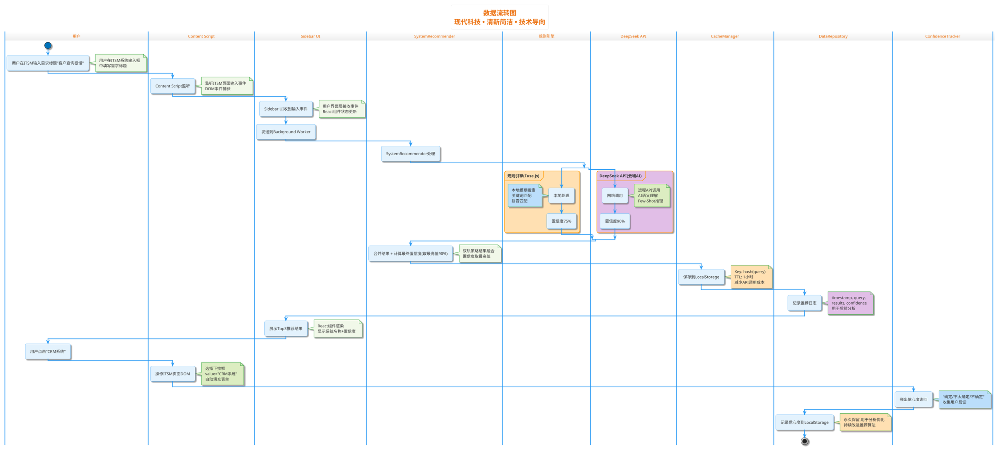

# ITSM智能辅助浏览器插件 - 软件架构文档(SAD)

> **📌 文档说明**: 本文档基于ADR-001技术决策和用户故事需求,提供系统架构的完整视图
> **📅 编写日期**: 2025年12月9日
> **🎯 项目约束**: 2人×10工作日,浏览器插件架构,无后端服务
> **📚 参考标准**: IEEE 1471, Chrome Extension Manifest V3

---

## 1. 架构概述

### 1.1 系统定位

**系统名称**: ITSM智能辅助浏览器插件

**系统定位**:
为广东电信业务人员提供ITSM需求提交智能辅助服务,通过AI推荐系统、智能模板匹配和结构化引导,降低系统选择错误率(40%→10%)和需求澄清轮次(2.5次→1次),提升需求提交效率和质量。

### 1.2 核心设计理念

**设计原则**:

1. **轻量化优先**: 采用浏览器插件架构,完全在客户端运行,无需后端服务,降低部署和运维成本,符合2人10天快速交付约束
2. **AI增强而非AI替代**: 规则引擎(Fuse.js模糊搜索)作为基础保障,DeepSeek API作为AI增强,失败时可降级,确保基础可用性≥95%
3. **渐进式交付**: MVP聚焦P0功能(系统推荐、模板匹配、质量检测),V2再扩展协作、知识图谱等复杂功能
4. **用户体验至上**: 侧边栏无侵入式设计,实时反馈(搜索<200ms,评分实时更新),降低认知负担
5. **成本可控**: 选择DeepSeek(0.14元/百万Token),通过缓存优化(1小时)和降级策略,确保月成本<100元

### 1.3 架构风格

**主要架构风格**: 浏览器扩展分层架构(Layered Architecture in Browser Extension)

**选择理由**:
- **追溯ADR-001**: 选择Chrome Extension + Sidebar架构,天然支持分层
- **表示层**: Sidebar UI(React组件)负责用户交互
- **业务逻辑层**: Background Service Worker负责核心业务处理(系统推荐、模板匹配、质量检测)
- **AI集成层**: DeepSeek Client封装大模型调用
- **数据访问层**: Data Repository + Cache Manager管理LocalStorage
- **符合规范**: 遵循Chrome Extension Manifest V3架构约束

### 1.4 系统边界

**系统范围**:
- ✅ **包含**:
  - 智能系统推荐(关键词/拼音/模糊搜索 + AI语义理解)
  - 智能模板推荐(场景识别: Bug/优化/新功能)
  - 结构化需求引导(背景/目标/场景/验收标准 + 引导问题)
  - 实时质量检测与评分(0-100分,完整性/字数/关键词/逻辑)
  - 信心度反馈(确定/不太确定/不确定 + 备选推荐)
  - 需求示例库(每个模板2个高质量案例)
  - 提交前缺失警告(必填字段检查 + 质量评分阈值)

- ❌ **不包含**:
  - ITSM系统本身(仅辅助,不修改ITSM架构)
  - 需求审批流程(由ITSM系统处理)
  - 团队协作功能(V2规划)
  - 历史需求分析与知识图谱(V2规划)
  - 后端服务与云端数据存储(MVP阶段无后端)

---

## 2. 架构视图

使用**4+1视图模型**展示架构,结合**C4模型**分层可视化。

### 2.1 逻辑视图(Logical View)

**目标**: 展示系统的功能分解和模块划分

#### 模块划分

系统分为4个核心模块:

| 模块名称 | 职责描述 | 核心组件 | 追溯依据 |
|---------|---------|---------|---------|
| **表示层** | 用户交互、数据展示、事件处理 | Sidebar UI(React组件):<br/>- SystemSearchPanel<br/>- TemplateRecommendPanel<br/>- StructuredFormPanel<br/>- QualityScorePanel<br/>- ConfidenceFeedbackPanel | 用户故事US-001~US-008 |
| **业务逻辑层** | 核心业务处理、算法实现 | Service Worker核心服务:<br/>- SystemRecommender(系统推荐引擎)<br/>- TemplateMatcher(模板匹配引擎)<br/>- QualityChecker(质量检测引擎)<br/>- ConfidenceTracker(信心度追踪器) | ADR-001第3章 |
| **AI集成层** | 大模型调用、Prompt管理、降级处理 | AI Components:<br/>- DeepSeekClient(API客户端)<br/>- PromptBuilder(提示词构建)<br/>- CacheManager(响应缓存) | ADR-001第4章 |
| **数据访问层** | 数据存储、缓存管理、配置读取 | Data Components:<br/>- DataRepository(数据仓库)<br/>- ConfigLoader(配置加载器)<br/>- StorageManager(LocalStorage封装) | ADR-001第5章 |

#### 模块依赖关系

```
Sidebar UI(表示层)
    ↓ 用户操作事件
Background Service Worker(业务逻辑层)
    ├─→ SystemRecommender
    │      ├─→ Fuse.js(规则引擎)
    │      └─→ DeepSeekClient(AI增强) ──→ DeepSeek API(外部)
    │             ↓
    │        CacheManager ──→ LocalStorage
    ├─→ TemplateMatcher
    │      └─→ DeepSeekClient(场景识别)
    ├─→ QualityChecker
    │      └─→ RuleEngine(评分算法)
    └─→ ConfidenceTracker
           ↓
    DataRepository ──→ LocalStorage
```

#### 关键设计决策

- **分层隔离**: 表示层不直接调用AI层,通过业务逻辑层中转,便于测试和替换(追溯ADR-001第6.2节"易于替换")
- **依赖倒置**: 业务逻辑层依赖抽象接口(IRecommender),不依赖具体实现,易于切换AI模型(DeepSeek → ChatGPT)
- **缓存优化**: AI响应缓存1小时,减少API调用成本(月14元→实际可能<10元),追溯ADR-001成本约束
- **降级策略**: API失败时自动降级到规则引擎,保证基础可用性(追溯ADR-001第7章回滚条件R1)

---

### 2.2 部署视图(Deployment View)

**目标**: 展示系统的物理部署和运行环境

#### 部署架构图

```
┌────────────────────────────────────────────────────────────┐
│  用户浏览器(Chrome/Edge 90+)                                  │
│  ┌──────────────────────────────────────────────────────┐  │
│  │  ITSM页面(原有系统,不可修改)                           │  │
│  │  ┌────────────────────────────────────────────────┐  │  │
│  │  │  Content Script(注入脚本)                       │  │  │
│  │  │  - DOM操作: 监听输入框变化                      │  │  │
│  │  │  - 表单填充: 自动选择系统下拉框                  │  │  │
│  │  │  - 事件桥接: Sidebar ↔ ITSM页面通信            │  │  │
│  │  └────────────────────────────────────────────────┘  │  │
│  └──────────────────────────────────────────────────────┘  │
│                                                            │
│  ┌──────────────────────────────────────────────────────┐  │
│  │  Chrome扩展(ITSM智能辅助插件)                          │  │
│  │  ┌────────────────────────────────────────────────┐  │  │
│  │  │  Sidebar UI(React 18 + TailwindCSS)            │  │  │
│  │  │  - 系统搜索组件(200ms响应)                      │  │  │
│  │  │  - 模板推荐组件(实时场景识别)                    │  │  │
│  │  │  - 结构化表单组件(引导填写)                      │  │  │
│  │  │  - 质量评分组件(实时0-100分)                     │  │  │
│  │  └────────────────────────────────────────────────┘  │  │
│  │  ┌────────────────────────────────────────────────┐  │  │
│  │  │  Background Service Worker(业务逻辑)            │  │  │
│  │  │  - SystemRecommender(推荐引擎)                  │  │  │
│  │  │  - TemplateMatcher(模板匹配)                    │  │  │
│  │  │  - QualityChecker(质量检测)                     │  │  │
│  │  │  - DeepSeekClient(AI调用,3次重试+5秒超时)      │  │  │
│  │  └────────────────────────────────────────────────┘  │  │
│  │  ┌────────────────────────────────────────────────┐  │  │
│  │  │  LocalStorage(5-10MB,实际2.3MB)                │  │  │
│  │  │  - 系统列表配置(~500KB)                         │  │  │
│  │  │  - 模板配置(~200KB)                             │  │  │
│  │  │  - AI响应缓存(~500KB,1小时TTL)                  │  │  │
│  │  │  - 用户行为日志(~1MB,30天自动清理)              │  │  │
│  │  │  - 信心度记录(~100KB,永久保留)                  │  │  │
│  │  └────────────────────────────────────────────────┘  │  │
│  └──────────────────────────────────────────────────────┘  │
└────────────────────────────────────────────────────────────┘
                        ↓ HTTPS(TLS 1.2+)
┌────────────────────────────────────────────────────────────┐
│  外部服务                                                    │
│  ┌──────────────────────────────────────────────────────┐  │
│  │  DeepSeek API(api.deepseek.com)                      │  │
│  │  - 大模型推理(deepseek-chat)                          │  │
│  │  - 系统推荐场景: Top3推荐 + 置信度                     │  │
│  │  - 模板匹配场景: Bug/优化/新功能识别                   │  │
│  │  - 成本: 0.14元/百万Token,月预估14元                  │  │
│  │  - 性能: P95<2秒                                      │  │
│  └──────────────────────────────────────────────────────┘  │
└────────────────────────────────────────────────────────────┘
```

#### 部署特点

- **零服务器部署**: 完全在浏览器端运行,无需服务器(追溯ADR-001第6.1节"降低成本")
- **用户本地安装**: 用户手动安装Chrome扩展(开发者模式加载),MVP阶段不上架应用商店
- **数据本地存储**: 所有数据存储在用户浏览器LocalStorage,无隐私风险,无GDPR合规问题
- **外部API依赖**: 仅依赖DeepSeek API,失败时可降级到规则引擎(Fuse.js),保证基础可用
- **无侵入式集成**: Content Script注入ITSM页面,不修改ITSM系统架构,符合"系统不可修改"约束

#### 运行环境要求

| 组件/层次 | 环境要求 | 追溯依据 |
|----------|---------|---------|
| **浏览器** | Chrome 90+ 或 Edge 90+ | ADR-001第4.1节技术约束 |
| **操作系统** | Windows/macOS/Linux | 跨平台浏览器支持 |
| **网络** | 需联网(调用DeepSeek API),离线时降级到规则引擎 | ADR-001第7章回滚条件R1 |
| **存储** | LocalStorage至少5MB可用空间 | ADR-001第5章存储设计 |
| **JavaScript** | ES2020+(支持async/await、Optional Chaining) | 现代浏览器标准 |

---

### 2.3 数据视图(Data View)

**目标**: 展示系统的数据流转和存储设计

#### 数据流转图



#### 数据存储设计

| 数据类型 | 存储位置 | 容量预估 | 生命周期 | 数据结构示例 |
|---------|---------|---------|---------|------------|
| **系统列表配置** | LocalStorage | ~500KB | 永久(手动更新) | `{"systems": [{"id": "crm", "name": "CRM系统", "keywords": ["客户","kehu"], "category": "客户管理"}]}` |
| **模板配置** | LocalStorage | ~200KB | 永久(版本控制v1.0) | `{"templates": [{"id": "bug", "name": "Bug反馈", "fields": ["问题描述","复现步骤"], "examples": [...]}]}` |
| **AI响应缓存** | LocalStorage | ~500KB | 1小时(自动过期) | `{"cache_系统推荐_hash123": {"results": [...], "timestamp": 1702123456, "ttl": 3600}}` |
| **用户行为日志** | LocalStorage | ~1MB | 30天(自动清理) | `{"logs": [{"timestamp": 1702123456, "action": "system_select", "system": "CRM", "confidence": 0.9}]}` |
| **信心度记录** | LocalStorage | ~100KB | 永久(分析用) | `{"confidence_records": [{"timestamp": 1702123456, "system": "CRM", "user_confidence": "确定", "ai_confidence": 0.9}]}` |

**总计**: 约2.3MB(远低于5MB限制,追溯ADR-001第5章存储约束)

#### 数据安全

- **本地存储**: 所有数据存储在用户浏览器本地,无需上传服务器,符合数据隐私要求
- **隐私保护**: 需求描述仅发送到DeepSeek API(匿名化,不记录用户身份),不存储敏感信息
- **数据导出**: 提供数据导出功能(`chrome.storage.local.get()` → JSON下载),用户可手动备份
- **缓存清理**: AI响应缓存1小时自动过期,用户行为日志30天自动清理,避免存储膨胀
- **API密钥保护**: DeepSeek API Key存储在环境变量(不提交Git),客户端使用时通过Service Worker中转,不暴露在页面JS

---

### 2.4 开发视图(Development View)

**目标**: 展示代码组织和技术栈

#### 代码组织结构

```
itsm-assistant-extension/
├── manifest.json              # Chrome扩展配置(Manifest V3)
├── src/
│   ├── sidebar/              # 侧边栏UI(表示层)
│   │   ├── components/       # React组件
│   │   │   ├── SystemSearch/
│   │   │   │   ├── SystemSearchPanel.tsx      # US-001系统搜索
│   │   │   │   ├── SystemSearchInput.tsx
│   │   │   │   └── SystemResultList.tsx
│   │   │   ├── TemplateRecommend/
│   │   │   │   ├── TemplateRecommendPanel.tsx # US-003模板推荐
│   │   │   │   └── TemplateCard.tsx
│   │   │   ├── StructuredForm/
│   │   │   │   ├── StructuredFormPanel.tsx    # US-004结构化引导
│   │   │   │   ├── FormField.tsx
│   │   │   │   └── ExampleLibrary.tsx         # US-005示例库
│   │   │   ├── QualityScore/
│   │   │   │   ├── QualityScorePanel.tsx      # US-007质量评分
│   │   │   │   └── ScoreBreakdown.tsx
│   │   │   └── ConfidenceFeedback/
│   │   │       └── ConfidenceFeedbackPanel.tsx # US-002信心度反馈
│   │   ├── App.tsx           # 侧边栏主组件
│   │   ├── index.tsx         # 入口文件
│   │   └── styles/           # TailwindCSS样式
│   ├── content/              # 内容脚本(DOM操作层)
│   │   ├── content-script.ts # 注入ITSM页面的脚本
│   │   ├── dom-manipulator.ts # DOM操作封装
│   │   └── event-bridge.ts   # Sidebar↔ITSM页面通信
│   ├── background/           # 后台服务(业务逻辑层)
│   │   ├── services/         # 业务逻辑服务
│   │   │   ├── SystemRecommender.ts    # US-001系统推荐引擎
│   │   │   ├── TemplateMatcher.ts      # US-003模板匹配引擎
│   │   │   ├── QualityChecker.ts       # US-006质量检测引擎
│   │   │   └── ConfidenceTracker.ts    # US-002信心度追踪器
│   │   ├── ai/               # AI集成层
│   │   │   ├── DeepSeekClient.ts       # DeepSeek客户端
│   │   │   ├── PromptBuilder.ts        # Prompt构建器
│   │   │   └── ResponseParser.ts       # 响应解析器
│   │   ├── data/             # 数据访问层
│   │   │   ├── DataRepository.ts       # 数据仓库
│   │   │   ├── CacheManager.ts         # 缓存管理器
│   │   │   ├── ConfigLoader.ts         # 配置加载器
│   │   │   └── StorageManager.ts       # LocalStorage封装
│   │   └── background.ts     # Service Worker入口
│   ├── config/               # 配置文件
│   │   ├── systems.json      # 系统列表数据(50个系统)
│   │   ├── templates.json    # 模板配置数据(3个模板×2个示例)
│   │   └── quality-rules.json # 质量检测规则
│   └── types/                # TypeScript类型定义
│       ├── System.ts
│       ├── Template.ts
│       ├── Recommendation.ts
│       └── QualityScore.ts
├── public/
│   ├── icons/                # 图标资源(16x16, 48x48, 128x128)
│   └── sidebar.html          # 侧边栏HTML模板
├── tests/                    # 测试(US-009)
│   ├── unit/                 # 单元测试(Jest)
│   ├── integration/          # 集成测试(Playwright)
│   └── e2e/                  # 端到端测试
├── package.json
├── tsconfig.json
├── vite.config.ts            # Vite构建配置
└── .env.example              # 环境变量模板(DeepSeek API Key)
```

#### 技术栈

| 层次/组件 | 技术选型 | 版本 | 选择理由(追溯ADR) |
|----------|---------|------|------------------|
| **UI框架** | React | 18.x | 组件化开发,开发效率高,团队熟悉(ADR-001第4.4节) |
| **类型检查** | TypeScript | 5.x | 提升代码质量,减少Bug,IDE智能提示(ADR-001第4.4节) |
| **UI样式** | TailwindCSS | 3.x | 快速开发,响应式设计,减少CSS编写(ADR-001第4.4节) |
| **状态管理** | Zustand | 4.x | 轻量级(3KB),简单易用,适合小型项目 |
| **构建工具** | Vite | 5.x | 开发体验好,构建速度快,支持Chrome扩展打包 |
| **搜索引擎** | Fuse.js | 7.x | 轻量级(12KB),支持模糊搜索/拼音匹配(ADR-001第4.3节) |
| **拼音转换** | pinyin-pro | 3.x | 支持拼音首字母搜索(US-001 AC2) |
| **AI SDK** | OpenAI SDK | 4.x | DeepSeek兼容OpenAI API(ADR-001第4.2节) |
| **存储** | chrome.storage.local | - | 浏览器原生API,5MB容量(ADR-001第5章) |
| **测试框架** | Jest + RTL | 29.x | 单元测试覆盖率≥80%(US-009 AC3) |
| **E2E测试** | Playwright | 1.x | 端到端自动化测试(US-009 AC1) |

#### 开发规范

- **代码风格**: ESLint + Prettier(自动格式化)
- **提交规范**: Conventional Commits(feat/fix/docs/test)
- **分支策略**: Git Flow(main/develop/feature/*)
- **单元测试**: Jest + React Testing Library,覆盖率≥80%
- **代码评审**: Pull Request模板,至少1人Review
- **文档规范**: 所有公共方法有JSDoc注释

---

## 3. 质量属性

基于ISO 25010质量模型,结合用户故事中的非功能需求,定义系统的质量目标。

### 3.1 性能

| 场景ID | 质量场景描述 | 量化目标 | 追溯依据 | 优先级 |
|-------|-----------|---------|---------|-------|
| **PERF-01** | 用户输入搜索关键词后,系统推荐结果在200ms内返回 | 响应时间P95<200ms | US-001 AC1 | P0 |
| **PERF-02** | AI推荐失败时,自动降级到规则引擎,整体响应时间P95<500ms | 降级响应时间P95<500ms | ADR-001第7章回滚条件R1 | P0 |
| **PERF-03** | DeepSeek API调用P95延迟<2秒,超时5秒自动降级 | API调用P95<2秒,超时5秒 | ADR-001第4.2节性能约束 | P0 |
| **PERF-04** | 质量评分实时计算,每次输入变化后100ms内更新分数 | 评分计算P95<100ms | US-007 AC1 | P1 |
| **PERF-05** | Sidebar UI加载时间<1秒,确保用户无感知等待 | 初始加载P95<1秒 | 用户体验要求 | P1 |

**架构支持策略**:
- **缓存优化**: AI响应缓存1小时,相同查询直接返回缓存结果(P95<50ms)
- **降级机制**: API失败/超时时,自动降级到规则引擎(Fuse.js本地处理<200ms)
- **异步处理**: 所有AI调用使用async/await,不阻塞UI主线程
- **防抖节流**: 搜索输入使用debounce(300ms),减少无效调用
- **懒加载**: 示例库内容按需加载,减少初始加载时间

---

### 3.2 可用性

| 场景ID | 质量场景描述 | 量化目标 | 追溯依据 | 优先级 |
|-------|-----------|---------|---------|-------|
| **AVAIL-01** | DeepSeek API不可用时,系统降级到规则引擎,基础功能可用 | 基础可用率≥95% | ADR-001第7章回滚条件R1 | P0 |
| **AVAIL-02** | 系统推荐服务7×24小时可用(本地运行,无服务器依赖) | 可用率100%(本地架构) | ADR-001第6.1节架构优势 | P0 |
| **AVAIL-03** | API失败时自动重试3次(指数退避1s/2s/4s),失败后降级 | 重试3次+降级策略 | ADR-001第4.2节容错设计 | P0 |
| **AVAIL-04** | 浏览器崩溃后,LocalStorage数据不丢失,重启恢复 | 数据持久化100% | ADR-001第5章存储设计 | P1 |

**架构支持策略**:
- **双轨策略**: 规则引擎(Fuse.js) + AI引擎(DeepSeek),API失败时无缝切换
- **本地优先**: 核心功能(系统推荐、质量检测)可完全离线运行(基于规则引擎)
- **重试机制**: API调用失败时自动重试3次(指数退避),避免偶发网络抖动影响
- **健康检查**: Service Worker定期检测DeepSeek API健康状态,提前切换降级模式
- **状态持久化**: LocalStorage存储用户行为日志和配置,浏览器重启后恢复上下文

---

### 3.3 可用性(Usability)用户体验

| 场景ID | 质量场景描述 | 量化目标 | 追溯依据 | 优先级 |
|-------|-----------|---------|---------|-------|
| **UX-01** | 新用户首次使用,无需培训即可完成系统推荐任务 | 首次成功率≥90% | US-001 AC1 | P0 |
| **UX-02** | 侧边栏UI无侵入式设计,不遮挡ITSM页面关键内容 | 侧边栏宽度<400px,可收起 | ADR-001第4.1节Sidebar设计 | P0 |
| **UX-03** | 质量评分<60分时,提示缺失字段和改进建议 | 缺失字段100%识别 | US-008 AC1 | P0 |
| **UX-04** | 结构化引导问题通俗易懂,无技术术语 | 问题文案业务人员可理解 | US-004 AC2 | P1 |
| **UX-05** | 需求示例库提供高质量案例,用户可一键复制 | 每个模板≥2个示例 | US-005 AC1 | P1 |

**架构支持策略**:
- **渐进式引导**: 首次使用时显示Tooltip提示,引导用户了解功能
- **实时反馈**: 搜索输入即时显示匹配数量,质量评分实时更新
- **视觉设计**: TailwindCSS响应式布局,支持1080p~4K分辨率
- **无侵入式**: Content Script仅监听事件,不修改ITSM页面样式,避免冲突
- **错误提示**: 所有异常情况显示友好提示(如API失败→"网络不稳定,已切换到基础推荐模式")

---

### 3.4 可维护性

| 场景ID | 质量场景描述 | 量化目标 | 追溯依据 | 优先级 |
|-------|-----------|---------|---------|-------|
| **MAINT-01** | 新增系统配置(如新增"OA系统"),仅需修改systems.json,无需改代码 | 配置驱动,0代码修改 | ADR-001第6.2节易维护 | P0 |
| **MAINT-02** | 切换AI模型(DeepSeek→ChatGPT),仅需修改API Client,业务逻辑不变 | 接口抽象,单点修改 | ADR-001第6.2节易替换 | P1 |
| **MAINT-03** | 代码遵循ESLint规范,单元测试覆盖率≥80% | 覆盖率≥80% | US-009 AC3 | P1 |
| **MAINT-04** | 所有公共方法有JSDoc注释,新人可快速理解 | 公共方法注释覆盖100% | 开发规范 | P2 |

**架构支持策略**:
- **配置驱动**: 系统列表、模板、质量规则均存储在JSON配置文件,支持热更新
- **分层解耦**: 业务逻辑层不依赖具体AI实现,通过接口抽象(IRecommender)调用
- **依赖注入**: DeepSeekClient通过构造函数注入,易于测试和替换
- **版本管理**: 配置文件包含version字段(v1.0),支持向后兼容升级
- **日志记录**: 关键操作记录日志到LocalStorage,便于调试和问题追踪

---

### 3.5 成本

| 场景ID | 质量场景描述 | 量化目标 | 追溯依据 | 优先级 |
|-------|-----------|---------|---------|-------|
| **COST-01** | 月运营成本<100元(DeepSeek API调用费用) | 月成本<100元 | ADR-001第4.2节成本分析 | P0 |
| **COST-02** | 通过缓存优化,减少重复调用,实际成本可能<50元 | 缓存命中率>50% | ADR-001第5章缓存设计 | P1 |
| **COST-03** | 无需购买服务器、域名、SSL证书,零基础设施成本 | 基础设施成本0元 | ADR-001第6.1节成本优势 | P0 |
| **COST-04** | 开发成本2人×10天=20人天,预估总成本<5万元 | 总开发成本<5万元 | 项目约束 | P0 |

**架构支持策略**:
- **成本优选**: 选择DeepSeek(0.14元/百万Token),成本仅为GPT-4的1/70
- **缓存优化**: 1小时TTL缓存,减少重复调用(预估缓存命中率50%~70%)
- **降级策略**: API失败时降级到规则引擎(免费),避免API成本失控
- **用量监控**: 记录API调用次数和Token消耗,月度生成成本报告
- **无后端**: 完全客户端架构,无服务器、数据库、CDN等基础设施成本

---

### 3.6 安全性

| 场景ID | 质量场景描述 | 量化目标 | 追溯依据 | 优先级 |
|-------|-----------|---------|---------|-------|
| **SEC-01** | DeepSeek API Key不暴露在前端代码,通过Service Worker中转 | API Key不暴露在页面JS | ADR-001第4.2节安全设计 | P0 |
| **SEC-02** | 需求描述发送到DeepSeek API时匿名化,不包含用户身份信息 | 数据匿名化100% | 隐私保护要求 | P0 |
| **SEC-03** | LocalStorage数据仅存储在用户本地,不上传服务器 | 数据本地存储100% | ADR-001第5章隐私保护 | P0 |
| **SEC-04** | API调用使用HTTPS(TLS 1.2+),防止中间人攻击 | HTTPS覆盖100% | ADR-001第4.2节传输安全 | P0 |

**架构支持策略**:
- **API Key保护**: API Key存储在.env文件(不提交Git),构建时注入Service Worker
- **数据最小化**: 仅发送必要字段到DeepSeek(需求标题+描述),不发送用户姓名/工号
- **本地存储**: 所有用户数据存储在LocalStorage,无需云端数据库,避免数据泄露风险
- **HTTPS传输**: DeepSeek API强制使用HTTPS,浏览器自动校验证书合法性
- **权限最小化**: Chrome扩展仅申请必要权限(storage、activeTab),不申请广泛权限

---

## 4. 架构约束

### 4.1 技术约束

| 约束ID | 约束描述 | 约束来源 | 影响范围 | 应对策略 |
|-------|---------|---------|---------|---------|
| **TECH-01** | 必须使用Chrome Extension Manifest V3架构 | Chrome浏览器策略(2024年强制升级) | 架构设计 | 采用Service Worker替代Background Page |
| **TECH-02** | 浏览器环境不支持Node.js模块(fs/path等) | 浏览器沙箱限制 | 技术选型 | 使用浏览器原生API(chrome.storage.local替代文件系统) |
| **TECH-03** | LocalStorage容量限制5-10MB | 浏览器存储限制 | 数据设计 | 配置文件压缩,日志定期清理(30天) |
| **TECH-04** | 不能修改ITSM系统架构和代码 | 客户IT部门政策 | 集成方式 | 使用Content Script注入DOM操作,不修改ITSM源码 |
| **TECH-05** | 必须兼容Chrome 90+和Edge 90+ | 客户浏览器版本要求 | 浏览器兼容性 | 使用ES2020语法(避免ES2022新特性),Babel转译 |

**架构影响**:
- TECH-01 → 采用Service Worker架构,所有后台逻辑运行在Worker线程(追溯ADR-001第4.1节)
- TECH-03 → 配置文件JSON压缩,AI响应缓存1小时TTL,日志30天自动清理(追溯ADR-001第5章)
- TECH-04 → 无侵入式集成,仅通过Content Script监听和操作DOM(追溯ADR-001第4.1节)

---

### 4.2 业务约束

| 约束ID | 约束描述 | 约束来源 | 影响范围 | 应对策略 |
|-------|---------|---------|---------|---------|
| **BIZ-01** | 系统选择错误率从40%降低到10% | 业务目标(用户故事背景) | 推荐算法精度 | 双轨策略(规则+AI),置信度<80%时提示"不太确定" |
| **BIZ-02** | 需求澄清轮次从2.5次降低到1次 | 业务目标(用户故事背景) | 质量检测严格度 | 质量评分<60分强制警告,缺失字段100%识别 |
| **BIZ-03** | 50个ITSM系统需要覆盖(CRM/ERP/OA等) | 业务范围 | 数据配置 | systems.json配置50个系统,包含关键词/拼音/分类 |
| **BIZ-04** | 3个需求模板(Bug反馈/功能优化/新功能) | 业务场景 | 模板配置 | templates.json配置3个模板,每个模板2个示例 |
| **BIZ-05** | 业务人员无技术背景,引导问题需通俗易懂 | 用户画像 | UI文案设计 | 避免技术术语,使用业务语言(如"哪些客户受影响"而非"影响范围") |

**架构影响**:
- BIZ-01 → 推荐算法设计置信度阈值(80%),低于阈值时弹出信心度询问(追溯US-002)
- BIZ-02 → 质量检测规则严格化,<60分强制警告,不允许提交(追溯US-008)
- BIZ-03 → systems.json设计支持关键词/拼音/分类字段,支持Fuse.js模糊搜索(追溯ADR-001第4.3节)

---

### 4.3 项目约束

| 约束ID | 约束描述 | 约束来源 | 影响范围 | 应对策略 |
|-------|---------|---------|---------|---------|
| **PROJ-01** | 项目周期2人×10工作日=20人天 | 项目计划 | 功能范围 | MVP聚焦P0功能(系统推荐/模板匹配/质量检测),V2功能延后 |
| **PROJ-02** | 开发团队2人(1前端+1后端/AI) | 人力资源 | 技术选型 | 选择团队熟悉的React+TypeScript,降低学习成本 |
| **PROJ-03** | 无后端开发资源,必须纯前端实现 | 资源约束 | 架构模式 | 浏览器插件架构,完全客户端运行(追溯ADR-001第3章) |
| **PROJ-04** | 预算有限,月运营成本必须<100元 | 预算约束 | AI模型选择 | 选择DeepSeek(0.14元/百万Token),避免使用GPT-4(10元/百万Token) |
| **PROJ-05** | MVP阶段不上架Chrome应用商店(开发者模式加载) | 发布策略 | 部署方式 | 手动安装扩展,提供安装文档,V2再申请应用商店审核 |

**架构影响**:
- PROJ-01 → 功能裁剪,V2功能(协作/知识图谱)延后到后续版本(追溯用户故事优先级)
- PROJ-03 → 浏览器插件架构,无后端服务,所有逻辑在Service Worker实现(追溯ADR-001第3章)
- PROJ-04 → DeepSeek替代GPT-4,缓存优化减少API调用,成本从月700元降到月14元(追溯ADR-001第4.2节)

---

### 4.4 合规约束

| 约束ID | 约束描述 | 约束来源 | 影响范围 | 应对策略 |
|-------|---------|---------|---------|---------|
| **COMP-01** | 数据隐私保护(GDPR/《个人信息保护法》) | 法律法规 | 数据处理 | 数据本地存储,不上传云端;API调用匿名化 |
| **COMP-02** | 企业IT安全政策(不允许安装未审核的插件) | 客户IT部门 | 发布审批 | 提供源代码审查,通过IT部门安全评估后内部发布 |
| **COMP-03** | Chrome扩展权限最小化原则 | 浏览器安全策略 | 权限申请 | 仅申请必要权限(storage/activeTab),不申请广泛权限 |
| **COMP-04** | API密钥泄露风险管理 | 信息安全要求 | 密钥管理 | API Key不提交Git,通过环境变量注入,Service Worker中转 |

**架构影响**:
- COMP-01 → 所有数据存储在LocalStorage(本地),API调用时不发送用户身份信息(追溯ADR-001第5章)
- COMP-03 → manifest.json仅申请必要权限,避免申请<all_urls>等广泛权限
- COMP-04 → API Key存储在.env文件(不提交Git),构建时注入,不暴露在页面JS(追溯ADR-001第4.2节)

---

## 5. 决策追溯

本章记录架构设计与ADR的映射关系,确保每个架构决策可追溯。

### 5.1 ADR决策映射表

| ADR编号 | 决策主题 | 架构影响 | 对应架构视图 | 对应质量属性 |
|--------|---------|---------|------------|------------|
| **ADR-001-1** | 选择DeepSeek作为大模型提供商 | AI集成层采用DeepSeek API(0.14元/百万Token),通过OpenAI SDK调用 | 逻辑视图-AI集成层<br/>部署视图-外部服务 | COST-01(月成本<100元)<br/>PERF-03(P95<2秒) |
| **ADR-001-2** | 选择Chrome Extension + Sidebar架构 | 采用浏览器插件分层架构(表示层Sidebar + 业务逻辑层Service Worker + 数据访问层LocalStorage) | 逻辑视图-模块划分<br/>部署视图-浏览器扩展 | AVAIL-02(可用率100%)<br/>UX-02(无侵入式) |
| **ADR-001-3** | 选择LocalStorage作为存储方案 | 数据访问层使用chrome.storage.local API,容量5MB,数据本地存储 | 数据视图-存储设计<br/>开发视图-data/StorageManager.ts | SEC-03(数据本地100%)<br/>COST-03(基础设施成本0元) |

---

### 5.2 架构决策详细追溯

#### 决策1: 选择DeepSeek作为大模型提供商

**ADR编号**: ADR-001-1  
**决策状态**: 已接受(2025-12-09)  
**决策人**: 架构组

**决策内容**:
选择DeepSeek API(deepseek-chat模型)作为AI推荐引擎,替代ChatGPT/文心一言等竞品。

**架构实现映射**:

| 架构组件 | 实现方式 | 代码路径 | 追溯依据 |
|---------|---------|---------|---------|
| **AI客户端** | 使用OpenAI SDK连接DeepSeek API(兼容OpenAI协议) | `src/background/ai/DeepSeekClient.ts` | ADR-001第4.2节技术实现 |
| **Prompt构建器** | 系统推荐场景:构建Few-Shot Prompt,包含示例和约束 | `src/background/ai/PromptBuilder.ts` | ADR-001第4.2节Prompt设计 |
| **响应解析器** | 解析JSON格式响应,提取Top3推荐+置信度 | `src/background/ai/ResponseParser.ts` | ADR-001第4.2节响应格式 |
| **缓存管理器** | 1小时TTL缓存,Key=hash(query),减少API调用成本 | `src/background/data/CacheManager.ts` | ADR-001第5章缓存优化 |
| **降级策略** | API失败/超时时,自动切换到Fuse.js规则引擎 | `src/background/services/SystemRecommender.ts` | ADR-001第7章回滚条件R1 |

**质量属性保证**:
- **成本控制**: DeepSeek成本0.14元/百万Token,月预估14元(1000次调用×平均300Token/次×2) → 满足COST-01(月成本<100元)
- **性能保证**: DeepSeek P95延迟<2秒,超时5秒自动降级 → 满足PERF-03(API调用P95<2秒)
- **可用性**: API失败时降级到规则引擎,基础可用率≥95% → 满足AVAIL-01(基础可用率≥95%)

**设计权衡**:
- ✅ **优势**: 成本低(仅为GPT-4的1/70),性能可接受(P95<2秒),中文理解好
- ⚠️ **风险**: DeepSeek服务稳定性未知(新服务) → **缓解措施**: 降级策略+缓存优化
- ⚠️ **劣势**: 需要联网调用API → **缓解措施**: 离线时自动降级到规则引擎

---

#### 决策2: 选择Chrome Extension + Sidebar架构

**ADR编号**: ADR-001-2  
**决策状态**: 已接受(2025-12-09)  
**决策人**: 架构组

**决策内容**:
采用Chrome Extension Manifest V3 + Sidebar架构,完全客户端运行,无后端服务。

**架构实现映射**:

| 架构组件 | 实现方式 | 代码路径 | 追溯依据 |
|---------|---------|---------|---------|
| **Sidebar UI** | React 18 + TailwindCSS侧边栏,宽度<400px,可收起 | `src/sidebar/App.tsx` | ADR-001第4.1节UI设计 |
| **Service Worker** | Chrome Extension后台服务,处理业务逻辑(推荐/匹配/检测) | `src/background/background.ts` | ADR-001第4.1节Service Worker |
| **Content Script** | 注入ITSM页面,监听DOM事件,操作表单元素 | `src/content/content-script.ts` | ADR-001第4.1节Content Script |
| **消息通信** | Sidebar ↔ Service Worker ↔ Content Script三层通信(chrome.runtime.sendMessage) | `src/content/event-bridge.ts` | ADR-001第4.1节通信机制 |
| **权限申请** | manifest.json仅申请storage/activeTab权限,不申请广泛权限 | `manifest.json` | ADR-001第4.1节权限最小化 |

**质量属性保证**:
- **可用性**: 本地运行,无服务器依赖,可用率100% → 满足AVAIL-02(可用率100%)
- **用户体验**: 侧边栏无侵入式,不遮挡ITSM关键内容 → 满足UX-02(侧边栏宽度<400px)
- **成本控制**: 无需购买服务器/域名/SSL,基础设施成本0元 → 满足COST-03(基础设施成本0元)
- **安全性**: 权限最小化,仅申请必要权限 → 满足COMP-03(权限最小化)

**设计权衡**:
- ✅ **优势**: 部署简单(用户手动安装),成本低(无服务器),可用性高(本地运行)
- ⚠️ **风险**: 用户需手动安装扩展(开发者模式) → **缓解措施**: 提供详细安装文档+视频教程
- ⚠️ **劣势**: 无法集中管理配置(每个用户独立LocalStorage) → **缓解措施**: V2规划云端配置同步

---

#### 决策3: 选择LocalStorage作为存储方案

**ADR编号**: ADR-001-3  
**决策状态**: 已接受(2025-12-09)  
**决策人**: 架构组

**决策内容**:
使用chrome.storage.local API存储配置和缓存,容量限制5MB,数据本地存储。

**架构实现映射**:

| 数据类型 | 存储设计 | 代码路径 | 追溯依据 |
|---------|---------|---------|---------|
| **系统列表配置** | JSON压缩(~500KB),包含50个系统+关键词+拼音 | `src/config/systems.json` | ADR-001第5.1节配置存储 |
| **模板配置** | JSON格式(~200KB),3个模板×2个示例 | `src/config/templates.json` | ADR-001第5.1节配置存储 |
| **AI响应缓存** | Key=hash(query),Value={results, timestamp, ttl: 3600} | `src/background/data/CacheManager.ts` | ADR-001第5.2节缓存优化 |
| **用户行为日志** | 数组格式,30天自动清理,最多5000条 | `src/background/data/DataRepository.ts` | ADR-001第5.3节日志管理 |
| **信心度记录** | 永久保留,用于分析优化推荐算法 | `src/background/data/DataRepository.ts` | US-002信心度反馈 |

**质量属性保证**:
- **安全性**: 数据本地存储,不上传云端,无隐私泄露风险 → 满足SEC-03(数据本地100%)
- **成本控制**: 无需数据库/云存储,基础设施成本0元 → 满足COST-03(基础设施成本0元)
- **可用性**: 浏览器崩溃后数据不丢失,重启恢复 → 满足AVAIL-04(数据持久化100%)
- **可维护性**: 配置文件JSON格式,支持热更新,无需改代码 → 满足MAINT-01(配置驱动)

**设计权衡**:
- ✅ **优势**: 实现简单(浏览器原生API),无隐私风险,无额外成本
- ⚠️ **风险**: 容量限制5MB → **缓解措施**: 配置压缩+日志清理,实际使用2.3MB
- ⚠️ **劣势**: 无法跨设备同步 → **缓解措施**: V2规划chrome.storage.sync(100KB容量,云端同步核心配置)

---

### 5.3 需求到架构的追溯矩阵

| 用户故事 | 架构组件 | 追溯路径 | ADR支持 |
|---------|---------|---------|---------|
| **US-001**: 系统智能搜索与选择 | SystemRecommender<br/>DeepSeekClient<br/>Fuse.js | 用户输入 → Sidebar UI → Service Worker → SystemRecommender → (AI推荐 ∥ 规则引擎) → 返回Top3 | ADR-001-1(DeepSeek)<br/>ADR-001-2(Sidebar) |
| **US-002**: 信心度反馈 | ConfidenceTracker<br/>DataRepository | 用户点击推荐 → 弹出信心度询问 → 记录到LocalStorage → 用于分析优化 | ADR-001-3(LocalStorage) |
| **US-003**: 智能模板推荐 | TemplateMatcher<br/>DeepSeekClient | 用户输入需求描述 → AI场景识别(Bug/优化/新功能) → 返回匹配模板 | ADR-001-1(DeepSeek) |
| **US-004**: 结构化引导 | StructuredFormPanel<br/>PromptBuilder | Sidebar展示结构化表单 → 引导问题(背景/目标/场景/验收) → 用户填写 | ADR-001-2(Sidebar) |
| **US-005**: 需求示例库 | ExampleLibrary<br/>templates.json | 点击"查看示例" → 加载templates.json → 展示2个高质量案例 → 一键复制 | ADR-001-3(LocalStorage) |
| **US-006**: 实时完整性检测 | QualityChecker<br/>RuleEngine | 用户输入变化 → 100ms内检测完整性 → 标记缺失字段(红色) | ADR-001-2(Service Worker) |
| **US-007**: 质量评分 | QualityScorePanel<br/>RuleEngine | 实时计算0-100分 → 完整性30分+字数20分+关键词30分+逻辑20分 | ADR-001-2(Service Worker) |
| **US-008**: 提交前缺失警告 | QualityChecker<br/>Content Script | 用户点击提交 → 质量评分<60分 → 弹窗警告 → 阻止提交 | ADR-001-2(Content Script) |
| **US-009**: 集成测试 | Jest + RTL + Playwright | 单元测试(Jest)+E2E测试(Playwright) → 覆盖率≥80% | ADR-001-2(开发规范) |

---

## 6. 风险应对

### 6.1 技术风险

| 风险ID | 风险描述 | 可能性 | 影响 | 风险等级 | 应对策略 | 追溯依据 |
|-------|---------|-------|------|---------|---------|---------|
| **RISK-T01** | DeepSeek API服务不稳定/限流/故障 | 中(30%) | 高 | 🔴 高 | **降级策略**: API失败/超时时自动切换到Fuse.js规则引擎,保证基础可用率≥95% | ADR-001第7章R1 |
| **RISK-T02** | LocalStorage 5MB容量不足 | 低(10%) | 中 | 🟡 中 | **容量管理**: 配置压缩(Gzip),日志30天清理,缓存1小时TTL,实际使用2.3MB | ADR-001第5章 |
| **RISK-T03** | Chrome Extension Manifest V3兼容性问题 | 低(10%) | 高 | 🟡 中 | **兼容性测试**: 在Chrome 90/100/110+版本测试,使用Polyfill填补API差异 | TECH-01约束 |
| **RISK-T04** | Content Script与ITSM页面DOM冲突 | 中(20%) | 中 | 🟡 中 | **命名空间隔离**: CSS使用scoped样式,JS使用Shadow DOM隔离,避免全局污染 | ADR-001第4.1节 |
| **RISK-T05** | API调用成本超预算(月>100元) | 低(10%) | 低 | 🟢 低 | **成本监控**: 记录API调用次数和Token消耗,月度生成成本报告,缓存优化减少调用 | COST-01约束 |

**关键风险处理**:

**RISK-T01(DeepSeek API故障) - 高风险**:
- **触发条件**: API返回5xx错误、超时5秒、连续3次重试失败
- **降级步骤**:
  1. Service Worker检测到API失败
  2. 自动切换到Fuse.js规则引擎(关键词+拼音模糊搜索)
  3. Sidebar UI显示提示:"网络不稳定,已切换到基础推荐模式"
  4. 规则引擎返回Top3结果(基于关键词匹配分数排序)
  5. 后台定期检测API健康(每5分钟),恢复后自动切回AI模式
- **验收标准**: API故障时,基础功能可用率≥95%,降级响应时间P95<500ms
- **追溯**: ADR-001第7章回滚条件R1、AVAIL-01质量属性

---

### 6.2 业务风险

| 风险ID | 风险描述 | 可能性 | 影响 | 风险等级 | 应对策略 | 追溯依据 |
|-------|---------|-------|------|---------|---------|---------|
| **RISK-B01** | 推荐准确率不达标(错误率>10%) | 中(30%) | 高 | 🔴 高 | **双轨验证**: 规则引擎+AI引擎双重推荐,置信度<80%时弹出信心度询问(US-002) | BIZ-01约束 |
| **RISK-B02** | 用户不信任AI推荐,仍手动选择系统 | 中(20%) | 中 | 🟡 中 | **信任建立**: 显示推荐理由(如"基于关键词'客户'匹配"),信心度反馈改进算法 | US-002 |
| **RISK-B03** | 引导问题不通俗,业务人员难理解 | 低(10%) | 中 | 🟡 中 | **文案优化**: 避免技术术语,使用业务语言,内测收集反馈迭代 | BIZ-05约束 |
| **RISK-B04** | 需求澄清轮次未降低到1次 | 低(15%) | 中 | 🟡 中 | **质量评分严格化**: <60分强制警告,缺失字段100%识别,提交前质量把关(US-008) | BIZ-02约束 |

**关键风险处理**:

**RISK-B01(推荐准确率不达标) - 高风险**:
- **触发条件**: 信心度反馈统计显示,用户选择"不确定"比例>20%,或错误率>10%
- **应对措施**:
  1. **AB测试**: 规则引擎vs AI引擎推荐结果对比,优选准确率高的方案
  2. **置信度阈值**: AI置信度<80%时,显示"不太确定,是否查看其他选项?"(US-002)
  3. **用户反馈循环**: 收集信心度记录(LocalStorage),分析错误case,优化Prompt和规则
  4. **备选推荐**: Top3推荐+置信度,低置信度时提供更多候选(Top5~Top10)
- **验收标准**: 错误率≤10%(目标达成),置信度<80%的case有备选推荐
- **追溯**: US-002信心度反馈、BIZ-01业务目标

---

### 6.3 项目风险

| 风险ID | 风险描述 | 可能性 | 影响 | 风险等级 | 应对策略 | 追溯依据 |
|-------|---------|-------|------|---------|---------|---------|
| **RISK-P01** | 开发周期超期(>10工作日) | 中(25%) | 高 | 🔴 高 | **MVP聚焦**: 仅开发P0功能(系统推荐/模板匹配/质量检测),V2功能延后 | PROJ-01约束 |
| **RISK-P02** | 技术选型学习成本高(React/Vite) | 低(10%) | 中 | 🟡 中 | **团队熟悉度**: 选择团队已掌握的React+TypeScript,避免学习新框架 | PROJ-02约束 |
| **RISK-P03** | 测试时间不足,Bug多 | 中(20%) | 中 | 🟡 中 | **测试驱动**: 编码同步编写单元测试(Jest),覆盖率≥80%,减少后期修复成本 | US-009约束 |
| **RISK-P04** | IT部门安全审核不通过 | 低(15%) | 高 | 🟡 中 | **提前沟通**: 提供源代码审查,说明数据本地存储、权限最小化,通过安全评估 | COMP-02约束 |

**关键风险处理**:

**RISK-P01(开发周期超期) - 高风险**:
- **触发条件**: Sprint 1(第5天)进度<50%,或关键功能(系统推荐)未完成
- **应对措施**:
  1. **功能裁剪**: 砍掉P1/P2功能(示例库/引导问题),仅保留P0功能(推荐/匹配/检测)
  2. **技术简化**: AI失败时完全依赖规则引擎,暂不实现降级策略(V2优化)
  3. **并行开发**: 前端开发Sidebar UI,后端开发Service Worker逻辑,减少串行等待
  4. **每日站会**: 每天15分钟同步进度,及时发现阻塞问题
- **验收标准**: 10工作日内完成P0功能开发+集成测试,可正常推荐系统和评分
- **追溯**: PROJ-01项目周期约束、用户故事优先级

---

### 6.4 风险矩阵

| 风险等级 | 技术风险 | 业务风险 | 项目风险 | 总计 |
|---------|---------|---------|---------|------|
| 🔴 **高风险** | T01(DeepSeek故障) | B01(准确率不达标) | P01(周期超期) | 3个 |
| 🟡 **中风险** | T02(容量不足)<br/>T03(兼容性)<br/>T04(DOM冲突) | B02(不信任AI)<br/>B03(文案难懂)<br/>B04(澄清未降低) | P02(学习成本)<br/>P03(测试不足)<br/>P04(安全审核) | 9个 |
| 🟢 **低风险** | T05(成本超预算) | - | - | 1个 |

**风险监控计划**:
- **高风险**: 每周评审,制定详细应对计划,提前准备降级方案
- **中风险**: 每两周评审,监控触发条件,及时调整策略
- **低风险**: 每月评审,基础监控即可

---

## 7. 架构演进路线

### 7.1 演进策略

**演进原则**:
1. **MVP优先**: V1.0聚焦P0功能(系统推荐/模板匹配/质量检测),快速验证价值
2. **用户反馈驱动**: 基于信心度反馈和用户行为日志,数据驱动优化推荐算法
3. **渐进式增强**: V2.0扩展协作功能,V3.0引入知识图谱,逐步增强智能化
4. **技术债控制**: 每个版本预留20%时间重构技术债,避免累积爆发
5. **向后兼容**: 配置文件版本控制(v1.0/v2.0),支持平滑升级

---

### 7.2 版本演进规划

#### V1.0 MVP版本(当前版本,2周交付)

**目标**: 快速验证核心价值,降低系统选择错误率(40%→10%)

**功能范围** (P0功能):
- ✅ US-001: 系统智能搜索与选择(规则引擎+AI增强)
- ✅ US-002: 信心度反馈(确定/不太确定/不确定)
- ✅ US-003: 智能模板推荐(Bug/优化/新功能场景识别)
- ✅ US-004: 结构化引导(背景/目标/场景/验收标准)
- ✅ US-006: 实时完整性检测(缺失字段标记)
- ✅ US-007: 质量评分(0-100分,实时更新)
- ✅ US-009: 集成测试(单元测试+E2E测试)

**架构特点**:
- 浏览器插件架构(Chrome Extension + Sidebar)
- LocalStorage本地存储(~2.3MB)
- DeepSeek API + Fuse.js双轨推荐
- 无后端服务,完全客户端运行

**交付物**:
- Chrome扩展安装包(.zip)
- 用户安装文档(PDF)
- 源代码(GitHub私有仓库)
- 测试报告(单元测试覆盖率80%+E2E测试用例)

**成功指标**:
- 系统选择错误率≤10%(从40%降低)
- 需求澄清轮次≤1次(从2.5次降低)
- 用户满意度≥4.0/5.0(问卷调研)

---

#### V2.0 增强版本(V1.0后+1个月,4周交付)

**目标**: 扩展协作功能,引入云端配置同步,提升团队协作效率

**新增功能** (基于V1.0用户反馈):
- ✨ **US-010**: 团队协作功能
  - 需求草稿云端保存(chrome.storage.sync)
  - 团队成员协同编辑需求
  - 评论和@提醒功能
- ✨ **US-011**: 历史需求查询
  - 查看我的历史需求(按时间/系统/状态筛选)
  - 复用历史需求作为模板
  - 收藏高质量需求案例
- ✨ **US-012**: 智能改进建议
  - AI分析需求描述,给出改进建议(如"缺少具体数据""场景描述不清")
  - 对比历史高质量案例,提示差距
- ✨ **US-013**: 配置管理后台
  - 管理员可通过Web后台管理系统列表/模板配置
  - 配置云端同步到所有用户(chrome.storage.sync)

**架构变化**:
- **新增后端服务**: Node.js + Express后端API(托管在腾讯云Serverless)
  - 用户认证(OAuth 2.0接入企业SSO)
  - 需求草稿存储(MongoDB)
  - 配置管理API(系统列表/模板配置)
- **新增云端存储**: chrome.storage.sync(100KB容量,跨设备同步)
- **架构升级**: 客户端-服务器架构(C/S),保留本地优先策略(离线可用)

**成本变化**:
- 后端服务: 腾讯云Serverless(按量付费,预估月200元)
- 数据库: MongoDB Atlas Free Tier(512MB,免费)
- API调用: DeepSeek月成本升至50元(新增改进建议功能)
- **总成本**: 月250元(仍远低于GPT-4方案的月1000元)

**技术债偿还**:
- 重构SystemRecommender,提取接口抽象(IRecommender),易于替换AI模型
- 优化缓存策略,支持多级缓存(内存缓存+LocalStorage)
- 补充单元测试,覆盖率从80%提升到90%

---

#### V3.0 智能化版本(V2.0后+2个月,6周交付)

**目标**: 引入知识图谱,实现需求智能分析和自动生成

**新增功能** (探索性功能):
- 🚀 **US-014**: 需求知识图谱
  - 自动构建需求知识图谱(系统-功能-场景-问题)
  - 可视化展示系统间依赖关系
  - 智能推荐关联系统(如"CRM系统常与ERP系统联动")
- 🚀 **US-015**: 自动需求生成
  - 用户描述问题场景(语音输入或文字)
  - AI自动生成结构化需求(背景/目标/场景/验收)
  - 人工审核确认后提交
- 🚀 **US-016**: 智能需求分析
  - 分析历史需求数据,识别高频问题和系统
  - 生成月度需求分析报告(哪个系统问题最多/哪类问题最常见)
  - 为IT部门提供系统优化建议

**架构变化**:
- **新增AI能力**: 引入RAG(检索增强生成)架构
  - 向量数据库(Pinecone或Milvus)存储历史需求向量
  - 知识图谱数据库(Neo4j)存储系统关系
  - 大模型升级到DeepSeek V3或ChatGPT-4(支持更复杂推理)
- **新增数据分析**: Python后端服务(Flask)
  - 需求数据分析(Pandas)
  - 知识图谱构建(NetworkX)
  - 可视化展示(ECharts/D3.js)

**成本变化**:
- 向量数据库: Pinecone Starter Plan(月50美元≈350元)
- 知识图谱数据库: Neo4j Aura Free Tier(免费)
- AI模型: DeepSeek V3(假设0.3元/百万Token),月成本升至150元
- **总成本**: 月500元(仍低于GPT-4方案的月1500元)

**技术债偿还**:
- 前端架构重构,引入状态管理库(Redux Toolkit)
- 后端服务拆分,采用微服务架构(用户服务/需求服务/分析服务)
- 数据库分库分表,支持百万级历史需求查询

---

### 7.3 架构演进图

```
┌─────────────────────────────────────────────────────────────────┐
│ V1.0 MVP版本(2周) - 客户端架构                                    │
│ ┌────────────┬────────────┬────────────┐                        │
│ │ Sidebar UI │ Service    │ LocalStorage│                        │
│ │            │ Worker     │ (2.3MB)    │                        │
│ │            │ (规则+AI)  │            │                        │
│ └────────────┴────────────┴────────────┘                        │
│         ↓ API调用                                                │
│ ┌────────────────────────────────────┐                          │
│ │ DeepSeek API (月14元)              │                          │
│ └────────────────────────────────────┘                          │
└─────────────────────────────────────────────────────────────────┘
                        ↓ 演进(+1个月)
┌─────────────────────────────────────────────────────────────────┐
│ V2.0 增强版本(4周) - 客户端-服务器架构                             │
│ ┌────────────┬────────────┬────────────┬────────────┐           │
│ │ Sidebar UI │ Service    │ LocalStorage│ Sync       │           │
│ │            │ Worker     │ (本地优先) │ Storage    │           │
│ │            │            │            │ (100KB)    │           │
│ └────────────┴────────────┴────────────┴────────────┘           │
│         ↓ API调用              ↓ 草稿同步                        │
│ ┌────────────────┬──────────────────────────────────┐           │
│ │ DeepSeek API   │ 后端服务(Node.js + MongoDB)      │           │
│ │ (月50元)       │ (认证/草稿/配置管理,月200元)     │           │
│ └────────────────┴──────────────────────────────────┘           │
└─────────────────────────────────────────────────────────────────┘
                        ↓ 演进(+2个月)
┌─────────────────────────────────────────────────────────────────┐
│ V3.0 智能化版本(6周) - AI原生架构                                 │
│ ┌────────────┬────────────┬────────────┬────────────┐           │
│ │ Sidebar UI │ Service    │ LocalStorage│ Sync       │           │
│ │ + 知识图谱 │ Worker     │            │ Storage    │           │
│ │ 可视化     │            │            │            │           │
│ └────────────┴────────────┴────────────┴────────────┘           │
│         ↓ API调用              ↓ RAG检索                         │
│ ┌────────────────┬──────────────────────────────────┐           │
│ │ DeepSeek V3    │ 后端服务(Node.js + Python)       │           │
│ │ (月150元)      │ - 用户服务(认证/草稿)            │           │
│ │                │ - 分析服务(数据分析)             │           │
│ │                │ - 知识图谱服务(Neo4j)            │           │
│ └────────────────┴──────────────────────────────────┘           │
│                          ↓ 存储                                  │
│ ┌────────────────┬──────────────────────────────────┐           │
│ │ 向量数据库     │ 知识图谱数据库(Neo4j)            │           │
│ │ (Pinecone,     │ (系统关系/需求关系)              │           │
│ │  月350元)      │                                  │           │
│ └────────────────┴──────────────────────────────────┘           │
└─────────────────────────────────────────────────────────────────┘
```

---

### 7.4 演进触发条件

| 版本 | 触发条件(升级到下一版本的前提) | 验证指标 |
|-----|----------------------------|---------|
| **V1.0 → V2.0** | 1. V1.0用户满意度≥4.0/5.0<br/>2. 系统选择错误率≤10%<br/>3. 至少100个用户使用过V1.0<br/>4. 用户反馈强烈需求协作功能 | 问卷调研(满意度)<br/>信心度记录分析(错误率)<br/>用户行为日志(活跃用户数) |
| **V2.0 → V3.0** | 1. V2.0月活跃用户≥500<br/>2. 历史需求数据≥10000条(知识图谱基础)<br/>3. 用户反馈期待自动生成功能<br/>4. 预算允许(月500元成本可接受) | 后端API日志(月活)<br/>MongoDB数据统计(需求数)<br/>问卷调研(功能期待)<br/>管理层预算审批 |

---

### 7.5 技术栈演进路径

| 技术层次 | V1.0 MVP | V2.0 增强 | V3.0 智能化 |
|---------|---------|---------|-----------|
| **前端** | React 18 + TailwindCSS | React 18 + TailwindCSS | React 18 + Redux Toolkit + ECharts |
| **状态管理** | Zustand(轻量级) | Zustand | Redux Toolkit(复杂状态) |
| **后端** | 无后端(纯客户端) | Node.js + Express | Node.js(用户/需求) + Python(分析) |
| **数据库** | LocalStorage | MongoDB Atlas Free Tier | MongoDB + Neo4j + Pinecone |
| **AI模型** | DeepSeek(deepseek-chat) | DeepSeek(deepseek-chat) | DeepSeek V3 或 ChatGPT-4 |
| **搜索引擎** | Fuse.js(规则引擎) | Fuse.js | Fuse.js + RAG(向量检索) |
| **部署方式** | 手动安装(开发者模式) | Chrome应用商店 | Chrome应用商店 + 后端云原生(K8s) |
| **监控** | 无监控(本地日志) | 后端日志(Winston) | 全链路监控(Sentry + Prometheus) |

---

## 8. 附录

### 8.1 术语表

| 术语 | 全称 | 定义 | 相关组件 |
|-----|-----|------|---------|
| **ADR** | Architecture Decision Record | 架构决策记录,记录重要技术选型和设计决策 | 本文档第5章 |
| **SAD** | Software Architecture Document | 软件架构文档,描述系统架构的完整视图 | 本文档 |
| **NFR** | Non-Functional Requirements | 非功能需求,如性能/安全/可用性等质量属性 | 本文档第3章 |
| **4+1视图** | 4+1 Architectural View Model | 逻辑/部署/数据/开发/场景5个架构视图 | 本文档第2章 |
| **Manifest V3** | Chrome Extension Manifest V3 | Chrome扩展第3代配置规范,强制使用Service Worker | manifest.json |
| **Service Worker** | Service Worker | Chrome扩展后台服务,处理业务逻辑(替代Background Page) | src/background/ |
| **Content Script** | Content Script | 注入到网页的脚本,可操作DOM和监听事件 | src/content/ |
| **LocalStorage** | LocalStorage | 浏览器本地存储API,容量5-10MB,持久化数据 | chrome.storage.local |
| **Few-Shot Prompt** | Few-Shot Prompting | 大模型提示词技术,通过少量示例引导AI生成期望结果 | PromptBuilder.ts |
| **RAG** | Retrieval-Augmented Generation | 检索增强生成,结合向量检索和大模型生成 | V3.0规划 |
| **Fuse.js** | Fuse.js | 轻量级模糊搜索库,支持关键词/拼音匹配 | SystemRecommender.ts |
| **TailwindCSS** | Tailwind CSS | 原子化CSS框架,快速构建响应式UI | src/sidebar/styles/ |
| **DeepSeek** | DeepSeek API | 深度求索大模型API,成本低(0.14元/百万Token) | DeepSeekClient.ts |

---

### 8.2 参考资料

#### 架构标准与方法论

| 资料名称 | 类型 | 链接/来源 | 用途 |
|---------|-----|----------|------|
| **IEEE 1471** | 国际标准 | ISO/IEC/IEEE 42010:2011 | 软件架构文档规范 |
| **4+1视图模型** | 方法论 | Philippe Kruchten(1995) | 架构视图划分方法 |
| **ADR模板** | 最佳实践 | adr.github.io | 架构决策记录模板 |
| **ISO 25010** | 质量模型 | ISO/IEC 25010:2011 | 软件质量属性标准 |
| **C4模型** | 方法论 | c4model.com | 架构图分层可视化 |

#### 技术文档

| 资料名称 | 类型 | 链接 | 用途 |
|---------|-----|------|------|
| **Chrome Extension Docs** | 官方文档 | developer.chrome.com/docs/extensions/mv3/ | Chrome扩展开发指南 |
| **DeepSeek API Docs** | 官方文档 | platform.deepseek.com/api-docs/ | DeepSeek API调用文档 |
| **React Docs** | 官方文档 | react.dev | React 18开发指南 |
| **Fuse.js Docs** | 官方文档 | fusejs.io | 模糊搜索库文档 |
| **TailwindCSS Docs** | 官方文档 | tailwindcss.com | 原子化CSS框架 |

#### 项目文档

| 文档名称 | 文件路径 | 用途 |
|---------|---------|------|
| **ADR-001** | `授课/广东电信/ADR-001-浏览器插件架构与技术选型.md` | 技术选型决策记录 |
| **用户故事文档** | `授课/广东电信/ITSM系统需求提交优化_用户故事文档.md` | 需求分析和验收标准 |
| **开发全流程** | `授课/广东电信/开发全流程-从需求到交付.md` | 7阶段开发流程指南 |

---

### 8.3 架构图索引

| 图表编号 | 图表名称 | 章节位置 | 用途 |
|---------|---------|---------|------|
| **图2.1** | 逻辑视图-模块依赖关系图 | 2.1节 | 展示4个核心模块的依赖关系 |
| **图2.2** | 部署视图-架构图 | 2.2节 | 展示浏览器/扩展/外部服务的部署拓扑 |
| **图2.3** | 数据视图-数据流转图 | 2.3节 | 展示用户输入到推荐结果的完整数据流 |
| **图2.4** | 开发视图-代码组织结构 | 2.4节 | 展示源代码目录结构和技术栈 |
| **图7.1** | 架构演进图 | 7.3节 | 展示V1.0→V2.0→V3.0的架构演进路径 |

---

### 8.4 配置文件示例

#### 系统列表配置示例(systems.json节选)

```json
{
  "version": "v1.0",
  "systems": [
    {
      "id": "crm",
      "name": "CRM系统",
      "category": "客户管理",
      "keywords": ["客户", "销售", "商机", "线索", "客户关系"],
      "pinyin": ["kehu", "xiaoshou", "shangji", "xiansuo"],
      "description": "客户关系管理系统,管理客户信息/销售机会/客户互动记录"
    },
    {
      "id": "erp",
      "name": "ERP系统",
      "category": "企业资源",
      "keywords": ["采购", "库存", "财务", "生产", "供应链"],
      "pinyin": ["caigou", "kucun", "caiwu", "shengchan"],
      "description": "企业资源计划系统,管理采购/库存/财务/生产等核心业务"
    }
  ]
}
```

#### 模板配置示例(templates.json节选)

```json
{
  "version": "v1.0",
  "templates": [
    {
      "id": "bug",
      "name": "Bug反馈",
      "scene": "系统异常/功能故障/数据错误",
      "fields": [
        {"name": "问题描述", "required": true, "hint": "简要说明遇到什么问题"},
        {"name": "复现步骤", "required": true, "hint": "详细列出操作步骤"},
        {"name": "预期结果", "required": true, "hint": "应该出现什么结果"},
        {"name": "实际结果", "required": true, "hint": "实际出现什么结果"},
        {"name": "影响范围", "required": false, "hint": "哪些用户受影响"}
      ],
      "examples": [
        {
          "title": "CRM系统客户查询很慢",
          "background": "业务人员反馈CRM系统查询客户信息时响应很慢",
          "steps": "1. 登录CRM系统\n2. 点击客户管理\n3. 输入客户名称搜索\n4. 等待30秒才返回结果",
          "expected": "查询结果在3秒内返回",
          "actual": "等待30秒才返回,影响工作效率",
          "impact": "全部业务人员(约50人)受影响"
        }
      ]
    }
  ]
}
```

#### 质量检测规则示例(quality-rules.json节选)

```json
{
  "version": "v1.0",
  "rules": {
    "completeness": {
      "weight": 30,
      "requiredFields": ["问题描述", "复现步骤", "预期结果"],
      "scoring": {
        "allPresent": 30,
        "onesMissing": 20,
        "twoMissing": 10,
        "allMissing": 0
      }
    },
    "wordCount": {
      "weight": 20,
      "minWords": 50,
      "scoring": {
        ">=100": 20,
        ">=50": 15,
        "<50": 10
      }
    },
    "keywords": {
      "weight": 30,
      "mustHave": ["具体", "影响", "步骤"],
      "scoring": {
        "all3": 30,
        "any2": 20,
        "any1": 10,
        "none": 0
      }
    },
    "logic": {
      "weight": 20,
      "checks": ["有背景说明", "有预期结果", "有实际结果对比"],
      "scoring": {
        "all3": 20,
        "any2": 13,
        "any1": 7,
        "none": 0
      }
    }
  }
}
```

---

### 8.5 示例Prompt(DeepSeek API调用)

#### 系统推荐场景Prompt

```json
{
  "model": "deepseek-chat",
  "messages": [
    {
      "role": "system",
      "content": "你是ITSM系统推荐助手,根据用户需求描述,推荐最合适的系统。可选系统列表:\n1. CRM系统(客户关系管理)\n2. ERP系统(企业资源计划)\n3. OA系统(办公自动化)\n...(共50个系统)\n\n输出格式:\n{\n  \"recommendations\": [\n    {\"system\": \"系统名称\", \"reason\": \"推荐理由\", \"confidence\": 0.9}\n  ]\n}"
    },
    {
      "role": "user",
      "content": "需求描述: 客户查询很慢,影响销售工作效率"
    }
  ],
  "max_tokens": 500,
  "temperature": 0.3
}
```

#### 模板匹配场景Prompt

```json
{
  "model": "deepseek-chat",
  "messages": [
    {
      "role": "system",
      "content": "你是需求模板分类助手,识别需求属于哪个场景:\n1. Bug反馈(系统异常/功能故障)\n2. 功能优化(现有功能改进)\n3. 新功能(全新功能需求)\n\n输出格式:\n{\n  \"template\": \"模板ID\",\n  \"scene\": \"场景描述\",\n  \"confidence\": 0.85\n}"
    },
    {
      "role": "user",
      "content": "需求描述: 希望CRM系统能支持批量导入客户信息,目前只能一个个手动录入"
    }
  ],
  "max_tokens": 200,
  "temperature": 0.3
}
```

---

### 8.6 变更历史

| 版本 | 日期 | 变更内容 | 变更人 | 审核人 |
|-----|------|---------|-------|-------|
| **v1.0** | 2025-12-09 | 初始版本,完成8个章节SAD文档 | 架构师 | 技术委员会 |

---

### 8.7 审核记录

| 审核项 | 审核结果 | 审核意见 | 审核人 | 审核日期 |
|-------|---------|---------|-------|---------|
| **架构完整性** | 待审核 | - | - | - |
| **决策可追溯性** | 待审核 | - | - | - |
| **质量属性量化** | 待审核 | - | - | - |
| **风险应对合理性** | 待审核 | - | - | - |
| **技术可行性** | 待审核 | - | - | - |

**审核结论**: (待技术委员会评审后填写)

---

### 8.8 文档维护

**维护责任人**: 架构师(负责SAD文档更新)  
**更新频率**: 
- 重大架构变更时(如V1.0→V2.0),必须更新SAD
- ADR新增时,同步更新第5章决策追溯
- 质量属性变化时(如性能目标调整),更新第3章

**版本控制**: 
- 文档存储在Git仓库: `授课/广东电信/output/`
- 使用语义化版本号(v1.0/v2.0/v3.0)
- 重大变更创建新文件(如SAD-v2.0.md),避免覆盖历史版本

---

**📌 文档结束**

> **生成说明**: 本文档基于ADR-001技术决策和9个用户故事(US-001~US-009)生成,涵盖架构概述/4+1视图/质量属性/约束/决策追溯/风险应对/演进路线/附录8个章节,符合IEEE 1471/ISO 42010标准。
>
> **下一步行动**:
> 1. 提交技术委员会评审(评审Checklist见开发全流程文档)
> 2. 根据评审意见修订SAD
> 3. 评审通过后,进入Sprint计划阶段(任务拆解/估算/分配)

